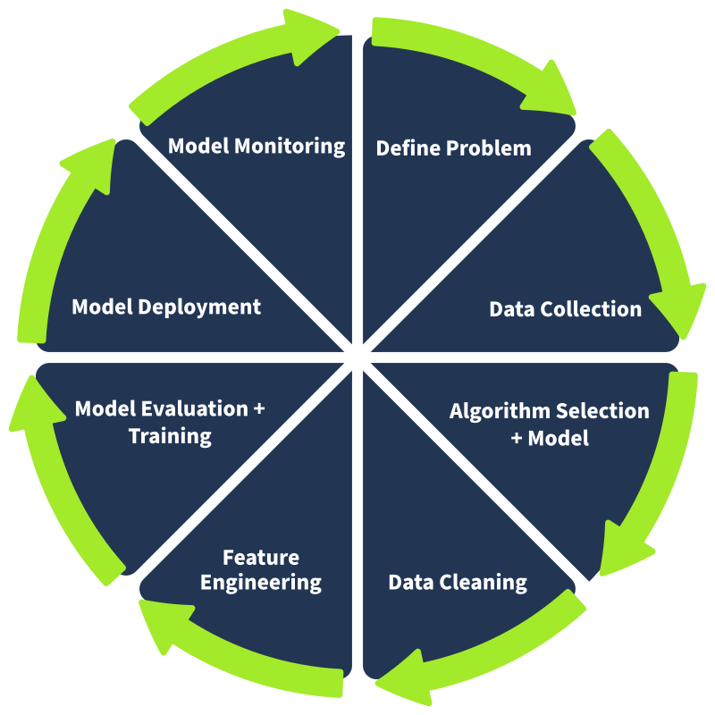
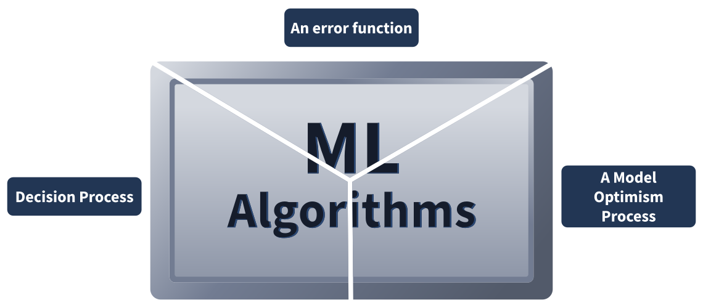
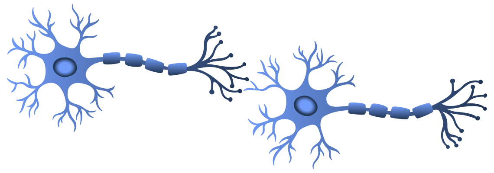
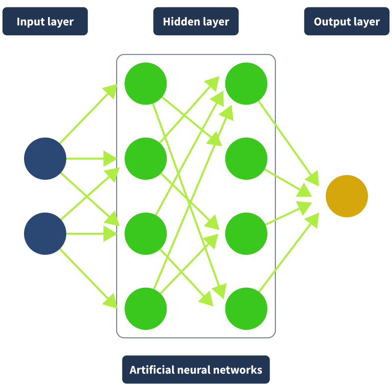
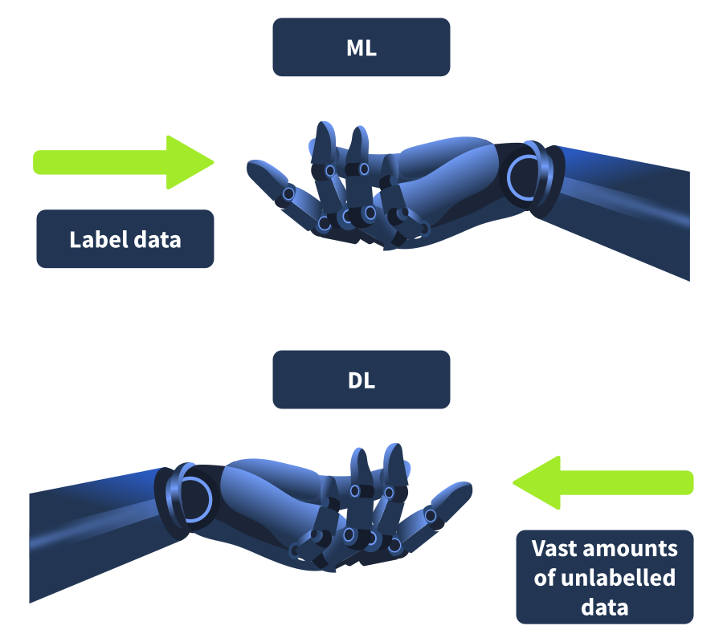
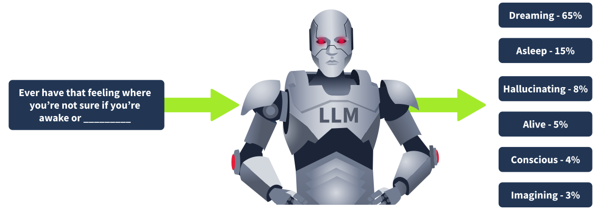
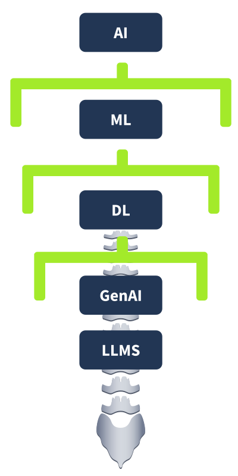

# The Building Blocks of AI

- [Room information](#room-information)
- [Solution](#solution)
- [References](#references)

## Room information

```text
Type: Walkthrough
Difficulty: Easy
Tags: Artificial intelligence
Meta Tags: Walkthrough, Walk-through, Write-up, Writeup
Subscription type: Free
Description:
Learn how AI, ML, neural networks, and LLMs actually work, from the ground up.
```

Room link: [https://tryhackme.com/room/aimlsecuritythreats](https://tryhackme.com/room/aimlsecuritythreats)

## Solution

### Task 1: Introduction

The world is changing. Industries everywhere are coming to terms with how Artificial Intelligence (AI) is going to affect them, and cyber security is no different. It should come as no surprise that AI is at the heart of a lot of ongoing discussions in this industry right now. There's a lot of research being done, a lot of questions being asked, and this room is going to start answering them:

- What is AI and Machine Learning (ML)?
- How can it be used in our industry?
- How will it affect my role?
- How are attackers leveraging it?

This room is your entry point into the world of AI. By the end of it, you'll have a solid understanding of how the technology actually works, what's driving the boom we're currently in the middle of, and why it matters for cyber security.

#### Learning Prerequisites

This room doesn't require any previous rooms or modules to be completed and is the intended entry point for the AI Security learning path. A basic understanding of cyber security concepts, such as common attack types, is assumed.

#### Learning Objectives

- Understand what AI and ML are and how they relate to each other.
- Understand how Machine Learning algorithms work and the categories they fall into.
- Understand Deep Learning and neural networks, and why they matter.
- Understand what LLMs are and how they work under the hood.

---------------------------------------------------------------------------

### Task 2: Introducing TryHackMe's AI Agent Platform

#### A New Kind of Tool

Before we get into the challenges, it's worth taking a moment to introduce the tool you'll be using throughout this room. Meet the TryHackMe AI Agent platform. Rather than a traditional terminal or virtual machine, some tasks in this room use an AI agent as your interactive environment. It works exactly how you'd expect: you type, it responds, and the conversation drives the exercise forward.

This isn't just a chatbot. Each agent in this room has been configured with a specific role, a set of behaviours, and in some cases, information it's protecting or a goal it's trying to achieve. Your job changes depending on the task, sometimes you'll be working with the agent, sometimes against it.

#### How It Works

When a task has an agent attached, the **Open Agent** button will appear in the task. Click it and the chat panel opens on the right hand side of the screen. That panel is your environment for that task. Type naturally, the agent will respond, and the conversation drives the exercise forward.

A few things worth knowing before you start:

- There's no right or wrong way to interact with the agent, just type naturally.
- Some agents later in the room will resist you, that's intentional.
- The agent's responses are driven by how you prompt it, so how you phrase things matters.

#### Have a Play

Before the challenges begin, there's a sandbox agent attached to this task with no objective and no flag. It's just here for you to get a feel for the platform. Ask it anything you like, get comfortable with how it works, and when you're ready move on to the next task.

---------------------------------------------------------------------------

### Task 3: What is AI and Machine Learning?

#### Our Starting Point

Knowledge is power, and before we can talk about AI security, we need to talk about AI. Let's start with the basics. Artificial Intelligence refers to a machine or computer system that is able to carry out tasks that would otherwise require human reasoning, comprehension, problem-solving, or creativity. It's a term that doesn't have one clean definition given the sheer scope of its application, but that one gets us started.

The field dates back to the 1950s, when research first began on getting machines to simulate human intelligence. For decades it remained largely niche and academic. That changed with the emergence of Machine Learning.


#### Machine Learning

ML is a subfield of AI that refers to a computer's ability to learn from data without being explicitly given instructions. Think of it like how the human brain learns: over time, with enough exposure to patterns, it gets better at recognising and predicting them. ML algorithms work the same way. Feed them enough data and they'll improve their accuracy over time without being hand-coded to do so.

ML follows a structured lifecycle. It starts with defining the problem, for example, determining whether an email is spam. Data is then collected, cleaned, and prepared. The model is trained on that data, then evaluated and tuned until it performs well. Once it's ready, it gets deployed into a real-world environment. But the lifecycle doesn't stop at deployment. Models require ongoing monitoring and periodic retraining as the world changes around them, which is what makes it an iterative process rather than a one-and-done job.



One term worth flagging here is **overfitting**. This is when a model becomes so familiar with its training data that it fails to generalise to new, unseen data. Rather than learning the underlying pattern, it essentially memorises the examples it was trained on. You'll hear this term come up again later in the path, particularly in a security context.

Now let's look at what's actually doing the learning: the algorithms themselves and the agents that power them, to find out how we can get a computer to make a decision without being directly programmed to do so.

---------------------------------------------------------------------------

#### What is the term for when a model becomes too familiar with its training data and fails to generalise to new data?

Answer: `Overfitting`

#### What is the subfield of AI that enables systems to learn from data without being explicitly programmed?

Answer: `Machine Learning`

---------------------------------------------------------------------------

### Task 4: Machine Learning Algorithms

#### The Brains of the Operation

ML algorithms are the mathematical methods used to learn patterns from data. The trained outputs they produce are what we call ML models. Every algorithm follows the same basic structure: a **decision process** that makes predictions based on input data, an **error function** that evaluates how far off those predictions were, and a **model optimisation process** that adjusts the algorithm to do better next time. This loop repeats until the model reaches a satisfactory level of performance.



ML algorithms fall into four main categories depending on how they learn and what kind of data they work with.

**Supervised learning** trains on labelled data, meaning every training example comes with the correct answer already attached. The model learns to map inputs to outputs based on those examples. Predicting house prices or classifying whether an email is spam are both supervised learning problems.

**Unsupervised learning** works with unlabelled data and has to find its own structure. Rather than being told what the answer is, the algorithm identifies patterns, clusters, and relationships in the data on its own. It's useful for things like grouping customers by behaviour or detecting anomalies in network traffic.

**Semi-supervised learning** sits between the two. It uses a small portion of labelled data to guide the learning process across a much larger pool of unlabelled data. This is practical in situations where labelling data is expensive or time-consuming.

**Reinforcement learning** works differently from all three. Rather than learning from a fixed dataset, an agent learns by taking actions in an environment and receiving rewards or penalties based on the outcomes. Over time, it refines its behaviour to maximise reward. It's the approach behind things like game-playing AI and autonomous systems.

#### Mission Briefing

Now that you know your algorithm types, it's time to put them to work. You've been handed four covert operations, each one describing a real-world scenario that can only be solved by deploying the right type of ML algorithm. Your job for each mission is to:

1. Identify which of the four algorithm types applies: **supervised**, **unsupervised**, **semi-supervised**, or **reinforcement learning**.
2. Explain in one sentence why that algorithm type fits the scenario.

Get it right and the next mission unlocks. Complete all four and the final mission will hand over the flag.

Click the **Open Agent** button above to receive your first briefing.

---------------------------------------------------------------------------

#### Which category of ML algorithm learns by receiving rewards or penalties based on actions taken in an environment?

Answer: `Reinforcement learning`

#### Which category of ML algorithm uses a small amount of labelled data to guide learning across a larger unlabelled dataset?

Answer: `Semi-supervised learning`

#### What's the flag?

Mission one: `Supervised learning, the training data is already labelled.`
Mission two: `Unsupervised learning, the training data is not labelled and the algorithm identifies clusters.`
Mission three: `Semi-supervised learning, the training data is both a small set of labelled data and a larger pool of unlabelled data.`
Mission four: `Reinforcement learning, the algorithm learns by taking actions and receiving feedback (the score).`

Answer: `THM{<REDACTED>}`

---------------------------------------------------------------------------

### Task 5: Neural Networks and Deep Learning

#### Simulating intelligence

The main objective of AI is to enable computers to behave like humans. One of the most powerful methods we have for achieving that is through neural networks. To understand how they work, it helps to go back to high school biology for a moment.

The human brain processes information using interconnected neurons, cells that transmit signals between the body and brain via connections called *synapses*. When we encounter something new, the brain adjusts the strength of those synaptic connections based on the patterns it observes. Over time, the brain gets better at recognising and responding to those patterns. Neural networks replicate this exact behaviour.



A neural network is made up of layers of nodes, where each node represents a neuron and each connection between nodes acts as a synapse. The **input layer** receives raw data. The number of nodes it has depends on the data type: a 4x4 pixel image, for example, has 16 input nodes, one per pixel. The **hidden layers** in the middle process and refine that input, extracting increasingly complex features as the signal moves deeper. Each connection carries a **weight** that determines how much influence it has on the next layer. **The output** layer produces the final prediction.



Consider a neural network tasked with recognising a handwritten digit. Early hidden layers detect simple features like edges and curves. Deeper layers combine those features into more complex patterns. A straight vertical line increases the likelihood of a 1 or 7. Curves push probability toward 3, 8, or 0. The output layer has one node per possible digit, and whichever scores highest wins. When a network has more than three layers, it qualifies as a **Deep Learning (DL)** algorithm, hence the name.

The key distinction between ML and DL is that DL doesn't require labelled data. Where supervised ML needs a human to attach correct answers to training examples, a DL algorithm can take raw, unstructured input and determine its own features. No human intervention means larger datasets can be processed, which is why DL is sometimes described as scalable ML. The explosion of DL over the last decade is largely down to one thing: the mass digitisation of information suddenly gave these algorithms the volume of data they needed to realise their potential.



#### Take Control of NEURON-1

In the previous task we covered how a neural network processes data layer by layer: raw input goes in, the hidden layers extract features and patterns, and the output layer makes a classification. Now you're going to walk that process yourself.

NEURON-1 is a freshly initialised neural network with no training data. You're going to give it something to classify and guide it through each layer manually, the same way a real network processes data during training. The point of the exercise is to make that flow tangible rather than just theoretical.

#### What to Classify

You can give NEURON-1 anything as an input. It doesn't have to be a cyber security example. Here are a few ideas to get you thinking:

- An image of an animal, like a golden retriever
- A line from a firewall log
- An email that might be spam
- A network packet

Pick whatever makes sense to you. Once you've chosen, share it with NEURON-1 and it will guide you through the rest.

#### What You'll Be Doing

NEURON-1 will walk you through three stages:

1. **Input Layer**: You describe the raw features of your input, the basic characteristics the network receives as data.
2. **Hidden Layer**: You identify what patterns those raw features form when combined, the deeper meaning the network extracts. For example, raw features like "four legs, fur, tail" might combine into the pattern "mammal, likely domestic animal".
3. **Output Layer**: Based on what the hidden layer detected, you make the final classification.

Get the flow right and NEURON-1 will reward you with a flag.

---------------------------------------------------------------------------

#### What is the first layer in a neural network that receives raw input data?

Answer: `Input Layer`

#### What term describes the weighted connections between nodes in a neural network?

Answer: `Synapses`

#### What's the flag?

```text
> What would you like me to classify?

Type of programming language

> Send your input in this format:
> 
> Input: [what you want to classify]
> Features: [raw features that describe it, e.g. colour, shape, size, texture]

Input:
void print_flag() {
        printf("Getting Flag:\n");
        fflush(stdout);
        char *cat_flag[3] = {"/bin/cat", "flag.txt", NULL};
        execve("/bin/cat", cat_flag,  NULL);
        exit(0);
}

Features:
syntax
indentation
keywords

> What patterns or higher-level characteristics do those raw features suggest when you combine them?

The use of semi-colon at the end of most lines suggests C. Pointer variables such as 'char *' suggests C. Result (i.e. void) of the function also suggests C.

> What classification should NEURON-1 produce based on this analysis?

C
```

Answer: `THM{<REDACTED>}`

---------------------------------------------------------------------------

### Task 6: Large Language Models

#### Packaged Intelligence

So far in this room we've traced AI from its origins as a field of research, through the emergence of ML, into the development of neural networks and DL. All of that brings us to the technology that kicked off the AI boom we're currently living through: Large Language Models.


If you've heard of ChatGPT, you already know what the moment felt like. Its ability to generate fluent, human-like text in response to a natural language query triggered discussions across news, politics, education, and industry simultaneously. Something had shifted. We were in a new era, and LLMs were the reason why. But how do they actually work?

#### What are LLMs and how do they work?

Large Language Models are deep learning-based AI models that process and generate text by predicting the next word in a sequence. When you send a message to a chatbot, what's happening in the background is a rapid series of predictions about what word should come next in the response, repeated until the reply is complete. The key question is: how does the model get good enough at those predictions to be useful?

LLMs are first trained in a **pre-training** phase, where they process enormous volumes of text. GPT-3 alone was trained on data that would take a human 2,600 years to read nonstop. Instead of labelled data, LLMs rely on billions of **parameters**, numerical values that function like puzzle pieces, collectively encoding the model's understanding of language. During pre-training, the model is fed a piece of text with the final word removed and asked to predict it. Its initial guess is random. That guess is then compared against the correct answer, and the parameters are adjusted via an algorithm called **backpropagation** to make the right answer more likely next time. Repeat this process trillions of times across a vast dataset and the model develops a remarkably accurate sense of how language works.



The scale of pre-training is only possible because of advances in hardware (specifically GPUs enabling parallel processing) and a specific type of neural network called **transformer neural networks**. Introduced in Google's 2017 paper *Attention is All You Need*, transformers enabled parallel text processing instead of sequential word-by-word analysis. The key innovation was **attention**: the ability to assign different levels of importance to different words depending on context. Take this sentence:

"*The bank approved the loan because it was financially stable.*"

A model without attention might struggle to resolve what "it" refers to. Transformers calculate attention scores across the whole sentence, correctly linking "it" back to "the bank" rather than "the loan."

After pre-training, humans come back into the loop in a process called **RLHF (Reinforcement Learning from Human Feedback)**. Reviewers evaluate model outputs, flag anything unhelpful or problematic, and the parameters are adjusted accordingly. This is the step that shapes a raw language model into something usable as a chatbot or assistant.

LLMs power generative AI products like ChatGPT, LLaMA, and DeepSeek, which can create original text-based content in response to user prompts. Generative AI as a whole extends further still, enabling the creation of images, audio, video, and more. The AI boom didn't happen overnight. It's the product of decades of incremental research finally converging at the right moment. The diagram below shows how everything we've covered connects:



**Artificial Intelligence** is the overarching field. **Machine Learning** is a subfield of AI that enables learning from data. **Deep Learning** is a subfield of ML that uses neural networks to process data at scale without human intervention. **Large Language Models** are advanced DL models built on transformer neural networks, designed to understand and generate human-like text.

---------------------------------------------------------------------------

#### What type of neural network, introduced by Google in 2017, powers modern LLMs?

Answer: `Transformer neural networks`

#### What is the name of the process where humans review and flag model outputs to refine its behaviour after pre-training?

Answer: `RLHF`

#### What mechanism do transformer networks use to assign different levels of importance to different words in a sequence?

Answer: `Attention`

#### What algorithm is used to adjust a model's parameters based on the difference between its prediction and the correct answer?

Answer: `Backpropagation`

---------------------------------------------------------------------------

### Task 7: Practical

You've made it through the building blocks. AI, ML, neural networks, DL, LLMs. Now it's time to put all of it together in one place.

Click the **View Site** button above to launch NEURON-1, your final challenge for this room.

You'll be dropped into an interactive neural network and tasked with operating it from the ground up: feed the input, navigate the hidden layer, and read the output correctly to complete your classification. Everything you need to answer the questions the site asks is in this room. Get it right and the network rewards you with the flag.

---------------------------------------------------------------------------

#### What's the flag?

Answer: `THM{<REDACTED>}`

---------------------------------------------------------------------------

### Task 8: Conclusion

At the start of this room it was said that knowledge is power, and that's especially true when it comes to AI. The technology has moved fast enough to leave a lot of people feeling like they missed the memo. Hopefully that's no longer you. Here's a recap of what's been covered:

- **Artificial Intelligence** is the overarching field concerned with enabling machines to mimic human intelligence and reasoning.
- **Machine Learning** is a subfield of AI in which models learn from data to make predictions, following a structured lifecycle from data collection through to deployment and monitoring.
- **ML algorithms** fall into four categories: supervised, unsupervised, semi-supervised, and reinforcement learning, each suited to different types of problems and data.
- **Neural networks** replicate the structure of the human brain using layers of weighted nodes, enabling models to extract increasingly complex features from raw input data.
- **Deep Learning** extends this further, removing the need for labelled data entirely and enabling self-learning at scale through neural networks with more than three layers.
- **Large Language Models** are the product of all of the above. Built on transformer neural networks and trained on vast datasets, they predict the next word in a sequence to generate human-like text, shaped into useful tools through RLHF.

Room 2 picks up from here and gets into why all of this matters for security: how attackers are weaponising these technologies, what vulnerabilities AI models introduce, and how defenders are fighting back with the same tools.

---------------------------------------------------------------------------

For additional information, please see the references below.

## References

- [Artificial intelligence - Wikipedia](https://en.wikipedia.org/wiki/Artificial_intelligence)
- [Large language model - Wikipedia](https://en.wikipedia.org/wiki/Large_language_model)
- [Machine learning - Wikipedia](https://en.wikipedia.org/wiki/Machine_learning)
- [Neural network (machine learning) - Wikipedia](https://en.wikipedia.org/wiki/Neural_network_(machine_learning))
