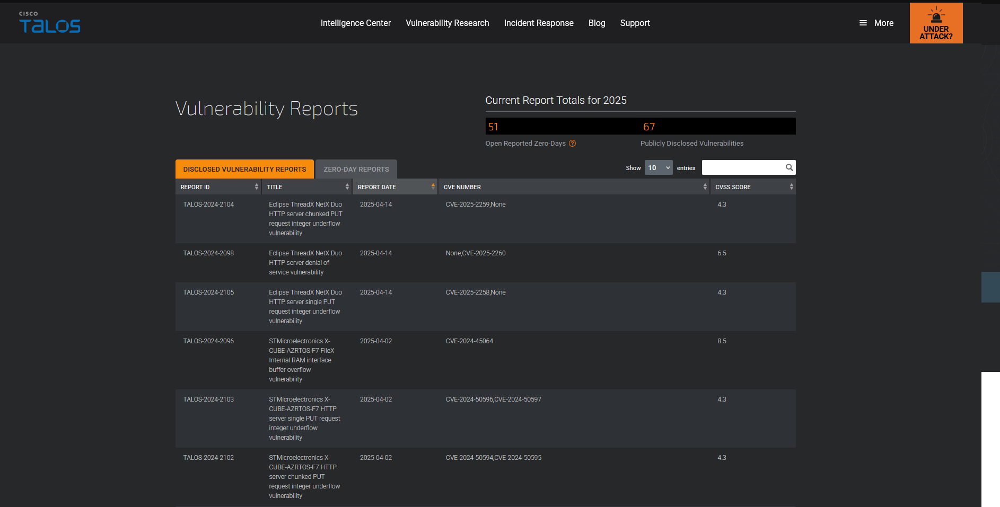
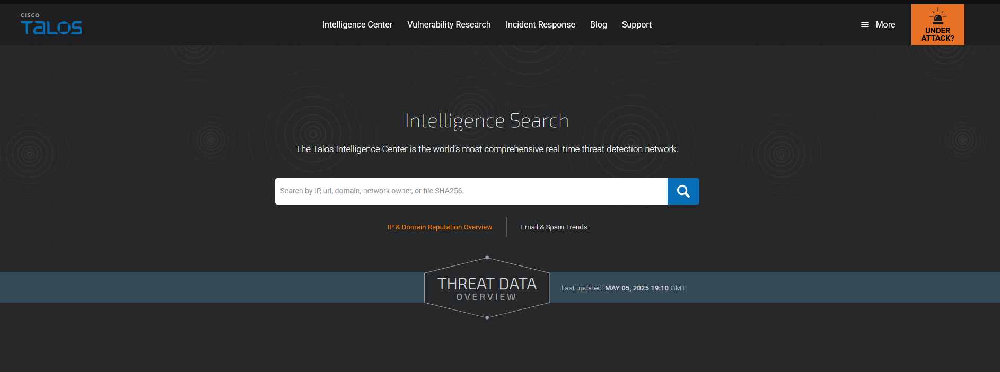
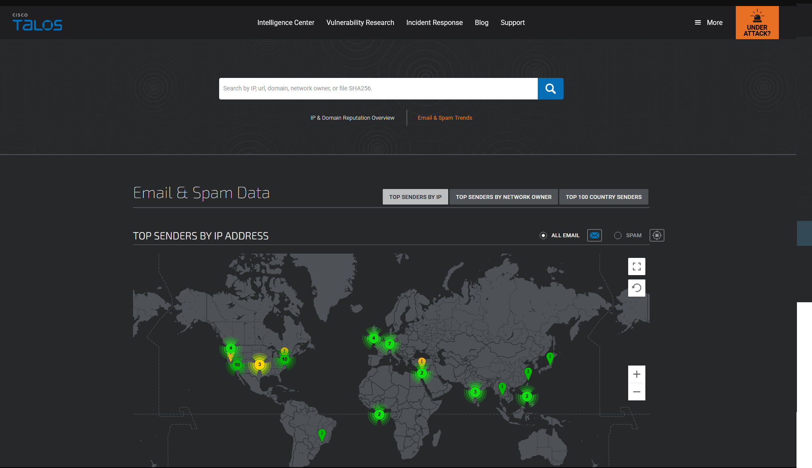

# Threat Intelligence Tools

- [Room information](#room-information)
- [Solution](#solution)
- [References](#references)

## Room information

```text
Type: Walkthrough
Difficulty: Easy
OS: N/A
Subscription type: Free
Description: Explore different OSINT tools used to conduct security threat assessments and investigations.
```

Room link: [https://tryhackme.com/room/threatinteltools](https://tryhackme.com/room/threatinteltools)

## Solution

### Task 1 - Room Outline

This room will cover the concepts of Threat Intelligence and various open-source tools that are useful. The learning objectives include:

- Understanding the basics of threat intelligence & its classifications.
- Using UrlScan.io to scan for malicious URLs.
- Using Abuse.ch to track malware and botnet indicators.
- Investigate phishing emails using PhishTool
- Using Cisco's Talos Intelligence platform for intel gathering.

### Task 2 - Threat Intelligence

Threat Intelligence is the analysis of data and information using tools and techniques to generate meaningful patterns on how to mitigate against potential risks associated with existing or emerging threats targeting organisations, industries, sectors or governments.

To mitigate against risks, we can start by trying to answer a few simple questions:

- Who's attacking you?
- What's their motivation?
- What are their capabilities?
- What artefacts and indicators of compromise should you look out for?

#### Threat Intelligence Classifications

Threat Intel is geared towards understanding the relationship between your operational environment and your adversary. With this in mind, we can break down threat intel into the following classifications:

- **Strategic Intel**: High-level intel that looks into the organisation’s threat landscape and maps out the risk areas based on trends, patterns and emerging threats that may impact business decisions.

- **Technical Intel**: Looks into evidence and artefacts of attack used by an adversary. Incident Response teams can use this intel to create a baseline attack surface to analyse and develop defence mechanisms.

- **Tactical Intel**: Assesses adversaries’ tactics, techniques, and procedures (TTPs). This intel can strengthen security controls and address vulnerabilities through real-time investigations.

- **Operational Intel**: Looks into an adversary’s specific motives and intent to perform an attack. Security teams may use this intel to understand the critical assets available in the organisation (people, processes and technologies) that may be targeted.

### Task 3 - UrlScan.io

[Urlscan.io](https://urlscan.io/) is a free service developed to assist in scanning and analysing websites. It is used to automate the process of browsing and crawling through websites to record activities and interactions.

When a URL is submitted, the information recorded includes the domains and IP addresses contacted, resources requested from the domains, a snapshot of the web page, technologies utilised and other metadata about the website.

The site provides two views, the first one showing the most recent scans performed and the second one showing current live scans.


#### Scan Results

URL scan results provide ample information, with the following key areas being essential to look at:

- **Summary**: Provides general information about the URL, ranging from the identified IP address, domain registration details, page history and a screenshot of the site.
- **HTTP**: Provides information on the HTTP connections made by the scanner to the site, with details about the data fetched and the file types received.
- **Redirects**: Shows information on any identified HTTP and client-side redirects on the site.
- **Links**: Shows all the identified links outgoing from the site's homepage.
- **Behaviour**: Provides details of the variables and cookies found on the site. These may be useful in identifying the frameworks used in developing the site.
- **Indicators**: Lists all IPs, domains and hashes associated with the site. These indicators do not imply malicious activity related to the site.


Note: Due to the dynamic nature of internet activities, data searched can produce different results on different days as new information gets updated.

#### Scenario

You have been tasked to perform a scan on TryHackMe's domain. The results obtained are displayed in the image below. Use the details on the image to answer the questions:


#### What was TryHackMe's Cisco Umbrella Rank based on the screenshot?

Answer: 345612

#### How many domains did UrlScan.io identify on the screenshot?

Answer: 13

#### What was the main domain registrar listed on the screenshot?

Answer: NAMECHEAP INC

#### What was the main IP address identified for TryHackMe on the screenshot?

Answer: 2606:4700:10::ac43:1b0a

### Task 4 - Abuse.ch

[Abuse.ch](https://abuse.ch/) is a research project hosted by the Institue for Cybersecurity and Engineering at the Bern University of Applied Sciences in Switzerland. It was developed to identify and track malware and botnets through several operational platforms developed under the project. These platforms are:

- **Malware Bazaar**:  A resource for sharing malware samples.
- **Feodo Tracker**:  A resource used to track botnet command and control (C2) infrastructure linked with Emotet, Dridex and TrickBot.
- **SSL Blacklist**:  A resource for collecting and providing a blocklist for malicious SSL certificates and JA3/JA3s fingerprints.
- **URL Haus**:  A resource for sharing malware distribution sites.
- **Threat Fox**:  A resource for sharing indicators of compromise (IOCs).

Let us look into these platforms individually.

#### [MalwareBazaar](https://bazaar.abuse.ch/)

As the name suggests, this project is an all in one malware collection and analysis database. The project supports the following features:

Malware Samples Upload: Security analysts can upload their malware samples for analysis and build the intelligence database. This can be done through the browser or an API.
Malware Hunting: Hunting for malware samples is possible through setting up alerts to match various elements such as tags, signatures, YARA rules, ClamAV signatures and vendor detection.


#### [FeodoTracker](https://feodotracker.abuse.ch/)

With this project, Abuse.ch is targeting to share intelligence on botnet Command & Control (C&C) servers associated with Dridex, Emotes (aka Heodo), TrickBot, QakBot and BazarLoader/BazarBackdoor. This is achieved by providing a database of the C&C servers that security analysts can search through and investigate any suspicious IP addresses they have come across. Additionally, they provide various IP and IOC blocklists and mitigation information to be used to prevent botnet infections.


#### [SSL Blacklist](https://sslbl.abuse.ch/)

Abuse.ch developed this tool to identify and detect malicious SSL connections. From these connections, SSL certificates used by botnet C2 servers would be identified and updated on a denylist that is provided for use. The denylist is also used to identify JA3 fingerprints that would help detect and block malware botnet C2 communications on the TCP layer.

You can browse through the SSL certificates and JA3 fingerprints lists or download them to add to your deny list or threat hunting rulesets.


#### [URLhaus](https://urlhaus.abuse.ch/)

As the name points out, this tool focuses on sharing malicious URLs used for malware distribution. As an analyst, you can search through the database for domains, URLs, hashes and filetypes that are suspected to be malicious and validate your investigations.

The tool also provides feeds associated with country, AS number and Top Level Domain that an analyst can generate based on specific search needs.


#### [ThreatFox](https://threatfox.abuse.ch/)

With ThreatFox,  security analysts can search for, share and export indicators of compromise associated with malware. IOCs can be exported in various formats such as MISP events, Suricata IDS Ruleset, Domain Host files, DNS Response Policy Zone, JSON files and CSV files.


#### The IOC 212.192.246.30:5555 is identified under which malware alias name on ThreatFox?

Hint: Search through the ThreatFox database using the syntax `ioc:<ip here>` and you will find the malware alias name.

Answer: Katana

#### Which malware is associated with the JA3 Fingerprint 51c64c77e60f3980eea90869b68c58a8 on SSL Blacklist?

Answer: Dridex

#### From the statistics page on URLHaus, what malware-hosting network has the ASN number AS14061?

Answer: DIGITALOCEAN-ASN

#### Which country is the botnet IP address 178.134.47.166 associated with according to FeodoTracker?

Answer: Georgia

### Task 5 - PhishTool

Before going into the task, click the **Start Machine** button to start the attached VM and open it in Split View. You will be using the same machine through tasks 7 and 8.

This task will introduce you to a tool, **PhishTool**, that you would add to your toolkit of email analysis tools. Please take note that it would not be necessary to use it to complete the task; however, the principles learnt would be helpful.

#### Email Phishing

Email phishing is one of the main precursors of any cyber attack. Unsuspecting users get duped into opening and accessing malicious files and links sent to them by email, as they appear to be legitimate. As a result, adversaries infect their victims’ systems with malware, harvesting their credentials and personal data and performing other actions such as financial fraud or conducting ransomware attacks.

For more information and content on phishing, check out these rooms:

- [Phishing Emails 1](https://tryhackme.com/room/phishingemails1tryoe)
- [Phishing Emails 2](https://tryhackme.com/room/phishingemails2rytmuv)
- [Phishing Emails 3](https://tryhackme.com/room/phishingemails3tryoe)
- [Phishing Emails 4](https://tryhackme.com/room/phishingemails4gkxh)
- [Phishing Emails 5](https://tryhackme.com/room/phishingemails5fgjlzxc)

PhishTool seeks to elevate the perception of phishing as a severe form of attack and provide a responsive means of email security. Through email analysis, security analysts can uncover email IOCs, prevent breaches and provide forensic reports that could be used in phishing containment and training engagements.

PhishTool has two accessible versions: **Community** and **Enterprise**. We shall mainly focus on the Community version and the core features in this task. Sign up for an account via [this link](https://app.phishtool.com/sign-up/community) to use the tool.

The core features include:

- **Perform email analysis**: PhishTool retrieves metadata from phishing emails and provides analysts with the relevant explanations and capabilities to follow the email’s actions, attachments, and URLs to triage the situation.
- **Heuristic intelligence**: OSINT is baked into the tool to provide analysts with the intelligence needed to stay ahead of persistent attacks and understand what TTPs were used to evade security controls and allow the adversary to social engineer a target.
- **Classification and reporting**: Phishing email classifications are conducted to allow analysts to take action quickly. Additionally, reports can be generated to provide a forensic record that can be shared.

Additional features are available on the Enterprise version:

- Manage user-reported phishing events.
- Report phishing email findings back to users and keep them engaged in the process.
- Email stack integration with Microsoft 365 and Google Workspace.

We are presented with an upload file screen from the Analysis tab on login. Here, we submit our email for analysis in the stated file formats. Other tabs include:

- **History**: Lists all submissions made with their resolutions.
- **In-tray**: An Enterprise feature used to receive and process phish reports posted by team members through integrating Google Workspace and Microsoft 365.

Analysis Tab

Once uploaded, we are presented with the details of our email for a more in-depth look. Here, we have the following tabs:

- **Headers**: Provides the routing information of the email, such as source and destination email addresses, Originating IP and DNS addresses and Timestamp.
- **Received Lines**: Details on the email traversal process across various SMTP servers for tracing purposes.
- **X-headers**: These are extension headers added by the recipient mailbox to provide additional information about the email.
- **Security**: Details on email security frameworks and policies such as Sender Policy Framework (SPF), DomainKeys Identified Mail (DKIM) and Domain-based Message Authentication, Reporting and Conformance (DMARC).
- **Attachments**: Lists any file attachments found in the email.
- **Message URLs**: Associated external URLs found in the email will be found here.

We can further perform lookups and flag indicators as malicious from these options. On the right-hand side of the screen, we are presented with the Plaintext and Source details of the email.


Above the **Plaintext** section, we have a **Resolve** checkmark. Here, we get to perform the resolution of our analysis by classifying the email, setting up flagged artefacts and setting the classification codes. Once the email has been classified, the details will appear on the **Resolution** tab on the analysis of the email.


You can now add PhishTool to your list of email analysis tools.

#### Scenario

You are a SOC Analyst and have been tasked to analyse a suspicious email, **Email1.eml**. To solve the task, open the email using Thunderbird on the attached VM, analyse it and answer the questions below.

#### What social media platform is the attacker trying to pose as in the email?

Hint: Use Thunderbird to open the email and you should recognise the famous social platform via the logo.

Answer: LinkedIn

#### What is the senders email address?

Answer: `darkabutla@sc500.whpservers.com`

#### What is the recipient's email address?

Answer: `cabbagecare@hotsmail.com`

#### What is the Originating IP address? Defang the IP address.

Hint: Cyberchef has a defang recipe

Answer: 204[.]93[.]183[.]11

#### How many hops did the email go through to get to the recipient?

Answer: 4

### Task 6 - Cisco Talos Intelligence

IT and Cybersecurity companies collect massive amounts of information that could be used for threat analysis and intelligence. Being one of those companies, Cisco assembled a large team of security practitioners called Cisco Talos to provide actionable intelligence, visibility on indicators, and protection against emerging threats through data collected from their products. The solution is accessible as [Talos Intelligence](https://talosintelligence.com/).

Cisco Talos encompasses six key teams:

- **Threat Intelligence & Interdiction**: Quick correlation and tracking of threats provide a means to turn simple IOCs into context-rich intel.
- **Detection Research**: Vulnerability and malware analysis is performed to create rules and content for threat detection.
- **Engineering & Development**: Provides the maintenance support for the inspection engines and keeps them up-to-date to identify and triage emerging threats.
- **Vulnerability Research & Discovery**: Working with service and software vendors to develop repeatable means of identifying and reporting security vulnerabilities.
- **Communities**: Maintains the image of the team and the open-source solutions.
- **Global Outreach**: Disseminates intelligence to customers and the security community through publications.

More information about Cisco Talos can be found on their [White Paper](https://www.talosintelligence.com/docs/Talos_WhitePaper.pdf)

#### Talos Dashboard

Note: Cisco Talos have restructured their dashboards since this room's creation!

Accessing the open-source solution, we are first presented with a reputation lookup dashboard with a world map. This map shows an overview of email traffic with indicators of whether the emails are legitimate, spam or malware across numerous countries. Clicking on any marker, we see more information associated with IP and hostname addresses, volume on the day and the type.

At the top, we have several tabs that provide different types of intelligence resources. The primary tabs that an analyst would interact with are:

- **Vulnerability Information**: Disclosed and zero-day vulnerability reports marked with CVE numbers and CVSS scores. Details of the vulnerabilities reported are provided when you select a specific report, including the timeline taken to get the report published. Microsoft vulnerability advisories are also provided, with the applicable snort rules that can be used.



- **Reputation Center**: Provides access to searchable threat data related to IPs and files using their SHA256 hashes. Analysts would rely on these options to conduct their investigations.



- **Email & Spam Trends**: Additional email and spam data can be found under the Email & Spam Data tab.



#### Task

Use the information gathered from inspecting the **Email1.eml** file from Task 5 to answer the following questions using Cisco Talos Intelligence. Please note that the VM launched in Task 5 would not have access to the Internet.

#### What is the listed domain of the IP address from the previous task?

Hint: Use the IP addressed discovered in Task 5 and search for it.

Answer: scnet.net

#### What is the customer name of the IP address?

Hint: Perform a WHOIS lookup against the IP to identify the customer, if you cannot find the information on Talos.

Answer: Complete Web Reviews

### Task 7 - Scenario 1

**Scenario**: You are a SOC Analyst. Several suspicious emails have been forwarded to you from other coworkers. You must obtain details from each email to triage the incidents reported.

**Task**: Use the tools and knowledge discussed throughout this room (or use your resources) to help you analyze **Email2.eml** found on the VM attached to Task 5 and use the information to answer the questions.

#### According to Email2.eml, what is the recipient's email address?

Answer: `chris.lyons@supercarcenterdetroit.com`

#### On VirusTotal, the attached file can also be identified by a Detection Alias, which starts with an H

Answer: HIDDENEXT/Worm.Gen

### Task 8 - Scenario 2

**Scenario**: You are a SOC Analyst. Several suspicious emails have been forwarded to you from other coworkers. You must obtain details from each email to triage the incidents reported.

**Task**: Use the tools and knowledge discussed throughout this room (or use your resources) to help you analyze **Email3.eml** found on the VM attached to Task 5 and use the information to answer the questions.

#### What is the name of the attachment on Email3.eml?

Answer: Sales_Receipt 5606.xls

#### What malware family is associated with the attachment on Email3.eml?

Answer: Dridex

### Task 9 - Conclusion

#### There's More Out There

You have come to the end of the room. However, this is just the tip of the iceberg for open-source threat intelligence tools that can help you as an analyst triage through incidents. There are plenty of more tools that may have more functionalities than the ones discussed in this room.

Check out these rooms to dive deeper into Threat Intelligence:

- [Yara](https://tryhackme.com/room/yara)
- [MISP](https://tryhackme.com/room/misp)
- [Red Team Threat Intel](https://tryhackme.com/room/redteamthreatintel)

For additional information, please see the references below.

## References

- [FeodoTracker - Abuse.ch](https://feodotracker.abuse.ch/)
- [MalwareBazaar - Abuse.ch](https://bazaar.abuse.ch/)
- [Reputation Center - Cisco Talos](https://talosintelligence.com/reputation_center)
- [SSL Blacklist - Abuse.ch](https://sslbl.abuse.ch/)
- [ThreatFox - Abuse.ch](https://threatfox.abuse.ch/)
- [URLhaus - Abuse.ch](https://urlhaus.abuse.ch/)
- [Urlscan.io](https://urlscan.io/)
- [Vulnerability Reports - Cisco Talos](https://talosintelligence.com/vulnerability_reports)
