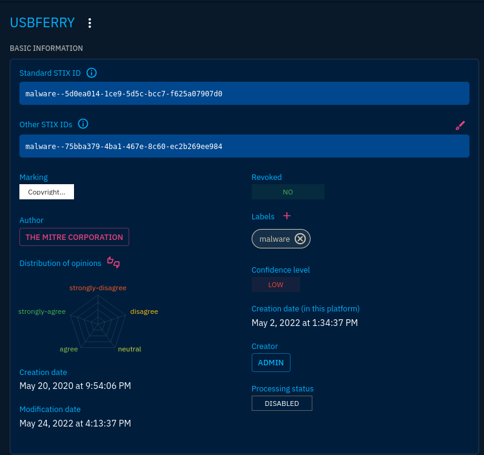
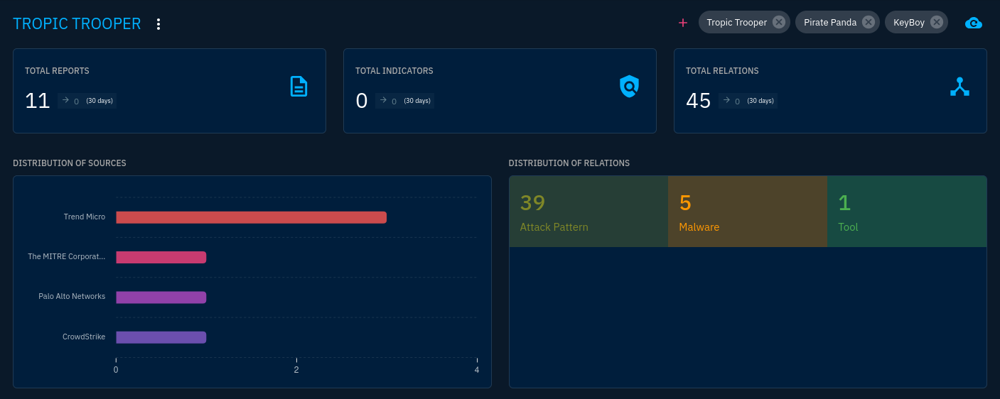
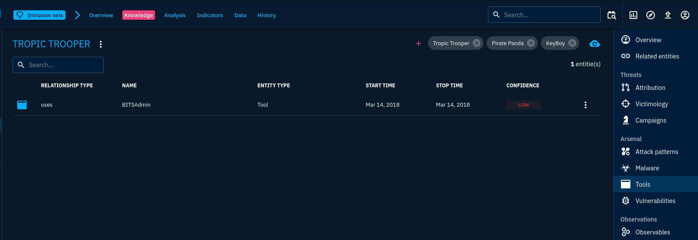
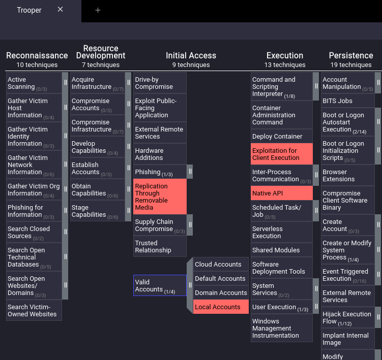
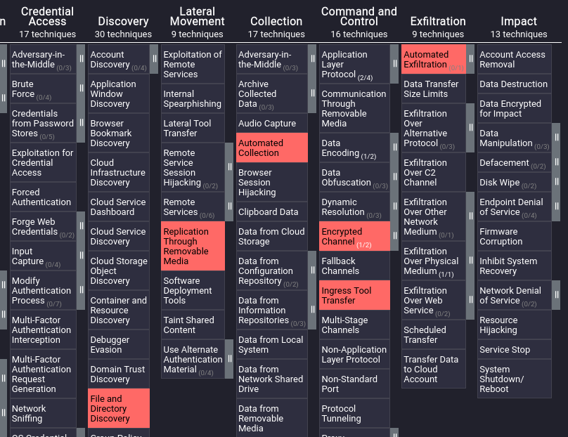

# Trooper

- [Room information](#room-information)
- [Solution](#solution)
- [References](#references)

## Room information

```text
Type: Walkthrough
Difficulty: Easy
OS: N/A
Subscription type: Premium
Description: Use Cyber Threat Intelligence knowledge and skills to identify a threat based on a report.
```

Room link: [https://tryhackme.com/room/trooper](https://tryhackme.com/room/trooper)

## Solution

### Task 1 - Who's The Threat?

A multinational technology company has been the target of several cyber attacks in the past few months. The attackers have been successful in stealing sensitive intellectual property and causing disruptions to the company's operations. A threat advisory report about similar attacks has been shared, and as a CTI analyst, your task is to identify the Tactics, Techniques, and Procedures (TTPs) being used by the Threat group and gather as much information as possible about their identity and motive. For this task, you will utilise the [OpenCTI](https://tryhackme.com/room/opencti) platform as well as the MITRE ATT&CK navigator, linked to the details below.

#### Assigned Tools

Start the virtual machine by clicking on the green "Start Machine" button on the upper right section of this task. Give it about 7 minutes to fully load and use the credentials below to access the platforms via the AttackBox or VPN to conduct your investigations.

- Username: `info@tryhack.io`
- Password: `TryHackMe1234`
- OpenCTI IP: `http://10.10.21.69:8080`
- ATT&CK Navigator IP: `http://10.10.21.69:4200`

### Answer the questions below

#### What kind of phishing campaign does APT X use as part of their TTPs?

The answer can be found in the first paragraph of the threat report:

```text
APT X, a threat actor group that targets government, military, healthcare, transportation, and high-tech industries in Taiwan, the
Philippines, and Hong Kong, has been active since 2011. The group was reportedly using spear-phishing emails with weaponized
attachments to exploit known vulnerabilities.
```

Answer: spear-phishing emails

#### What is the name of the malware used by APT X?

This answer can be found in the second paragraph of the report:

```text
The group employs USBferry, a USB malware that performs different commands on specific targets, maintains stealth in
environments, and steals critical data through USB storage.
```

Answer: USBferry

#### What is the malware's STIX ID?

Login to the OpenCTI platform and goto the `Arsenal` section. Search for `USBferry` and click on the malware.



Answer: malware--5d0ea014-1ce9-5d5c-bcc7-f625a07907d0

#### With the use of a USB, what technique did APT X use for initial access?

This answer can be found in the Att&CK Navigator matrix under the Initial Access tactic.

Answer: Replication Through Removable Media

#### What is the identity of APT X?

Following the first link in the report to `https://documents.trendmicro.com/assets/wp/wp-operation-tropic-trooper.pdf` we find the following:

```text
Taiwan and the Philippines have become the targets of an ongoing campaign called “Operation Tropic 
Trooper.” Active since 2012, the attackers behind the campaign have set their sights on the Taiwanese 
government as well as a number of companies in the heavy industry. 
```

Answer: Tropic Trooper

#### On OpenCTI, how many Attack Pattern techniques are associated with the APT?

1. Select `Threats` in the left menu and then the `Intrusion sets` tab in the top menu.
2. Search for `Tropic Trooper` and click on the entry found
3. Select the `Knowledge` tab in top menu



Answer: 39

#### What is the name of the tool linked to the APT?

Click on `Tools` in the menu to the right



Answer: BITSAdmin

#### Load up the Navigator. What is the sub-technique used by the APT under Valid Accounts?

Click on the `||`-icon for `Valid Accounts` under the `Initial Access` tactic to expand the technique and see the sub-techniques.



Answer: Local Accounts

#### Under what Tactics does the technique above fall?

Hint: Order follows an attack kill chain.

Find the [sub-technique on Mitre ATT&CK](https://attack.mitre.org/techniques/T1078/003/)

Answer: Initial Access, Persistence,  Defense Evasion and Privilege Escalation

#### What technique is the group known for using under the tactic Collection?

Check the ATT&CK Navigator under the `Collection` tactic



Answer: Automated Collection

For additional information, please see the references below.

## References

- [ATT&CK - Mitre](https://attack.mitre.org/)
- [ATT&CK Navigator - Mitre](https://mitre-attack.github.io/attack-navigator/)
- [Cyber Kill Chain - Lockheed Martin](https://www.lockheedmartin.com/en-us/capabilities/cyber/cyber-kill-chain.html)
- [OpenCTI - Documentation](https://docs.opencti.io/latest/)
- [OpenCTI - GitHub](https://github.com/OpenCTI-Platform/opencti)
