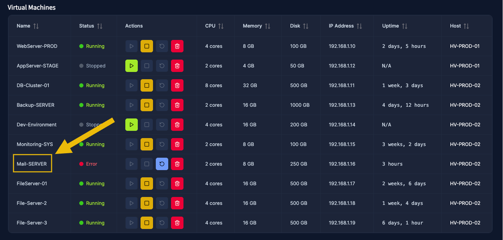
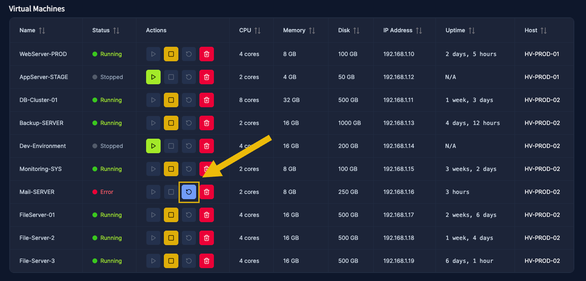
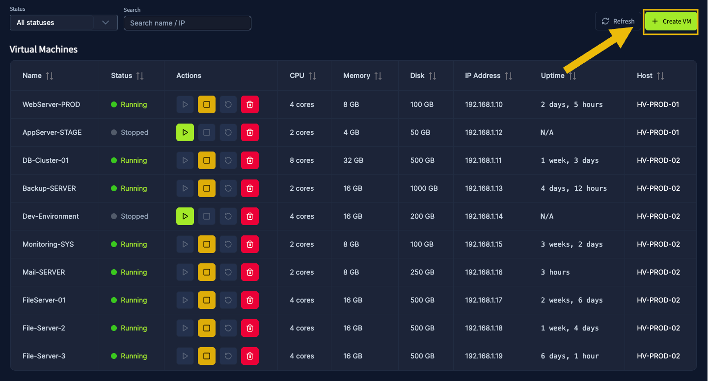
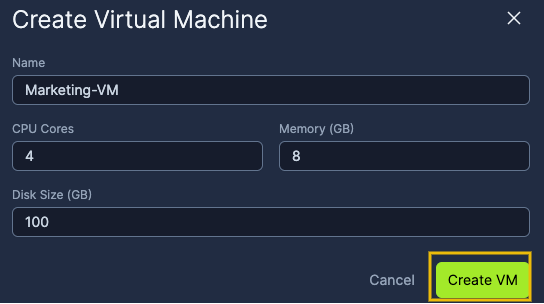
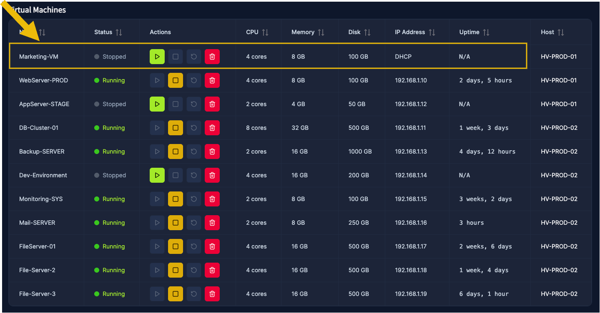
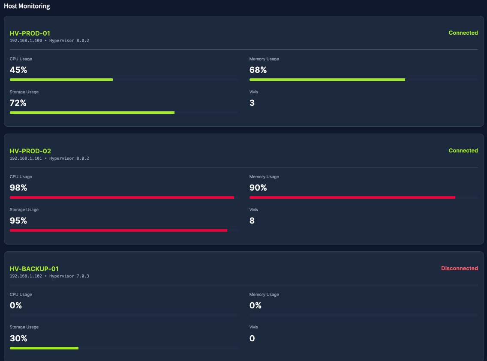
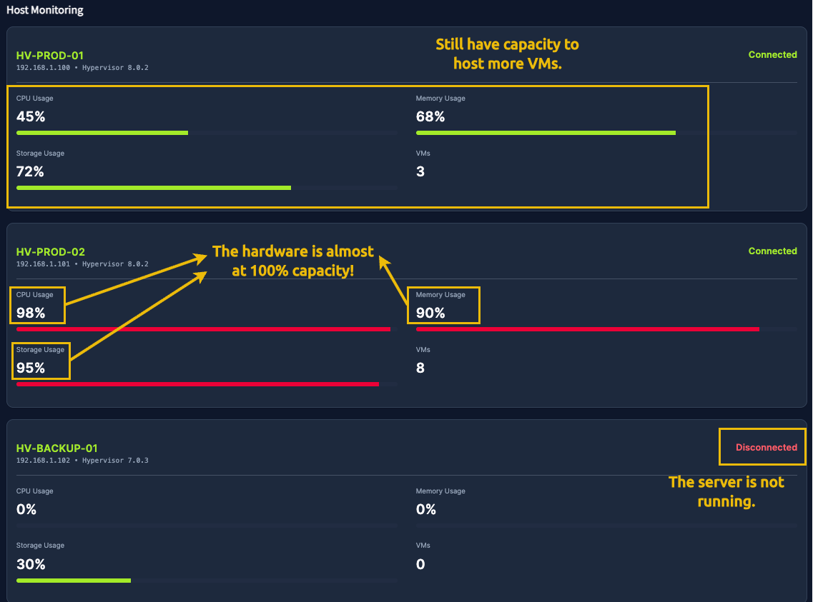

# Virtualization Basics

- [Room information](#room-information)
- [Solution](#solution)
- [References](#references)

## Room information

```text
Type: Walkthrough
Difficulty: Easy
Tags: Linux
Meta Tags: Walkthrough, Walk-through, Write-up, Writeup
Subscription type: Premium
Description:
Learn why virtualisation powers modern IT, improving efficiency and safely isolating environments.
```

Room link: [https://tryhackme.com/room/virtualisationbasics](https://tryhackme.com/room/virtualisationbasics)

## Solution

### Task 1: Introduction

In previous rooms, you learned what the components of a computer are and how they communicate with each other. In this room, you will learn how companies have optimized these computer components to reduce costs and build flexible, scalable systems that power the modern internet through a concept known as **virtualization**.

Have you ever considered how expensive and inefficient it would be if every piece of software or every website required its own physical server?
**Virtualization was created to solve exactly this problem**.


Your manager asked for help on improving the hardware utilization of a computer that hosts a website. Let's explore the concept of virtualization and help your manager!

#### Learning Objectives

- Understand why managing applications on individual physical servers is inefficient.
- Learn how virtualization addresses hardware utilization and scalability challenges.
- Understand the components of a lab machine.
- Learn how containers have further optimized hardware utilization for applications.

#### Prerequisites

Before you start, we recommend that you complete the following rooms:

- Inside a Computer System (coming soon)
- [Computer Types](https://tryhackme.com/room/computertypes)
- [Client-Server Basics](https://tryhackme.com/room/clientserverbasics)

---------------------------------------------------------------------------

### Task 2: Virtualization Overview

Before the concept of virtualization, the rule of thumb in IT was:  
"**One server = one application**."

In the early days, digital services were run on physical machines, and each machine typically had a single, clear purpose, such as hosting a website or storing data. As businesses added more services, they naturally increased the number of physical servers, and the “one job per box” approach became the standard for building reliable systems.

This meant that if a company wanted to run a website, a database, an email service, and an internal app, they would need separate physical servers for each one. The problems were obvious:

- **High cost**: Buying multiple physical servers is expensive, not just the hardware, but also electricity, cooling, maintenance, and data center space.
- **Low utilization**: Most applications don’t use the server’s full capacity. Many servers stayed at 5–20% usage, wasting CPU, memory, and storage resources.
- **Slow deployment**: Setting up new physical servers could take days or weeks.
- **Hard to scale**: If an application suddenly needed more resources, you often had to buy yet another server.

In short, companies were paying a lot for hardware that wasn’t being fully utilized.


#### The Need for Sharing Hardware Safely and Efficiently

Virtualization introduced a new idea:  
"**What if multiple applications could share the same physical server safely**?"

A virtualization layer, called a **hypervisor**, was introduced to act as a referee between lab machines and allow each virtual computer to behave independently, like a physical computer.

#### The Building Analogy

Imagine if one single person lives alone in an entire 10-floor building:

- The person uses only one floor but must maintain the entire building: electricity, cleaning, water, and security.
- Most of the building stays empty and wasted.
- It’s expensive, inefficient, and unnecessary for his needs.

Now imagine dividing the building into **separate apartments**:

- Each apartment has its own door, walls, kitchen, and privacy.
- Different people can live independently without bothering each other.
- They all share the building’s main structure: electricity, water, and elevators, making it cheaper and more efficient for everyone.

**This is virtualization**:

- The building = the physical server
- The apartments = lab machines
- The tenants = applications or operating systems
- The building manager = the hypervisor (the software that divides the building safely)

Each virtual computer, known as a Lab Machine (VM), **acts as an independent system** with its own operating system, apps, and settings, even though they all share the same physical hardware underneath.

---------------------------------------------------------------------------

#### What does virtualization enable multiple applications to share?

Answer: `physical server`

#### What is the name of the software that manages the resources for each lab machine?

Answer: `hypervisor`

---------------------------------------------------------------------------

### Task 3: Virtualization Components

#### Hypervisor (The Building Manager)

A **hypervisor** is the core technology behind virtualization. It's the software that creates and manages lab machines.

It is a special piece of software that:

- Divides a physical computer into multiple virtual ones.
- Gives each lab machine its own share of CPU, memory, and storage.
- Keeps everything isolated and safe.
- Manages the lifecycle of lab machines (start, stop, pause, clone, delete).

Hypervisors have two main types of implementation, each of which is used for specific scenarios, from home labs to large data centers:

- **Type 1** hypervisors run directly on the physical hardware, making them fast, efficient, and ideal for servers and professional environments.
- **Type 2** hypervisors run within an existing operating system, making them easier to install and ideal for learning, testing, or small setups.

Below is a table showing which use case is best suited to each hypervisor type. The use cases can run on both hypervisor types, but it's not the best approach given the main objectives of each.

|Use Case|Type 1|Type 2|
|----|:----:|:----:|
|Test Malicious Files||X|
|Production Server|X||
|Database Server|X||
|Software Testing||X|
|Kali Linux||X|
|Data Center|X||

When using virtualization to test malicious files, care should be taken to ensure that the host machine does not become infected by the malware being tested in the guest machine. One approach is to use different operating systems for the guest and host machines, or to isolate the guest machine so that it does not communicate with the host.

#### Lab Machines (The Apartments)

A **Lab Machine (VM)** is a virtual computer created by the hypervisor.

Even though it’s virtual, it behaves as a real machine:

- It has its own virtual CPU, RAM, storage, and network.
- It can run any operating system (Windows, Linux, etc.).
- It’s completely isolated from other VMs. This means that if one VM breaks, the others continue to work.

You can deploy VMs on your own computer using tools such as Oracle VirtualBox and VMware Workstation. This type of software acts as a type 2 hypervisor and lets you run multiple operating systems, such as Windows, Linux, and macOS.

Since you have learned what a hypervisor and VM are, let's take some examples where you might need them:

- You need to work on a different OS like Kali Linux, but you can't buy another whole system, so you install a hypervisor and run a Kali Linux VM on it.
- You want to test whether a file is malicious, so you set up an isolated lab machine to protect your main computer from being infected.

#### Containers (The Rooms Inside the Apartment)

A **container** is a lightweight, isolated environment that runs a single application and all the necessary components to support it. Instead of bringing a whole separate operating system, a container borrows the core of the existing system by running on the kernel, which is the part of an operating system that communicates with the hardware and manages resources such as memory and running programs.

Because containers share this kernel, they start quickly and use fewer resources than full lab machines, but it also means they must match the host system’s type. For example, you can’t run a Windows container on a Linux machine.

Containers behave like small, self-contained spaces because:

- They package the application and its dependencies (libraries, tools, versions).
- They share the host’s operating system, so they start almost instantly.
- They remain isolated from each other, so a misbehaving container doesn’t affect the others.
- They can run consistently on any machine, making them perfect for development, testing, and scalable deployments.

The easiest way to deploy containers in a VM is using Docker.

Docker is an open-source software platform that simplifies the process of building, deploying, and running applications using containerization.

The image below illustrates the relationship between Hypervisors, VMs, and containers:


In summary, VMs provide the “full apartment” with maximum separation and flexibility, while containers offer lightweight “rooms” ideal for scalable, fast-deploying applications.

---------------------------------------------------------------------------

#### Suppose a user wants to deploy a study lab on their machine to practice some exercises for a cyber security certification. Which type of hypervisor will they use?

Answer: `Type 2`

#### Suppose a company wants to host multiple small applications in the same lab machine. What should they use?

Answer: `Containers`

---------------------------------------------------------------------------

### Task 4: Managing Virtual Machines

After learning about virtualization, you were hired to be responsible for the virtual environment for AutoGalo, a company that has recently started using lab machines.

In this company, they use an application called Virtualization Manager. This application provides a clear view of the overall status of an entire virtualization environment, providing details of each virtualized instance and the physical hosts. It also enables you to run actions and manage the VMs you create.

Your manager has asked you to investigate an issue with the email service. Essentially, everyone in the company stopped receiving emails today, and no one knows what happened.

Open the Virtualization Manager site by clicking the `View Site` button, and let's investigate!

#### Analyzing Lab Machine States

In the home screen, you should see three main sections:

- **Summary**: Provides a generic view of the state of the environment.
- **Lab Machines**: Provides details of each VM and enables you to run actions on them.
- **Hosts**: Displays usage and performance details for each physical server.

Go to the Lab Machines section and look for the VM with the name `Mail-SERVER`:



Looks like this lab machine has entered an `Error` state. Let's try rerunning this VM using the `Blue Square Button` to restart it.



After running again, it appears to be working correctly, with no errors!

#### Creating a Lab Machine

As part of your routine, you create lab machines for other teams. After resolving the email server issue, you received a task to create a VM to support the marketing team's website.

Now, let's create a VM to host their marketing website. In the Lab Machines section, locate the `+ Create VM` button on the top right side of the Lab Machines section and click on it.



You should fill out the form with how much hardware your lab machine will be using:

- Name: `Marketing-VM`
- CPU Cores: `4`
- Memory (GB): `8`
- Disk Size (GB): `100`

Then click on Create VM



Now, at the top of the list of Lab Machines, you should see your created VM:



#### Analyzing Hardware Usage

Another routine task you have is to manage the health of the physical servers and report status to your manager. Go to the Hosts section at the bottom of the page:



By analyzing it, we can identify:

- `HV-PROD-01` has the capacity to host more VMs.
- `HV-PROD-02` is almost operating at 100% of its capacity, and we might need to report this!
- `HV-BACKUP-01` is disconnected and does not host any VMs.



Now, answer the following task questions to conclude your shift as the responsible for virtualization in AutoGalo!

---------------------------------------------------------------------------

#### What is the name of the lab machine that has been running for the longest time?

Click on the `Uptime` column to sort it descending.

Answer: `Monitoring-SYS`

#### What is the name of the lab machine that is using the biggest amount of memory?

Click on the `Memory` column to sort it descending.

Answer: `DB-Cluster-01`

#### How many VMs are in the running state after you solved the issue on `Mail-SERVER`?

Check the `Running VMs` metrics in the summary.

Answer: `8`

#### What is the name of the physical machine that is hosting most of the VMs?

Check the `Host Monitoring` section and specifically the `VMs` metric on each machine.

Answer: `HV-PROD-02`

---------------------------------------------------------------------------

### Task 5: Conclusion

In this room, you learned why **virtualization** is such a critical foundation in modern IT, both for maximizing hardware efficiency and for safely isolating environments.

#### Key Terminology

Let's quickly review some concepts we learned in this room:

- **Virtualization**: Enables a single physical computer to act like multiple separate computers.
- **Hypervisor**: The “manager” software that makes and runs the virtual computers.
- **Lab Machine (VM)**: A whole virtual computer inside the real one, with its own system.
- **Container**: A small, isolated box for one app that shares the same system as the host.
- **Container Images**: A pre-packed recipe/template used to create containers.
- **Network Ports**: Special numbered entry points that apps use to talk over the network.

We also concluded that the key benefits of virtualization are:

- Cost savings
- Better resource usage
- Safe testing for cyber security
- Faster deployment
- Flexibility
- Portability
- Scalability
- Centralized Management

#### Further Learning

Through hands-on practice, you experienced how **virtualization** simplifies and accelerates application deployment, providing a fast and secure way to run applications consistently.

With these fundamentals, you are ready to explore the Cloud concept in the Cloud Computing Fundamentals room, which uses virtualization, containerization, and automation to provide scalable, on-demand services!

---------------------------------------------------------------------------

For additional information, please see the references below.

## References

- [Containerization (computing) - Wikipedia](https://en.wikipedia.org/wiki/Containerization_(computing))
- [Docker - Docs](https://docs.docker.com/)
- [Docker - Homepage](https://www.docker.com/)
- [docker - Manual page](https://manpages.org/docker)
- [Docker (software) - Wikipedia](https://en.wikipedia.org/wiki/Docker_(software))
- [Hypervisor - Wikipedia](https://en.wikipedia.org/wiki/Hypervisor)
- [Virtualization - Wikipedia](https://en.wikipedia.org/wiki/Virtualization)
