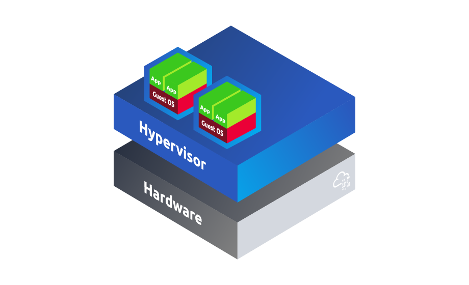
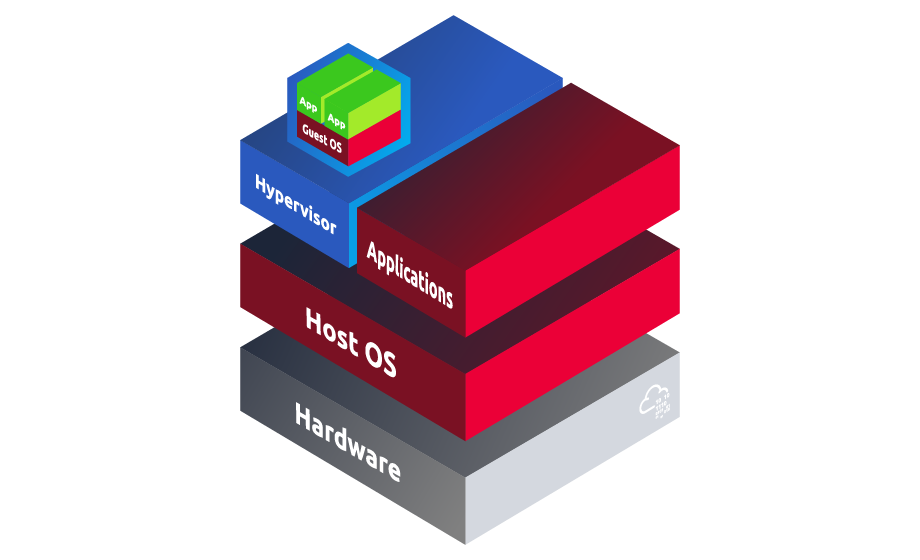

# Virtualization and Containers

- [Room information](#room-information)
- [Solution](#solution)
- [References](#references)

## Room information

```text
Type: Walkthrough
Difficulty: Easy
Tags: Linux
Meta Tags: Walkthrough, Walk-through, Write-up, Writeup
Subscription type: Premium
Description:
Introduction to common virtualization technologies and applications.
```

Room link: [https://tryhackme.com/room/virtualizationandcontainers](https://tryhackme.com/room/virtualizationandcontainers)

## Solution

### Task 1: Introduction

As computing has become more prevalent in daily life, the need for computing resources, accessibility, and extensibility is larger than ever. With access to computing resources limited, technology has needed to adapt to allow those without direct access to resources to still access modern technology. Thus, cloud computing and virtualization have come to the forefront of technology as a solution for individuals, small and large businesses, and everything in between.

Apart from cloud computing, virtualization can also be used to partition and create lab machines (VMs). This allows for atomic testing, development, research, and other uses that we will expand on throughout this room.

In this room, we will take a high-level overview of virtualization and its applications, gradually investigating specific virtualization technologies used in modern environments.

#### Learning Objectives

- Understand what virtualization is, how and why it is used.
- Learn common virtualization technologies, including hypervisors and containers.
- Use virtualization technologies practically and understand their applications to security and modern computing.

This room is designed to teach high-level concepts from the ground up and requires no prerequisites.

---------------------------------------------------------------------------

### Task 2: What is Virtualization

At its most basic level, virtualization is the concept of encapsulating the capabilities and features of a physical machine in a virtual environment, known as a **lab machine**.

But why is virtualization needed? For most organizations and individuals, virtualization comes from a need of the following:

- **Decrease expenses**: Physical servers can be expensive, and virtualization can decrease the number of servers or other hardware, or even completely remove physical hardware from a company's infrastructure.
- **Scale**: Without properly implemented DevOps, it may be hard for a company to scale resources as server usage increases. Virtualization makes this process easier and can delegate a server's resources to lab machines as needed based on usage.
- **Efficiency**: Like scaling, virtualization can also make it easier to decrease the resources allocated to a lab machine if there is reduced usage.

#### Virtualization Technology

At this point, you may be asking how virtualization is possible; while this is an intricate question, in this room, we will break down different technologies and platforms, briefly looking at how they interact with the underlying host operating system.

To answer the above question, we need to expand the definition of virtualization. Formally, virtualization abstracts or creates an **abstraction layer** over computer hardware. An abstraction layer allows a single device to be divided into multiple virtual computers, also known as lab machines (VMs).

In simpler terms, this means that the lab machine will have access to *logical resources* that are abstracted away from the *physical resources*.

#### Virtualization Structure

Virtualization is implemented using an engine-machine format, which means that a software or system creates an abstraction layer and allocates resources, while an operating system or application can then be installed on top of this virtualized environment. The operating system installed in a lab machine is known as a **guest OS**, as opposed to the **host OS** on which the virtualization engine is running.

In the next task, we will introduce our first virtualization engine type - **hypervisors**.

---------------------------------------------------------------------------

#### Is scalability a primary benefit of virtualization? (Y/N)

Answer: `Y`

#### What is the operating system of a lab machine often referred to as?

Answer: `guest OS`

---------------------------------------------------------------------------

### Task 3: Hypervisors

In the previous task, we introduced the concept of virtualization at a high level and briefly discussed the structure of virtualization. In this task, we will present our first type of virtualization engine: **hypervisors**.

A hypervisor provides the ability to create the abstraction layer between hardware and software. A hypervisor will also generally include some form of management application or software to provide an interface between the end user and the abstraction layer to create or load lab machines.

Hypervisors are separated into two categories that are determined by their position relative to the hardware. They can either directly create a lightweight operating system on top of the hardware that is the hypervisor or add a hypervisor as an application on top of a pre-existing operating system.

#### Type 1 Hypervisors

**Type 1 hypervisors**, also known as **bare metal hypervisors**, create an abstraction layer directly between hardware and lab machines without a common operating system between them. Instead, the hypervisor is the operating system and is often *headless*, with only a web-based management portal remotely accessed. These hypervisors are designed for scale and to deploy a large number of lab machines at once. They are extremely lightweight to dedicate the most resources to lab machines. Below is a diagram of a type 1 hypervisor architecture.



Examples of type 1 hypervisors include VMware ESXi, Proxmox, VMware vSphere, Xen, and KVM.

#### Type 2 Hypervisors

**Type 2 hypervisors**, also known as **hosted hypervisors**, create an abstraction layer from a software application built on top of a pre-existing operating system. Unlike type 1 hypervisors, type 2 hypervisors are often managed directly from the application through a GUI. These hypervisors are often designed for end-users or individuals such as developers and are not strictly designed to run a large number of lab machines for scale. Below is a diagram of a type 2 hypervisor architecture.



Examples of type 2 hypervisors include VMware Workstation, VMware Fusion, VirtualBox, Parallels, and QEMU.

---------------------------------------------------------------------------

#### What type of hypervisor is VirtualBox considered?

Answer: `Type 2`

#### What are type 1 hypervisors also known as?

Answer: `bare metal hypervisors`

---------------------------------------------------------------------------

### Task 4: Containers

Hypervisors work as expected for a large number of use cases but begin to encounter issues when scaling lightweight applications. *Microservices* give us a good example of an application architecture that encounters issues when deployed from a hypervisor. A microservice is an application structure that is broken up into smaller services that are scalable and use lightweight protocols and features. The lightweight nature of the architecture poses obvious issues to hypervisors that require a large number of lab machines each with high resource usage.

**Containers** are the current solution to the issues encountered with hypervisors at scale.

#### What are Containers

Containers have a lot in common with lab machines, but instead of being completely abstracted from the host operating system, containers share some properties with the host operating system. Containers have their own filesystem, a portion of computing resources (CPU, RAM), a process space, and more.

Apart from the obvious benefits of being lightweight, containers are also *portable* and *robust* because they are not completely abstracted.

Container engines are our second type of virtualization. As lab machines use a hypervisor to create an abstraction layer for virtualization, containers use a container engine to create an abstraction layer using logical resources.

In the next task, we will introduce our first container engine - **Docker**.

---------------------------------------------------------------------------

#### Are containers completely abstracted from the host operating system? (Y/N)

Answer: `N`

---------------------------------------------------------------------------

### Task 5: Docker

#### Set up your virtual environment

To successfully complete this room, you'll need to set up your virtual environment. This involves starting both your AttackBox (if you're not using your VPN) and Lab Machines, ensuring you're equipped with the necessary tools and access to tackle the challenges ahead.

If someone is familiar with containers, Docker is likely the first name that comes to mind. Docker is a container platform and engine that is used to run Docker "images" as containers.

Each Docker image is built of a base image, such as Alpine or Ubuntu, that is specifically built for use in containers and is lightweight. To build a Docker image, a Dockerfile must be created, which defines the base image for a container and any commands to be run.

For more information about Docker, check out the [Intro to Docker](https://tryhackme.com/room/introtodockerk8pdqk) room.

#### Running and Interacting with a Docker Container

Docker Hub is a remote repository for Docker images, similar to GitHub - a remote repository for Git. Using Docker Hub, we can pull Docker images created by others or push our own.

```bash
docker pull <user>/<image>
```

Alternatively, a container image can be automatically pulled when running the container for the first time. Once a container is pulled for the first time, it will be cached locally, and Docker will look for it locally before attempting to download it.

```bash
docker run <user>/<image>
```

Once the image is started, we can verify that the Docker engine is running the container by listing the processes running in Docker using the below command.

```bash
docker ps
```

From the above command, you may notice that the container will be assigned a random identifier, IP address, and network interface.

#### Hands-On Application

To get hands-on with containers and Docker, we will deploy a Flask web server in a Docker container. To access the terminal, deploy the lab machine attached to this task task by pressing the green **Start Lab Machine** button. Please allow the machine 3 - 5 minutes to deploy. The machine will start in split view; if the machine does not appear, you can click the blue **Show Split View** button located at the top right of this room. Alternatively, you can access the machine with SSH using the credentials provided below.

- Machine IP: `10.82.175.202`
- Username: `thmuser`
- Password: `TryHackMe!`

Before starting the docker container, we must first introduce two new flags that must be used with the run command to allow the container to detach from the current terminal (`-d`) and expose ports externally (`-p`). Below is the required syntax to start the example Flask app in a Docker container, exposing the webserver to port 5000.

```bash
docker run -p 5000:5000 -d cryillic/thm_example_app 
```

To verify that the web server is running in the Docker container, we can scan the container or access the designated port in a web browser.

**Note**: Certain special characters may not be visible on the provided VM. When doing a copy-and-paste, it will still copy all characters.

---------------------------------------------------------------------------

#### What flag is obtained at `http://10.82.175.202:5000` after running the container?

We start by logging in and run the container.

```bash
┌──(kali㉿kali)-[/mnt/…/Wargames/TryHackMe/Walkthroughs/Easy]
└─$ export TARGET_IP=10.82.175.202

┌──(kali㉿kali)-[/mnt/…/Wargames/TryHackMe/Walkthroughs/Easy]
└─$ ssh thmuser@$TARGET_IP
The authenticity of host '10.82.175.202 (10.82.175.202)' can't be established.
ED25519 key fingerprint is SHA256:9j+wMornoqLevhhwKgZLF35G1a3wKoxoGD0O2R+b3jA.
This key is not known by any other names.
Are you sure you want to continue connecting (yes/no/[fingerprint])? yes
Warning: Permanently added '10.82.175.202' (ED25519) to the list of known hosts.
thmuser@10.82.175.202's password: 
Welcome to Ubuntu 20.04.6 LTS (GNU/Linux 5.15.0-1084-aws x86_64)

 * Documentation:  https://help.ubuntu.com
 * Management:     https://landscape.canonical.com
 * Support:        https://ubuntu.com/pro

 System information as of Mon Aug 31 11:38:54 UTC 2026

  System load:  0.29              Processes:             117
  Usage of /:   5.3% of 58.09GB   Users logged in:       1
  Memory usage: 18%               IPv4 address for ens5: 10.82.175.202
  Swap usage:   0%

 * Ubuntu Pro delivers the most comprehensive open source security and
   compliance features.

   https://ubuntu.com/aws/pro

Expanded Security Maintenance for Infrastructure is not enabled.

0 updates can be applied immediately.

45 additional security updates can be applied with ESM Infra.
Learn more about enabling ESM Infra service for Ubuntu 20.04 at
https://ubuntu.com/20-04


The list of available updates is more than a week old.
To check for new updates run: sudo apt update
Failed to connect to https://changelogs.ubuntu.com/meta-release-lts. Check your Internet connection or proxy settings


The programs included with the Ubuntu system are free software;
the exact distribution terms for each program are described in the
individual files in /usr/share/doc/*/copyright.

Ubuntu comes with ABSOLUTELY NO WARRANTY, to the extent permitted by
applicable law.


The programs included with the Ubuntu system are free software;
the exact distribution terms for each program are described in the
individual files in /usr/share/doc/*/copyright.

Ubuntu comes with ABSOLUTELY NO WARRANTY, to the extent permitted by
applicable law.

Last login: Mon Aug 31 11:36:49 2026 from 10.82.111.157
Could not chdir to home directory /home/thmuser: No such file or directory
$ docker run -p 5000:5000 -d cryillic/thm_example_app 
4847a4b779ab5b6248befcf6a7f073b44a0afba6968e6134ea30d73e6ee5b749
$ docker ps
CONTAINER ID   IMAGE                      COMMAND            CREATED         STATUS         PORTS                                       NAMES
4847a4b779ab   cryillic/thm_example_app   "python view.py"   6 seconds ago   Up 4 seconds   0.0.0.0:5000->5000/tcp, :::5000->5000/tcp   youthful_mcnulty
$ 
```

Then we can get the flag via `curl`.

```bash
┌──(kali㉿kali)-[/mnt/…/Wargames/TryHackMe/Walkthroughs/Easy]
└─$ curl http://$TARGET_IP:5000                   
<!DOCTYPE html>

<html lang="en">
<head>
    <meta charset="UTF-8">
    <title>Flask Docker</title>
</head>
<body>
    <center><h1>THM{<REDACTED>}</h1></center>
</body>
</html>                                                                                                                                                                     
┌──(kali㉿kali)-[/mnt/…/Wargames/TryHackMe/Walkthroughs/Easy]
└─$ curl -s http://$TARGET_IP:5000 | grep -oE 'THM{.*}'
THM{<REDACTED>}
```

Answer: `THM{<REDACTED>}`

---------------------------------------------------------------------------

### Task 6: Kubernetes

Through the use of hypervisors and containers, most problems associated with traditional computing are resolved, such as cost and *efficiency*. This still leaves the question, what if we need a faster and more scalable solution? That is, as load or other criteria changes, the resources or the number of instances allocated to the application or service increase or decrease on the fly as needed.

**Kubernetes**, also shortened to "**K8s**," is one such solution known as an **orchestration platform**. An orchestration platform aims to integrate into other products, such as Docker, and extend their capabilities or "synchronize" them with other products or applications.

Kubernetes relies on these traditional virtualization models like hypervisors and containers and extends their uses, features, and capabilities.

These capabilities and features include the following:

- **Horizontal scaling**: Unlike traditional "vertical" scaling, "horizontal" scaling refers to adding devices or machines to handle increased workload, rather than adding logic resources such as CPU or RAM.
- **Extensibility**: Clusters can be modified dynamically without affecting containers outside of the intended group.
- **Self-healing**: K8s can automatically restart, replace, reschedule, and kill containers that are not properly functioning based on user-defined health checks.
- **Automated rollouts and rollbacks**: K8s can progressively roll out changes to containers. As changes are made, it will monitor the application's health and decide whether to continue the rollout or rollback. This ensures the constant uptime of your cluster even if some containers fail.

#### Hands-On Application

To get hands-on with K8s, we've given you access to a pre-deployed cluster configured with *kubectl*. Because Kubernetes provides most of the basic automation by default, we want you to explore the differences between K8s and a traditional virtualization platform on your own. That being said, Kubernetes is a large platform with a pervasive list of features. We encourage you to continue investigating DevOps and the features of K8s, as we will only provide you with a basic set of questions to get started exploring a Kubernetes cluster.

To access the cluster, deploy the lab machine attached to this task task by pressing the green **Start Lab Machine** button. Please allow the machine 3 - 5 minutes to deploy. The machine will start in split view; if the machine does not appear, you can click the blue **Show Split View** button located at the top right of this room.

To aid you in using kubectl, you can use the online reference found [here](https://kubernetes.io/docs/reference/kubectl/cheatsheet/). We encourage you to use the hints to guide you as you answer questions.

Before proceeding, ensure all clusters are started by opening a terminal and running `minikube start`.

```bash
ubuntu@tryhackme:~$ minikube start
😄  minikube v1.32.0 on Ubuntu 20.04
✨  Using the docker driver based on existing profile
👍  Starting control plane node minikube in cluster minikube
🚜  Pulling base image ...
🔄  Restarting existing docker container for "minikube" ...
❗  This container is having trouble accessing https://registry.k8s.io
💡  To pull new external images, you may need to configure a proxy: https://minikube.sigs.k8s.io/docs/reference/networking/proxy/
🐳  Preparing Kubernetes v1.28.3 on Docker 24.0.7 ...
❗  kubeadm certificates have expired. Generating new ones...
🤦  Unable to restart cluster, will reset it: apiserver healthz: apiserver process never appeared
    ▪ Generating certificates and keys ...
    ▪ Booting up control plane ...
    ▪ Configuring RBAC rules ...
🔗  Configuring bridge CNI (Container Networking Interface) ...
    ▪ Using image gcr.io/k8s-minikube/storage-provisioner:v5
🔎  Verifying Kubernetes components...
🌟  Enabled addons: default-storageclass, storage-provisioner
🏄  Done! kubectl is now configured to use "minikube" cluster and "default" namespace by default
ubuntu@tryhackme:~$ 
```

---------------------------------------------------------------------------

#### How many pods are running on the provided cluster?

Hint: kubectl get pods

```bash
ubuntu@tryhackme:~$ kubectl get pods   
No resources found in default namespace.
```

Configuration broken! Got the answer from another writeup.

Answer: `1`

#### How many system pods are running on the provided cluster?

Hint: kubectl get pods -A

```bash
ubuntu@tryhackme:~$ kubectl get pods -A
NAMESPACE     NAME                               READY   STATUS    RESTARTS        AGE
kube-system   coredns-5dd5756b68-7xlbq           1/1     Running   0               4m26s
kube-system   etcd-minikube                      1/1     Running   0               4m38s
kube-system   kube-apiserver-minikube            1/1     Running   0               4m38s
kube-system   kube-controller-manager-minikube   1/1     Running   0               4m38s
kube-system   kube-proxy-xmprv                   1/1     Running   0               4m27s
kube-system   kube-scheduler-minikube            1/1     Running   0               4m38s
kube-system   storage-provisioner                1/1     Running   1 (3m53s ago)   4m35s
ubuntu@tryhackme:~$ kubectl get pods -A | grep Running | wc -l
7
ubuntu@tryhackme:~$ 
```

Answer: `7`

#### What is the pod name on the provided cluster?

Hint: kubectl get pods

```bash
ubuntu@tryhackme:~$ kubectl get pods   
No resources found in default namespace.
```

Configuration broken! Got the answer from another writeup.

Answer: `hello-tryhackme-66c4d4d69d-gb9nz`

#### What is the deployment name on the provided cluster?

Hint: kubectl get deployments

```bash
ubuntu@tryhackme:~$ kubectl get deployments
No resources found in default namespace.
```

Configuration broken! Got the answer from another writeup.

Answer: `hello-tryhackme`

#### What port is exposed by the service in question 5?

Hint: kubectl get services

```bash
ubuntu@tryhackme:~$ kubectl get services
NAME         TYPE        CLUSTER-IP   EXTERNAL-IP   PORT(S)   AGE
kubernetes   ClusterIP   10.96.0.1    <none>        443/TCP   35m
ubuntu@tryhackme:~$ kubectl get services hello-tryhackme-service
Error from server (NotFound): services "hello-tryhackme-service" not found
ubuntu@tryhackme:~$ 
```

Unclear! The service isn't related to question 5!?

Answer: `443`

#### How many replica sets are deployed on the provided cluster?

Hint: kubectl get rs

```bash
ubuntu@tryhackme:~$ kubectl get rs
No resources found in default namespace.
```

Configuration broken! Got the answer from another writeup.

Answer: `1`

#### What is the replica set name on the provided cluster?

Hint: kubectl get rs

```bash
ubuntu@tryhackme:~$ kubectl get rs
No resources found in default namespace.
```

Configuration broken! Answer inspired by another writeup.

Answer: `hello-tryhackme-66c4d4d69d`

#### What command would be used to delete the deployment from question 5?

Hint: Look at the kubectl help menu or online resources.

```bash
ubuntu@tryhackme:~$ kubectl -h     
kubectl controls the Kubernetes cluster manager.

 Find more information at: https://kubernetes.io/docs/reference/kubectl/

Basic Commands (Beginner):
  create          Create a resource from a file or from stdin
  expose          Take a replication controller, service, deployment or pod and expose it as a new Kubernetes service
  run             Run a particular image on the cluster
  set             Set specific features on objects

Basic Commands (Intermediate):
  explain         Get documentation for a resource
  get             Display one or many resources
  edit            Edit a resource on the server
  delete          Delete resources by file names, stdin, resources and names, or by resources and label selector

Deploy Commands:
  rollout         Manage the rollout of a resource
  scale           Set a new size for a deployment, replica set, or replication controller
  autoscale       Auto-scale a deployment, replica set, stateful set, or replication controller

Cluster Management Commands:
  certificate     Modify certificate resources
  cluster-info    Display cluster information
  top             Display resource (CPU/memory) usage
  cordon          Mark node as unschedulable
  uncordon        Mark node as schedulable
  drain           Drain node in preparation for maintenance
  taint           Update the taints on one or more nodes

Troubleshooting and Debugging Commands:
  describe        Show details of a specific resource or group of resources
  logs            Print the logs for a container in a pod
  attach          Attach to a running container
  exec            Execute a command in a container
  port-forward    Forward one or more local ports to a pod
  proxy           Run a proxy to the Kubernetes API server
  cp              Copy files and directories to and from containers
  auth            Inspect authorization
  debug           Create debugging sessions for troubleshooting workloads and nodes
  events          List events

Advanced Commands:
  diff            Diff the live version against a would-be applied version
  apply           Apply a configuration to a resource by file name or stdin
  patch           Update fields of a resource
  replace         Replace a resource by file name or stdin
  wait            Experimental: Wait for a specific condition on one or many resources
  kustomize       Build a kustomization target from a directory or URL

Settings Commands:
  label           Update the labels on a resource
  annotate        Update the annotations on a resource
  completion      Output shell completion code for the specified shell (bash, zsh, fish, or powershell)

Subcommands provided by plugins:

Other Commands:
  api-resources   Print the supported API resources on the server
  api-versions    Print the supported API versions on the server, in the form of "group/version"
  config          Modify kubeconfig files
  plugin          Provides utilities for interacting with plugins
  version         Print the client and server version information

Usage:
  kubectl [flags] [options]

Use "kubectl <command> --help" for more information about a given command.
Use "kubectl options" for a list of global command-line options (applies to all commands).
ubuntu@tryhackme:~$ 
```

Answer: `kubectl delete deployment hello-tryhackme`

---------------------------------------------------------------------------

### Task 7: Conclusion

In this room, we've briefly overviewed the current virtualization technologies, the problems they solve, and how they are implemented. You may still be asking, how is virtualization used every day?

Throughout this room, we have looked at virtualization in the context of microservices, but virtualization goes far beyond that.

Lab machines are portable; they can be stored, moved, and redeployed in the same state. With portability also comes ease of deployment; templates and "golden images" can be used to create an image or snapshot of a VM so it can be redeployed multiple times.

Because lab machines can be easily redeployed, they make a perfect environment for development and testing. If an unknown exception occurs or a machine breaks, you can always revert to a previous snapshot or the image from which you started.

These are only a handful of the applications of virtualization, and we encourage you to explore these solutions in light of your challenges or opportunities and see how they could benefit you.

---------------------------------------------------------------------------

For additional information, please see the references below.

## References

- [Containerization (computing) - Wikipedia](https://en.wikipedia.org/wiki/Containerization_(computing))
- [curl - Homepage](https://curl.se/)
- [curl - Linux manual page](https://man7.org/linux/man-pages/man1/curl.1.html)
- [cURL - Wikipedia](https://en.wikipedia.org/wiki/CURL)
- [Docker - Docs](https://docs.docker.com/)
- [Docker - Homepage](https://www.docker.com/)
- [docker - Manual page](https://manpages.org/docker)
- [Docker (software) - Wikipedia](https://en.wikipedia.org/wiki/Docker_(software))
- [grep - Linux manual page](https://man7.org/linux/man-pages/man1/grep.1.html)
- [Hypervisor - Wikipedia](https://en.wikipedia.org/wiki/Hypervisor)
- [kubectl - Manual page](https://manpages.org/kubectl)
- [Kubernetes - Wikipedia](https://en.wikipedia.org/wiki/Kubernetes)
- [Virtualization - Wikipedia](https://en.wikipedia.org/wiki/Virtualization)
