# Walking An Application

- [Room information](#room-information)
- [Solution](#solution)
- [References](#references)

## Room information

```text
Type: Walkthrough
Difficulty: Easy
Tags: Web
Meta Tags: Walkthrough, Walk-through, Write-up, Writeup
Subscription type: Premium
Description:
Manually review a web application for security issues using only your browser's developer tools.
```

Room link: [https://tryhackme.com/room/walkinganapp](https://tryhackme.com/room/walkinganapp)

## Solution

### Task 1: Walking An Application

In this room you will learn how to manually review a web application for security issues using only the in-built tools in your browser. More often than not, automated security tools and scripts will miss many potential vulnerabilities and useful information.

#### Learning Objectives

By the end of this room, you will be able to:

- Use your browser to view the human-readable source code of a website
- Inspect page elements and make changes to view the usually blocked content
- Inspect and control the flow of a page's JavaScript
- Identify the network requests a page makes
- Identify locally stored data by a website

#### Prerequisites

You should have an understanding of the following rooms before starting:

- [Web Application Basics](https://tryhackme.com/room/webapplicationbasics)
- [HTTP In Detail](https://tryhackme.com/room/httpindetail)

#### Machine Access

Launch the AttackBox using the **Start AttackBox** button, and the Lab machine using the **Start Lab Machine** button. Then, use Mozilla Firefox on the AttackBox to navigate to `http://10.112.181.41` to access the website, which we will use throughout this room to understand the fundamental concepts.

---------------------------------------------------------------------------------------

### Task 2: Exploring The Website

As a penetration tester, your role when reviewing a website or web application is to discover features that could potentially be vulnerable and attempt to exploit them to assess whether or not they are. These features are usually parts of the website that require some interactivity with the user.

Finding interactive portions of the website can range from spotting a login form to manually reviewing the website's JavaScript. An excellent place to start is just with your browser; explore the website, note down the individual pages, areas, and features, and include a summary for each. After visiting the Acme IT Support website, you will see the following page:


An example site review for the Acme IT Support website would look something like this:

|Feature|URL|Summary|
|----|----|----|
|Home Page|`/`|This page contains a summary of what Acme IT Support does with a company photo of their staff.|
|Latest News|`/news`|This page contains a list of recently published news articles by the company, and each news article has a link with an id number, i.e. `/news/article?id=1`|
|News Article|`/news/article?id=1`|Displays the individual news article. Some articles seem to be blocked and reserved for premium customers only.|
|Contact Page|`/contact`|This page contains a form for customers to contact the company. It contains name, email and message input fields and a send button.|
|Customers|`/customers`|This link redirects to `/customers/login`.|
|Customer Login|`/customers/login`|This page contains a login form with username and password fields.|
|Customer Signup|`/customers/signup`|This page contains a user-signup form that consists of a username, email, password and password confirmation input fields.|
|Customer Reset Password|`/customers/reset`|Password reset form with an email address input field.|
|Customer Dashboard|`/customers`|This page contains a list of the user's tickets submitted to the IT support company and a **Create Ticket** button.|
|Create Ticket|`/customers/ticket/new`|This page contains a form with a textbox for entering the IT issue and a file upload option to create an IT support ticket.|
|Customer Account|`/customers/account`|This page allows the user to edit their username, email and password.|
|Customer Logout|`/customers/logout`|This link logs the user out of the customer area.|

We will start taking a deeper look into some of the pages we have discovered in the next task.

---------------------------------------------------------------------------------------

#### What is the endpoint for creating new tickets?

Answer: `/customers/ticket/new`

---------------------------------------------------------------------------------------

### Task 3: Viewing The Page Source

The **page source** is the human-readable code returned to our browser/client from the web server each time we make a request.

The returned code is made up of HTML (HyperText Markup Language), CSS (Cascading Style Sheets) and JavaScript, and it's what tells our browser what content to display, how to show it and adds an element of interactivity with JavaScript.

For our purposes, viewing the page source can help us discover more information about the web application.

#### How do I view the Page Source?

While viewing a website, you can right-click the page and select **View Page Source** from the menu.

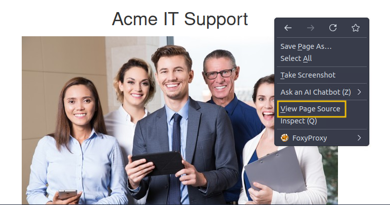

Most browsers also support putting view-source in front of the URL, for example, `view-source:https://www.google.com/`.

#### Let's view some Page Source

Try viewing the source code of the Acme IT Support website's home page. Unfortunately, explaining everything you can see here is well out of the scope of this room, and you'll need to look into website design/development courses to understand it fully. What we can do is pick out bits of information that are of importance to us.

At the top of the page, you'll notice some code starting with `<!--` and ending with `-->`; these are **comments**. Comments are messages left by the website developer, usually to explain something in the code to other programmers or even notes/reminders for themselves. These comments don't get displayed on the actual webpage. This comment explains that the homepage is temporary while a new one is under development. **View the webpage in the comment to get your first flag**.

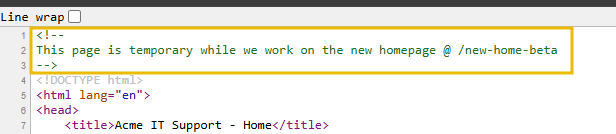

Links to different pages in HTML are written in anchor tags (these are HTML elements that start with `<a`), and the link that you'll be directed to is stored in the `href` attribute.

For example, you'll see the contact page link on line `31`:

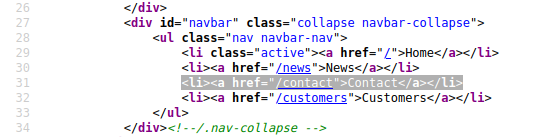

If you view the page source further down, there is a hidden link to a page starting with `secr`; **view this link to get another flag**. You obviously wouldn't get a flag in a real-world situation, but you may discover a private area the business uses to store company, staff, or customer information.

**External files** such as CSS, JavaScript and images can be included using the HTML code. In this example, you'll notice that these files are all stored in the same directory.

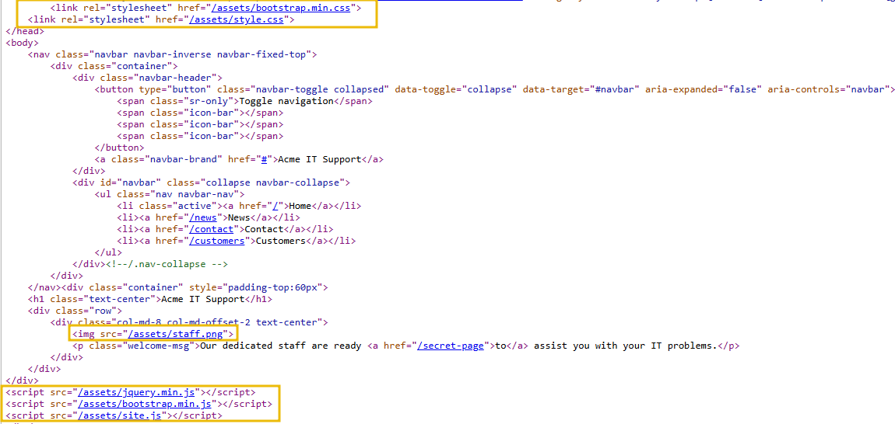

If you view this directory in your web browser, you should see a configuration error: either a blank page or a **403 Forbidden** page with an error stating you don't have access to the directory. Instead, the directory listing feature has been enabled, which actually lists every file in the directory. Sometimes this isn't an issue, and all the files in the directory are safe for public viewing, but in some cases, backup files, source code, or other confidential information could be stored here. **In this instance, there is a flag in the `flag.txt` file**.

Many websites these days aren't built from scratch; they use a **framework**. A framework is a collection of pre-made code that makes it easy for developers to include common features a website would require, such as blogs, user management, form processing, and more, saving developers hours or days of development time.

Viewing the **page source** can often give us clues into whether a framework is in use and, if so, which framework and even what version. Knowing the framework and version can be a powerful find, as there may be public vulnerabilities in the framework, and the website might not be using the most up-to-date version. At the bottom of the page, you'll find a comment about the framework and its version in use, along with a link to the framework's website. Viewing the framework's website, you'll see that our website is, in fact, out of date. **Read the update notice and use the information that you find to discover another flag**.

---------------------------------------------------------------------------------------

#### What is the flag from the HTML comment?

Hint: Go to the page mentioned in the comment.

View source of the home page and look for comments.

The first comment is:

```html
<!--
This page is temporary while we work on the new homepage @ /new-home-beta
-->
```

Follow the URL, i.e. access `http://10.112.181.41/new-home-beta` for the flag.

Answer: `THM{<REDACTED>}`

#### What is the flag from the secret link?

Hint: Have a look a the secret page in the welcome message.

In the source we see this secret link:  
`<p class="welcome-msg">Our dedicated staff are ready <a href="/secret-page">to</a> assist you with your IT problems.</p>`

From the home page click on the word `to` to follow the link and get the flag.

Answer: `THM{<REDACTED>}`

#### What is the directory listing flag?

Hint: Try to access the URL where all of the static files (CSS, JS and Images) are stored.

Looking through the links in the HTML-source the following local directory can be identified:  
`/assets/`

Try to access this directory `http://10.112.181.41/assets/` and we get the following result:

```text
Index of /assets/

../
avatars/                                           23-Aug-2021 08:53                   -
bootstrap.min.css                                  23-Aug-2021 08:53              121200
bootstrap.min.js                                   23-Aug-2021 08:53               37049
flag.txt                                           23-Aug-2021 08:53                  34
flash.min.js                                       23-Aug-2021 08:53                2409
jquery.min.js                                      23-Aug-2021 08:53               89476
printer.png                                        23-Aug-2021 08:53              154361
shakinghands.png                                   23-Aug-2021 08:53              230418
site.js                                            23-Aug-2021 08:53                 408
staff.png                                          23-Aug-2021 08:53              528156
style.css                                          23-Aug-2021 08:53                6415
```

Access/click on the `flag.txt` link for the flag.

Answer: `THM{<REDACTED>}`

#### What is the framework flag?

Hint: Navigate to the framework’s website and find a file on the Change Log page.

Note this comment at the end of the home page

```html
<!--
Page Generated in 0.03511 Seconds using the THM Framework v1.2 ( https://static-labs.tryhackme.cloud/sites/thm-web-framework )
-->
```

Visit the framework site (`https://static-labs.tryhackme.cloud/sites/thm-web-framework`) and click on the `Change Log` link.

```text
Version 1.3

We've had an issue where our backup process was creating a file in the web directory called /tmp.zip which potentially could of been read by website visitors. This file is now stored in an area that is unreadable by the public.

<---snip--->
```

Download the zip-file with `wget` and unpack it to get the flag.

```bash
┌──(kali㉿kali)-[/mnt/…/TryHackMe/Walkthroughs/Easy/Walking_An_Application]
└─$ wget 10.112.181.41/tmp.zip                                                                            
Prepended http:// to '10.112.181.41/tmp.zip'
--2026-08-23 10:25:51--  http://10.112.181.41/tmp.zip
Connecting to 10.112.181.41:80... connected.
HTTP request sent, awaiting response... 200 OK
Length: 198 [application/zip]
Saving to: ‘tmp.zip’

tmp.zip                                         100%[=====================================================================================================>]     198  --.-KB/s    in 0s      

2026-08-23 10:25:51 (26.2 MB/s) - ‘tmp.zip’ saved [198/198]

┌──(kali㉿kali)-[/mnt/…/TryHackMe/Walkthroughs/Easy/Walking_An_Application]
└─$ unzip tmp.zip                  
Archive:  tmp.zip
 extracting: flag.txt                

┌──(kali㉿kali)-[/mnt/…/TryHackMe/Walkthroughs/Easy/Walking_An_Application]
└─$ cat flag.txt                                                            
THM{<REDACTED>}
```

Answer: `THM{<REDACTED>}`

---------------------------------------------------------------------------------------

### Task 4: Developer Tools - Inspector

#### Developer Tools

Every modern browser includes developer tools; this is a tool kit used to aid web developers in debugging web applications and gives you a peek under the hood of a website to see what is going on. As a pentester, we can leverage these tools to provide us with a much better understanding of the web application. We're specifically focusing on three features of the developer tool kit, **Inspector**, **Debugger** and **Network**.

#### Opening Developer Tools

The way to access developer tools varies by browser. If you're not sure how to access it, click the `View Site` button on the top-right of this task to get instructions for accessing the tools for your browser.

#### Inspector

The page source doesn't always reflect what's shown on a webpage; CSS, JavaScript, and user interaction can change the page's content and style, so we need a way to view what's been displayed in the browser window at this exact time. The **Inspector** tab provides a live view of what is currently on the website. In addition to viewing this live view, we can also edit and interact with page elements, which is helpful for web developers to debug issues.

On the Acme IT Support website, click into the **News** section, where you'll see three news articles. The first two articles are readable, but the third is blocked by a floating notice above the content stating that you need a premium subscription to view it. These floating boxes that block page content are often called **paywalls**, as they put up a metaphorical wall in front of the content you want to see until you pay.

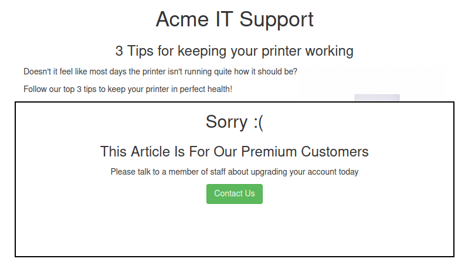

Right-click the premium notice (paywall), then select **Inspect** from the menu to open the developer tools at the bottom or right-hand side, depending on your browser or preferences.

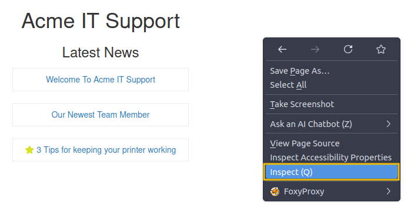

In the Inspector tab, you'll now see the elements/HTML that make up the website.

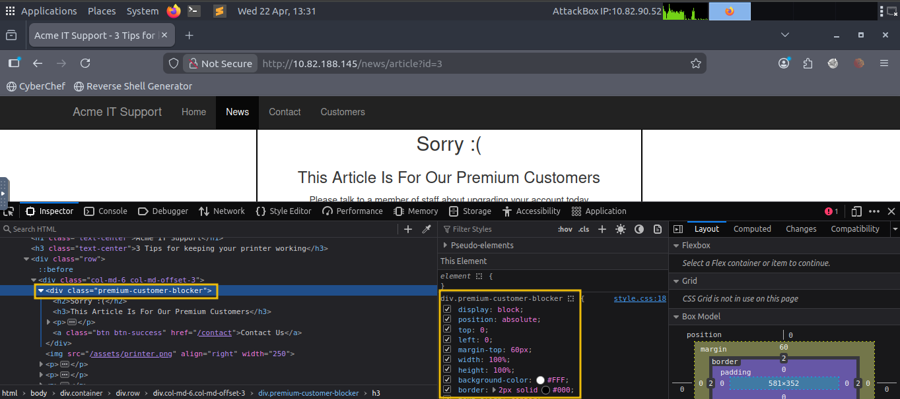

Locate the `DIV` element with the class `premium-customer-blocker`, and then click on it. You'll see all the CSS styles in the styles box that apply to this element, such as `margin-top: 60px` and `text-align: center`. The style we're interested in is the `display: block`. If you click on the word `block`, you can type a value of your own choice. Try typing `none`, and this will make the box disappear, revealing the content underneath it and a **flag**. If the element didn't have a display field, you could click the bottom of the last style and add your own.

Have a play with the element inspector, and you'll see you can change any of the information on the website, including the content. Remember, this is only edited in your browser window, and when you press refresh, everything will be back to normal.

---------------------------------------------------------------------------------------

#### What is the flag behind the paywall?

Hint: Type none into the display: field when inspecting the premium-customer-blocker class on the News page

From the Acme IT Support homepage, click on the `News` section in the upper menu.

Three news articles are show. Clieck on the last one (`3 Tips for keeping your printer working`).

Open DevTools by pressing `F12` and select the `Inspector` tab.

If needed, expand the `<body>` and two levels of `div class="xyz"`.

Select the `<div class="premium-customer-blocker">` line.

Click on the `block` word in the `display: block` line in the middle pane. Change it to `none` and press `Enter`.

Now the flag is revealed.

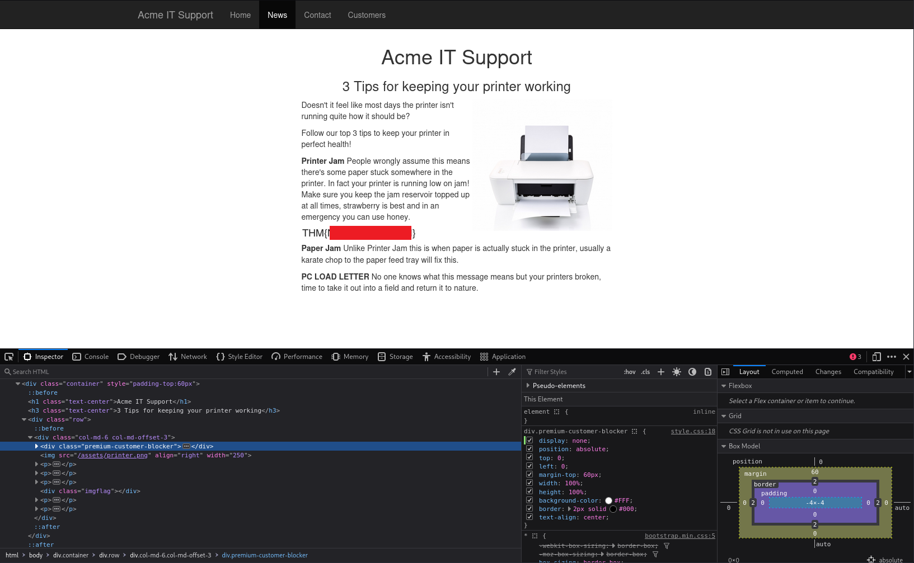

Answer: `THM{<REDACTED>}`

---------------------------------------------------------------------------------------

### Task 5: Developer Tools - Debugger

#### Developer Tools - Debugger

This panel in the developer tools is intended for debugging JavaScript, and again is an excellent feature for web developers wanting to work out why something might not be working. But as penetration testers, we can dig deep into the JavaScript code. In Firefox and Safari, this feature is called **Debugger**, but in Google Chrome, it's called **Sources**.

On the Acme IT Support website, click on the **Contact** page. Each time the page loads, you might notice a rapid flash of red on the screen. We're going to use the Debugger tab to work out what this red flash is and if it contains anything interesting. Debugging a red dot wouldn't be something you'd do in the real world as a penetration tester, but it does let us use this feature and get familiar with the Debugger.

In the Debugger tab, on the left-hand side, you see a list of all the resources the current webpage is using. If you click into the `assets` folder, you'll see a file named `flash.min.js`. Clicking this file displays its contents.

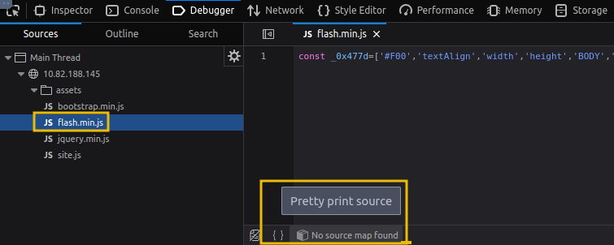

Often when viewing JavaScript files, you'll notice that everything is on one line because they've been minimised, meaning all formatting (tabs, spacing, and newlines) has been removed to make the file smaller. This file is no exception; it has also been obfuscated, making it purposely difficult to read and harder for other developers to copy.

We can return some of the formatting by using the **Pretty Print** option, which looks like two braces `{ }` to make it a little more readable, though due to the obfuscation, it's still difficult to comprehend what is going on in the file. If you scroll to the bottom of the `flash.min.js` file, you'll see the line: `flash['remove']();`.

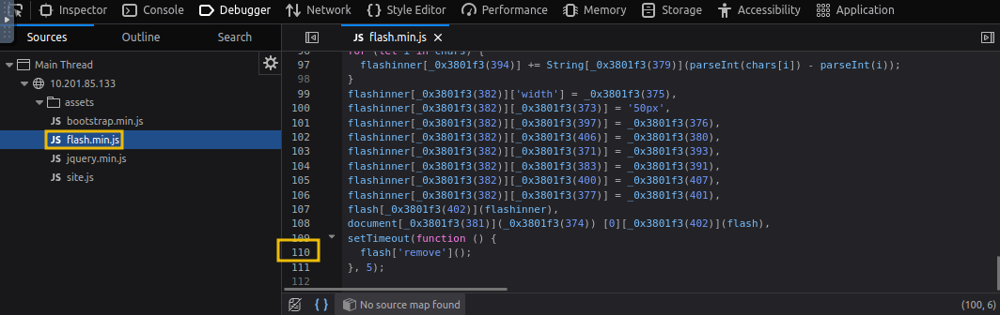

This little bit of JavaScript is what is removing the red pop-up from the page. We can utilise another feature of the Debugger called breakpoints. These are code points we can use to force the browser to stop processing JavaScript and pause the current execution.

If you click line `110` that contains the code above, you'll notice it turns blue.

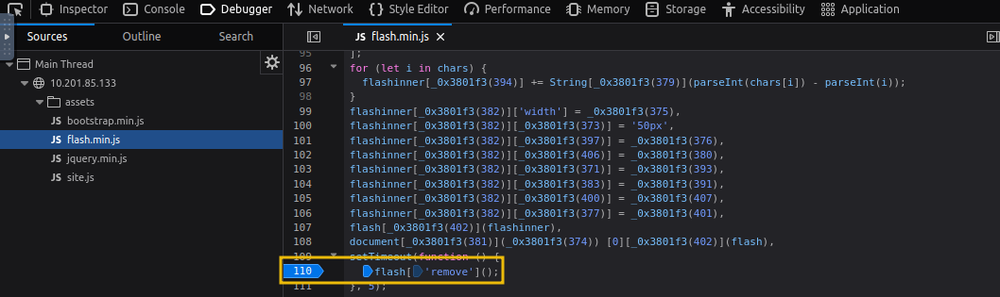

You've now inserted a breakpoint on this line. Now try refreshing the page, and you'll notice the red box stays on the page instead of disappearing, and it **contains a flag**.

---------------------------------------------------------------------------------------

#### What is the flag in the red box?

Hint: Follow the steps in the task to find the JavaScript flash.min.js file, using Pretty Print, finding the line with `flash['remove']();` and adding a JavaScript break point to stop the red message disappearing when the page loads.

From the Acme IT Support homepage, click on the `News` section in the upper menu.

If needed, press `F12` to access DevTools and navigate to the `Debugger` Tab.

Select the `flash.min.js` file in the source tree.

Pretty-print the file by clicking the `{}`-button.

Scroll to the bottom and click on the line number (`110`) to set a breakpoint on the line `flash['remove']();`

Press `F5` to reload the page and the flag is shown.

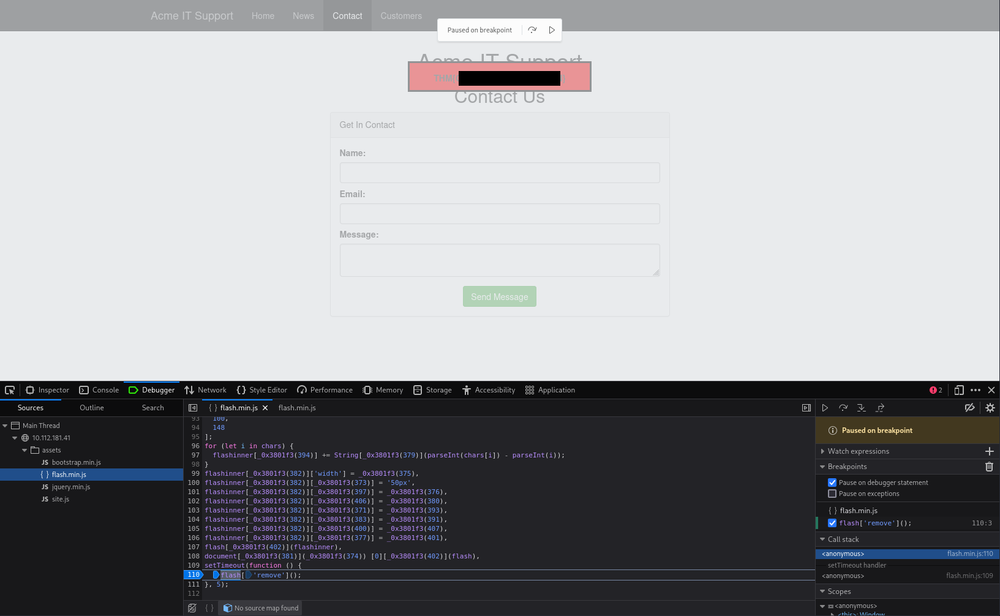

Answer: `THM{<REDACTED>}`

---------------------------------------------------------------------------------------

### Task 6: Developer Tools - Network

#### Developer Tools - Network

The **Network** tab in Developer Tools can be used to track every external request a webpage makes. If you click on the Network tab and refresh the page, you'll see all the files the page requests.

Try doing this on the **Contact** page; you can press the **trash can** icon to delete the list if it gets a bit overpopulated.

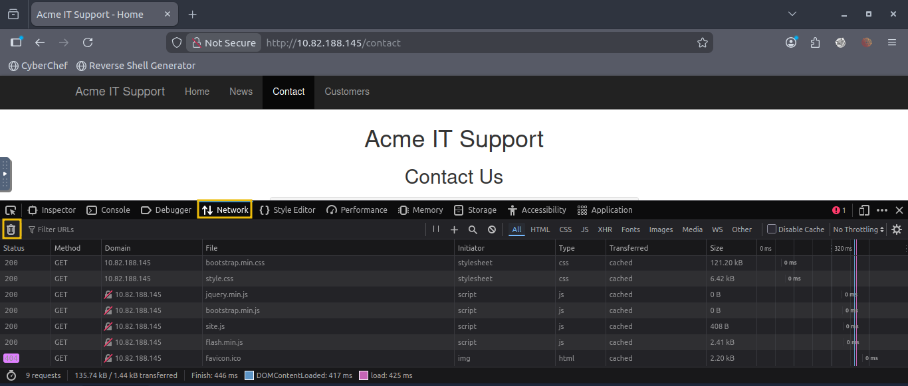

With the Network tab open, try filling in the contact form and pressing the **Send Message** button. You'll notice an event in the Network tab; this is the form being submitted in the background via AJAX. AJAX is a method for sending and receiving network data in a web application in the background without interfering with the current web page.

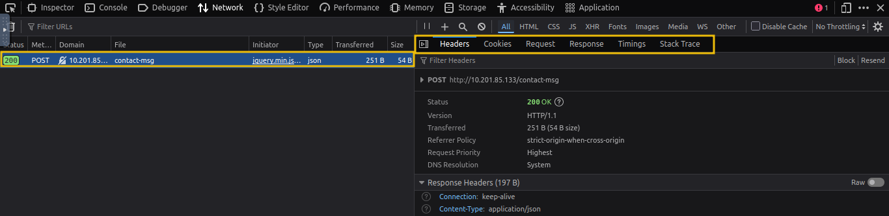

Once you examine the request, you will be able to see the request headers, cookie details and HTML response that would help you further help in enumeration and exploitation. Examine the new entry on the Network tab created by the contact form, and view the page the data was sent to **reveal a flag**.

---------------------------------------------------------------------------------------

#### What is the flag under the Response tab on the contact-msg network request?

Hint: When you find the contact-msg request, make sure you click on it to reveal the response headers of the request.

From the Acme IT Support homepage, click on the `Contact` section in the upper menu.

If needed, press `F12` to access DevTools and navigate to the `Network` Tab.

Fill in the contact form with any information and press the `Send Message` button.

Select the line with the POST-request to `contact-msg` in DevTools.

Check the Rsponse Headers in the Pane to the right. The `Headers` tab should be selected in this pane.

```text
HTTP/1.1 200 OK
Server: nginx/1.18.0 (Ubuntu)
Date: Sun, 23 Aug 2026 08:53:31 GMT
Content-Type: application/json
Connection: keep-alive
X-FLAG: THM{<WRONG_FLAG>}
Content-Length: 54
```

One flag is in the `X-FLAG` header but that's not the correct flag.

Press `OK` to close the popup window with the text `Contact Form Sent`.

Select the `Response` tab in the right pane.

The wanted flag is displayed is the response:

```text
msg: "Message Received"
flag "THM{<REDACTED>}"
```

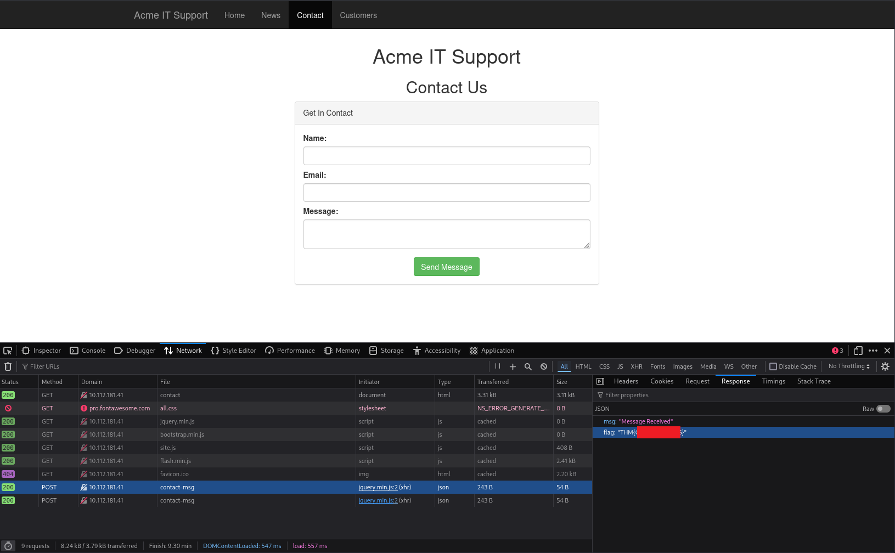

Answer: `THM{<REDACTED>}`

---------------------------------------------------------------------------------------

### Task 7: Developer Tools - Storage

#### Storage Tab

The **Storage** tab in developer tools lets us view and manage data that a website stores in our browser. This data is stored on the client side and may contain sensitive or interesting information useful during a manual pentest. As pentesters, checking browser storage helps us understand how the application handles authentication, session data, user preferences, and other stored values.

On the webpage, create a new account by visiting `http://10.112.181.41/customers/signup`. After signing up, navigate to the Storage tab in developer tools, where you will see the following screen:

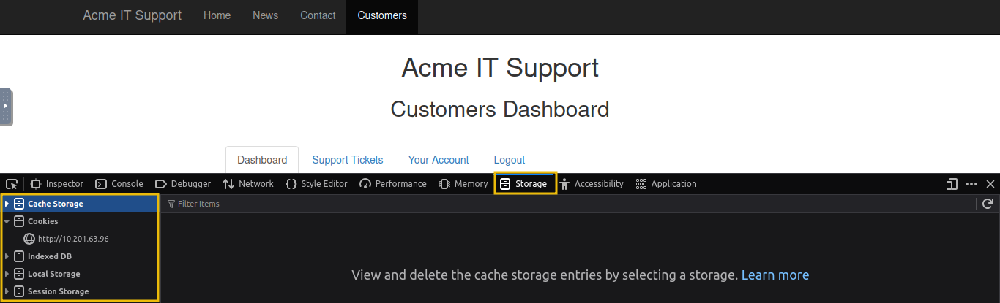

The Storage tab has the following important options:

- **Local Storage**: Stores data persistently in the browser, even after the browser is closed.
- **Session Storage**: Stores data temporarily for a single browser tab/session.
- **Cookies**: Small pieces of data sent by the server and stored in the browser, often used for sessions and authentication.
- **Cache Storage**: Stores cached resources like images, scripts, and API responses for faster loading

Among storage options, **cookies** are among the most important for a pentester. If you navigate to the **Cookies** section, you’ll see the data stored on the client side by the website.

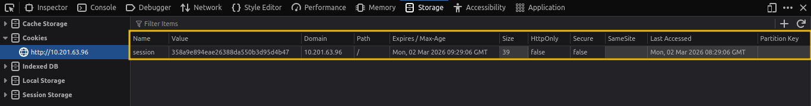

This often includes session identifiers, user preferences, and sometimes authentication-related tokens. Cookies also have important security flags. The `HttpOnly` flag prevents JavaScript from accessing the cookie, helping protect against XSS attacks. The `Secure` flag ensures the cookie is only sent over HTTPS, and the `SameSite` attribute helps mitigate CSRF attacks. Carefully reviewing cookies can reveal how the application manages sessions and whether any security best practices are missing.

---------------------------------------------------------------------------------------

#### What is the value of the HttpOnly flag after logging in?

To get the ner `admin` cookie, you need to logout and login again.

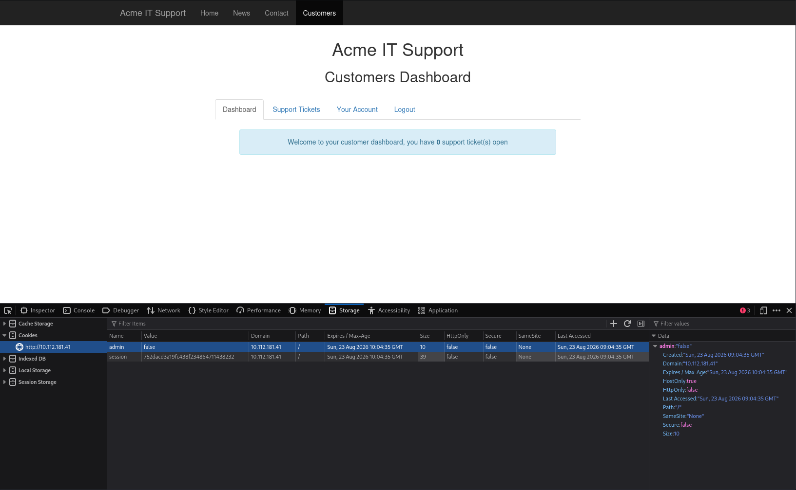

Answer: `false`

---------------------------------------------------------------------------------------

### Task 8: Conclusion

In this room, we focused on manually assessing a web application using only the browser, no automated tools, no scanners, just observation and logical thinking. From **walking through an application** and **exploring the website** to analysing the **Page Source**, we learned how much information is openly exposed to anyone willing to look closely. Small details such as comments, hidden links, and misconfigurations can often reveal valuable insights.

By diving into the developer tools, including the **Inspector**, **Debugger**, **Network**, and **Storage** tabs, we explored how modern web applications function behind the scenes. We saw how content can be manipulated client-side, how network requests expose application behaviour, and how **cookies** and local storage handle session data. Understanding these components helps build a strong foundation in identifying client-side weaknesses.

Manual testing sharpens your pentesting mindset. Before relying on automated tools, learning to observe, question, and analyse what’s happening in the browser will make you far more effective. Tools are powerful, but a trained eye and a curious mindset are even more powerful.

---------------------------------------------------------------------------------------

For additional information, please see the references below.

## References

- [Ajax (programming) - Wikipedia](https://en.wikipedia.org/wiki/Ajax_(programming))
- [CSS - Wikipedia](https://en.wikipedia.org/wiki/CSS)
- [Debugger - Wikipedia](https://en.wikipedia.org/wiki/Debugger)
- [DevTools - Chrome Docs](https://developer.chrome.com/docs/devtools/)
- [DevTools - Firefox User Docs](https://firefox-source-docs.mozilla.org/devtools-user/)
- [DevTools - MDN](https://developer.mozilla.org/en-US/docs/Learn_web_development/Howto/Tools_and_setup/What_are_browser_developer_tools)
- [HTML - Wikipedia](https://en.wikipedia.org/wiki/HTML)
- [HTTP - Wikipedia](https://en.wikipedia.org/wiki/HTTP)
- [HTTP cookie - Wikipedia](https://en.wikipedia.org/wiki/HTTP_cookie)
- [HTTP headers - MDN](https://developer.mozilla.org/en-US/docs/Web/HTTP/Reference/Headers)
- [JavaScript - Wikipedia](https://en.wikipedia.org/wiki/JavaScript)
- [unzip - Linux manual page](https://linux.die.net/man/1/unzip)
- [Web framework - Wikipedia](https://en.wikipedia.org/wiki/Web_framework)
- [wget - Linux manual page](https://man7.org/linux/man-pages/man1/wget.1.html)
