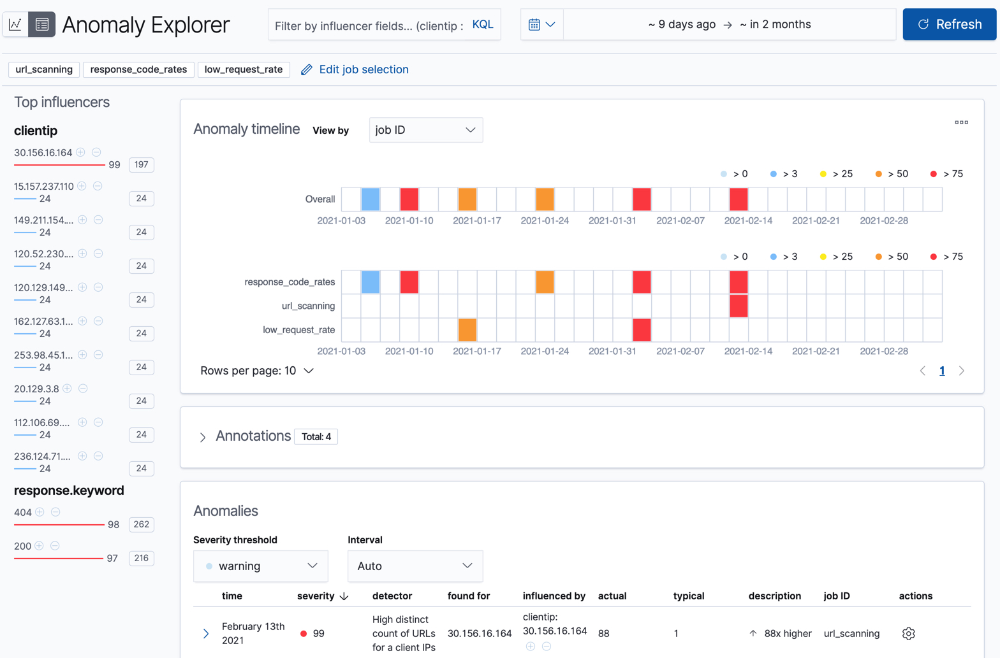

# AI Forensics

- [Room information](#room-information)
- [Solution](#solution)
- [References](#references)

## Room information

```text
Type: Walkthrough
Difficulty: Medium
Tags: Artificial intelligence
Meta Tags: Walkthrough, Walk-through, Write-up, Writeup
Subscription type: Free
Description:
Explore AI DFIR and learn how it boosts your investigation capabilities.
```

Room link: [https://tryhackme.com/room/aiforensics](https://tryhackme.com/room/aiforensics)

## Solution

### Task 1: Introduction

The world of Digital Forensics is full of pieces needing to be connected, often under a time constraint. This can be a challenging task, but one that many forensics analysts have accomplished without the need for AI tools. This begs the question: Does the digital forensics industry need the AI tools being used by so many other adjacent industries? This room aims to answer this question, exploring the potential application of AI in digital forensics, the challenges that come with that and the potential ethical and legal implications.

#### Learning Prerequisites

In this room, we will cover AI, specifically its potential implementation in the Digital Forensics / DFIR field. Because of this, it is **recommended** that you:

- Know the basics of AI covered in the [AI/ML Security Threats](https://tryhackme.com/room/aisecuritythreats) room
- Know the basics of DFIR (if you need to scrub up on your basics, consider [DFIR: An Introduction](https://tryhackme.com/room/introductoryroomdfirmodule) and [Linux Forensics](https://tryhackme.com/room/linuxforensics))
- Know the challenges faced in DFIR, covered in the [IR Difficulties and Challenges](https://tryhackme.com/room/irdifficultiesandchallenges) room

#### Learning Objectives

- Understand the day-to-day challenges faced in DFIR
- Understand how AI can be used to address those challenges
- Understand the challenges that arise when you use AI for forensics investigations and the ethical/legal implications this has
- Understand how AI impacts the DFIR investigation process

---------------------------------------------------------------------------

### Task 2: The AI Forensics Landscape

Many of the abilities of AI/ML discussed in the AI/ML Security Threats room lend themselves to solving the challenges faced in DFIR. Consider the following examples:

- **Data Processing**: The field of Digital Forensics is one ripe with tasks requiring the investigator/analyst to process vast amounts of data in search of evidence or environmental clues. This data processing can be a massive undertaking for an investigator and requires a lot of manual work and time. Now armed with the power of parallelised deep learning & Transformer models, which can process entire bodies of text in parallel (often in mere milliseconds), providing insights and classifications on the processed data.

- **Anomaly Detection**: Analysts are tasked with identifying attacks, and this can often be a “needle in a haystack” scenario, especially sophisticated attacks which can (and often are designed to) blend in with normal activity. Machine Learning algorithms can learn what “normal” behaviour looks like for users, systems and networks, allowing supervised and unsupervised models to identify potential anomalies that could indicate malicious behaviour. Turning the haystack into a handful of hay. This ability to recognise patterns on such a large scale can also mean patterns are spotted that humans can't comprehend.

- **Scalability**: Modern infrastructures can take many different forms, such as cloud, hybrid, remote endpoints, etc., generating more forensic data than ever. AI systems can scale effortlessly, continually processing and learning from millions of events across these large and distributed environments, enabling DFIR teams to cover more ground without a proportional increase in workload.


#### AI in the Wild

AI/ML has already been heavily adopted into the DFIR landscape; a lot of tools now boast AI integration and increased productivity as a result. Take a look at the table below to see how AI/ML is being applied practically in the field:

|DFIR Task|What AI/ML Enables|Example Tools / Platforms|How AI Solves It|
|----|----|----|----|
|**Anomaly Detection / UEBA**|Flags unusual user/system behavior compared to learned “normal”|[Splunk UEBA](https://www.splunk.com/en_us/blog/learn/user-entity-behavior-analytics-ueba.html), [Elastic ML](https://www.elastic.co/elasticsearch/machine-learning), [Exabeam](https://www.exabeam.com/)|AI uses unsupervised learning techniques (like Isolation Forests and Autoencoders) to learn baseline behaviour for users and systems. Deviations from this baseline are flagged as potential threats, even without predefined rules.|
|**Phishing & Communication**|Detects phishing emails and flags risky language in chat/email logs|[Microsoft Defender for O365](https://www.microsoft.com/en-us/security/business/siem-and-xdr/microsoft-defender-office-365), [Splunk NLP](https://splunkbase.splunk.com/app/6792)|Transformer-based language models (e.g., BERT, RoBERTa) classify messages as phishing or benign based on tone, structure, and known attack patterns. These models help detect impersonation, urgency phrases, and malicious links.|
|**Malware / File Classification**|Classifies files as malicious or benign based on extracted static/dynamic features|[Microsoft Defender (STAMINA)](https://www.cyberdefensemagazine.com/stamina-a-new-approach-to-malware-detection-by-microsoft-intel/), [Cylance](https://arcticwolf.com/cylance/), [VirusTotal ML integrations](https://blog.virustotal.com/2023/04/introducing-virustotal-code-insight.html)|AI systems analyse file metadata, code signatures, and sandbox behaviour to detect threats. These models are trained on large malware corpora to classify new files based on patterns learned from known threats.|
|**Alert Triage & Prioritisation**|Automatically scores, ranks, and filters alerts to reduce analyst workload|[Cortex XSOAR/XSIAM](https://start.paloaltonetworks.com/introducing-cortex-xsiam-3), [IBM QRadar Advisor](https://www.ibm.com/docs/en/qradar-common?topic=apps-qradar-advisor-watson-app&), [CrowdStrike Falcon + Charlotte AI](https://www.crowdstrike.com/en-us/platform/charlotte-ai/)|AI analyses past alert data, analyst feedback, and incident outcomes to rank alerts by severity and relevance. This reduces noise and surfaces the most urgent issues first, saving analysts time, a valuable resource in DFIR.|
|**Timeline & Event Correlation**|Reconstructs attack timelines by clustering and linking logs across sources|[Timesketch](https://timesketch.org/), [Velociraptor](https://docs.velociraptor.app/docs/overview/), [Jupyter-based analysis](https://github.com/jupyterlab/jupyter-ai)|AI clusters similar log events, identifies causal relationships, and aligns activity across systems. This helps analysts visualise attack chains and reconstruct incident timelines faster. Again, time is a valuable resource , and one of the key benefits of integrating AI into DFIR.|



Elastic ML Anomaly Explorer in Action

#### AI Limitations

So far, we have been singing artificial intelligence’s praises, of which there are many that we can take advantage of in DFIR. However, nothing is perfect, and AI is no different. Understanding the limitations of AI is fundamental knowledge if you are going to effectively utilise it, especially in DFIR. Let’s start by exploring the nature of AI.

**Probabilistic** vs **Deterministic**

Traditional software and algorithms are deterministic; in other words, if you provide them with the same input, they will always provide you with the same output. Consider a calculator function provided with the sum 5 + 5; it will always, without exception, return 10. Its behaviour is predictable and reliable (within its defined scope). However, the same cannot be said about AI systems and modern machine learning models. These are generally *probabilistic*; instead of following a fixed ruleset that provides a fixed outcome, they use statistical models to learn from data and make predictions with certain possibilities. It’s why you rarely get the same output when you ask AI a query unless you have customised your settings to make it more deterministic.


AI’s non-deterministic nature is not necessarily a bad thing; it's because of this that allows AI to handle uncertainty and adapt to new patterns, a key characteristic and one of the reasons it’s so widely used in today's society. However, digital forensics is a field that demands consistent and repeatable results. Non-determinism can lead to issues like different timelines being reconstructed when given the same input data, and prompt sensitivity can also mean vastly different outputs can be generated with a slight tweak to the input, so extensive prompt engineering is required when using AI in evaluative contexts. This is a consideration which needs to be taken into account when adopting AI technology into the DFIR process.

**Accuracy** vs **Precision** vs **Recall**

When using AI to help with a task as important as assisting with identifying and analysing potential evidence, you must be able to assess the performance of the model you are using to achieve this. Important metrics to consider when  evaluating AI performance are:

- **Accuracy**: Accuracy refers to the overall rate of correct predictions. It’s very important when assessing an AI’s performance to not only consider accuracy, as in isolation, it can be very misleading. Especially in a field such as digital forensics, where we often deal with highly imbalanced data (a few malicious files amongst thousands of benign ones, etc.), so a model can achieve a high accuracy by simply predicting the majority class each time. For example, if there are 100 files, 99 are benign and, one is malicious. If a model were to predict all files to be benign, it would achieve 99% accuracy, but this does not make it efficient. Overfitting (briefly discussed in the AI/ML Security Threats room), where a model can be overtrained on training data, can directly affect the accuracy of a model.

- **Precision**: Precision measures how often a model's positive predictions are correct. In other words, out of all of the files flagged as malicious, how many are actually malicious? Higher precision = fewer false positives (saving time chasing down irrelevant leads). However, this metric also suffers in isolation as the model can choose to be very selective, only flagging the very obvious malicious files, meaning some malicious files may be missed.

- **Recall**: Recall measures how successful the model was in identifying all positives in the provided dataset. e.g. identifying 18 out of 20 malicious files present would result in a 90% recall. Again, in isolation, this metric would be ineffective as a model could simply cast a wide net, flagging every file as malicious, achieving 100% recall but flagging many false positives in the process.

The above shows that these metrics can be misleading in isolation. However, if we consider all of these metrics together, we can gain a deeper insight into the model's performance. This allows us to tweak it to perform the digital forensics tasks we give it optimally.

**Garbage In**, **Garbage Out**

The GIGO (Garbage In, Garbage Out) principle is just as true for AI systems (if not more) than it is for any system. In other words, the quality of an AI's output is directly determined by the quality of its input. This means if an AI has been trained on "bad" data, that is, data that doesn't accurately capture the scope of what is being learned and understood by the model, it will lead to the model confidently asserting false predictions as though they were fact. When using this technology to pursue justice, you can see why this calls for extra caution.

**What Does This Mean**?

In conclusion, while AI offers powerful capabilities in DFIR, it's not a silver bullet. Its non-determinism, evaluation challenges, and performance trade-offs mean it should never replace human expertise. AI can accelerate and enhance our work, but human oversight, judgment, and validation will always remain essential. In other words, **AI cannot replace humans as digital forensic analysts**.

---------------------------------------------------------------------------

#### What ability of AI helps turn a DFIR investigator by recognising patterns they might not have been able to comprehend?

Answer: `Anomaly Detection`

#### Which metric tells you the proportion of positively flagged results that were actually correct?

Answer: `Precision`

#### What term describes the AI characteristic where the same input may yield different outputs across different runs?

Answer: `Non-determinism`

---------------------------------------------------------------------------

### Task 3: AI & DFIR

In this task, we will discuss how certain features of AI/ML (such as pattern recognition, anomaly detection, natural language processing (NLP), user behaviour analysis, etc.) are being harnessed in digital forensics to tackle common challenges faced within the field more efficiently. We will explore this by looking at how AI/ML can be used across four key areas of DFIR.

#### Image and Video Forensics

Digital image and video forensics is an excellent example of AI/ML and its capabilities, making our lives in DFIR easier. One way in which it does this is through CNN (convolutional neural networks). A CNN is a type of neural network that automatically learns patterns in data using small filters commonly used for images. However, it can also be applied to other types of data like audio, time series, or text where spatial or sequential patterns are important. Examples of how this can be used in the field include:

- **CNN-Based Forgery Detection**: Researchers have started combining traditional forensics methods such as ELA (Error Level Analysis, a technique used in image forensics to detect areas of an image that may have been digitally altered) with CNN models to identify image tampering. This [2024 study](https://peerj.com/articles/cs-2205/) proposes an ELA+CNN framework in which ELA first processes the image to highlight compression inconsistencies, and then a CNN classifies the regions as forged or not. This approach achieved a high accuracy rating of 94%.

- **Deepfake Detection**: The advancement of AI technologies has also meant advancements for the attacker. Deepfakes are one area which has seen a dramatic increase in quality, and as a forensics analyst, this is yet another area where new challenges are presented. As is often the case, one of the best ways we can tackle attackers using AI is by wielding it ourselves. CNN models have recently started being used in conjunction with some other AI technologies to develop specialised detectors. These detectors are used to analyse subtle inconsistencies in facial videos, [achieving state-of-the-art accuracy in identifying deepfakes](https://link.springer.com/article/10.1007/s11042-024-20548-6#:~:text=deepfakes,test%20videos%20with%20reference%20videos).

- **GANs**: Another exciting development in image and video forensics is the use of Generative Adversarial Networks (GANs), a setup where two neural networks compete: one generates fake media, and the other tries to detect it. As they battle, both improve. This approach has driven advances in deepfake creation, which raises concerns about this technology being used for identity theft/ privacy breaches. However, GANs are also being used defensively, allowing for both sides to benefit from them. Forensic tools now use GANs to train detectors on AI-generated fakes, making them better at spotting subtle manipulations that even humans miss. Ultimately, it’s an arms race, and both sides are powered by AI.

#### Communication Analysis

Communication analysis (and other areas of DFIR, for that matter) involves the processing and analysis of large volumes of text. As we know, large language models use deep learning to process vast amounts of data, so it makes sense that we can leverage this technology to help us in forensics.

- **Phishing Email Detection**: Transformer-based models that are trained for NLP (Natural Language Processing), such as BERT and RoBERTa, excel at identifying phishing emails. In fact, [this study found](https://www.mdpi.com/2076-3417/15/6/3396#:~:text=In,the%20balanced%20merged%20dataset%2C) that they achieved 99% accuracy in classifying phishing emails against legitimate ones. This technology not only means we can move away from a rule-based approach for detecting incoming phishing emails (which looked for known bad URLs or keywords) and adopt deep learning, context-aware models but also means it can be used to categorise emails for **human review**, saving a lot of time.

- **Chat Log and Social Media Analysis**: The same technology mentioned above is also harnessed by some forensic platforms, allowing forensic investigators to automatically scan chats for keywords or patterns related to threats (like discussing of nefarious plans) and perform sentiment analysis to gauge emotional tone. This helps investigators massively as it helps identify communications present in massive datasets that could have otherwise been missed due to the impracticality of manually reading/processing.


#### Timeline Reconstruction and User Behaviour

Reconstructing incident timelines is a common and critical part of an investigation; it is also a very labour-intensive and time-consuming task. Machine learning is now being harnessed to help us with this task:

- **Automated Event Timeline Reconstruction**: AI systems are particularly adept at correlating time-sequenced data from multiple sources and putting together what happened before, during, and after an incident. For example, ML algorithms can ingest logs, filesystem timestamps, network records, etc., and automatically build a chronological timeline of events or merge events from server logs, firewall alerts and application logs into a unified timeline. In cases where the attacker has deliberately tried to obscure their actions by altering logs, etc, this technology can be especially useful.

- **Anomaly Detection**: Artificial Intelligence is incredibly good at identifying patterns. In DFIR, this ability can give you an eagle eye, flagging things like impossible logins, where a user was logged in at two places simultaneously, or behaviour unusual for this specific user. Behaviour analysis isn't just limited to users either; it can also be used to determine what constitutes "normal" behaviour for a web application. Web application firewalls can then be used to defend against what it has chosen to be abnormal, potentially dangerous behaviour.

#### Malware Detection/Analysis

AI/ML has also lent itself greatly to the area of Malware detection and analysis, with research into this subject looking to provide an edge over traditional analysis methods and signature-based detection:

- Breakthroughs in being able to represent malware files in ways processible by deep neural networks have made it possible to **classify a file** as malicious or benign (e.g. [Microsoft and Intel's STAMINA project](https://www.cyberdefensemagazine.com/stamina-a-new-approach-to-malware-detection-by-microsoft-intel/)).
- ML is also being considered for use in dynamic analysis, observing how a program behaves to identify whether it is malicious or not. Research has been done on ways this can be accomplished, for example, converting a program's API calls sequence into a 2D image (sequence order encoded in pixels) and then classifying it.
- Using some form of AI/ML is now very common in antivirus and endpoint detection response (EDR) products.


As we’ve seen across these key areas, AI and machine learning are not just theoretical tools. They are actively reshaping how digital forensic investigators approach complex, time-sensitive, and data-heavy challenges. Whether it's detecting tampered images using CNNs, identifying phishing emails with advanced NLP models, or reconstructing incident timelines from fragmented data, AI/ML technologies are accelerating analysis, aiding detection, and making it possible to uncover patterns that might otherwise go unnoticed. While these tools don’t replace human expertise, they significantly enhance it, allowing analysts to work smarter and respond faster.

---------------------------------------------------------------------------

#### What type of neural network is commonly used in image and video forensics due to its ability to learn spatial patterns in visual data?

Answer: `Convolutional Neural Network`

#### What kind of analysis can be performed on social media or chat logs to assess the emotional tone of messages?

Answer: `Sentiment Analysis`

#### What type of data do AI systems correlate to reconstruct the timeline of an incident automatically?

Answer: `Time-Sequenced`

#### What type of analysis observes how a program behaves to determine whether it is malicious, e.g., using its API call sequence?

Answer: `Dynamic Analysis`

---------------------------------------------------------------------------

### Task 4: AI Legal & Ethical Implications

As covered, artificial intelligence is increasingly being woven into DFIR, enabling investigators to save time collecting evidence, providing deep insights and integrating with tools which are already commonplace in the industry. While these advancements pose obvious benefits, they also raise complex legal and ethical questions. Courts and regulators worldwide are grappling with how AI-generated evidence fits into established evidentiary standards, and there are key issues that investigators need to consider when using AI in a DFIR context. In this task, we will explore these issues.

#### Explainability and Transparency

One of the core issues facing the implementation of AI in digital forensics is the explainability of AI tools. Many AI models are “black boxes”, meaning they don’t readily explain how they came to a conclusion. This clashes with a core tenet of forensics analysis, the need for transparency and defensibility of evidence interpretation. For example, in [one documented civil litigation case](https://arxiv.org/html/2504.02963v1#:~:text=Interpretability%20and%20Explainability,exclusion%20of%20the%20generated%20evidence), an LLM had been used to flag certain emails as “suspicious”, but when the opposing counsel demanded to know why they were suspicious, the legal team could not explain the model’s reasoning. As a result, the AI-generated evidence was excluded by the court. What we can learn from this event is that without explainability and expert validation, AI-generated insights may not survive a courtroom challenge, failing to meet admissibility standards like the U.S. Daubert test ( a U.S. legal rule that determines the admissibility of expert testimony, particularly scientific testimony, in federal court), underscoring the sentiment that AI is NOT a replacement for human expertise but a guiding light.


#### Bias and Fairness

AI systems can unintentionally introduce bias, raising ethical and legal concerns about fairness and due process. ML models are trained on historical data; if that data contains skewed representations or prejudices, the model’s output will reflect them. In a forensics context, bias can influence what conclusions are drawn and evidence is prioritised, for example, de-prioritising non-English communications in a multilingual data set, delaying the examination of relevant evidence. A stark real-world example of this bias in action is facial recognition technology being used by police. Studies have found that these algorithms misidentify black and other minority individuals at much higher rates than white individuals. This algorithmic bias can translate into real-world injustice, with it being found that in the U.S., there are [at least seven known wrongful arrests due to faulty face recognition](https://www.aclu.org/news/privacy-technology/police-say-a-simple-warning-will-prevent-face-recognition-wrongful-arrests-thats-just-not-true#:~:text=often%20fails%20to%20generate%20a,person%20wrongfully%20arrested%20was%20Black), and almost every one of these victims was an African American mistakenly identified by an AI. What this means is that:

1. Legally, if a defence can show an AI technique is biased, judges may exclude its results.
2. Ethically, forensic experts have a duty to validate and correct biases present in AI tools (for example, using diverse training data or bias mitigation techniques). Doing this ensures equitable treatment and upholds the integrity of the investigation.

#### Accountability and Chain of Custody

One of the biggest questions for forensic investigators in a legal context is, “Who is responsible for an algorithm’s output, and can it be trusted in the same way as a human?”. In terms of trust and accountability, courts require that digital evidence be handled in a **traceable** and **preservable** manner and that integrity is preserved at each step. We achieve this by maintaining the **chain of custody** and an audit trail. Regarding AI-generated digital evidence, this can create conflicts as many AI tools (especially cloud-based services) operate opaquely, clashing with these requirements. There was an instance recently where an [LLM was used to summarise a suspect's mobile phone data](https://arxiv.org/html/2504.02963v1#:~:text=Chain%20of%20Custody%20and%20Evidentiary%20Integrity,challenged%20on%20procedural%20grounds%20during%20judicial%20review), which inadvertently violated the chain of custody (due to the intermediate AI outputs not being logged), causing the defence to challenge the forensic findings on procedural grounds. We can learn from this that AI processes must be **carefully documented and secured**, and using on-premises or controlled systems can help achieve this and satisfy legal scrutiny.  

#### Privacy and Data Protection

As we have covered, AI models thrive on large datasets, whether through training, processing or analysing; however, their use in investigations can trigger privacy and legal compliance issues. Public cloud servers may inadvertently expose sensitive evidence to third-party servers, violating privacy laws or court orders. Legal frameworks like GDPR may restrict how personal data is processed, even for law enforcement purposes. So DFIR investigators face pressure to ensure AI is used in a privacy-preserving manner.  This can be achieved, for example, by running AI tools in secure offline environments or using federated learning. These considerations cannot be understated in their importance as part of the ethical use of AI in forensics; as if AI systems use personal data without proper authority, any evidence gleaned might be ruled inadmissible.


#### The Verdict

This task has covered the many ethical and legal considerations that need to be made when using AI systems in a digital forensics context. While it is abundantly clear that AI can be a force of good, with its abilities enabling investigators to be more productive, efficient and effective than ever before in the pursuit of justice, it is also clear that this new tool needs to be wielded with a great amount of care. The classic Uncle Ben quote comes to mind: “With great power comes great responsibility”, which is especially true when it comes to forensics in a legal and ethical context. Therefore, investigators have a responsibility/duty to ensure that they are using AI following the legal and ethical guidelines outlined above to ensure justice can be served in a fair and ethical manner.

---------------------------------------------------------------------------

#### What legal test used in the U.S. assesses whether expert or scientific testimony is admissible in court?

Answer: `Daubert`

#### What term describes AI models whose internal decision-making processes are difficult to interpret?

Answer: `Black Box`

#### What real-world technology used by law enforcement has been shown to produce racially biased results in identifying suspects?

Answer: `Facial Recognition`

#### What technique allows machine learning to be performed without transferring sensitive data to a central server, helping preserve privacy?

Answer: `Federated Learning`

---------------------------------------------------------------------------

### Task 5: Practical - The Digital Trail

#### Just Another Night at the Office

This evidence report is long, but this day has run longer. The night crept up faster than a phishing email past an intern on a Friday afternoon. It should be time to leave, but the sound of the rain ricocheting off the tin roof outside tells me to stay. What's one more cup of coffee? Like clockwork, the phone rings as the styrofoam cup of coffee touches the desk. It looks like a new number, which can only mean one thing: a new case. I guess there really is no rest for the wicked. With the phone answered and the case accepted, here's what we know:

- **The Client**: RobbCo, founded by Robb House, is a titan in the software and automation industry famous for its system firmware and terminal operating systems.
- **The Case**: A member of the SOC team awoke founder Robb House to report a suspected breach, citing a security system that flagged an off-the-clock login and other suspicious behaviour. They need the digital train followed ASAP to confirm if this is the case.
- **The Damage**: On the phone, Mr House sounded very frantic, suggesting it was possible that the proprietary code for their most popular products: **RETROS BIOS** (their low-level firmware), **MF Boot Agent** (their secure and programmable bootloader) and Unified Operating System/UOS (their widely used operating system), was accessed as these were hosted on the breached system. It's up to you to find out.

With the specifics noted down, the sun was coming up. There is no use in going to bed now; then, another coffee and the investigation can begin. It's time to see what can be found on the system, with a digital forensics intuition and a little help from AI.

#### Setting up

Welcome to "The Digital Trail", an interactive DFIR lab built to showcase how AI/ML can be used to give you an investigative edge. To get started, click the green "Start Lab Machine" button to boot up the machine and allow 1-2 minutes for the machine to be ready for use.

In this task, we will see a practical demonstration of how AI/ML-enabled technologies can help provide a guiding light, using their ability to process vast amounts of data and identify patterns and anomalies to save us time and send us in the right direction. We will use scikit-learn, an open-source Python library that provides simple, efficient data mining and machine learning tools, including classification, regression, clustering, and dimensionality reduction. This task will also showcase how human insight is required to validate the findings and confirm any conclusions drawn in conjunction with the guiding light.

#### The Investigation Begins...

Another day, another case. RobbCo has granted you access to their system to perform a forensic analysis and determine what happened. Let's start things up by activating the virtual environment. As a forensic investigator, isolation is key; you’ll be working in a virtual environment to ensure any tools you run or changes you make don’t contaminate the original evidence. Think of it as your digital crime scene suit.

`source /opt/dfir-env/bin/activate`

As mentioned, we will use machine learning-enhanced scripts to help us with our investigation. The first one we are going to run is `classify_logs.py`. This script was made by one of the RobbCo engineers. It uses an AI model trained on labelled log data to understand what "normal" logs look like and spot potentially suspicious anomalies. Let's run this script against `auth.log` and see if it finds anything suspicious:

`python3 /opt/dfir-lab/classify_logs.py /var/log/auth.log`

```bash
ubuntu@tryhackme:~$ source /opt/dfir-env/bin/activate
(dfir-env) ubuntu@tryhackme:~$ python3 /opt/dfir-lab/classify_logs.py /var/log/auth.log
[SUSPICIOUS] Jan 15 03:00:01 tryhackme sshd[1833]: Failed password for invalid user admin from 192.168.0.100 port 22 ssh2
[SUSPICIOUS] Jan 15 03:01:02 tryhackme sshd[1833]: Accepted password for j.morgan from 192.168.0.100 port 22 ssh2
[SUSPICIOUS] Jan 15 03:15:00 tryhackme sshd[1833]: Accepted publickey for r.house from 192.168.0.100 port 22 ssh2
(dfir-env) ubuntu@tryhackme:~$ 
```

Okay, that's got us off to a great start. This output shows that a few log lines have been identified as suspicious. It looks like there was an initial attempt to log in as admin, which failed, followed by a successful log in as **j.morgan**. We can see that the attacker escalated their privileges to **r.house** (the founder, not good!). These logs were likely flagged due to the unusual time for employee activity and align with what was reported by the RobbCo SOC engineer.

The initial failed login attempt, followed by the successful login, implies access to credentials or partial credentials. At the very least, it implies an attacker likely has gained access. Let's call on AI again for some assistance and run another script, file_anomalies.py. This script uses the same Scikit-learn library and uses a model which has been trained on certain high-priority directories and their contents, considering factors (such as file name, path, size, extension, entropy, permissions, and creation time) to identify potentially suspicious files. Let's run the script using:

`python3 /opt/dfir-lab/file_anomalies.py`

```bash
(dfir-env) ubuntu@tryhackme:~$ python3 /opt/dfir-lab/file_anomalies.py
[*] Scanning paths:
    - /opt/robbco
    - /tmp
    - /dev/shm
    - /usr/local/bin

[!] Supervised AI-flagged suspicious files:
                                                 path  size   entropy
0                    /opt/robbco/sys/boot_monitor.log    59  4.535458
1   /opt/robbco/engineering/MFBootAgent/mfboot_main.c    97  5.122591
2           /opt/robbco/firmware/RETROS_BIOS/core.asm    54  4.358886
3                               /tmp/dock-replace.log   235  4.803189
4                                         /tmp/.syncd    87  4.492156
5                                             /tmp/.x    52  4.411602
6                               /tmp/invoice_dump.txt   709  4.653766
10                   /dev/shm/.core_dump_2025.tgz.enc   369  5.766267
14                              /usr/local/bin/sysmon    52  4.411602
(dfir-env) ubuntu@tryhackme:~$ 
```

Okay, it looks like the attacker has been busy; quite a few files got flagged. Of course, AI isn't definitive, so this requires our human insight. So, investigate whether these files are indeed suspicious and what can be inferred from their presence.

#### Constructing the Timeline

We will now use our human insight to validate the findings of the ML script and see if they can shed any light on whether an attack has taken place, and how. As we go through each of the flagged artefacts, follow along and navigate to the artefact location so you can piece together the attack, solve the mystery and answer the questions attached to the task.

#### Phase I: Initial Access

The first key artefact the ML script flagged for us is:

|Artefact|Behaviour|Impact/Analysis|Explanation|
|----|----|----|----|
|`/tmp/invoice_dump.txt`|Stores collected recon data|Reveals prior SSH usage, usernames, and active sessions|Output of the macro’s system recon. Provided the attacker insight into viable accounts and access paths.|

This is a suspicious dump file; if we investigate further by listing its contents, we can see it seems to be some kind of data dump, which gets exfiltrated. One key piece of information contained within is some bash history which opens a file `invoice_Q1_2075.ods` contained within `~/Documents/Invoices/`. We don't know whose home directory this bash history is from, but if we combine this knowledge with the suspicious `auth.log` files flagged earlier, which showed us the first user account to be accessed was **j.morgan**, the best place to look next is `/home/j.morgan/Documents/Invoices/`. Sure enough, we have found exactly what we're looking for:

|Artefact|Behaviour|Impact/Analysis|Explanation|
|----|----|----|----|
|`/home/j.morgan/Documents/Invoices/invoice_Q1_2075.ods`|Embedded macro executes shell commands|Harvests .bash_history, SSH keys, user sessions, and dumps /etc/passwd. Attempts exfiltration to 192.168.0.100|Likely, the result of a phishing lure masquerading as a legitimate invoice but runs an embedded payload when opened.|

This is a very malicious file indeed; it's ringing phishing email attachment alarm bells. Can you confirm this is the case and find the email in question?

Finding the email confirms our suspicions, and we are now able to reconstruct how the attacker gained initial access:

1. Phishing email sent to **j.morgan**
2. Malicious .ods file opened, triggering data harvesting
3. Data saved to `/tmp/invoice_dump.txt` and exfiltrated to the attacker
4. Attacker logs into **j.morgan** using collected or replayed credentials
5. Access escalates from there

#### Phase II: Tooling and Infrastructure

Following the data exfiltration from the phishing lure (`invoice_Q1_2075.ods`), the attacker leveraged the harvested information — including usernames, shell history, and SSH configuration — to log in as **j.morgan**. What they did next can be a hard question to ask but our AI assistant script flagged some potentially suspicious files that might help us answer that very question: With this initial foothold established, they deployed additional tooling to enable remote access.

|Artefact|Behaviour|Impact/Analysis|Explanation|
|----|----|----|----|
|`/tmp/.syncd`|Connects to `http://10.0.0.66/payload.sh` and executes it|Initiates second-stage download|First-stage dropper used to quietly retrieve additional malicious tooling.|
|`/tmp/.x`|Reverse shell stub|Establishes remote shell to `10.0.0.66:4444`|Gave the attacker live access under **j.morgan**’s user context. Likely deployed immediately after the phishing document was opened.|

In summation, with this initial foothold established, they deployed additional tooling to enable remote access.

#### Phase III: Privilege Escalation

Our next big question is: How did the attacker move from **j.morgan** to the highly privileged **r.house**? To answer that question, we're going to have to engage our human insight to connect the dots. Take a look at the contents of the following file to help shed some light:

|Artefact|Behaviour|Impact/Analysis|Explanation|
|----|----|----|----|
|`/home/j.morgan/.bash_history`|Reveals use of `sudo` to modify SSH keys|SSH key planted in **r.house**’s `authorized_keys`|Subtle privilege escalation — no exploits used. Demonstrates abuse of legitimate permissions for escalation.|

It looks like the attacker was able to abuse legitimate permissions to escalate their privileges. The giveaway is the `sudo nano /home/r.house/.ssh/authorized_keys` line in **j.morgan**'s bash history. It seems very likely that the attacker used this command to plant an SSH key, giving them access to the **r.house** account.

#### Phase IV: Disguise and Persistence

Now operating as **r.house**, the attacker was in a very privileged position. Two more of the files flagged by our stalwart AI assistant script give us an indication of what the attacker did with this power:

|Artefact|Behaviour|Impact/Analysis|Explanation|
|----|----|----|----|
|`/usr/local/bin/sysmon`|Outbound connection to `10.0.0.66:5555`|Reverse shell disguised as system monitoring tool|Persistence through deception — masks itself as a legitimate binary to evade detection.|
|`/opt/robbco/sys/boot_monitor.log`|Fake boot telemetry logs|Justifies **sysmon**'s presence|Fabricated log file used to support the ruse of a legitimate monitoring utility.|

The contents of these files (which you can inspect yourself to verify) give the answers we wanted; the attacker uses these files to plant persistence mechanisms disguised as legitimate tools, ensuring long-term access. The inclusion of the `boot_monitor.log` to justify the existence of the `sysmon` file (actually containing a rev shell) shows the attacker is quite sophisticated, and had the AI not been able to flag this as suspicious, it could have taken hours of investigation to uncover. This is also the attacker's second rev shell. This first shell (`/tmp/.x`) runs as the unprivileged user **j.morgan**, providing temporary access. This second rev shell was likely deployed after privilege escalation to maintain long-term control with elevated rights.

#### Phase V: Source Code Theft

The attacker had gained privileged access and persisted, but what was their ultimate objective? These following artefacts tell us all we need to know:

|Artefact|Behaviour|Impact/Analysis|Explanation|
|----|----|----|----|
|`/opt/robbco/engineering/MFBootAgent/mfboot_main.c`<BR>`/opt/robbco/firmware/RETROS_BIOS/core.asm`|Flagged by ML model|Not malicious, but classified as suspicious|AI mistakenly flagged these — they are RobbCo’s proprietary source code.|
|`/dev/shm/.core_dump_2025.tgz.enc`|Base64-encoded stolen archive|Exfiltration-ready package containing RobbCo IP|Stored in shared memory — stealthy staging location for data theft.|

From these artefacts, we can determine the following: RobbCo's proprietary source code was stolen, as well as their OS and boot loader. It looks like the attacker compressed and base64-encoded RobbCo’s proprietary source code, hiding it in shared memory as `/dev/shm/.core_dump_2025.tgz.enc`. This stealthy archive was likely staged for exfiltration without triggering alarms. The AI misclassified the proprietary source code as suspicious, which is a reminder that AI findings are not always 100% accurate and that human validation is ALWAYS required. We can confirm all this by unpacking the archive:

`base64 -d /dev/shm/.core_dump_2025.tgz.enc > /tmp/stolen.tar.gz`

`tar -xzvf /tmp/stolen.tar.gz -C /tmp/stolen_source`

```bash
(dfir-env) ubuntu@tryhackme:~$ base64 -d /dev/shm/.core_dump_2025.tgz.enc > /tmp/stolen.tar.gz
(dfir-env) ubuntu@tryhackme:~$ mkdir /tmp/stolen_source
(dfir-env) ubuntu@tryhackme:~$ tar -xzvf /tmp/stolen.tar.gz -C /tmp/stolen_source
opt/robbco/engineering/
opt/robbco/engineering/MFBootAgent/
opt/robbco/engineering/MFBootAgent/mfboot_main.c
(dfir-env) ubuntu@tryhackme:~$ cat /tmp/stolen_source/opt/robbco/engineering/MFBootAgent/mfboot_main.c 
// mfboot_main.c
void start_boot_sequence() { handshake("RETROS-52EE5"); load_os("UOS-2.3.0"); }
(dfir-env) ubuntu@tryhackme:~$ 
```

#### Another Case Closed

As the sun sets on another day and another investigation, we give the news to our client Robb House, livid with the attack, but grateful for the insight he closes the case. The wheels of justice keep on turning. And they have to. With recent advancements in AI technology, you better believe that attackers' wheels are turning just as fast, faster even, so it's up to us to responsibly harness the power of AI, as a guiding light in the search for justice and evidence, in combination with our human insight and intellect.


---------------------------------------------------------------------------

#### At what time does the attacker successfully log in as j.morgan?

```bash
ubuntu@tryhackme:~$ source /opt/dfir-env/bin/activate
(dfir-env) ubuntu@tryhackme:~$ python3 /opt/dfir-lab/classify_logs.py /var/log/auth.log
[SUSPICIOUS] Jan 15 03:00:01 tryhackme sshd[1833]: Failed password for invalid user admin from 192.168.0.100 port 22 ssh2
[SUSPICIOUS] Jan 15 03:01:02 tryhackme sshd[1833]: Accepted password for j.morgan from 192.168.0.100 port 22 ssh2
[SUSPICIOUS] Jan 15 03:15:00 tryhackme sshd[1833]: Accepted publickey for r.house from 192.168.0.100 port 22 ssh2
(dfir-env) ubuntu@tryhackme:~$ 
```

Answer: `03:01:02`

#### What attack method was used to gain initial access?

Answer: `Phishing`

#### Can you find the attacker's email address?

Hint: /home/j.morgan/

```bash
(dfir-env) ubuntu@tryhackme:~$ cat /home/j.morgan/Mail/inbox/email_invoice.eml 
From: "A. Keane" <akeane@poseidonenergy.net>
To: j.morgan@robbco.com
Subject: URGENT - Outstanding Invoice Q1 2075

Dear Mr. Morgan,

Please find attached the invoice for the Q1 joint energy terminal upgrade project. This invoice is marked as overdue and must be reviewed immediately by RobbCo engineering.

Failure to process this may result in administrative escalation.

[Attached: invoice_Q1_2075.ods]

Regards,
A. Keane  
Director of Field Operations  
Poseidon Energy  
(dfir-env) ubuntu@tryhackme:~$ 
```

Answer: `akeane@poseidonenergy.net`

#### What command did the attacker run as j.morgan to gain access to the r.house account?

```bash
(dfir-env) ubuntu@tryhackme:~$ head /tmp/invoice_dump.txt
bash_history:
cd ~/Documents/Invoices/
libreoffice invoice_Q1_2075.ods &
cd ~
ls -la
cat .ssh/config
cat /etc/motd
sudo nano /home/r.house/.ssh/authorized_keys
exit

(dfir-env) ubuntu@tryhackme:~$ 
```

Answer: `sudo nano /home/r.house/.ssh/authorized_keys`

#### What is the full path of the archive used to steal RobbCo's source code?

```bash
(dfir-env) ubuntu@tryhackme:~$ cat /home/r.house/.bash_history 
cd /opt/robbco/engineering
tar czf /tmp/src.tgz MFBootAgent/
base64 /tmp/src.tgz > /dev/shm/.core_dump_2025.tgz.enc
(dfir-env) ubuntu@tryhackme:~$ 
```

Answer: `/dev/shm/.core_dump_2025.tgz.enc`

---------------------------------------------------------------------------

### Task 6: Conclusion

#### A Bright Light on the AI Forensics Landscape

In this room, we have covered the undeniable potential AI has to help forensic analysts in the pursuit of justice. From understanding how intelligent systems can enhance our abilities to comprehending the responsibility that’s placed on us when we use them to aid in our investigations, here’s what we’ve covered in this lesson:

- How AI/ML enhances DFIR tasks like anomaly detection, phishing analysis, and timeline reconstruction
- The strengths and limitations of models used in forensics (e.g. probabilistic behaviour, precision-recall trade-offs)
- The legal and ethical challenges AI introduces, including explainability, chain of custody, and fairness
- A hands-on case investigation where you worked alongside an AI assistant powered by scikit-learn to uncover a targeted breach at RobbCo

If you take away one thing from this lesson, it should be the notion that has been echoed throughout this room: AI is not a replacement for human insight. In fact, human insight has never been more important than it is now, as the rapid adoption of these AI systems grows.

---------------------------------------------------------------------------

For additional information, please see the references below.

## References

- [Artificial intelligence - Wikipedia](https://en.wikipedia.org/wiki/Artificial_intelligence)
- [Computer forensics - Wikipedia](https://en.wikipedia.org/wiki/Computer_forensics)
- [Digital forensics - Wikipedia](https://en.wikipedia.org/wiki/Digital_forensics)
- [Large language model - Wikipedia](https://en.wikipedia.org/wiki/Large_language_model)
- [Machine learning - Wikipedia](https://en.wikipedia.org/wiki/Machine_learning)
