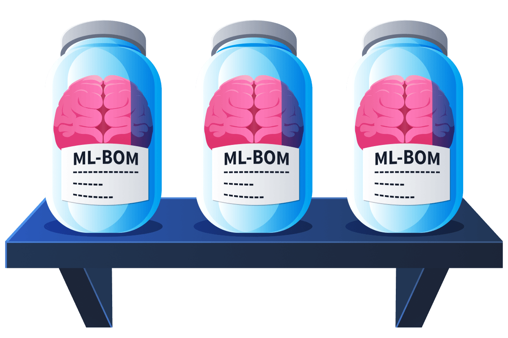
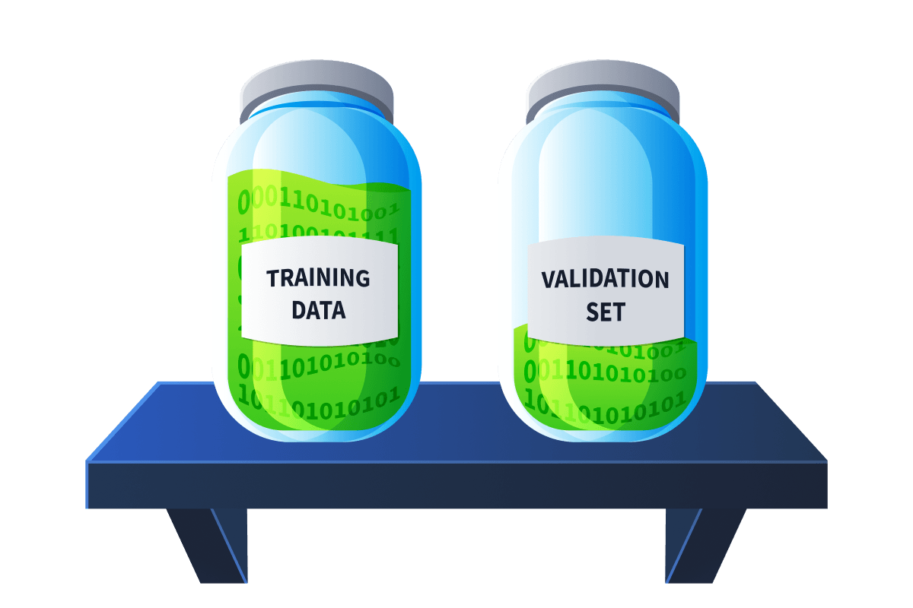
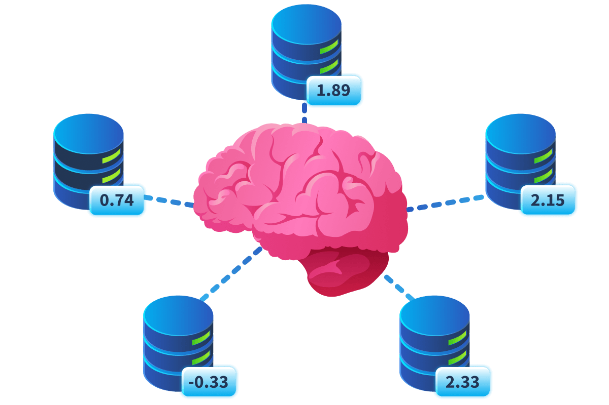
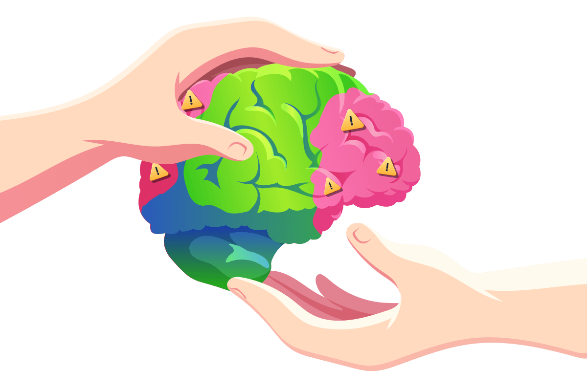

# AI Models & Data

- [Room information](#room-information)
- [Solution](#solution)
- [References](#references)

## Room information

```text
Type: Walkthrough
Difficulty: Medium
Tags: Artificial intelligence
Meta Tags: Walkthrough, Walk-through, Write-up, Writeup
Subscription type: Free
Description:
Explore how data is fundamental to AI security, and the models which power it.
```

Room link: [https://tryhackme.com/room/aimodelsdata](https://tryhackme.com/room/aimodelsdata)

## Solution

### Task 1: Introduction

Every AI model is, at its core, a product of its training data. Before a single prediction is made or a single prompt is answered, decisions about what data to collect, where to collect it from, and how to process it have already shaped everything the model will ever do. Those decisions carry security implications that most organisations deploying AI today have never examined. From PII scraped from the open web to credentials baked into model weights to safety mechanisms quietly eroded during fine-tuning, the risks don't begin when a model is deployed. They begin long before, in a data supply chain that is often invisible, poorly documented, and almost entirely unaudited.

#### Learning Objectives

- Understand where AI training data comes from and the security risks introduced by poor data provenance
- Recognise how PII and sensitive credentials can become permanently embedded in model weights through large-scale web scraping
- Understand how key model-building decisions (overfitting, quantisation, and federated learning) each introduce distinct security risks
- Understand the inheritance problem and what organisations unknowingly take on when fine-tuning pre-trained models
- Recognise why trained models are opaque black boxes, and what model cards do (and fail to do) to address this

#### Prerequisites

The basics of AI/ML should be understood, as covered in our [AI/ML Security Threats](https://tryhackme.com/room/aimlsecuritythreats) room.

---------------------------------------------------------------------------

### Task 2: Training Data

In the [AI/ML Security Threats](https://tryhackme.com/room/aimlsecuritythreats) room, we walked through the machine learning lifecycle and established that before a model can be trained, data must be collected and cleaned. That sounds orderly enough. But let's slow down a tad and ask the questions that the lifecycle diagram doesn't answer: collected from where, and cleaned by whom? As you'll see, the answers carry significant security implications, and most organisations deploying AI today have no idea what they are.

#### Where Does the Data Come From?

Training a large language model requires a staggering amount of text. GPT-3 was trained on roughly 570GB of filtered text, and that's considered relatively modest by "modern" standards. To hit numbers like that, developers can't carefully hand-pick sources. The pipeline typically draws from four buckets:

|Source|What it is|Trust profile|
|----|----|----|
|Web scraping|Automated crawls of public internet content (news, forums, blogs, social media, etc.)|Low: no curator, no version control, content changes after collection|
|Licensed datasets|Data purchased or agreed with platforms (e.g., OpenAI + Reddit, Meta's own social posts)|Medium: terms often unclear; original users rarely consented to AI training use|
|Synthetic data|AI-generated content used to train further AI systems|Variable: growing fast; ~12% of fine-tuning datasets now contain LLM-generated content|
|Internal corpora|Company knowledge bases, support transcripts, clinical notes used for fine-tuning|Higher: organisation has direct control, but also direct liability if mishandled|

The most widely used training dataset is [Common Crawl](https://commoncrawl.org/), a free, publicly available archive of web crawl data that has underpinned essentially every major model family. DeepSeek-V2 was pretrained on it; DeepSeek-V3 trained on 14.8 trillion tokens with Common Crawl as a core source; and LLaMA 4 was scaled to 40 trillion tokens across 200 languages using a similar pipeline. GPT-3 is one of the few models whose breakdown is publicly documented: 60% of its tokens came from a filtered version of Common Crawl, and more recent models lean even more heavily on it. The keyword is "filtered", and how that filtering was done, by whom, and what slipped through is where the security story begins.

#### The Problem of Provenance

Data provenance is the ability to answer three questions about any piece of training data:

1. Where did it come from?
2. When was it collected?
3. Has it been modified since?

In most AI supply chains today, the honest answer to all three is we don't fully know. Most major models are essentially trained on datasets of datasets, huge composites assembled from hundreds of upstream sources, where the original attribution has been lost, simplified, or never recorded in the first place. The [Data Provenance Initiative](https://www.dataprovenance.org/) audited over 1,800 datasets and found that more than 70% of licenses on popular hosting platforms were listed as "Unspecified", and of those that were labelled, 66% were miscategorised, usually listed as more permissive than they actually were. Organisations fine-tuning on these datasets often don't know what they legally have, let alone what's actually inside it.



The software security world has been here before. SolarWinds taught the industry that you can't trust a compiled binary if you don't know what went into it, which is exactly why software bills of materials (SBOMs) became standard practice. The AI equivalent is the ML-BOM: a documented inventory of dataset sources, licenses, PII categories, and filtering decisions. Adoption is still early, and most organisations deploying third-party models today have nothing close to one.

#### PII in the Pipeline

One of the most direct consequences of undocumented, large-scale web scraping is that personally identifiable information ends up baked into model weights. Once it's there, it's very difficult to remove. Medical records, personal email threads, forum posts about health conditions or political views: all of it gets swept up if it was publicly accessible at crawl time. The EU's GDPR explicitly requires data minimisation (collect only what's necessary). This sits in direct tension with the "more data is always better" logic driving pre-training.


The security implication is measurable and concrete. [Truffle Security](https://trufflesecurity.com/blog/research-finds-12-000-live-api-keys-and-passwords-in-deepseek-s-training-data) scanned the December 2024 Common Crawl archive (400TB of data from 2.67 billion web pages) and found nearly 12,000 live, verified API keys and passwords. With the right prompt, a model trained on that data can sometimes be coaxed into surfacing training content near-verbatim, including credentials. This isn't a bug introduced by an attacker. It's a consequence of what went in during training, and no patch fixes it once the model is deployed.

#### A Model Engineer

A model's behaviour is a direct product of what it was trained on. If that data was scraped without audit, contaminated with PII, or manipulated upstream, those characteristics become part of the model, and there's no reliable way for the organisation deploying it to know. The data supply chain is as real and as exploitable as a software supply chain. For organisations right now, it's almost entirely invisible.

---------------------------------------------------------------------------

#### What term describes the ability to answer where data came from, when it was collected, and whether it has been modified?

Answer: `Data provenance`

#### What is the name of the most widely used public corpus that underpins essentially every major model family?

Answer: `Common Crawl`

#### What is the AI equivalent of a Software Bill of Materials (SBOM), used to document dataset sources, licenses, and filtering decisions?

Answer: `ML-BOM`

---------------------------------------------------------------------------

### Task 3: Building the Model

#### Building the Model: Key Concepts

When we covered the ML lifecycle in [AI/ML Security Threats](https://tryhackme.com/room/aimlsecuritythreats), we did so at a high level: data in, model out. This task zooms into some of the decisions made along the way that have yet to be covered. Each concept below establishes a foundation for future security topics, so the goal here is not just to define them but to understand why they matter from a security perspective.

#### Epochs and Overfitting

An **epoch** is one complete pass of the training algorithm through the entire dataset. In practice, models are trained over many epochs. The algorithm repeatedly sees the same data, adjusting its parameters each time until it converges on accurate predictions.

The catch is that more epochs don't always mean a better model. Train for too long and the model stops learning general patterns and starts memorising training data specifically, a problem called **overfitting**. An overfit model performs well on its training data but poorly on other data. This matters for security because overfitting is one mechanism by which a model can "memorise" specific details from its training data, including sensitive ones, making it more likely to reproduce them when prompted.

#### Model Validation

To catch overfitting early, a portion of the training data is held back and never used for training; this is the **validation set**. At regular intervals during training, the model is tested on unseen data to check whether its performance is actually generalising or just improving on the training examples it's seen before. If training accuracy keeps climbing but validation accuracy plateaus or drops, that's overfitting in real time.



From a security perspective, validation is the quality gate in the ML lifecycle. A model that skips thorough validation is one whose real-world behaviour is unknown, and such unknown behaviour is a security risk. It also means any biases or anomalies introduced through compromised training data may go undetected until the model is already deployed.

#### Post-Training Optimisation: Pruning and Quantisation

Once a model is trained, it often goes through compression steps before deployment (particularly if it needs to run efficiently on limited hardware). Two of the most common are **pruning** and **quantisation**:

|Technique|What it does|Security consideration|
|----|----|----|
|Pruning|Removes parameters that contribute little to predictions, shrinking model size|Changes model behaviour post-training; rarely documented in detail|
|Quantisation|Reduces numerical precision of weights (e.g., 32-bit to 8-bit floats) to cut memory and compute requirements|Can degrade safety-aligned behaviour; backdoor defences tested on full-precision models may fail to detect threats in quantised versions|

Both steps are applied after the training is complete, often by a different third-party team packaging the model for distribution. Research has shown that quantisation can silently degrade the safety mechanisms built into a model; defences that worked on the full-precision version may fail to detect backdoors once the model is compressed. When an organisation downloads a quantised model without documentation of what changed during compression, they're inheriting unknown behaviour modifications alongside efficiency gains.

#### Federated Learning

All the training approaches covered so far assume that data flows into a single central location for model training. **Federated learning** flips this: the model is trained across many decentralised devices or organisations, with each participant training locally on their own data and only sending weight updates (not the raw data itself) back to a central server for aggregation.

This was designed with privacy in mind. A hospital sharing patient records to train a model is a data protection problem; a hospital contributing model updates without ever sending the records is a much easier conversation. In that sense, federated learning genuinely does reduce privacy risk at the data level.



The security trade-off, however, is that the integrity of the training process becomes much harder to verify. In a centralised setup, the organisation that trains the model controls the data. In a federated setup, participants can submit poisoned local updates (subtly manipulated gradients designed to skew the global model's behaviour), and these can be very difficult to detect at the aggregation stage. The question shifts from "who controls the data?" to "who controls the aggregation, and can any participant corrupt it?"

Federated learning is therefore an interesting case study in security trade-offs: it solves one trust problem by distributing control, but in doing so creates a different one.

---------------------------------------------------------------------------

#### What term describes one complete pass of the training algorithm through the entire dataset?

Answer: `Epoch`

#### What problem occurs when a model memorises training data rather than learning general patterns?

Answer: `Overfitting`

#### What post-training optimisation technique reduces the numerical precision of model weights to cut memory and compute requirements?

Answer: `Quantisation`

#### What training approach trains a model across decentralised devices, sending only weight updates rather than raw data to a central server?

Answer: `Federated Learning`

---------------------------------------------------------------------------

### Task 4: The Inheritance Problem

Training an LLM from scratch means assembling trillions of tokens of data, acquiring the compute infrastructure to process it, and running a training job that can cost tens of millions of dollars. For most organisations, that's not a realistic option. Instead, the dominant model for AI development today is to start with someone else's work.

#### Pre-Trained Models & Fine-Tuning

A pre-trained model is one that has already been trained on a large, general-purpose dataset (the kind of web-scale corpus discussed in Task 2). These base models learn broad language understanding: grammar, facts, reasoning patterns, and world knowledge. They're produced by a small number of well-resourced organisations and then made available for others to build on, either through open weights (like Meta's LLaMA family) or through API access (like OpenAI's GPT series).

Fine-tuning is the process of continuing to train one of these pre-trained models on a smaller, task-specific dataset. A healthcare company might fine-tune a base model trained on clinical documentation to improve its understanding of medical terminology. A law firm might fine-tune on case law. The result is a model with the broad capabilities of the base model, now specialised for a particular domain or use case.


**What fine-tuning changes**: the model's task-specific behaviour, tone, and domain knowledge.

**What fine-tuning does not change**: the base model weights (the billions of parameters shaped by pre-training on data the fine-tuning organisation never saw and almost certainly never audited).

#### The Inheritance Problem

This is where the security concern sits. When you fine-tune a pre-trained model, you inherit everything that model already contains. This includes things you cannot see and did not choose:

- Biases baked in during pre-training persist
- Unexpected behaviours introduced by the base model's training data carry through
- Any safety alignment built into the base model is not as durable as it might appear



This shows up in three concrete ways:

1. **Safety alignment erodes, not breaks**

[Stanford and Princeton](https://arxiv.org/abs/2310.03693) found that the defence mechanisms of aligned LLMs can be compromised by fine-tuning on as few as 10 adversarially crafted examples (at a cost of under $0.20). Even benign fine-tuning on legitimate data degraded safety as a side effect.

Think of safety alignment like a well-worn path through a forest. The model has been trained to follow this safe path when generating responses. Fine-tuning is like adding new paths through the same forest. Even if those new paths are legitimate (like teaching medical terminology), they can gradually obscure the original safe path. The model hasn't forgotten how to be unsafe; the probability weights have just shifted, making unsafe responses more likely again. The defence mechanisms don't snap; they wear down.

2. **Specialisation increases attack surface**

[Cisco](https://blogs.cisco.com/security/fine-tuning-llms-breaks-their-safety-and-security-alignment) found that fine-tuned models are measurably more susceptible to prompt injection than the base models they were fine-tuned on. The reason is structural: fine-tuning narrows the focus, reducing resilience to unexpected tokens. Think of it like this: a model fine-tuned on financial records gets better at financial reasoning, but also becomes more responsive to an attacker who frames their prompt in financial terms.

3. **Version matters, and it's rarely tracked**

Fine-tuning always targets a specific checkpoint of a base model. If that checkpoint later turned out to contain a backdoor or problematic training data, every derivative inherits it, regardless of whether anyone downstream was told. Without knowing exactly which version a model was fine-tuned from, there's no way to assess that exposure after the fact.

#### Inheritance Tax

When your organisation deploys a fine-tuned model, you're not deploying the fine-tuning work your team did; you're deploying the entire pre-trained base beneath it. That base was shaped by a training process you didn't control, on data you didn't audit, by an organisation whose supply chain you almost certainly haven't reviewed. Fine-tuning is powerful, but it doesn't sanitise what came before it.

---------------------------------------------------------------------------

#### What is the process of taking a pre-trained model and continuing to train it on a smaller, task-specific dataset?

Answer: `Fine-tuning`

#### What term describes a model that has already been trained on a large general-purpose dataset?

Answer: `Pre-trained Model`

---------------------------------------------------------------------------

### Task 5: The Black Box Problem

#### Models Are a Black Box

When a security team wants to audit a piece of software, they have options. Source code is readable. Even compiled binaries can be disassembled, stepped through, and reasoned about. A trained model's weights are neither. They're billions of floating-point numbers (the cumulative result of a training process), and they carry no human-readable record of how they were shaped, what data influenced them, or what behaviours they encode. You cannot open a model and find the decision that makes it behave a certain way. This is a "black box" in the truest sense.


This means trusting a model is, fundamentally, trusting the process that produced it. You can test its behaviour: run inputs through it, benchmark it against known tasks, and probe it with adversarial prompts through red teaming. All of these are valuable, but they're sampling, not auditing. They can tell you how the model behaved on the inputs you tried. They cannot tell you what it will do on inputs you haven't thought of yet. The attack surface is defined by the model's training, which is opaque.

#### Model Cards

The documentation artefact designed to address this is the **model card**: a structured document that accompanies a model and describes what it is, how it was built, and where it falls short. The concept was introduced by [Google researchers in 2019](https://arxiv.org/abs/1810.03993) and has since become the closest thing the industry has to a standard transparency format.

A well-formed model card should give you the answers to the questions you can't get by inspecting the weights themselves:

|Section|What it should tell you|
|----|----|
|Training data|What sources were used, how they were filtered, known gaps or biases|
|Intended use|What the model was designed for (and explicitly what it wasn't)|
|Evaluation results|Performance metrics across different conditions and demographics|
|Known limitations|Conditions under which the model is known to underperform or behave unexpectedly|
|Bias assessment|Where training data or evaluation may have introduced skew|
|Licence|What you're legally permitted to do with the model|

Think of it like a nutritional label for an AI model. You can't see inside the product, but the label is supposed to tell you what went into it and what to watch out for.

#### The Gaps

Have you ever checked out a food label, and it all sounds good until you find out your chicken slices are only 49% chicken? Well, in practice, model cards can also be frequently incomplete, vague, or (in some cases) absent entirely. Unlike food labels, there's no regulatory requirement to produce one; as of now, it remains voluntary for most use cases. The incentive to be thorough is weak when disclosing limitations might reduce adoption. The [Data Provenance Initiative](https://arxiv.org/abs/2310.16787)'s audit of over 1,800 datasets found documentation gaps throughout the AI supply chain, and model cards sit at the end of that same underdocumented pipeline.


From a security standpoint, a sparse or missing model card isn't an inconvenience; it's a warning sign. It means the organisation distributing the model either didn't evaluate it thoroughly enough to document findings, or chose not to share what they found. Either way, the downstream user is flying blind.

#### In Short

The model card is your audit trail. In the absence of one, there is no audit trail, just a black box and the hope that whoever built it was thorough. In security, hope is not a control.

---------------------------------------------------------------------------

#### What documentation artifact accompanies a model to describe what it is, how it was built, and where it falls short?

Answer: `Model Card`

#### What are the billions of floating-point numbers that make up a trained model collectively referred to as?

Hint: These are the numerical values adjusted throughout training that encode everything the model has learned.

Answer: `Weights`

---------------------------------------------------------------------------

### Task 6: Practical

Click the green **View Site** button above to open a simulated model repository, built to resemble **HuggingFace**, one of the most widely used platforms for hosting and sharing open-source AI models. Because anyone can upload a model, it's a powerful resource and a real supply chain risk.

Your job is to perform a **model audit**. Think of it as a scavenger hunt for red flags, the warning signs that a security-conscious engineer should never ignore. They could be lurking in the model card, the metadata, the file listings, or the training details.

After you submit your findings, you'll get feedback on each one, learning the severity and significance of each issue as you go. By the end, you'll have a practical checklist for evaluating any third-party model before it gets near a production system.

---------------------------------------------------------------------------

#### Complete the exercise to get the flag

```text
> Training Data
> -------------
> Training data source is vague — no provenance, collection dates, or checksums provided.
Severity: High
> No mention of PII filtering despite scraped forum and web data in the corpus.
Severity: High

> Training Procedure
> ------------------
> Fine-tuned from enterprise-base-v1.1 — a specific version with no documentation of what 
> that version contains or whether it has known issues.
Severity: Medium

> Evaluation
> ----------
> No bias evaluation, no limitations section, and a sparse evaluation section with no 
> adversarial or red-team testing documented.
Severity: Medium

> Licence
> -------
> Licence listed as "Custom" with no link, no terms, and no contact detail beyond the 
> organisation name.
Severity: Medium

> Files
> -----
> Model file size is significantly smaller than the base model with no documentation of 
> what post-training modifications were applied.
Severity: Medium
```

Answer: `THM{<REDACTED>}`

---------------------------------------------------------------------------

### Task 7: Conclusion

Throughout this room, you've explored how the security risks of AI systems are shaped long before a model ever reaches production. From the unaudited data pipelines that feed pre-training, to the inherited vulnerabilities carried through fine-tuning, to the simple fact that no one can look inside a trained model and see what it's actually doing, the risks stack up at every stage of the build process, long before anyone thinks to ask a security question. With this foundation, you're better equipped to ask the right questions when considering adoption or deployment of AI: where did this model come from, what does it contain, and does anyone actually know?

Here's a summary of this room's key takeaways:

- AI training data is drawn from poorly documented, unaudited sources, meaning most organisations have no reliable answer to where their training data came from, what it contained, or whether it was tampered with
- PII and live credentials routinely end up baked into model weights through large-scale web scraping and cannot be patched out once the model is deployed
- Model-building decisions such as quantisation and federated learning introduce security trade-offs that are rarely documented, meaning organisations inherit unknown behaviour modifications alongside efficiency gains
- Fine-tuning a pre-trained model inherits everything beneath it: safety alignment erodes with as few as 10 adversarial examples, and fine-tuned models are measurably more susceptible to prompt injection than their base counterparts
- Trained model weights are fundamentally opaque; security testing can only sample behaviour rather than audit it, and model cards (the primary transparency mechanism) remain voluntary, frequently incomplete, and sometimes absent entirely

---------------------------------------------------------------------------

For additional information, please see the references below.

## References

- [Artificial intelligence - Wikipedia](https://en.wikipedia.org/wiki/Artificial_intelligence)
- [ATLAS Matrix for AI Systems - MITRE](https://atlas.mitre.org/matrices/ATLAS)
- [Large language model - Wikipedia](https://en.wikipedia.org/wiki/Large_language_model)
- [Machine learning - Wikipedia](https://en.wikipedia.org/wiki/Machine_learning)
- [Neural network (machine learning) - Wikipedia](https://en.wikipedia.org/wiki/Neural_network_(machine_learning))
