# Expediting Registry Analysis

- [Room information](#room-information)
- [Solution](#solution)
- [References](#references)

## Room information

```text
Type: Walkthrough
Difficulty: Medium
Tags: Windows
Subscription type: Premium
Description:
This room explores different tools used to expedite analysis of registry data during investigation.
```

Room link: [https://tryhackme.com/room/expregistryforensics](https://tryhackme.com/room/expregistryforensics)

## Solution

### Task 1: Introduction

In [Windows Forensics 1](https://tryhackme.com/room/windowsforensics1), we learned about where we can find the registry hives and the different artefacts present in these hives. In this room, we will build on that information and learn more about data acquisition and analysis, as during an incident. Therefore, we will not discuss the different artefacts, the information on those artefacts, and where to find them. Instead, we will focus on leveraging the knowledge of these artefacts to perform incident analysis.

#### Learning Objectives

In this room, we will learn:

- How to acquire a live and cold system registry hive.
- The tools that can be used to analyse and parse the data in the registry hives.
- The kind of questions that can be answered by analysing a system's registry.

#### Prerequisites

Before continuing, it is highly recommended that you complete the [SOC Level 1](https://tryhackme.com/r/path-action/soclevel1/join) and [SOC Level 2](https://tryhackme.com/r/path-action/soclevel2/join) paths, especially the following rooms:

- [Windows Forensics 1](https://tryhackme.com/room/windowsforensics1)
- [KAPE](https://tryhackme.com/room/kape)

#### Room VM

Before moving forward, start the lab by clicking the **Start Machine** button. It will take 3-5 minutes to load properly. The VM will be accessible on the right side of the split screen. If the VM is not visible, use the blue **Show Split View** button at the top of the page. Additionally, we will provide you with RDP credentials that you may use if you prefer to connect from your own VPN connected machine.

- Username: `administrator`
- Password: `thm_4n6`
- IP: `10.65.149.95`

#### Scenario

Anna, the IR lead at Deer Inc., is investigating suspicious activity on one of the systems. She had been tipped off due to a new user creation activity on the machine. For further analysis, she decided to pull the registry data from the system to answer some questions and identify the scope of the incident. Let's help Anna verify the following information by analysing the attached VM:

- Information that can be used to identify the system.
- User accounts on the system, as well as any suspicious user account.
- Any password resets or wrong password inputs.
- Networks that the system connected to in the past.

### Task 2: Data Acquisition Considerations and the FTK Imager

To start the investigation, Anna needs to acquire registry data. There are several ways to acquire registry data from a system. We will discuss the most common ones in this room. But before that, let's understand the difference between live and cold collections.

#### Live Acquisition

A live acquisition is done on a running system. In a live acquisition, the Windows OS is already loaded into the memory, and the configurations are all in the memory. In a live system, the registry hives files are locked and cannot be copied without special tools. However, in a live system, since the configuration is already loaded, we don't have to analyse the registry to identify the active configuration of the system (e.g., the CurrentControlSet key is already loaded, and we know which configuration is in use). However, the problem with acquiring registry data from a live system is that whatever tool we use will leave a trace and might overwrite some critical data points. For example, if we use FTK Imager to collect live data, we will have to execute FTK imager, adding an entry to all the registry keys that keep track of program execution. The most common reason a live acquisition is done is to save time. Taking a full disk image and then extracting data from that takes a lot of time and can be impractical when dealing with an outbreak or when quick results are required. It is often better to take a live collection when time is of the essence.

#### Cold Acquisition

A cold data acquisition is done when the system is not running. In such an acquisition, a full disk image is first taken of the system by putting the system's hard disk drive in a write blocker. The system is shut down at this point. This disk image is then hashed and copied, and all the analysis is done on a copy of the original disk image. This is done to maintain the integrity of the original evidence so that, if need be, it can be proven that the evidence was not tampered with and the results are reproducible. We first mount the disk image using image mounting software to analyse the registry from a cold acquisition and extract the data from the mounted image. Some tools like FTK Imager and Autopsy can perform both steps simultaneously, and we don't need a separate image mounting software to view the data. Though a cold acquisition takes a lot of time, as we can guess from the number of steps involved in this process, it is to be noted that a cold acquisition makes the most negligible impact on the system under analysis, as it can be done from a write-blocked disk image instead of an actual running system. A cold acquisition is more suitable if we have to ensure the integrity of the data for purposes such as going to court.

#### Data Acquisition Using FTK Imager

FTK Imager is a tool primarily used to take disk and memory images of a live system. However, it can also be used to read acquired disk images. Acquiring a full disk or memory image is out of the scope of this room. However, we will learn to acquire registry data using FTK Imager in this room.

First, we must load the disk image from which we want to extract the data. In the attached VM, we can see the shortcut file for FTK Imager on the Desktop. After starting, we can `Add Evidence Item` by going to `File` > `Add Evidence Item`

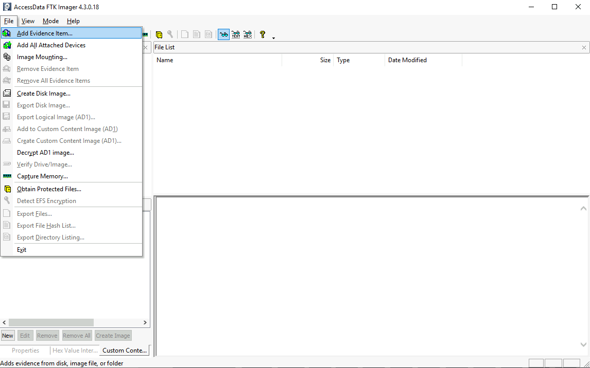

In a live system, this is generally the C drive of the system (or the drive where the OS is installed). We can do that by selecting `Logical Drive` in the Add Evidence Item menu.

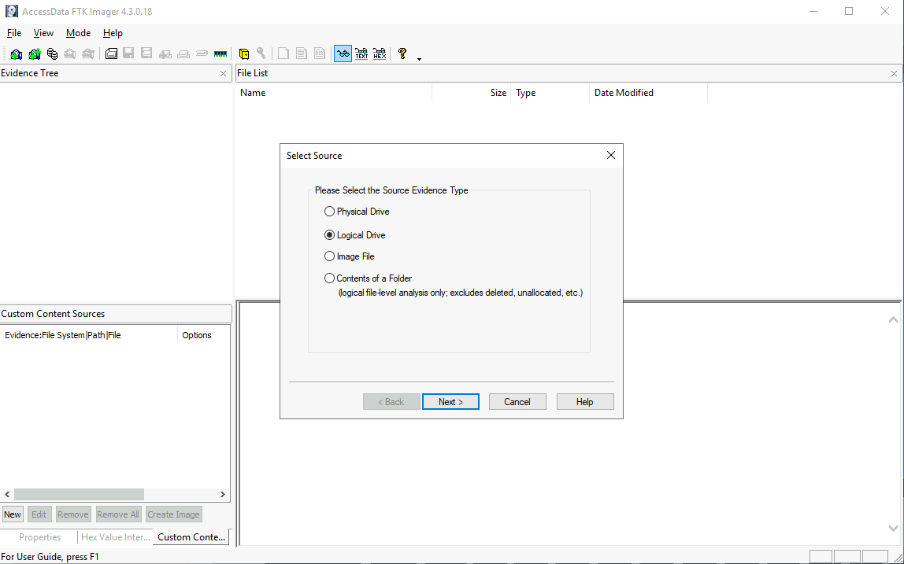

We can then select the OS drive from a list of available drives.

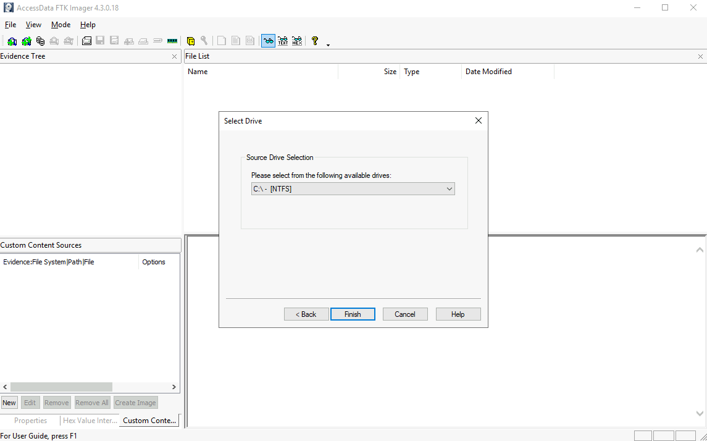

In a cold system, instead of the C drive of the current system, we have to navigate to the path of the target system and select the disk image from which we want to extract the data. We do that by selecting `Image File` in the Add Evidence Item menu.

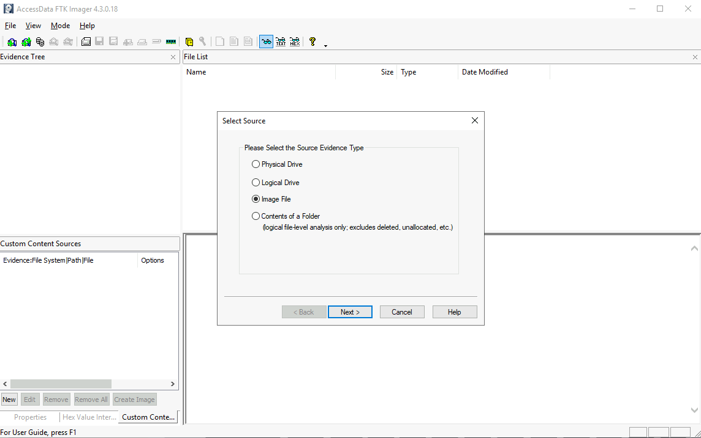

We can then browse where we saved the image file and add it to FTK Imager. This is the only difference between exporting files from a live disk or a cold disk image. Once we have added the evidence into FTK Imager, the rest of the process is the same.

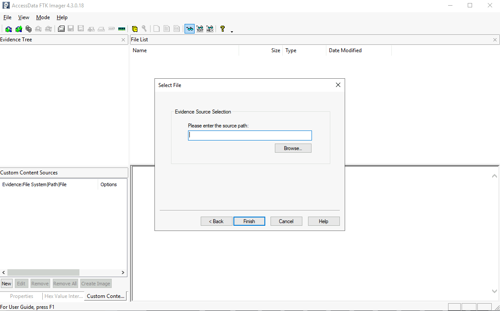

In a live system, we can collect the registry data by clicking the `Obtain Protected Files` option in FTK Imager. Remember that the registry files are locked and cannot be copied easily in a live system. Although we will not use this option now, it can help us get those locked and protected files. We could export these files to a location of our choice.

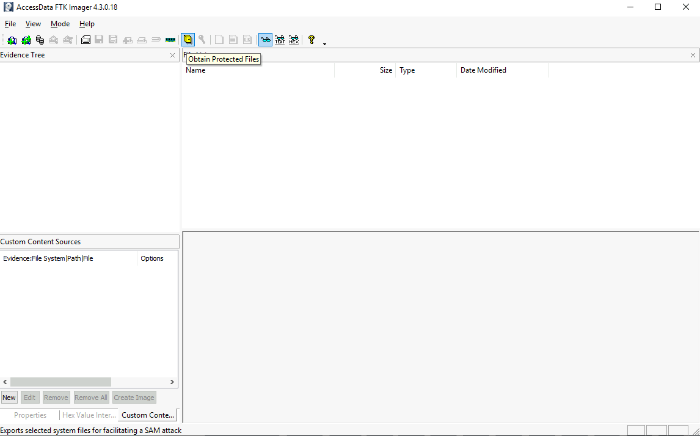

However, the problem with the above method is that it does not acquire all the registry hives. For example, it does not copy the **Amcache** hive, which will make us leave out important information about program execution. As we can see in the bottom-left of the above screenshot, this option exports files to facilitate a SAM attack, which targets the SAM registry hive to exploit user credentials.

A better way to export registry keys using FTK Imager is by navigating to the desired location where the hives are located and exporting the required files. We can do this by manually expanding the disk image and navigating to the directories. This method can be used for both live and cold acquisitions. Once we reach the desired location, we must select the files we want to export. We can then click the `Export Files` option to export the selected files to a location of our choice.

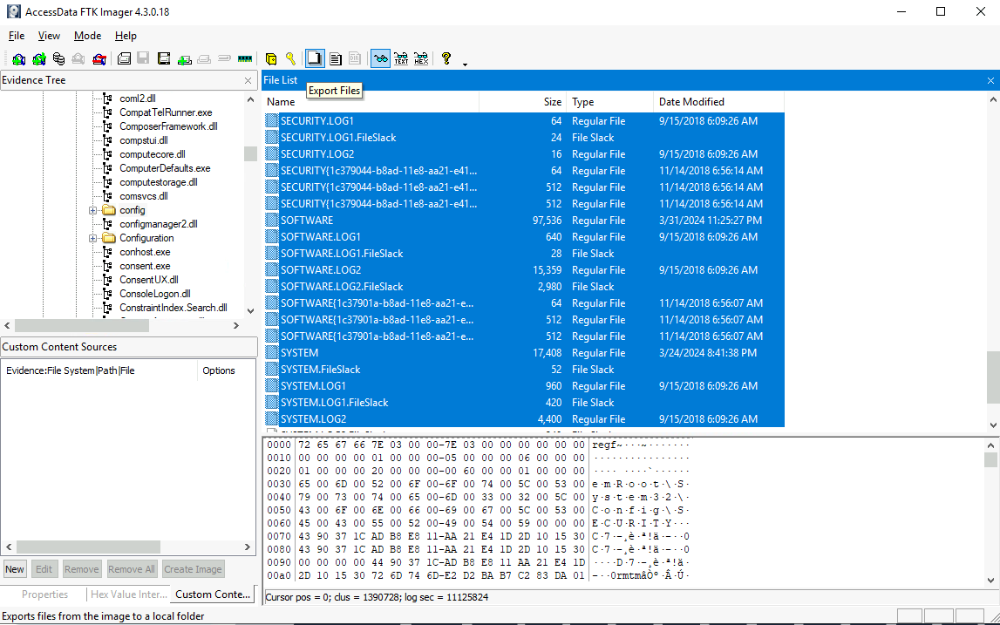

In the above screenshot, we are copying the registry hives, the transaction logs, and the backup files that contain the changes that are still not written in the registry hives but have been made already (we learned about these in the [Windows Forensics 1](https://tryhackme.com/room/windowsforensics1) room). These can contain essential pieces of the information puzzle we want to extract, which must be utilised when analysing the registry data.

In the scenario from Task 1, we outlined the information that Anna wants to extract from the system. As we learned in Windows Forensics 1, this information is generally present in the SAM, SYSTEM, and SOFTWARE registry hives in the `C:\Windows\System32\config` directory. Anna can extract those hives using FTK Imager to achieve her goal. To ensure the completeness of the information, she will also need to extract the transaction logs. She can do that using the FTK Imager, which is present on the Desktop in the attached VM.

The most significant advantage of using FTK Imager to extract data is the specificity and granularity of the process. We can pick and choose the exact files we want to extract. However, this process generally requires precise knowledge and time to execute. Using tools to automate this process might be better in some scenarios, as we will learn in the coming tasks.

Can you help Anna extract the registry data from the VM attached to Task 1, as shown in this task?

---------------------------------------------------------------------------------------

#### When we take a forensic data collection from the disk image of a system, what type of acquisition is it called?

Answer: `Cold Acquisition`

#### Is speed one of the advantages of collecting registry data from FTK Imager? Y or N?

Answer: `N`

### Task 3: Data Acquisition Using KAPE

Anna could use FTK Imager to extract registry data, but it is a manual way of data acquisition. Ideally, she would like something that can remove the human element from the process so there are fewer chances of making a mistake and is easier to delegate to one of her team members. Usually, the advantage of an automatic process is speed and efficiency, but a manual way also has its benefits, and granularity and specificity are such. In this task, we will see how to automate the data acquisition process using KAPE.

#### Data Acquisition Using KAPE

We learned about KAPE in a [dedicated room](https://tryhackme.com/room/kape). KAPE (Kroll Artifact Parser and Extractor) is a tool that helps us collect and process triage data quickly from a system. KAPE is generally used on live systems. However, it can also be used on a disk image by mounting it and providing the target location as the mounted disk image drive. We can use any image mounting software to mount the disk image, and the rest of the process remains the same. FTK Imager can also mount images, but running KAPE while FTK Imager is running might cause issues, and we have to select the `Ignore FTK warning` checkbox to execute KAPE in that scenario.

First, we can start with the `gkape.exe` executable, which we can find in the KAPE folder in the attached VM. It will open the KAPE GUI. This will look something like this:


Since we are to collect data, we will select the `Use Target Options` checkmark. This will make the left side of the KAPE GUI available for us to modify.

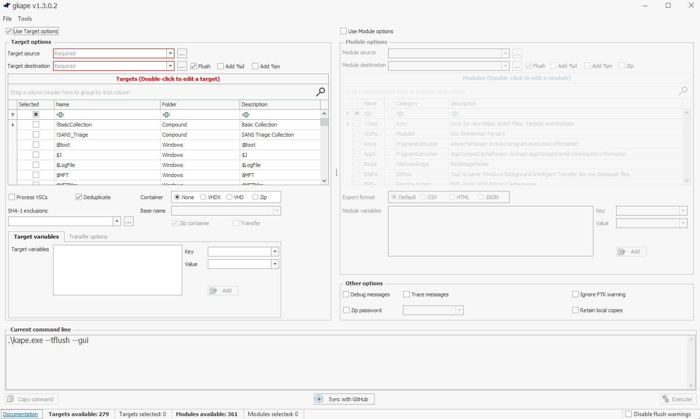

Once here, we can choose the source disk drive's path in the `Target source` option and specify the `Target destination` path where we wish to save the collected triage data. When collecting triage data from a disk image, we can select the disk drive where the disk image mounter has mounted the disk image. In a live system, we can choose the C drive (or the OS drive if it is other than the C drive).

Once we have selected the Target source and destination, we can choose from one of the available collection options. If we want to collect a comprehensive triage package considering the most useful forensic artefacts, we can collect the `KapeTriage`. If we just want the registry, we can use the search option to search for and choose one of the registry triage collections. Please remember to uncheck the `Flush` checkbox if you don't want to overwrite all the data in the destination folder.

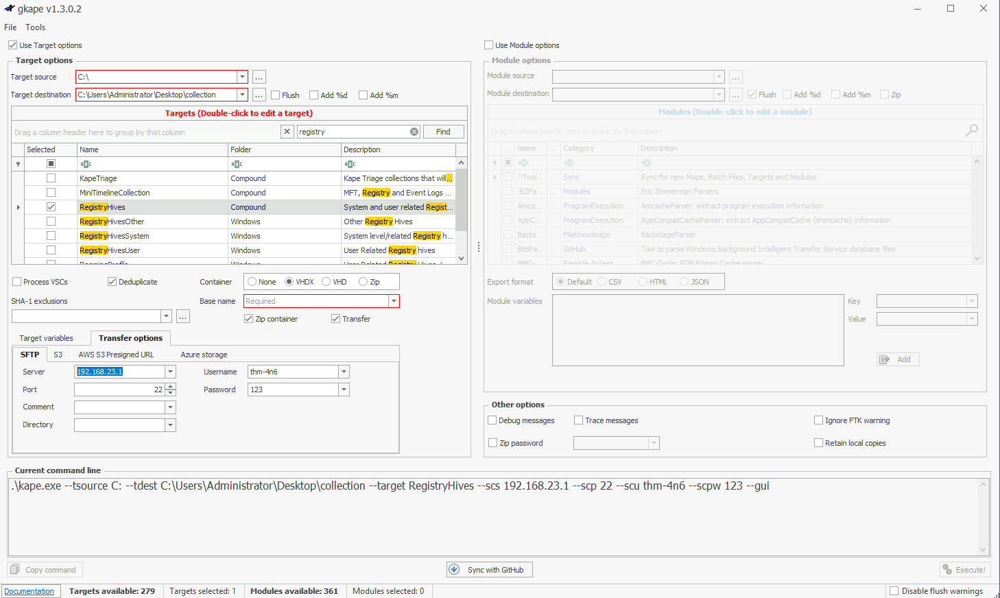

Once we have selected the triage package we want to collect, we can see the command in the `Current command line` tab at the bottom. We can also use this command in the command line to collect triage data. Similarly, we can use this command type as part of a script to collect triage data remotely. We can select a Container for the collected data to make a single file, such as a VHDX or VHD file, and select the Transfer option to upload it to a remote location.

Once we click `Execute!` at the bottom-right corner, KAPE will start the collection on a visible command screen, which will also show the progress of the collection.

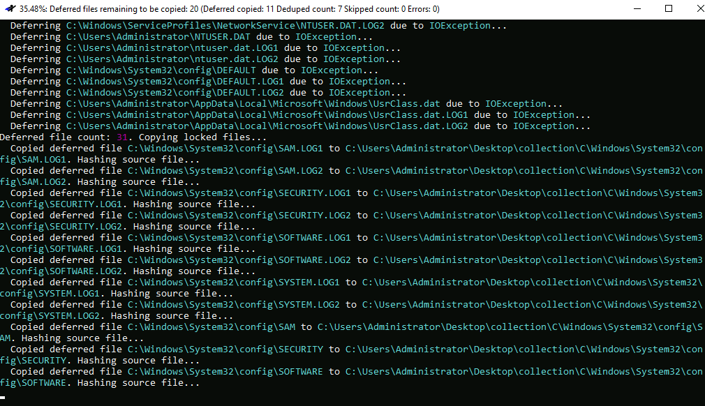

Once complete, it will show a message on the screen showing the total time taken to execute, followed by another prompt saying `Press any key to exit`. At this point, we can close the window.

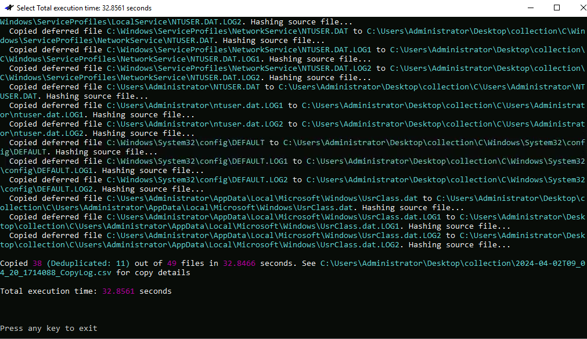

As noticed, KAPE makes the triage collection process scalable and automated and can be replicated against the whole enterprise. In contrast, FTK Imager can extract some specific artefacts granularly and precisely. Another advantage of using KAPE is that it retains the directory structure and metadata of the original files in the destination files, which makes the collection forensically more correct. Once collected, the parent directory of our target destination will look something like the screenshot below. All the collected files will be in the same directory structure in the folder named `C` here, as it would be in the C drive of the system. The remaining three files are the log files we can use to troubleshoot if something goes wrong with the KAPE collection.

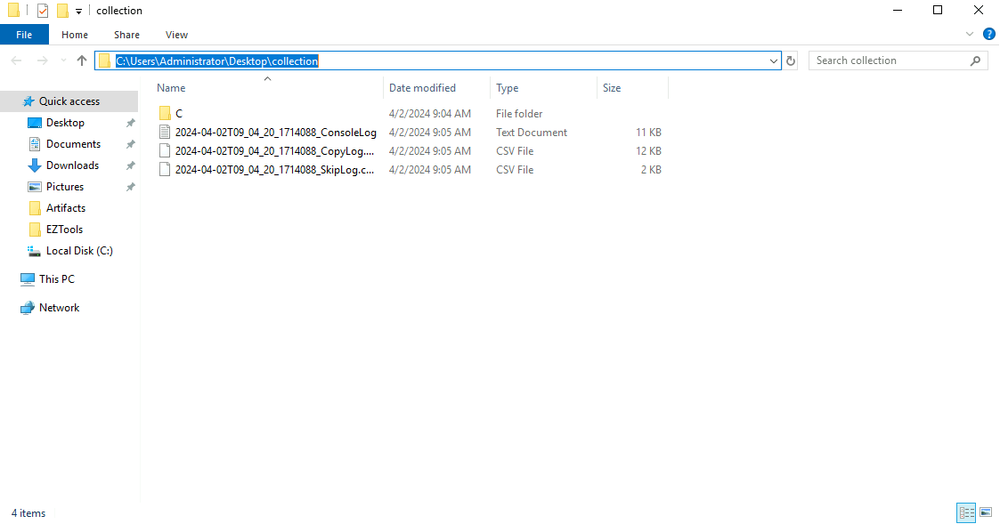

#### Automated Collection Using Batch Mode

In some enterprise environments, the IR team has to get help from the system administration team or the asset owner to collect triage data. In such a scenario, it is convenient to have a process that is easy to follow and automated to a large extent. KAPE's batch mode helps the IR team in such scenarios. An incident responder can create a `_kape.cli` file by using the command line we created earlier in the task, removing the `.\kape.exe` qualifier from it, and saving it in a file named `_kape.cli`. A system administrator can run this package by just executing kape.exe with administrator privileges, while the `_kape.cli` file is in the same directory. The triage data will be collected and uploaded to the desired location provided by the IR team. For example, if we are to create a KAPE batch file for the collection we set up in the task while explaining the creation of a VHDX package and uploading it to a server, it will contain the following command.

`--tsource C: --tdest C:\Users\THM-4n6\Desktop\triage --target RegistryHives --scs 192.168.23.1 --scp 22 --scu thm-4n6 --scpw 123 --vhdx reg`

Once we create this `_kape.cli` file, we can share the whole package with people who can execute this, such as system administration teams or asset owners. KAPE will automatically collect the required forensic artefacts and upload them to our desired location (in this case, we have set the IP `192.168.23.1`, username `thm-4n6`, and password `123`, and KAPE will upload the forensic artefacts to this IP address using SCP).

While FTK Imager could help Anna pick and choose the files she wanted to extract, collection through KAPE can help her expedite the collection. Furthermore, using KAPE could help her delegate the task to her team members or the system administrators without worrying about any missed steps messing up the collection. Can you help Anna collect registry data from the VM attached to Task 1 using KAPE, as shown in this task?

---------------------------------------------------------------------------------------

#### What will be the contents of a _kape.cli file if we want to collect data from the C drive and save it to the D drive using the target RegistryHives?

Answer: `--tsource C: --tdest D:\ --target RegistryHives`

### Task 4: Registry Analysis Using EZTools

Now that we have helped Anna acquire the registry data, the question arises of analysing this data. In the Windows Forensics rooms, we discussed analysing data on a per-artefact basis. While that information is suitable for basic understanding, it is not always practical when responding to incidents when time is paramount. In such a scenario, using tools can expedite the analysis process. However, knowing the basics is helpful when the tools' output is unreliable, or the output of two or more tools provides different results. Then, the analyst can go back to the basics and verify the output of the tools to identify the correct value of an artefact. As a recap, we can use the Registry Forensics cheatsheet we used in the [Windows Forensics 1](https://tryhackme.com/room/windowsforensics1) room, which we will need going forward. The cheat sheet is attached to this task and can be downloaded for use in this task.

Starting from this task, we will cover a few tools to help speed up the process of registry analysis. Each tool has its pros and cons. The purpose of knowing different tools is to use the one most suitable to the situation and cover the blind spots of one tool by using another.

[EZTools](https://ericzimmerman.github.io/#!index.md) (short for Eric Zimmerman, the author of these tools) are beneficial for analysing forensic artefacts. EZTools specific to the registry include Registry Explorer and RECmd. These tools can be used to analyse acquired registry hives.

#### Registry Explorer

**Registry Explorer** is a GUI-based tool that can be used to explore registry hives. Its significant features include integrating transaction logs and quick-find bookmarks for essential registry keys and values.

In the attached VM, the Registry Explorer GUI can be found on the Desktop under `EZTools\RegistryExplorer\RegistryExplorer.exe`. When we open Registry Explorer, we see the following window:

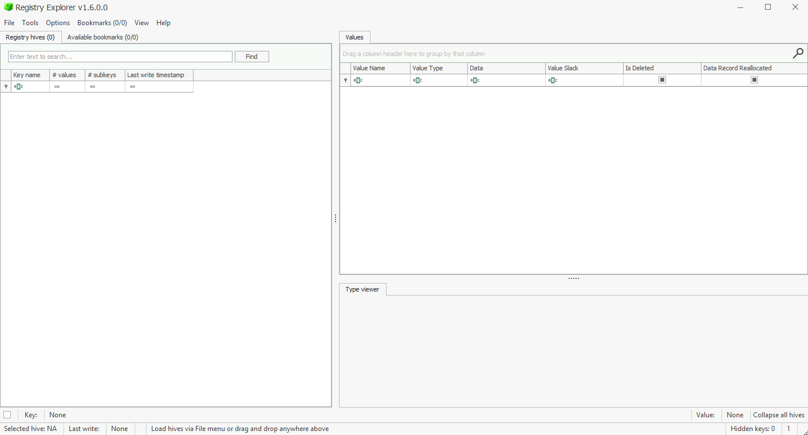

We can load a new registry hive by clicking the `File` > `Load` hive option. We can load multiple hives at one time in Registry Explorer. Since the first thing Anna wants to establish when starting her analysis is verifying system information, we will use Registry Explorer to identify system information. We have already acquired the registry data from the previous tasks so that we will build on the data acquired from the KAPE collection. Remember that KAPE retains the directory structure in its collected data, so we will find our registry hives in the same directory where they are in the Windows OS. Still, it will be in the destination directory we provided for KAPE. We learned that the SYSTEM hive is located in the `C:\Windows\System32\config` directory, so let's navigate to the KAPE target destination directory and load the SYSTEM hive from there to this location.

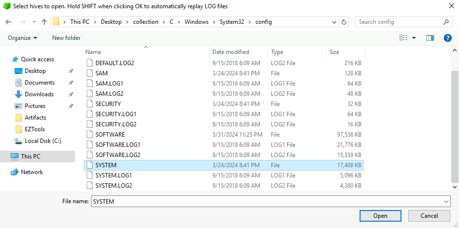

When we load a new registry hive, and the data from the transaction logs has not already been added, it asks the user if they want to add this data.

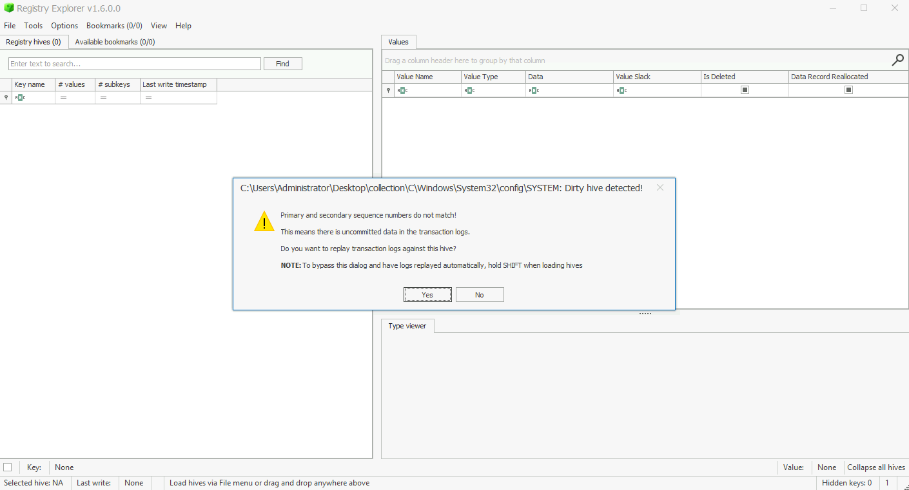

If we click Yes, Registry Explorer will ask us to select the transaction logs we want to incorporate. We must choose the same transaction logs as the hive we are trying to incorporate them into. For example, we will select SYSTEM.LOG1, SYSTEM.LOG2 when integrating into the SYSTEM hive.

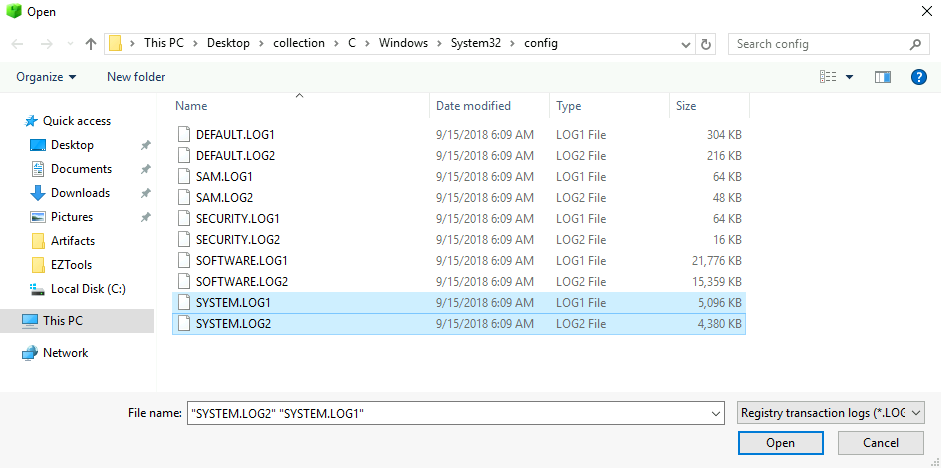

Once we select the logs, we must choose where the updated/clean hive will be saved. It will have the default name HIVE_clean.

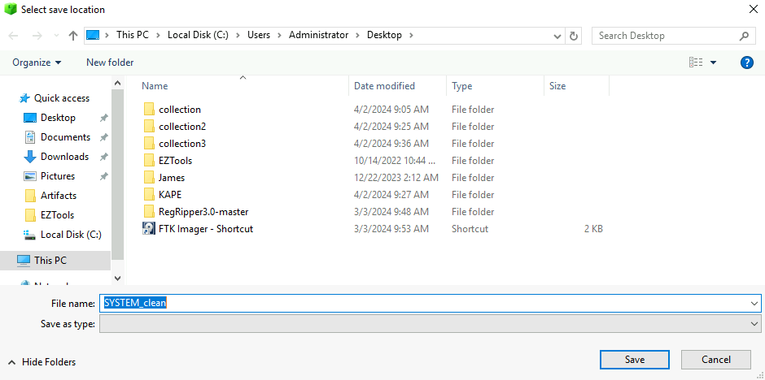

Once the data from transaction logs is added to the hive, the user is asked to reload it. Once reloaded, we can add the 'clean' hive with the transaction log data.

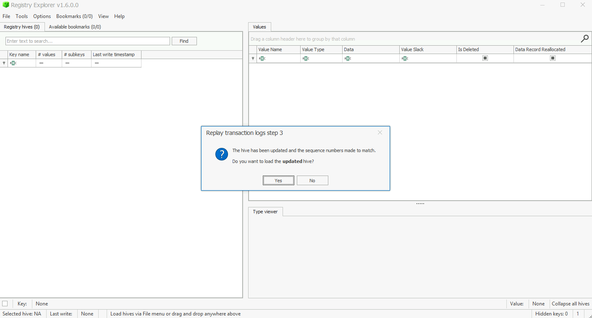

Once we click Yes, it asks if we want to load the dirty hive. We can do that if we encounter a problem loading the clean hive after replaying transaction logs. We just clicked No for now and moved only with the clean hive. We can see the Available bookmarks tab on the top, and when we click on this tab, it shows us the most forensically important registry keys and values from all the loaded hives. For a quick and dirty analysis, we can use the data from this tab to identify information that interests us. In the below screenshot, we can see this tab pointed by an arrow.

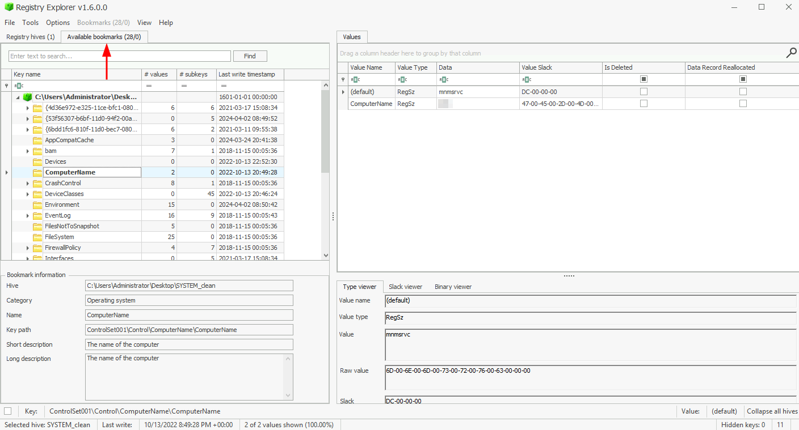

As we can see in the above screenshot, this tab gives us a shortcut to the most forensically important artefacts. We can see the highlighted 'ComputerName' registry key that provides us with the Computer Name. In the bottom left line, we can see the path of this registry key (`ControlSet001\Control\ComputerName\ComputerName`) and some other information.

From the same SYSTEM Hive, we can help Anna identify the Current Control Set (`SYSTEM\Select\Current`), Time Zone Information (`SYSTEM\CurrentControlSet\Control\TimeZoneInformation`), Network Interfaces and Past Networks (`SYSTEM\CurrentControlSet\Services\Tcpip\Parameters\Interfaces`). We can find the last two of these in the `Available bookmarks` tab in the Registry Explorer, while the first one can be looked at by navigating to its path in the `Registry hives` tab.

When we have loaded multiple hives, they look like the below image in Registry Explorer.

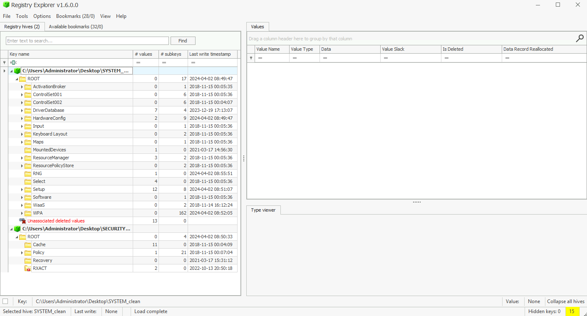

#### RECmd

As the name implies, **RECmd** is a Windows command line utility. RECmd is a tool that can be used to search and extract data from registry hives. It is a command-line version of the Registry Explorer tool and can also add transaction logs to registry hives. It can save the output in CSV format, making it easier to analyse.

Try running RECmd in the command prompt in the attached VM to check its different options. As we can see, the RECmd utility can recursively look into the provided directories or files, extract values and keys specified, or search for specific strings in the registry hives. It can save the results in either CSV or JSON. It can search for BASE64, Unicode, ASCII or regex. It can also recover any deleted keys or values. The following example shows RECmd being used to search for the keyword 'administrator' in the SAM registry hive.

```bat
C:\Users\Administrator\Desktop\EZTools\RECmd>RECmd.exe -f c:\Users\Administrator\Desktop\collection\c\windows\System32\config\SAM --sk administrator 
RECmd version 2.0.0.0

Author: Eric Zimmerman (saericzimmerman@gmail.com)
https://github.com/EricZimmerman/RECmd

Note: Enclose all strings containing spaces (and all RegEx) with double quotes

Command line: -f c:\Users\Administrator\Desktop\collection\c\windows\System32\config\SAM --sk administrator 
Processing hive c:\Users\Administrator\Desktop\collection\c\windows\System32\config\SAM

        Found 4 search hits in c:\Users\Administrator\Desktop\collection\c\windows\System32\config\SAM
        Key: SAM\Domains\Account\Users\Names\Administrator
        Key: SAM\Domains\Builtin\Aliases\Names\Administrators
        Key: SAM\Domains\Builtin\Aliases\Names\Hyper-V Administrators
        Key: SAM\Domains\Builtin\Aliases\Names\Storage Replica Administrators


C:\Users\Administrator\Desktop\EZTools\RECmd>   
```

The following command line shows RECmd being used to get specific key details.

```bat
C:\Users\Administrator\Desktop\EZTools\RECmd>RECmd.exe -f c:\Users\Administrator\Desktop\collection\c\windows\System32\config\SAM --kn SAM\Domains\Account\Users\Names\Administrator
RECmd version 2.0.0.0

Author: Eric Zimmerman (saericzimmerman@gmail.com)
https://github.com/EricZimmerman/RECmd

Note: Enclose all strings containing spaces (and all RegEx) with double quotes

Command line: -f c:\Users\Administrator\Desktop\collection\c\windows\System32\config\SAM --kn SAM\Domains\Account\Users\Names\Administrator


Processing hive c:\Users\Administrator\Desktop\collection\c\windows\System32\config\SAM

        Key path: SAM\Domains\Account\Users\Names\Administrator
        Last write time: 2021-03-17 14:58:48.9735963

        Subkey count: 0
        Values count: 1


        ------------ Value #0 ------------
        Name: (default) (RegUnknown)
        Data: 00-00-00-00


C:\Users\Administrator\Desktop\EZTools\RECmd>
```

The most significant feature of RECmd is the batch mode. This mode reads from a pre-configured YAML file and returns the desired registry keys and values. A batch file contains a header, which includes the metadata like the author of the batch file, the version of this file, the description, and an ID to identify the batch file. The batch file further contains a key section, which consists of a description of the desired key, the type of hive where the key is to be found, a category for the key, the path of the key, and comments regarding that particular key. Keys and values can be searched recursively, and wildcards can be used.

An example batch file will look something like the following.

```bat
Description: RECmd Batch File Template
Author: Andrew Rathbun
Version: 1.0
Id: 9bc106b8-efd0-44bb-b2a7-cbfddd99b2bb
Keys:
    -
        Description: Shutdown Time
        HiveType: SYSTEM
        Category: System Info
        KeyPath: ControlSet00*\Control\Windows
        ValueName: ShutdownTime
        Recursive: false
        IncludeBinary: true
        BinaryConvert: FILETIME
        Comment: "Last system shutdown time"
    -
        Description: System Info (Current)
        HiveType: SOFTWARE
        Category: System Info
        KeyPath: Microsoft\Windows NT\CurrentVersion
        ValueName: InstallTime
        IncludeBinary: true
        BinaryConvert: FILETIME
        Recursive: false
        Comment: "Current OS install time"
    -
        Description: System Info (Current)
        HiveType: SOFTWARE
        Category: System Info
        KeyPath: Microsoft\Windows NT\CurrentVersion
        ValueName: InstallDate
        IncludeBinary: true
        BinaryConvert: EPOCH
        Recursive: false
        Comment: "Current OS install date"
    -
        Description: Virtual Memory Pagefile Encryption Status
        HiveType: SYSTEM
        Category: System Info
        KeyPath: ControlSet*\Control\FileSystem
        ValueName: NtfsEncryptPagingFile
        Recursive: false
        Comment: "Virtual Memory Pagefile Encryption, 0 = Disabled, 1 = Enabled"
    -
        Description: MountPoints2
        HiveType: NTUSER
        Category: Devices
        KeyPath: Software\Microsoft\Windows\CurrentVersion\Explorer\MountPoints2
        Recursive: true
        Comment: "Mount Points - NTUSER"
```

RECmd leverages this data in a way that it creates normalised CSV files for the output. For example, it will use different plugins to extract data from different registry hives and categorise them in different CSV files per the category mentioned in the batch file. For example, it can extract information from the UserAssist registry key (from the NTUSER.DAT hive) and the Amcache hive and group them in a single CSV file named for the category "Program execution". However, since both these registry hives will have different information, the resulting CSV file will reflect this difference, with some fields being populated with data while others might remain empty.

Overall, RECmd can help us save time while analysing registry keys by automating most of the extraction so that an analyst has to focus on the analysis itself. We will further discuss leveraging RECmd by using KAPE in the next task.

---------------------------------------------------------------------------------------

#### What is the Computer Name of the computer we are analysing?

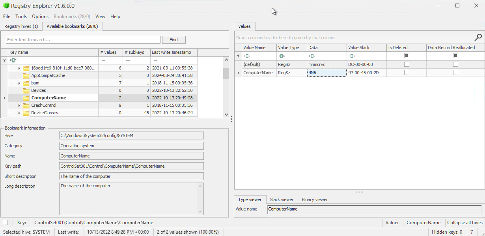

Answer: `4N6`

#### What is the TimeZoneKeyName of the computer we are analysing?

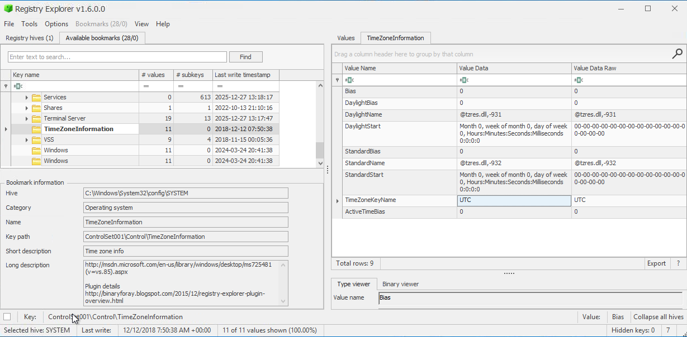

Answer: `UTC`

#### What is the LastKnownGood control set of the system?

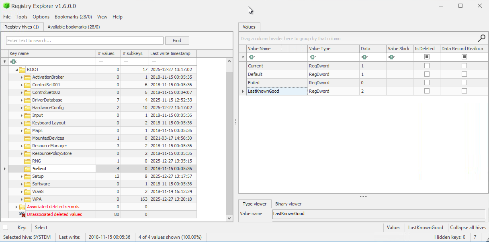

Answer: `2`

### Task 5: Registry Analysis Using RegRipper

Now that we have helped Anna verify the basic system information, let's see if we can find any suspicious account activity. We will use RegRipper to help us perform this task.

#### RegRipper

Since opening individual registry keys can become hectic and take a lot of time, RegRipper can come in handy to aggregate information from different registry hives. RegRipper works as a collection of various plugins. These plugins read the registry hive, extract the data they are programmed to extract, and write it to a document. We can always write our plugin to parse data of our interest, but for time-saving purposes, the community-built plugins are more than enough. We will not focus on writing our plugins or the internals of RegRipper, as that is out of the scope of the room. We will focus on the usage of RegRipper and analyse registry hives using this tool.

In the attached VM, RegRipper is placed in the `RegRipper 3.0` folder on the Desktop. The folder contains multiple files, but the ones we are interested in are `rr.exe` and `rip.exe`. The first one is the **RegRipper GUI**, which we will use here. The second one is a **command line utility** used for running individual plugins. Let's analyse the registry data we acquired in the earlier tasks using RegRipper.

When we first execute `rr.exe`, we see the following interface. We see a note mentioning that RegRipper does not automatically process transaction logs.

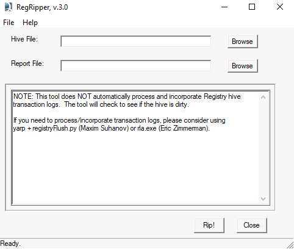

The interface is relatively straightforward. We select the registry hive location in the `Hive File` field, and the output file that we want to create is mentioned in the `Report File` field. We must note that **RegRipper does not** automatically incorporate transaction logs. We might get incomplete or incorrect information if we parse a hive without incorporating transaction logs. Therefore, if RegRipper warns us of the hive being dirty, we must first clean it by incorporating the transaction logs using Registry Explorer, as we learned in the previous task.

As we know from the Windows Forensics rooms, the SAM registry hive contains information about user accounts. So, let's parse the SAM hive using RegRipper. We will go to our KAPE collection and navigate to the location of the SAM hive to parse it using RegRipper.

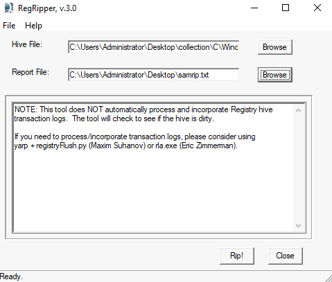

Once selected, we can click `Rip!` and it will extract information from the most forensically important registry keys and values for which the plugins are present. Below, we see the RegRipper output for parsing the SAM hive.

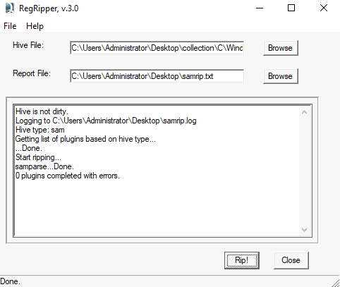

Each hive needs to be parsed individually, one by one. One important thing to remember is that we have to change the report file name for each new hive; otherwise, it will overwrite the existing file. We can see two files created in the output directory as an output for this data. One contains the log for the execution of RegRipper the file (with `.log` extension), which we can use to troubleshoot any problems with execution.

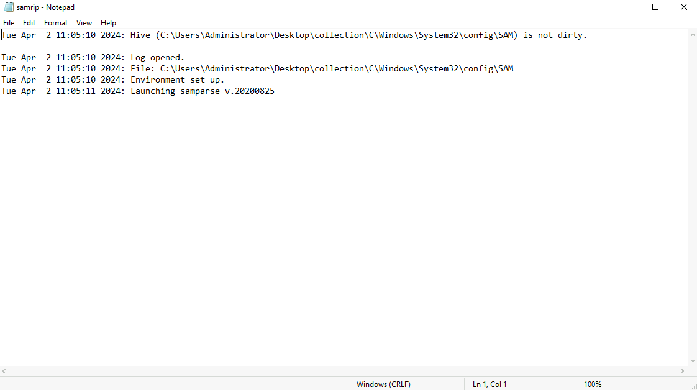

The other file (with `.txt` extension) will contain the results of RegRipper parsing that data.

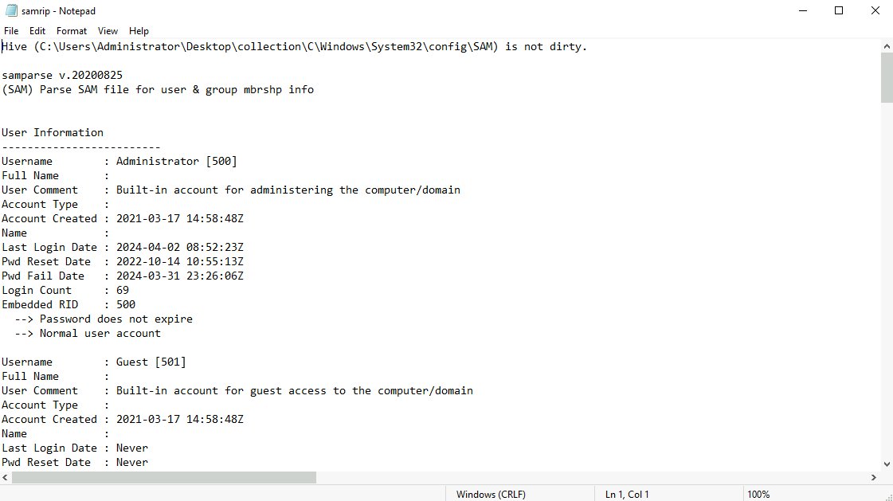

In the above screenshot, we can see that RegRipper has parsed the SAM hive and has extracted information about different user accounts in a more readable form. Notice that the first account it shows information about is the Administrator account. It shows us the Last Login Date, Password Reset Date, Login Count, and other details on this account that we otherwise have to extract one by one from the registry hive. We can scroll down further to identify more information about other user accounts. Further scrolling will also provide information on group membership for different accounts.

Similarly, we can parse the rest of the registry hives to extract forensically important information from these hives.

It must be noted that RegRipper is not a registry explorer. Instead, it parses specific registry keys and values deemed forensically crucial per the plugins. A plugin may be run, but the corresponding key or value is not in the registry hive. It is also possible that a key or value is present in the registry hive, but RegRipper does not extract the information from it because no plugin exists.

#### Use Cases of RegRipper

RegRipper provides a quick way to read the registry hives and create a list of important registry keys and values in an easy-to-read text file. Therefore, reading important information from a registry hive is much easier. It also extracts vital information from registry hives, such as first and last times, etc., which might have to be deducted when exploring a registry hive. The output of RegRipper also contains brief information about each registry key it extracts and its significance, making it easier to understand.

#### Shortcomings of RegRipper

Like any tool, RegRipper comes with its own set of shortcomings. Firstly and most importantly, RegRipper can not integrate registry transaction logs into dirty hives (which have some unsaved data in the form of transaction logs in separate files). To integrate transaction logs, we have to first use another tool, for example, Registry Explorer, and then use RegRipper. Another shortcoming of RegRipper is that it must be executed separately for each registry hive, making it a little more time-consuming and not ideal from a user experience point of view. Finally, the output of RegRipper is in long text files, which can become cumbersome to read sometimes and are not easy to parse and convert into timelines.

Can you parse the SAM hive using RegRipper and help Anna answer the following questions?

---------------------------------------------------------------------------------------

#### Which account was created last?

From the .txt result file of RegRipper:

|Account|Account Created|
|----|----|
|Administrator [500]|2021-03-17 14:58:48Z|
|Guest [501]|2021-03-17 14:58:48Z|
|DefaultAccount [503]|2021-03-17 14:58:48Z|
|WDAGUtilityAccount [504]|2021-03-17 14:58:48Z|
|4n6lab [1008]|2022-10-14 10:50:38Z|
|suspicious [1009]|2024-03-03 11:48:01Z|

Answer: `suspicious`

#### What is the Password Reset Date of this account?

From the .txt result file of RegRipper:

```text
Username        : suspicious [1009]
Full Name       : Suspicious user
User Comment    : 
Account Type    : 
Account Created : 2024-03-03 11:48:01Z
Name            :  
Last Login Date : 2024-03-03 11:54:11Z
Pwd Reset Date  : 2024-03-03 11:51:04Z
Pwd Fail Date   : Never
Login Count     : 1
Embedded RID    : 1009
  --> Password does not expire
  --> Normal user account
```

Answer: `2024-03-03 11:51:04Z`

#### What is the RID of the account 4n6lab?

From the .txt result file of RegRipper:

```text
Username        : 4n6lab [1008]
Full Name       : Forensicator
User Comment    : 
Account Type    : 
Account Created : 2022-10-14 10:50:38Z
Name            :  
Last Login Date : 2024-03-03 11:56:11Z
Pwd Reset Date  : 2024-03-03 11:52:52Z
Pwd Fail Date   : 2024-03-03 11:56:00Z
Login Count     : 1
Embedded RID    : 1008
  --> Password does not expire
  --> Normal user account
```

Answer: `1008`

#### Which 3 accounts are part of the Administrators group? (Format: account1, account2, account3 in ascending order of RID)

```text
Group Name    : Administrators [3]
LastWrite     : 2024-03-03 11:50:00Z
Group Comment : Administrators have complete and unrestricted access to the computer/domain
Users :
  S-1-5-21-1966530601-3185510712-10604624-500
  S-1-5-21-1966530601-3185510712-10604624-1008
  S-1-5-21-1966530601-3185510712-10604624-1009
```

|RID|Account Name|
|----|----|
|500|Administrator|
|1008|4n6lab|
|1009|suspicious|

Answer: `Administrator, 4n6lab, suspicious`

### Task 6: Speeding up the analysis using KAPE and EZTools

Anna had identified information about the system and different users on the affected machine but had not yet answered all the questions she had set out to answer. To top it off, she wanted to complete the analysis as quickly as possible so that she could take any remediation steps. She did not have the time to go to every single key to answer her questions. She wanted a turnkey solution that would answer all her questions. For this, she decided to use KAPE and EZTools to help her.

While we demonstrated how KAPE can be used to acquire registry data, it can also be used to automate and speed up some of the analysis process. As mentioned in the [KAPE](https://tryhackme.com/r/room/kape) room, KAPE can integrate different modules to post-process data after acquisition. In this task, we will demonstrate how we can leverage this capability and automate the processing of registry data using EZTools (RECmd, to be specific) to generate some easy-to-read CSV files that can then be further analysed to achieve our goal. For this task, we will acquire and process the registry data in one go to analyse the data in different registry artefacts after running KAPE.

To start with, we have to execute KAPE. We will see the familiar KAPE GUI.

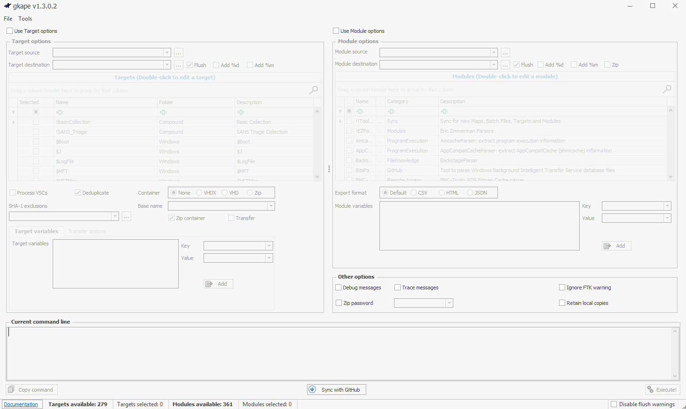

We can select the `RegistryHives` target option to collect the registry data.

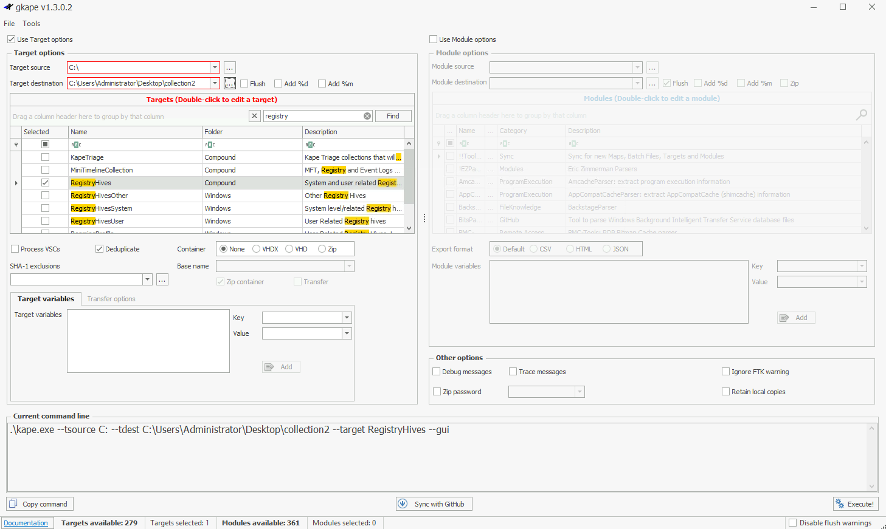

While we are at it, we will also select the module options. KAPE will automatically use the destination path from the target options as the source path for module options, so we can leave this field empty. We will use the `!EZParser` module to parse registry data using EZTools.

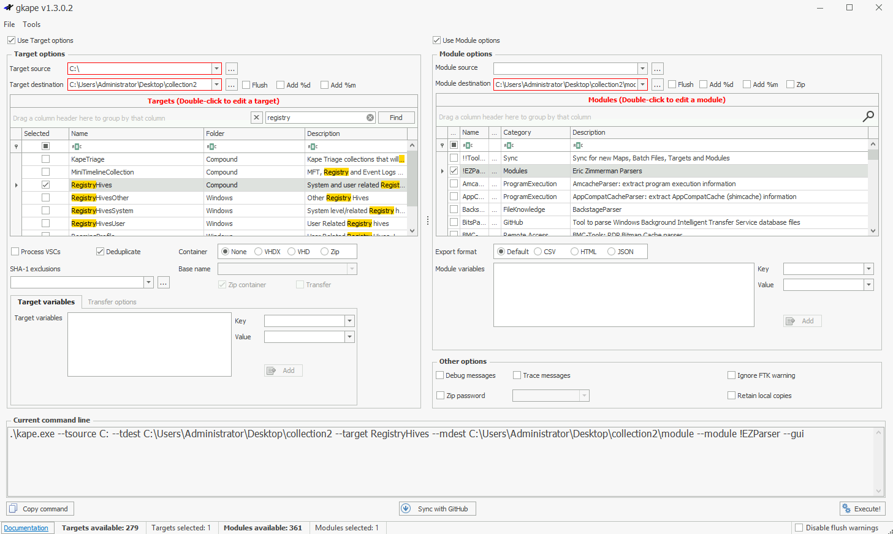

Once we have selected the target and module options, we can execute KAPE to acquire and process data. Note that this might take a couple of minutes.

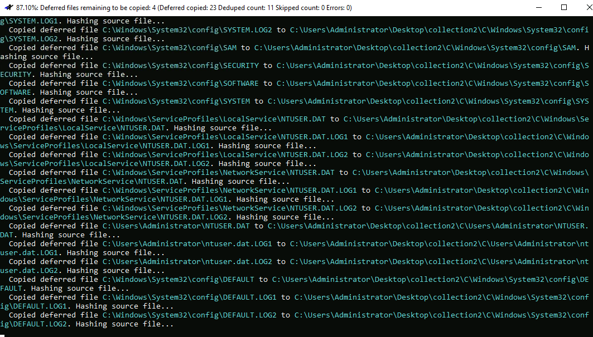

Once the execution is complete, we can find different output CSV files in various directories in the module destination directory. These CSV files can now be analysed, and our investigation can proceed. As you might have noted, this process takes just a few minutes, and we have all the critical forensic artefacts at our fingertips in a nice CSV format. The output directory will look something like this.

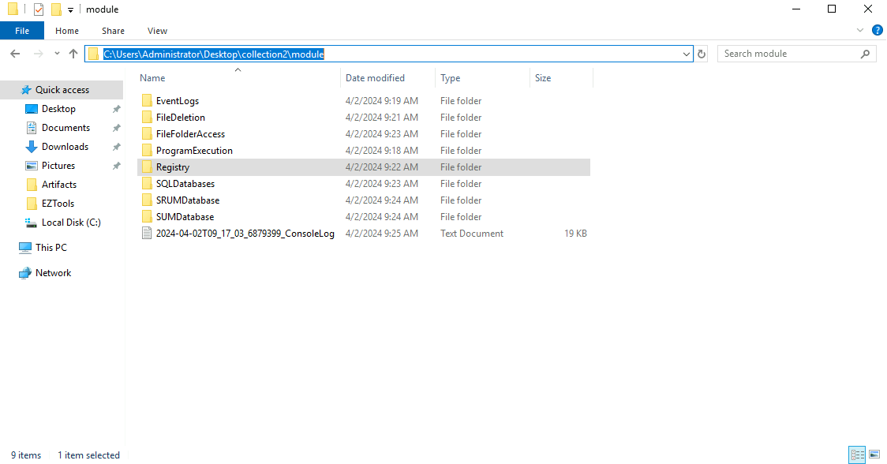

Now, we can sift through the destination directories and review the required information to meet our needs. Looking back on Task 1, we have already verified the system information and user accounts.

One question that remained unanswered so far was the known networks. Let's see if we can find that information in our results. For that, let's move to the Registry folder and further into the folder with the date. We will see a list of files as below:

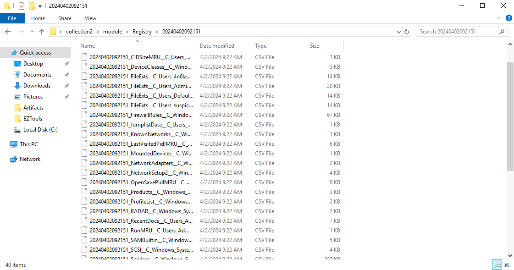

Among these, we can see a file containing information about KnownNetworks and another about NetworkAdapters. Let's open these files to see what information they contain. Since there is no MS Office in the VM, we can use **EZViewer** to open these files, which is placed on the Desktop in the EZTools directory. The screenshot below shows the KnownNetworks information of the system. We can see the network's name, network type, first connection date, last connection date, DNS suffix and the gateway's MAC address, among other information.

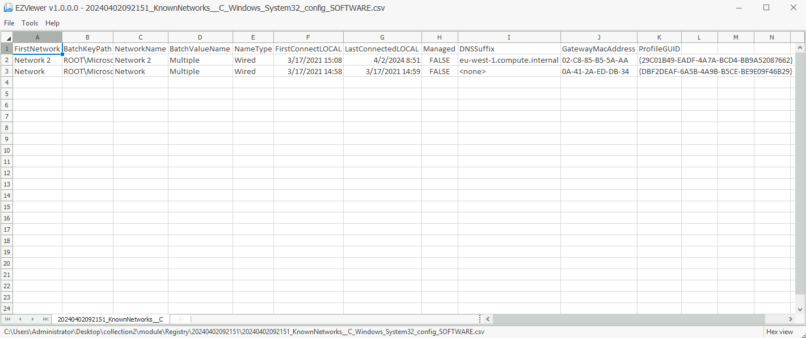

Similarly, we can look at the information in the NetworkAdapters and the NetworkSetup files to identify other network-related details about the system. Furthermore, the results also contain information about user activity extracted from NTUSER and USRCLASS hives.

In the current process, we might find that some directories are empty. That is because we did not collect all forensic artefacts that are parsed by the `!EZParser` module. The interesting thing about this process is that in addition to extracting all the valuable artefacts in CSV files, it automatically integrates the transaction logs to each registry hive, giving us a comprehensive output through a straightforward process. However, if someone still wants to be more granular and specific, they might want to use the other tools we discussed earlier in this room, if some information is not present in the results the way we want it to. We can use the Registry Forensics cheatsheet attached in task 4 of this room for reference to identify the critical registry locations.

#### Bonus - Complete Forensic Package Acquisition and Processing

Similar to the process we followed for acquiring and processing the registry data, we can use the same method to acquire and process a complete forensic package, including all the critical forensic artefacts from a Windows machine such as MFT, Prefetch, registry, etc. We can then process them to create nice CSV files as output containing the critical data. We can use the KAPE triage package as a target option.

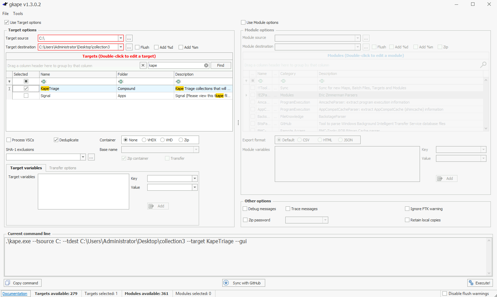

For module options, we can choose the same `!EZParser` module.

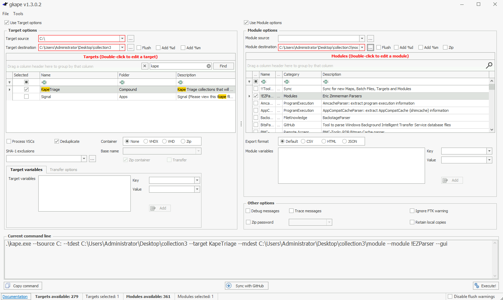

Once we execute KAPE, we will have results from most essential forensic artefacts from a Windows machine parsed and ready to be analysed in files and directories named per the information they provide. We can also use the batch mode of KAPE to perform the same task if we have to get help from other team members during an incident.

This process can help a lot when rapid triage of multiple machines is required, and we need to perform some quick and dirty analysis to contain an outbreak or a similar situation.

---------------------------------------------------------------------------------------

#### What is the network's gateway MAC address, which was last connected in 2021?

Hint: Look for this information in the Registry related to network information.

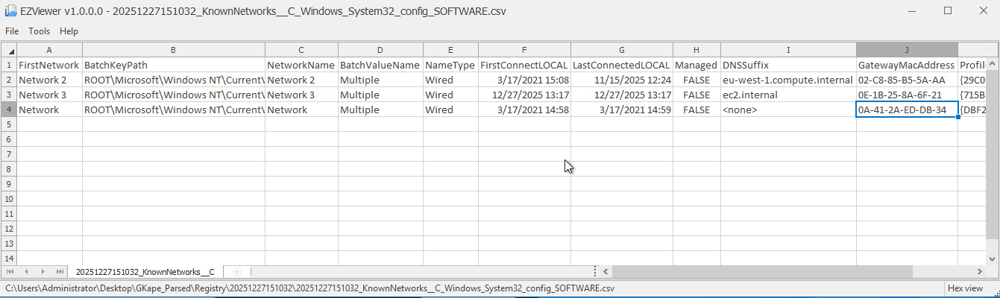

Answer: `0A-41-2A-ED-DB-34`

#### When was this network last connected?

See above.

Answer: `3/17/2021 14:59`

#### When was "Network 2" first connected?

See above.

Answer: `3/17/2021 15:08`

### Task 7: Practical Challenge

While analysing the other artefacts from the original system and the presence of a suspicious user account, Anna identified another system that might have been infected. Artefacts from that system are placed on the attached VM in the folder titled '**James**' on the Desktop. Can you help Anna analyze these artefacts and answer the questions below with the help of the registry cheat sheet? You can use the tools of your own choice to complete this task.

---------------------------------------------------------------------------------------

#### What is the name of this system?

From analysis of the SYSTEM hive with Registry Explorer:

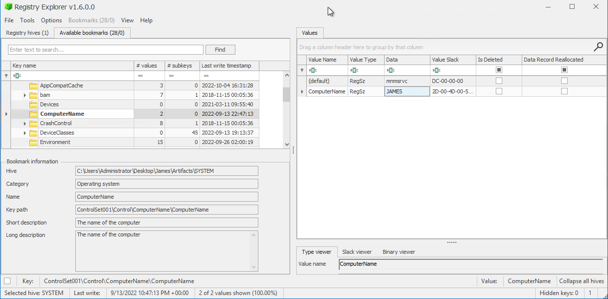

Answer: `JAMES`

#### Which user, other than administrator, is part of the administrators group?

From RegRipper analysis of the SAM hive:

```text
Group Name    : Administrators [2]
LastWrite     : 2022-10-04 16:51:04Z
Group Comment : Administrators have complete and unrestricted access to the computer/domain
Users :
  S-1-5-21-1966530601-3185510712-10604624-500
  S-1-5-21-1966530601-3185510712-10604624-1012
```

RID 1012 is the following account:

```text
Username        : art-test [1012]
Full Name       : 
User Comment    : 
Account Type    : 
Account Created : 2022-10-04 16:51:04Z
Name            :  
Last Login Date : Never
Pwd Reset Date  : 2022-10-04 16:51:04Z
Pwd Fail Date   : Never
Login Count     : 0
Embedded RID    : 1012
  --> Normal user account
```

Answer: `art-test`

#### A VPN connection was established on this system. What was the name of the network that connected to a VPN?

Hints:

- Make sure you are checking the artifacts placed on the Desktop already.
- Check the last connected networks. The name of the network will give it away.
- Note that KAPE can also run the module option without the target option.

From analysis of the SOFTWARE hive with Registry Explorer:

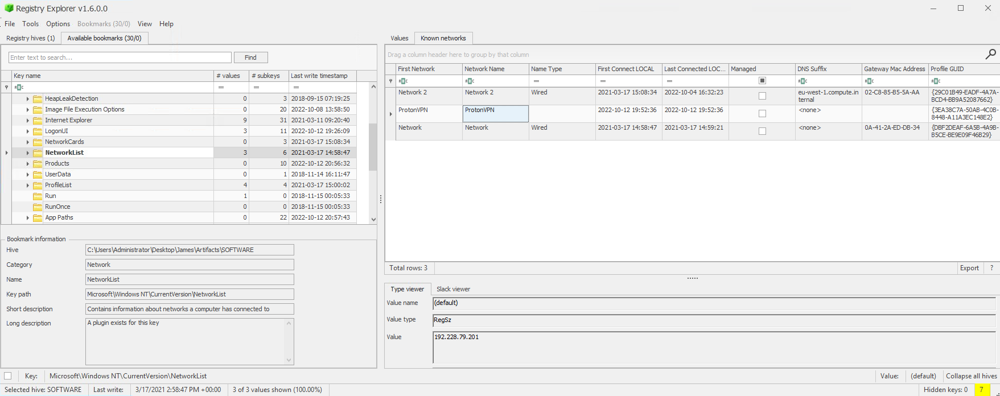

Answer: `ProtonVPN`

#### To which organization is the Windows OS registered?

Hint: Check OS details as per the registry cheatsheet

From analysis of the SOFTWARE hive with Registry Explorer:

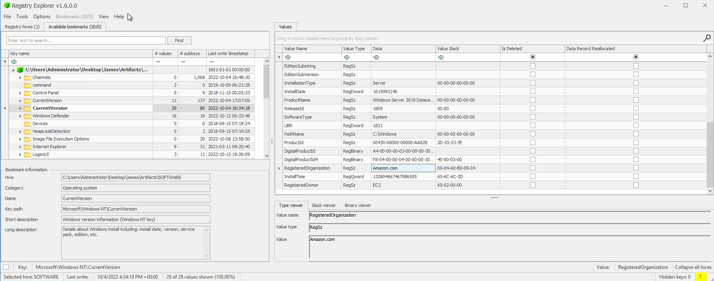

Answer: `Amazon.com`

### Task 8: Conclusion

That's a wrap for this room. Rounding it all up, we have learned:

- Different tools to acquire forensic registry data.
- Different tools that can be used to process collected registry data.
- Leveraging these tools to speed up the analysis process.
- Using our learnings from the Registry Forensics cheat sheet to answer different questions during an incident.

Let us know what you found most helpful in this room on our [Discord channel](https://discord.gg/tryhackme) or [Twitter account](http://twitter.com/realtryhackme).

For additional information, please see the references below.

## References

- [Eric Zimmerman's Tools - GitHub](https://ericzimmerman.github.io/)
- [FTK Imager - Homepage](https://www.exterro.com/ftk-imager)
- [KAPE (Kroll Artifact Parser And Extractor) - Homepage](https://www.kroll.com/en/services/cyber/incident-response-recovery/kroll-artifact-parser-and-extractor-kape)
- [RECmd - GitHub](https://github.com/EricZimmerman/RECmd)
- [RegRipper - GitHub](https://github.com/keydet89/RegRipper3.0)
- [Regripper - Kali Tools](https://www.kali.org/tools/regripper/)
- [Windows Registry - Wikipedia](https://en.wikipedia.org/wiki/Windows_Registry)
