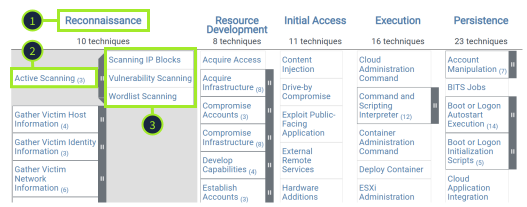
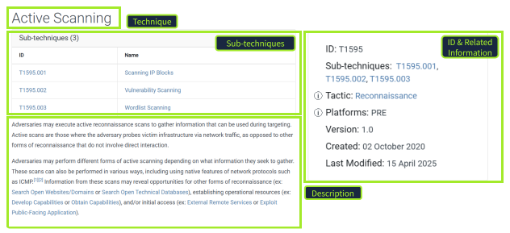
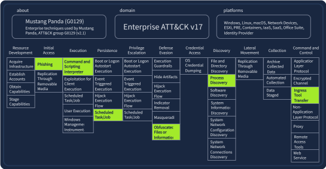
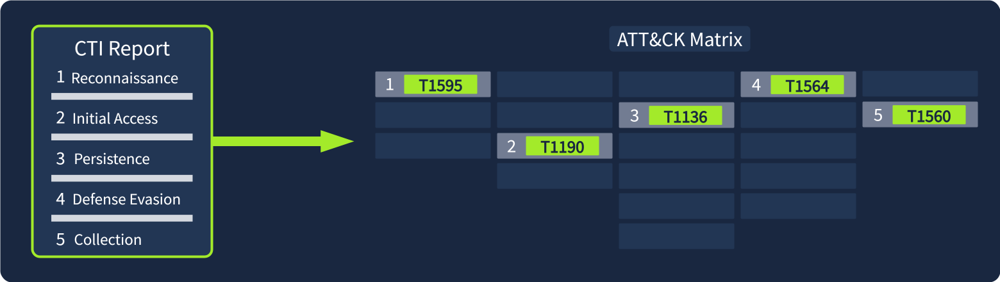
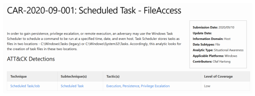
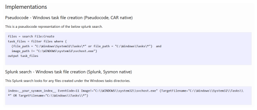
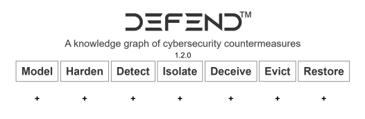
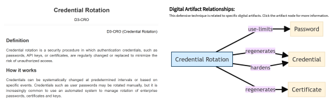
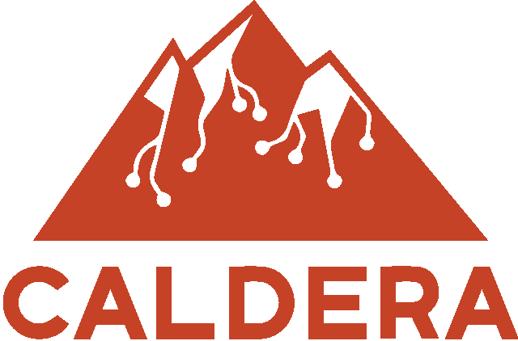
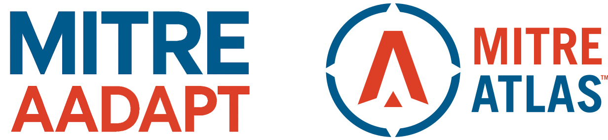

# MITRE

- [Room information](#room-information)
- [Solution](#solution)
- [References](#references)

## Room information

```text
Type: Walkthrough
Difficulty: Medium
Tags: -
Subscription type: Premium
Description: This room will discuss the various resources MITRE has made available for 
the cybersecurity community.
```

Room link: [https://tryhackme.com/room/mitre](https://tryhackme.com/room/mitre)

## Solution

### Task 1 - Introduction

In your cyber security journey so far, you've likely come across the name [MITRE](https://www.mitre.org/), perhaps when researching a known exploit or exploring various tactics used by attackers. MITRE is a not-for-profit organization that conducts research and development across a range of domains, including cyber security, artificial intelligence, healthcare, and space systems, all to support its mission: "to solve problems for a safer world."

In this room, we will focus on MITRE's cyber security frameworks and resources, including MITRE ATT&CK®, the CAR Knowledge Base, D3FEND, MITRE Engage™, and other relevant tools. These resources have become crucial in modern security, enabling both red and blue teams to understand adversary behavior, develop more effective detections, and enhance their defenses.

#### Learning Objectives

- Understand the purpose and structure of the MITRE ATT&CK® Framework
- Explore how security professionals apply ATT&CK in their work
- Use cyber threat intelligence (CTI) and the ATT&CK Matrix to profile threats
- Discover MITRE’s other frameworks, including CAR and D3FEND

#### Prerequisites

- Complete [Cyber Kill Chain](https://tryhackme.com/room/cyberkillchain) to build a foundational understanding of how cyber attacks unfold from start to finish.

### Task 2 - ATT&CK® Framework


The [MITRE ATT&CK®](https://attack.mitre.org/) framework is “a globally-accessible knowledge base of adversary tactics and techniques based on real-world observations. The ATT&CK knowledge base is used as a foundation for the development of specific threat models and methodologies in the private sector, in government, and in the cyber security product and service community.”

In 2013, MITRE recognized the need to document and categorize the standard tactics, techniques, and procedures (TTPs) used by advanced persistent threat (APT) groups. To better understand how adversaries operate, it’s helpful to break down what each part of TTP represents:

- [Tactic](https://attack.mitre.org/tactics/enterprise/): An adversary's goal or objective. The “why” of an attack.
- [Technique](https://attack.mitre.org/techniques/enterprise/): How an adversary achieves their goal or objective.
- Procedure: The implementation or how the technique is executed.

#### ATT&CK Evolution

The ATT&CK framework has evolved significantly over the years. Focused initially on the Windows platform, it has expanded to cover a range of environments, including macOS, Linux, cloud platforms, and more, under the Enterprise matrix. Additionally, specialized frameworks exist for Mobile and Industrial Control Systems (ICS). The framework continues to grow through contributions from the cyber security community. While incredibly valuable from a defensive perspective, red teams also rely on the framework to plan realistic attack simulations and test organizations' defenses.

#### ATT&CK Matrix

The [MITRE ATT&CK Matrix](https://attack.mitre.org/matrices/) is a powerful visual representation of all tactics and techniques that exist within the framework. You can also utilize the [ATT&CK Navigator](https://mitre-attack.github.io/attack-navigator/), a handy tool for annotating and exploring matrices. The tactics are represented across the top of the matrix. Each tactic contains techniques nested below, which can be expanded to reveal sub-techniques.

Let's check it out.

1. **Tactic**: Let's say that an attacker wants to perform Reconnaissance on their target. This is the attacker's goal.
2. **Technique**: They may utilize the Active Scanning technique. This is how they achieve their Reconnaissance goal.
3. **Sub-technique**: Active Scanning comprises three specific methods: Scanning IP Blocks, Vulnerability Scanning, or Wordlist Scanning.



**Diving Deeper**

Let's take a closer look at the [Active Scanning](https://attack.mitre.org/techniques/T1595/) technique. On the technique's details page, you will see the sub-techniques listed again. The linked page also includes all relevant information, including a description and the technique's ID, which you will often encounter in your cyber security research.



Alongside the information discussed above, each tactic and technique page includes procedure examples (groups, software used, and campaigns), mitigations, detections, and references. ATT&CK can be overwhelming at first, simply due to the vast amount of information available. Let's take a step back and answer a few questions to gain a better understanding.

---------------------------------------------------------------------------------------

#### What Tactic does the Hide Artifacts technique belong to in the ATT&CK Matrix?

From `https://attack.mitre.org/techniques/T1564/`

Answer: `Defense Evasion`

#### Which ID is associated with the Create Account technique?

From `https://attack.mitre.org/techniques/T1136/`

Answer: `T1136`

### Task 3 - ATT&CK in Operation

Now that you know what ATT&CK is and the kind of intelligence it contains, let’s take a closer look at how and why it’s used. With so much data available, how do organizations actually make sense of it all? Let’s explore how defenders, researchers, and red teams implement ATT&CK.

#### Why ATT&CK Matters

ATT&CK provides cyber security professionals and organizations with a standard and consistent language for describing adversary behavior. In your cyber learning journey, you’ve probably seen the same action or technique referred to by several different names. By providing standard terminology and unique IDs, the framework makes it easier to compare data and incidents, enabling effective communication across the security community.

**Threat Intelligence and Defense**

Beyond improving communication, ATT&CK also helps bridge the gap between threat intelligence and defensive operations. A threat report might describe what an attacker did, but not how to turn that information into usable detection measures. Through mapping threat activity to TTPs, defenders can translate intelligence into real detection logic, queries, and playbooks. Later in the room, we will discuss some of the tools that MITRE has made available to support these efforts.

**Who Uses ATT&CK?**

ATT&CK is used across the cyber security industry. The table below highlights how various teams and professionals apply it in their daily work and how it supports offensive and defensive operations.

|Who|Their Goal|How They Use ATT&CK|
|----|----|----|
|Cyber Threat Intelligence (CTI) Teams|Collect and analyze threat information to improve an organization's security posture|Map observed threat actor behavior to ATT&CK TTPs to create profiles that are actionable across the industry|
|SOC Analysts|Investigate and triage security alerts|Link activity to tactics and techniques to provide detailed context for alerts and prioritize incidents|
|Detection Engineers|Design and improve detection systems|Map SIEM/EDR and other rules to ATT&CK to ensure better detection efforts|
|Incident Responders|Respond to and investigate security incidents|Map incident timelines to MITRE tactics and techniques to better visualize the attack.|
|Red & Purple Teams|Emulate adversary behavior to test and improve defenses|Build emulation plans and exercises aligned with techniques and known group operations|

#### Mapping in Action

Let's say your organization has been the victim of an attack. In a post-incident scenario, it is crucial to analyze how the attack unfolded and map each stage in a structured format. This will allow your team to better prepare for future campaigns targeting your organization.

The group [Mustang Panda](https://attack.mitre.org/groups/G0129/) (G0129) has been mapped to a variety of ATT&CK techniques based on its years of attacking government entities, non-profits, and NGOs. Below, you can see that Mustang Panda prefers phishing techniques for initial access, persists via scheduled tasks, obfuscates files to evade defenses, and uses an ingress tool transfer for command and control. For the questions in this task, you will analyze Mustang Panda's dedicated page and associated [matrix](https://mitre-attack.github.io/attack-navigator//#layerURL=https%3A%2F%2Fattack.mitre.org%2Fgroups%2FG0129%2FG0129-enterprise-layer.json) using the ATT&CK Navigator.



---------------------------------------------------------------------------------------

#### In which country is Mustang Panda based?

From `https://attack.mitre.org/groups/G0129/`

Answer: `China`

#### Which ATT&CK technique ID maps to Mustang Panda’s Reconnaissance tactics?

From `https://attack.mitre.org/groups/G0129/`

Answer: `T1598`

#### Which software is Mustang Panda known to use for Access Token Manipulation?

From `https://attack.mitre.org/groups/G0129/`

Answer: `Cobalt Strike`

### Task 4 - ATT&CK for Threat Intelligence

In the previous task, we explored how organizations and teams utilize Cyber Threat Intelligence (CTI) to understand adversary behavior and inform defense strategies by mapping intelligence to the ATT&CK framework. You also gained some experience using the Navigator to analyze a group's TTPs. Now, you'll use your newly gained knowledge to research threat groups that might target your organization.



#### Scenario

You are a security analyst in the aviation sector, and your organization is migrating its infrastructure to the cloud. Your task is to use ATT&CK to gather intelligence on APT groups known to target this sector, identify their tactics and techniques, and assess any potential gaps in your defensive coverage.

You’ll use the [Groups](https://attack.mitre.org/groups/) section on the ATT&CK website to find an appropriate group and analyze its behavior using the Navigator layer and technique pages.

---------------------------------------------------------------------------------------

#### Which APT group has targeted the aviation sector and has been active since at least 2013?

Search on the page `https://attack.mitre.org/groups/` for a group with a description that contains both the keywords `aviation` and `2013`.

Answer: `APT33`

#### Which ATT&CK sub-technique used by this group is a key area of concern for companies using Office 365?

Search on the page `https://attack.mitre.org/groups/G0064/` for a sub-techniques containing the keyword `office`.

Answer: `Cloud Accounts`

#### According to ATT&CK, what tool is linked to the APT group and the sub-technique you identified?

Search on the page `https://attack.mitre.org/techniques/T1078/004/` for the keyword `APT33`.

Answer: `Ruler`

#### Which mitigation strategy advises removing inactive or unused accounts to reduce exposure to this sub-technique?

Search on the page `https://attack.mitre.org/techniques/T1078/004/` for a mitagation strategy with the keyword `inactive`.

Answer: `User Account Management`

#### What Detection Strategy ID would you implement to detect abused or compromised cloud accounts?

Check the page `https://attack.mitre.org/techniques/T1078/004/` for detections strategies (there is currently only one).

Answer: `DET0546`

### Task 5 - Cyber Analytics Repository (CAR)

MITRE defines the Cyber Analytics Repository ([CAR](https://car.mitre.org/)) as “a knowledge base of analytics developed by MITRE based on the MITRE ATT&CK adversary model. CAR defines a data model that is leveraged in its pseudocode representations, but also includes implementations directly targeted at specific tools (e.g., Splunk, EQL) in its analytics. With respect to coverage, CAR is focused on providing a set of validated and well-explained analytics, in particular with regard to their operating theory and rationale.”

This all sounds a bit complex, so let's break it down. CAR is a collection of ready-made detection analytics built around ATT&CK. Each analytic describes how to detect an adversary's behavior. This is key because it allows you to identify the patterns you should look for as a defender. CAR also provides example queries for common industry tools such as Splunk, so you, as a defender, can translate ATT&CK TTPs into real detections.

Let's dive in and get some hands-on experience with CAR. We will begin by examining [CAR-2020-09-001: Scheduled Task - File Access](https://car.mitre.org/analytics/CAR-2020-09-001/). Upon visiting the page, we are given a description of the analytics and references to the associated ATT&CK tactics and techniques.



In the **Implementations** section, you are provided with Pseudocode, a Splunk query, and a LogPoint search as examples of how an analyst may filter for this technique using their organization's Security Information and Event Management (SIEM) platform. Pseudocode is a plain, human-readable way to describe a set of instructions or algorithms that a program or system will perform. Note that not every analytic within CAR will have the same implementation examples. Some analytics even include Unit Tests, which an analyst can use to validate whether the analytic works as intended.



CAR also has its own [ATT&CK Navigator layer](https://mitre-attack.github.io/attack-navigator/#layerURL=https://raw.githubusercontent.com/mitre-attack/car/master/docs/coverage/car_analytic_coverage_04_05_2022.json) in which techniques are mapped to a matrix similar to what you saw previously when investigating groups. You will utilize the [CAR Analytics List](https://car.mitre.org/analytics/) and matrix for the questions in this task.

---------------------------------------------------------------------------------------

#### Which ATT&CK Tactic is associated with CAR-2019-07-001?

From `https://car.mitre.org/analytics/CAR-2019-07-001/`

Answer: `Defense Evasion`

#### What is the Analytic Type for Access Permission Modification?

Search for `Access Permission` on `https://car.mitre.org/analytics/`.

Click on the associated analytis (`https://car.mitre.org/analytics/CAR-2019-07-001/`) and note the analytic type.

Answer: `Situational Awareness`

### Task 6 - MITRE D3FEND Framework

With MITRE ATT&CK, you learn how attacks happen, but with MITRE D3FEND, you discover how to stop them.

**D3FEND** (Detection, Denial, and Disruption Framework Empowering Network Defense) is a structured framework that maps out defensive techniques and establishes a common language for describing how security controls work. D3FEND comes with its own [matrix](https://d3fend.mitre.org/), which is broken down into seven tactics, each with its associated techniques and IDs.



For example, the [Credential Rotation D3-CRO](https://d3fend.mitre.org/technique/d3f:CredentialRotation/) technique emphasizes the regular rotation of passwords to prevent attackers from reusing stolen credentials. D3FEND explains how this defense works, what to consider when implementing it, and how it relates to specific digital artifacts and ATT&CK techniques, helping you see both perspectives: the attacker’s move and the defender’s countermeasure.



---------------------------------------------------------------------------------------

#### Which sub-technique of User Behavior Analysis would you use to analyze the geolocation data of user logon attempts?

Search on the page `https://d3fend.mitre.org/technique/d3f:UserBehaviorAnalysis/` for the keyword `geoloacation`.

Answer: `User Geolocation Logon Pattern Analysis`

#### Which digital artifact does this sub-technique rely on analyzing?

See the page `https://d3fend.mitre.org/technique/d3f:UserGeolocationLogonPatternAnalysis/` under `Artifact Relationships`.

Answer: `Network Traffic`

### Task 7 - Other MITRE Projects

Beyond the frameworks and tools we have discussed previously, MITRE offers several other projects designed to help cyber security professionals strengthen their skills, test their defenses, and outsmart attackers. In this task, we will briefly explore these tools and how they can support your growth in the field.

#### Emulation Plans

MITRE's [Adversary Emulation Library](https://ctid.mitre.org/resources/adversary-emulation-library/), primarily maintained and contributed to by The Center for Threat Informed Defense ([CTID](https://ctid.mitre.org/)), is a free resource of adversary emulation plans. The [library](https://github.com/center-for-threat-informed-defense/adversary_emulation_library) currently contains several emulations that mimic real-world attacks by known threat groups. The emulation plans are a step-by-step guide on how to mimic the specific threat group.

#### Caldera



[Caldera](https://caldera.mitre.org/) is an automated adversary emulation tool designed to help security teams test and enhance their defenses. It provides the ability to simulate real-world attacker behavior utilizing the ATT&CK framework. This allows defenders to evaluate detection methods and practice incident response in a controlled environment. Caldera supports offensive and defensive operations, making it a powerful tool for red and blue team exercises.

#### New and Emerging Frameworks



[AADAPT](https://aadapt.mitre.org/) (Adversarial Actions in Digital Asset Payment Technologies) is a newly released knowledge base that includes its own matrix, covering adversary tactics and techniques related to digital asset management systems. AADAPT follows a similar structure to the ATT&CK Framework we covered previously and aims to help defenders understand and mitigate threats targeting blockchain networks, smart contracts, digital wallets, and other digital asset technologies.

[ATLAS](https://atlas.mitre.org/) (Adversarial Threat Landscape for Artificial-Intelligence Systems) is a knowledge base and framework that includes a matrix, focusing on threats targeting artificial intelligence and machine learning systems. It documents real-world attack techniques, vulnerabilities, and mitigations specific to AI technology.

---------------------------------------------------------------------------------------

#### What technique ID is associated with Scrape Blockchain Data in the AADAPT framework?

See the `ID` on the page `https://aadapt.mitre.org/techniques/ADT3025`.

Answer: `ADT3025`

#### Which tactic does LLM Prompt Obfuscation belong to in the ATLAS framework?

See the page `https://atlas.mitre.org/techniques/AML.T0068` under `Tactic`.

Answer: `Defense Evasion`

### Task 8 - Conclusion

In this room, you explored the tools and resources that MITRE has provided to the security community. The goal is to introduce you to these resources and provide you with a foundational understanding of their uses. Many vendors of security products and security teams worldwide consider these resources invaluable in their day-to-day efforts to thwart attackers. The more information we have as security professionals, the better equipped we are to fight back!
For additional information, please see the references below.

## References

- [Adversary Emulation Plans - Mitre](https://attack.mitre.org/resources/adversary-emulation-plans/)
- [AADAPT - Mitre](https://aadapt.mitre.org/)
- [ATLAS - Mitre](https://atlas.mitre.org/)
- [ATT&CK - Mitre](https://attack.mitre.org/)
- [ATT&CK Navigator - Mitre](https://mitre-attack.github.io/attack-navigator/)
- [Cyber Analytics Repository - Mitre](https://car.mitre.org/)
- [Cyber threat intelligence - Wikipedia](https://en.wikipedia.org/wiki/Cyber_threat_intelligence)
- [D3FEND - Mitre](https://d3fend.mitre.org/)
- [ENGAGE - Mitre](https://engage.mitre.org/)
