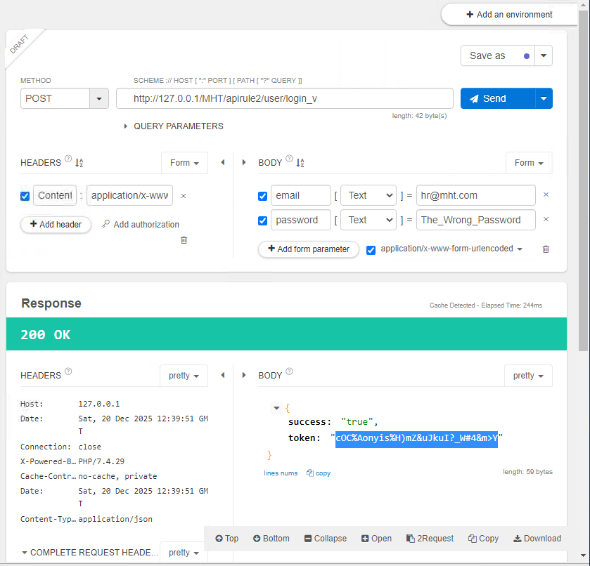
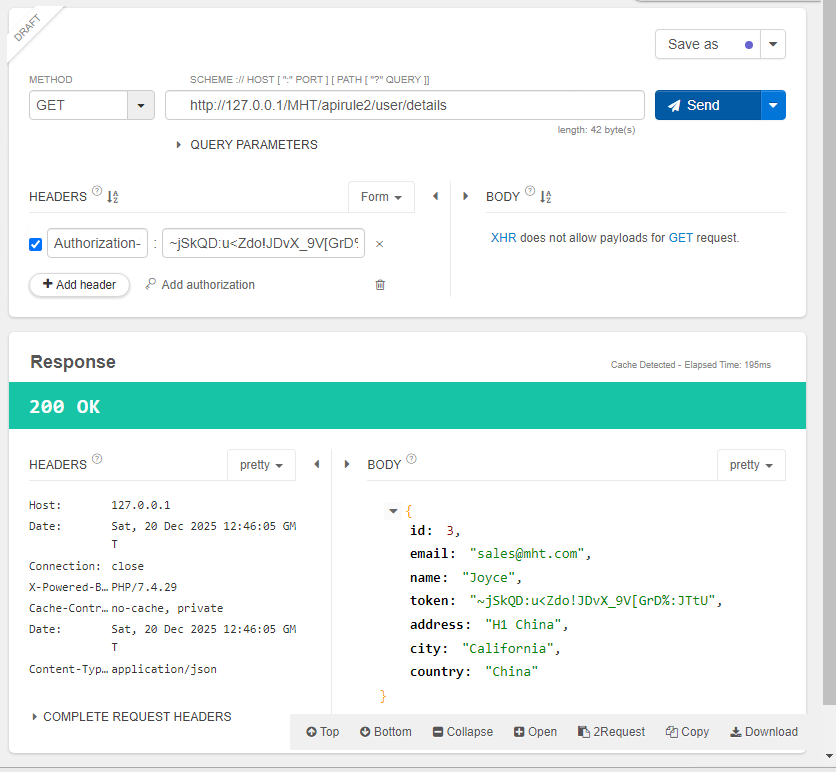
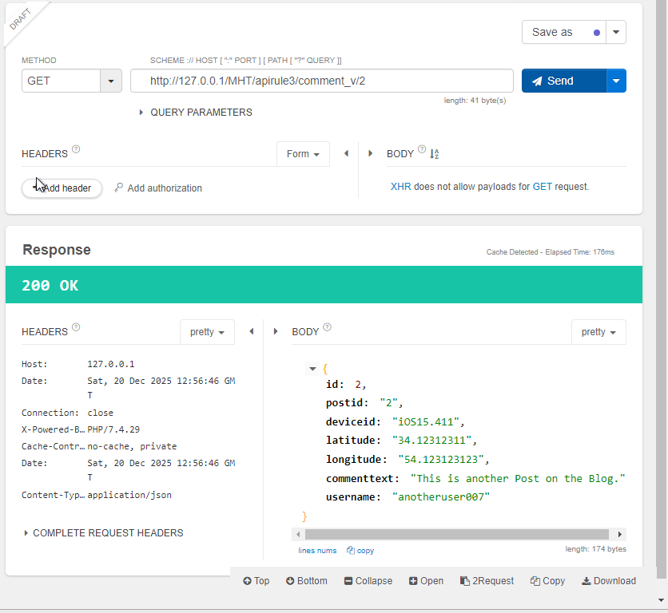
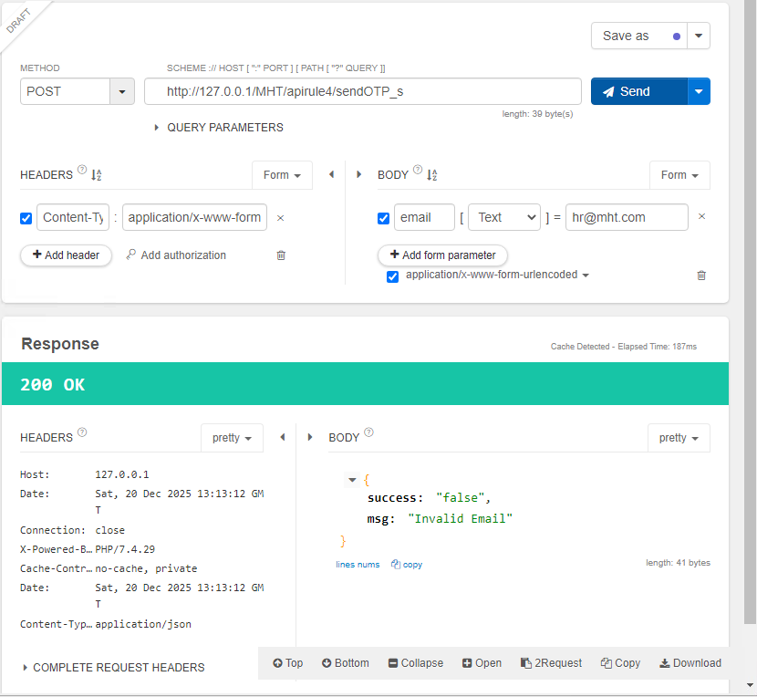

# OWASP API Security Top 10 - 1

- [Room information](#room-information)
- [Solution](#solution)
- [References](#references)

## Room information

```text
Type: Walkthrough
Difficulty: Medium
OS: Linux
Subscription type: Premium
Description:
Learn the basic concepts for secure API development (Part 1).
```

Room link: [https://tryhackme.com/room/owaspapisecuritytop105w](https://tryhackme.com/room/owaspapisecuritytop105w)

## Solution

### Task 1: Introduction

Open Worldwide Application Security Project (OWASP) is a non-profit and collaborative online community that aims to improve application security via a set of security principles, articles, documentation etc. Back in 2019, OWASP released a list of the top 10 API vulnerabilities, which will be discussed in detail, along with its potential impact and a few effective mitigation measures.

We have split this room into two parts. In **Part 1**, you will study the top 5 principles, and in [Part 2](https://tryhackme.com/room/owaspapisecuritytop10d0), you will learn the remaining principles.

#### Learning Objectives

- Best practices for API authorisation & authentication
- Identification of authorisation level issues
- Handling excessive data exposure
- Lack of resources and rate-limiting issues

#### Learning Pre-requisites

An understanding of the following topics is recommended before starting the room:

- [How websites work](https://tryhackme.com/room/howwebsiteswork)
- [HTTP protocols & methods](https://tryhackme.com/room/protocolsandservers)
- [Principles of security](https://tryhackme.com/room/principlesofsecurity)
- [OWASP Top 10 (2025)](https://tryhackme.com/module/owasp-top-10-2025) module

#### Connecting to the Machine

We will be using Windows as a development/test machine along with Talend API Tester - free edition throughout the room with the following credentials:

- Machine IP:  `10.65.135.197`
- Username:    `Administrator`
- Password:    `Owasp@123`

You can start the virtual machine by clicking **Start Machine**. The machine will start in a split-screen view. In case the VM is not visible, use the blue Show Split View button at the top-right of the page. Alternatively, you can connect with the VM through Remote Desktop using the above credentials. Please wait 1-2 minutes after the system boots completely to let the auto scripts run successfully that will execute Talend API Tester and Laravel-based web application automatically.


Let's begin!

### Task 2: Understanding APIs - A refresher

#### What is an API & Why is it important?

API stands for Application Programming Interface. It is a middleware that facilitates the communication of two software components utilising a set of protocols and definitions. In the API context, the term '**application**' refers to any software having specific functionality, and '**interface**' refers to the service contract between two apps that make communication possible via requests and responses. The API documentation contains all the information on how developers have structured those responses and requests. The significance of APIs to app development is in just a single sentence, i.e., **API is a building block for developing complex and enterprise-level applications**.

#### Recent Data Breaches through APIs

- LinkedIn data breach: In June 2021, the data of over 700 million LinkedIn users were offered for sale on one of the dark web forums, which was scraped by exploiting the LinkedIn API. The hacker published a sample of 1 million records to confirm the legitimacy of the LinkedIn breach, containing full names of the users, email addresses, phone numbers, geolocation records, LinkedIn profile links, work experience information, and other social media account details.

- Twitter data breach: In June 2022, data of more than 5.4 Million [Twitter](https://privacy.twitter.com/en/blog/2022/an-issue-affecting-some-anonymous-accounts) users was released for sale on the dark web. Hackers conducted the breach by exploiting a zero-day in the Twitter API that showed Twitter's handle against a mobile number or email.

- PIXLR data breach: In January 2021, PIXLR, an online photo editor app, suffered a data breach that impacted around 1.9 million users. All the data by the hackers was dumped on a dark web forum, which included usernames, email addresses, countries, and hashed passwords.

Now that we understand the threat and the damage caused due to non-adherence to mitigation measures - let's discuss developing a secure API through **OWASP API Security Top 10 principles**.

---------------------------------------------------------------------------------------

#### In the LinkedIn breach (Jun 2021), how many million records (sample) were posted by a hacker on the dark web?

Answer: `1`

#### Is the API documentation a trivial item and not used after API development (yea/nay)?

Answer: `nay`

### Task 3: Vulnerability I - Broken Object Level Authorisation (BOLA)

#### How does it Happen?

Generally, API endpoints are utilised for a common practice of retrieving and manipulating data through object identifiers. BOLA refers to Insecure Direct Object Reference (IDOR) - which creates a scenario where the user uses the **input functionality and gets access to the resources they are not authorised to access**. In an API, such controls are usually implemented through programming in Models (Model-View-Controller Architecture) at the code level.

#### Likely Impact

The absence of controls to prevent **unauthorised object access can lead to data leakage** and, in some cases, complete account takeover. User's or subscribers' data in the database plays a critical role in an organisation's brand reputation; if such data is leaked over the internet, that may result in substantial financial loss.

#### Practical Example

- Open the VM. You will find that the Chrome browser and Talend API Tester application are running automatically, which we will be using for debugging the API endpoints.

- Bob is working as an API developer in `Company MHT` and developed an endpoint `/apirule1/users/{ID}` that will allow other applications or developers to request information by sending an employee ID. In the VM, you can request results by sending GET requests to `http://localhost:80/MHT/apirule1_v/user/1`.


- What is the issue with the above API call? The problem is that the endpoint is not validating any incoming API call to confirm whether the request is valid. It is not checking for any authorisation whether the person requesting the API call can ask for it or not.

- The solution for this problem is pretty simple; Bob will implement an authorisation mechanism through which he can identify who can make API calls to access employee ID information.

- The purpose is achieved through **access tokens** or **authorisation tokens** in the header. In the above example, Bob will add an authorisation token so that only headers with valid authorisation tokens can make a call to this endpoint.

- In the VM, if you add a valid `Authorization-Token` and call `http://localhost:80/MHT/apirule1_s/user/1`, only then will you be able to get the correct results. Moreover, all API calls with an invalid token will show 403 Forbidden an error message (as shown below).


#### Mitigation Measures

- An authorisation mechanism that relies on user policies and hierarchies should be adequately implemented.
- Strict access controls methods to check if the logged-in user is authorised to perform specific actions.
- Promote using completely random values (strong encryption and decryption mechanism) for nearly impossible-to-predict tokens.

---------------------------------------------------------------------------------------

#### Suppose the employee ID is an integer with incrementing value. Can you check through the vulnerable API endpoint the total number of employees in the company?

ID 1-3 returns valid employee data, where as ID 4+ does not.

Answer: `3`

#### What is the flag associated with employee ID 2?

Answer: `THM{<REDACTED>}`

#### What is the username of employee ID 3?

Answer: `Bob`

### Task 4: Vulnerability II - Broken User Authentication (BUA)

#### How does it happen?

User authentication is the core aspect of developing any application containing sensitive data. Broken User Authentication (BUA) reflects a scenario where an API endpoint allows an attacker to access a database or acquire a higher privilege than the existing one. The primary reason behind BUA is either **invalid implementation of authentication** like using incorrect email/password queries etc., or the **absence of security mechanisms** like authorisation headers, tokens etc.

Consider a scenario in which an attacker acquires the capability to abuse an authentication API; it will eventually result in data leaks, deletion, modification, or even the complete account takeover by the attacker. Usually, hackers have created special scripts to profile, enumerate users on a system and identify authentication endpoints. A poorly implemented authentication system can lead any user to take on another user's identity.

#### Likely Impact

In broken user authentication, attackers can compromise the authenticated session or the authentication mechanism and easily access sensitive data. Malicious actors can pretend to be someone authorised and can conduct an undesired activity, including a complete account takeover.

#### Practical Example

- Continue to use the Chrome browser and Talend API Tester for debugging in the VM.

- Bob understands that authentication is critical and has been tasked to develop an API endpoint `apirule2/user/login_v` that will authenticate based on provided email and password.

- The endpoint will return a token, which will be passed as an `Authorization-Token` header (GET request) to `apirule2/user/details` to show details of the specific employee. Bob successfully developed the login endpoint; however, he only used email to validate the user from the `user table` and ignored the password field in the SQL query. An attacker only requires the victim's email address to get a valid token or account takeover.

- In the VM, you can test this by sending a POST request to `http://localhost:80/MHT/apirule2/user/login_v` with email and password in the form parameters.


- As we can see, the vulnerable endpoint received a token which can be forwarded to `/apirule2/user/details` to get detail of a user.

- To fix this, we will update the login query logic and use both email and password for validation. The endpoint `/apirule2/user/login_s` is a valid endpoint, as shown below, that authorises the user based on password and email both.


#### Mitigation Measures

- Ensure complex passwords with higher entropy for end users.
- Do not expose sensitive credentials in **GET** or **POST** requests.
- Enable strong JSON Web Tokens (JWT), authorisation headers etc.
- Ensure the implementation of multifactor authentication (where possible), account lockout, or a captcha system to mitigate brute force against particular users.
- Ensure that passwords are not saved in plain text in the database to avoid further account takeover by the attacker.

---------------------------------------------------------------------------------------

#### Can you find the token of `hr@mht.com`?



Answer: `cOC%Aonyis%H)mZ&uJkuI?_W#4&m>Y`

#### To which country does `sales@mht.com` belong?

1. Get the access token as above (`~jSkQD:u<Zdo!JDvX_9V[GrD%:JTtU`)
2. Access user data via a GET-request to `/apirule2/user/details` with a header of `Authorization-Token`



Answer: `China`

#### Is it a good practice to send a username and password in a GET request (yea/nay)?

Answer: `nay`

### Task 5: Vulnerability III - Excessive Data Exposure

#### How does it happen?

Excessive data exposure occurs when applications tend to **disclose more than desired information** to the user through an API response. The application developers tend to expose all object properties (considering the generic implementations) without considering their sensitivity level. They leave the filtration task to the front-end developer before it is displayed to the user. Consequently, an attacker can intercept the response through the API and quickly extract the desired confidential data. The runtime detection tools or the general security scanning tools can give an alert on this kind of vulnerability. However, it cannot differentiate between legitimate data that is supposed to be returned or sensitive data.

#### Likely Impact

A malicious actor can successfully sniff the traffic and easily access confidential data, including personal details, such as account numbers, phone numbers, access tokens and much more. Typically, APIs respond with sensitive tokens that can be later on used to make calls to other critical endpoints.

#### Practical Example

- Continue to use the Chrome browser and Talend API Tester for debugging in the VM.

- The company MHT launched a comment-based web portal that takes users' comments and stores them in the database and other information like location, device info, etc., to improve the user experience.

- Bob was tasked to develop an endpoint for showing users' comments on the company's main website. He developed an endpoint `apirule3/comment_v/{id}` that fetches all information available for a comment from the database. Bob assumed that the front-end developer would filter out information while showing it on the company's main website.


- What is the issue here? The API is sending more data than desired. Instead of relying on a front-end engineer to filter out data, only relevant data must be sent from the database.

- Bob realising his mistake, updated the endpoint and created a valid endpoint `/apirule3/comment_s/{id}` that returns only the necessary information to the developer (as shown below).


#### Mitigation Measures

- Never leave sensitive data filtration tasks to the front-end developer.
- Ensure time-to-time review of the response from the API to guarantee it returns only legitimate data and checks if it poses any security issue.
- Avoid using generic methods such as to_string() and to_json().
- Use API endpoint testing through various test cases and verify through automated and manual tests if the API leaks additional data.

---------------------------------------------------------------------------------------

#### What is the device ID value for post-ID 2?



Answer: `iOS15.411`

#### What is the username value for post-ID 3?

Answer: `hacker#!`

#### Should we use network-level devices for controlling excessive data exposure instead of managing it through APIs (programmatically) - (yea/nay)?

Answer: `nay`

### Task 6: Vulnerability IV - Lack of Resources & Rate Limiting

#### How does it happen?

Lack of resources and rate limiting means that **APIs do not enforce any restriction** on the frequency of clients' requested resources or the files' size, which badly affects the API server performance and leads to the DoS (Denial of Service) or non-availability of service. Consider a scenario where an API limit is not enforced, thus allowing a user (usually an intruder) to upload several GB files simultaneously or make any number of requests per second. Such API endpoints will result in excessive resource utilisation in network, storage, compute etc.

Nowadays, attackers are using such attacks to **ensure the non-availability of service** for an organisation, thus tarnishing the brand reputation through increased downtime. A simple example is non-compliance with the Captcha system on the login form, allowing anyone to make numerous queries to the database through a small script written in Python.

#### Likely Impact

The attack primarily targets the **Availability** principles of security; however, it can tarnish the brand's reputation and cause financial loss.

#### Practical Example

- Continue to use the Chrome browser and Talend API Tester for debugging in the VM.

- The company MHT purchased an email marketing plan (20K emails per month) for sending marketing, password recovery emails etc. Bob realised that he had successfully developed a login API, but there must be a "Forgot Password" option that can be used to recover an account.

- He started building an endpoint `/apirule4/sendOTP_v` that will send a 4-digit numeric code to the user's email address. An authenticated user will use that One Time Password (OTP) to recover the account.


- What is the issue here? Bob has not enabled any rate limiting in the endpoint. A malicious actor can write a small script and brute force the endpoint, sending many emails in a few seconds and using the company's recently purchased email marketing plan (financial loss).

- Finally, Bob came up with an intelligent solution (`/apirule4/sendOTP_s`) and enabled rate limiting such that the user has to wait 2 minutes to request an OTP token again.


#### Mitigation Measures

- Ensure using a captcha to avoid requests from automated scripts and bots.
- Ensure implementation of a limit, i.e., how often a client can call an API within a specified time and notify instantly when the limit is exceeded.
- Ensure to define the maximum data size on all parameters and payloads, i.e., max string length and max number of array elements.

---------------------------------------------------------------------------------------

#### Can rate limiting be carried out at the network level through firewall etc. (yea/nay)?

Answer: `yea`

#### What is the HTTP response code when you send a POST request to /apirule4/sendOTP_s using the email address `hr@mht.com`?



Answer: `200`

#### What is the "msg key" value after an HTTP POST request to /apirule4/sendOTP_s using the email address `sale@mht.com`?

Answer: `Invalid Email`

### Task 7: Vulnerability V - Broken Function Level Authorisation

#### How does it happen?

Broken Function Level Authorisation reflects a scenario where a low privileged user (e.g., sales) bypasses system checks and **gets access to confidential data by impersonating a high privileged user (Admin)**. Consider a scenario of complex access control policies with various hierarchies, roles, and groups and a vague separation between regular and administrative functions leading to severe authorisation flaws. By taking advantage of these issues, the intruders can easily access the unauthorised resources of another user or, most dangerously – the administrative functions.

Broken Function Level Authorisation reflects IDOR permission, where a user, most probably an intruder, can perform administrative-level tasks. APIs with complex user roles and permissions that can span the hierarchy are more prone to this attack.

#### Likely Impact

The attack primarily targets the authorisation and non-repudiation principles of security. Broken Functional Level Authorisation can lead an intruder to impersonate an authorised user and let the malicious actor get administrative rights to perform sensitive tasks.

#### Practical Example

- Continue to use the Chrome browser and Talend API Tester for debugging in the VM.

- Bob has been assigned another task to develop an admin dashboard for company executives so that they can view all employee's data and perform specific tasks.

- Bob developed an endpoint `/apirule5/users_v` to fetch data of all employees from the database. To add protection, he added another layer to security by adding a special header `isAdmin` in each request. The API only fetches employee information from the database if `isAdmin=1` and Authorization-Token are correct. The authorisation token for HR user Alice is `YWxpY2U6dGVzdCFAISM6Nzg5Nzg=`.


- We can see that Alice is a non-admin user (HR) but can see all employee's data by setting custom requests to the endpoint with `isAdmin = 1`.

The issue can be resolved programmatically by implementing correct authorisation rules and checking the functional roles of each user in the database during the query. Bob implemented another endpoint `/apirule5/users_s` that validates each user's role and only shows employees' data if the role is `Admin`.


#### Mitigation Measures

- Ensure proper design and testing of all authorisation systems and deny all access by default.
- Ensure that the operations are only allowed to the users belonging to the authorised group.
- Make sure to review API endpoints against flaws regarding functional level authorisation and keep in mind the apps and group hierarchy's business logic.

---------------------------------------------------------------------------------------

#### What is the mobile number for the username Alice?


Answer: `+1235322323`

#### Is it a good practice to send isAdmin value through the hidden fields in form requests - yea/nay?

Answer: `nay`

#### What is the address flag of username admin?

Answer: `THM{<REDACTED>}`

### Task 8: Conclusion

That's all for this room. In this room, we have studied the basic API development principles for Authorisation and Authentication and how excessive data exposure can lead to a complete account takeover.

Now, we will see you in [Part 2](https://tryhackme.com/room/owaspapisecuritytop10d0) of this room, where we will go through the remaining five principles of OWASP API security.

For additional information, please see the references below.

## References

- [API - Wikipedia](https://en.wikipedia.org/wiki/API)
- [OWASP Top 10:2025 - OWASP](https://owasp.org/Top10/2025/)
