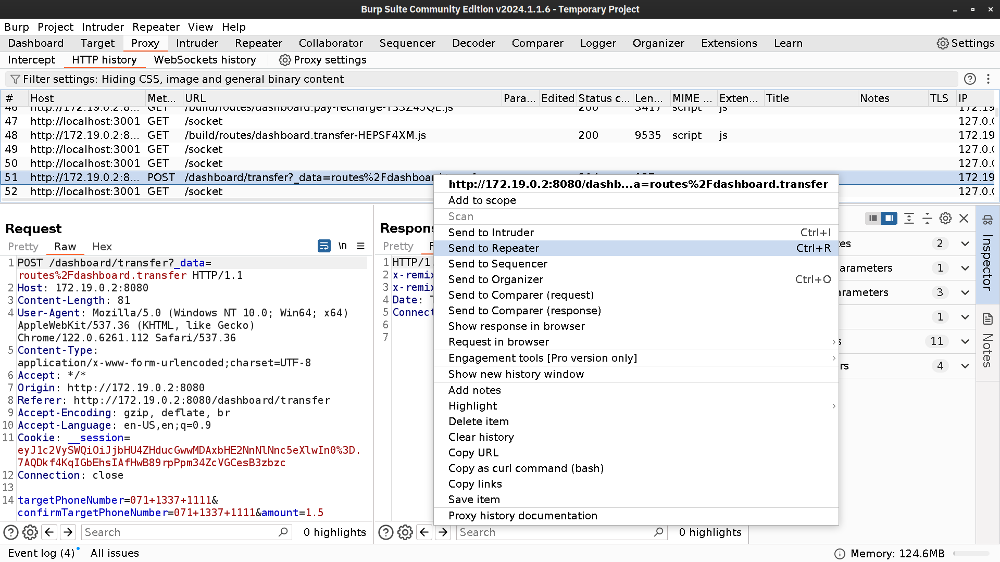
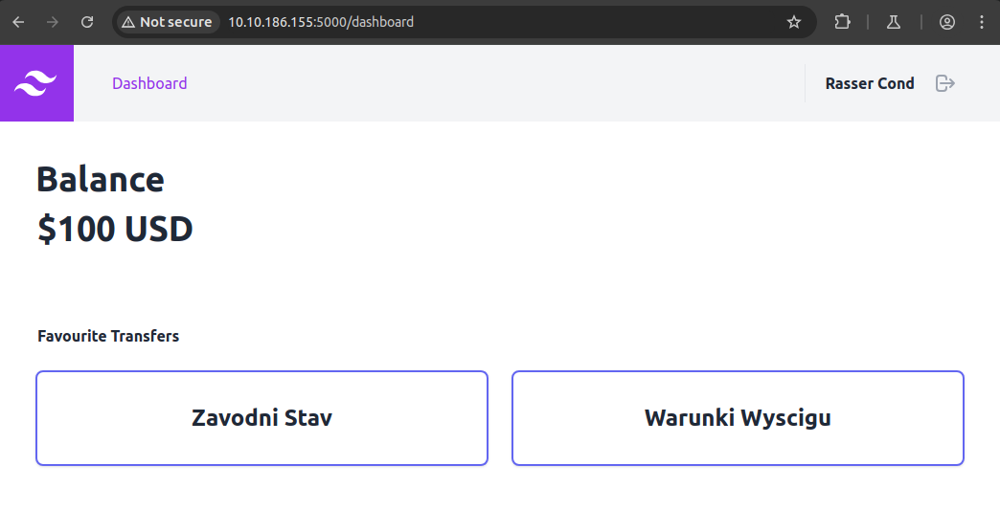

# Race Conditions

- [Room information](#room-information)
- [Solution](#solution)
- [References](#references)

## Room information

```text
Type: Walkthrough
Difficulty: Medium
Tags: <None>
Subscription type: Premium
Description:
Learn about race conditions and how they affect web application security.
```

Room link: [https://tryhackme.com/room/raceconditionsattacks](https://tryhackme.com/room/raceconditionsattacks)

## Solution

### Task 1: Introduction

Let’s say we are tasked with testing the security of an online shopping web application. Many questions pop up. Can we reuse a single $10 gift card to pay for a $100 item? Can we apply the same discount to our shopping cart multiple times? The answer is maybe! If the system is susceptible to a race condition vulnerability, we can do all this and more.

This room introduces the race conditions vulnerability. A race condition is a situation in computer programs where the timing of events influences the behaviour and outcome of the program. It typically happens when a variable gets accessed and modified by multiple threads. Due to a lack of proper lock mechanisms and synchronization between the different threads, an attacker might abuse the system and apply a discount multiple times or make money transactions beyond their balance.

#### Learning Objectives

After completing this room, you will learn about the following:

- Race conditions vulnerability
- Using Burp Suite Repeater to exploit race conditions

Along the way, you will also learn about:

- Threads and multi-threading
- State diagrams

#### Learning Prerequisites

To follow this room, we recommend familiarity with the HTTP protocol, web applications, and Burp Suite. The following rooms and modules are recommended to fill any knowledge gaps.

- [How the Web Works](https://tryhackme.com/module/how-the-web-works)
- [Packets and Frames](https://tryhackme.com/room/packetsframes)
- [Burp Suite: The Basics](https://tryhackme.com/r/room/burpsuitebasics)

### Task 2: Multi-Threading

In this task, we will provide a quick overview of the following terms:

- Program
- Process
- Thread
- Multi-threading

#### Programs

A **program** is a set of instructions to achieve a specific task. You need to execute the program to accomplish what you want. Unless you execute it, it won’t do anything and remains a set of static instructions.

Think of it as a recipe; you just downloaded a new coffee recipe that includes a variety of herbs, such as cardamom and cinnamon. These are the instructions:

```text
1. Combine brewed coffee, cardamom, cinnamon, and cloves (if using) in a saucepan.
2. Heat the mixture over low heat for 5 minutes, stirring occasionally. Do not boil.
3. Strain the coffee into your mug.
4. Add milk if desired, and sweeten to taste with honey or sugar.
```

Unless someone carries out the above instructions, no coffee will be served!

Compare this to our minimal Flask (Python) “Hello, World!” server. The code below dictates that the app will listen on port 8080 and respond with a minimal greeting HTML page that contains “Hello, World!” However, we must run these instructions (program) before we expect to get any greeting pages.

*Please note that the Flask code below is shown for demonstrative purposes only. We didn’t provide an environment to run it as it is outside the scope of this room.*

```python
# Import the Flask class from the flask module
from flask import Flask

# Create an instance of the Flask class representing the application
app = Flask(__name__)

# Define a route for the root URL ('/')
@app.route('/')
def hello_world():
    # This function will be executed when the root URL is accessed
    # It returns a string containing HTML code for a simple web page
    return '<html><head><title>Greeting</title></head><body><h1>Hello, World!</h1></body></html>'

# This checks if the script is being run directly (as the main program)
# and not being imported as a module
if __name__ == '__main__':
    # Run the Flask application
    # The host='0.0.0.0' allows the server to be accessible from any IP address
    # The port=8080 specifies the port number on which the server will listen
    app.run(host='0.0.0.0', port=8080)
```

#### Processes

One afternoon, you decide to try out this new coffee recipe you downloaded online. You start going through the recipe one step at a time. You are in the process of making this coffee recipe. While in the “process” of “executing” the “instructions,” you might get interrupted by an urgent call. Or you might work on another “job” while waiting for the water to heat. Interruptions and waiting are generally unavoidable. The act of carrying out the recipe instructions to make coffee is similar to the process of executing program instructions.

A **process** is a program in execution. In some literature, you might come across the term **job**. Both terms refer to the same thing, although the term process has superseded the term job. Unlike a program, which is static, a process is a dynamic entity. It holds several key aspects, in particular:

- **Program**: The executable code related to the process
- **Memory**: Temporary data storage
- **State**: A process usually hops between different states. After it is in the New state, i.e., just created, it moves to the Ready state, i.e., ready to run once given CPU time. Once the CPU allocates time for it, it goes to the Running state. Furthermore, it can be in the Waiting state pending I/O or event completion. Once it exits, it moves to the Terminated state.


If you run the Flask code above, a process will be created, and it will listen for incoming connections at port 8080. In other words, it will spend most of its time in the Waiting state. When it receives an HTTP `GET /` request, it will switch to the Ready state, waiting for its turn to run based on the CPU scheduling. Once in the Running state, it sends the HTML page to the client and returns to the Waiting state.

From the server’s perspective, the app is servicing clients sequentially, i.e., client requests are processed one at a time. (Note that Flask is multi-threaded by default since version 1.0. We used the argument `--without-threads` to force it to run single-threaded.)

*Please note that the Flask command shown below is for demonstrative purposes only.*

```bash
$ flask run --without-threads --host=0.0.0.0
 * Debug mode: off
WARNING: This is a development server. Do not use it in a production deployment. Use a production WSGI server instead.
 * Running on all addresses (0.0.0.0)
 * Running on http://127.0.0.1:5000
 * Running on http://192.168.0.104:5000
Press CTRL+C to quit
127.0.0.1 - - [16/Apr/2024 23:34:46] "GET / HTTP/1.1" 200 -
127.0.0.1 - - [16/Apr/2024 23:34:48] "GET / HTTP/1.1" 200 -
127.0.0.1 - - [16/Apr/2024 23:35:11] "GET / HTTP/1.1" 200 -
```

#### Threads

Let’s wrap up with another coffee analogy! Consider the case of a commercial espresso machine in a coffee shop. Let’s say it has two portafilters. At the start of the work day, the barista turns on the espresso machine, and whenever a customer orders an espresso, one portafilter is used to prepare an espresso shot for them. Does another customer order an espresso? No problem, the second portafilter to the rescue! The warmed-up espresso machine is the process; each new order is assigned a portafilter; that’s the analogy for the thread.

A **thread** is a lightweight unit of execution. It shares various memory parts and instructions with the process.

In many cases, we need to replicate the same process repeatedly. Think of a web server serving thousands of users the same page (or a personalized page). We can adopt one of two main approaches:

- **Serial**: One process is running; it serves one user after the other sequentially. New users are enqueued.
- **Parallel**: One process is running; it creates a thread to serve every new user. New users are only enqueued after the maximum number of running threads is reached.

The previous app can run with four threads using Gunicorn. Gunicorn, also called the “Green Unicorn”, is a **Python WSGI HTTP server**. WSGI stands for Web Server Gateway Interface, which bridges web servers and Python web applications. In particular, Gunicorn can spawn multiple worker processes to handle incoming requests simultaneously. By running `gunicorn` with the `--workers=4` option, we are specifying that we want four workers ready to tackle clients’ requests; moreover, `--threads=2` indicates that each worker process can spawn two threads.

*Please note that the Gunicorn command shown below is for demonstrative purposes only. We didn’t provide an environment to run it as it is outside the scope of this room.*

```bash
gunicorn --workers=4 --threads=2 -b 0.0.0.0:8080 app:app
[2024-04-16 23:35:59 +0300] [507149] [INFO] Starting gunicorn 21.2.0
[2024-04-16 23:35:59 +0300] [507149] [INFO] Listening at: http://0.0.0.0:8080 (507149)
[2024-04-16 23:35:59 +0300] [507149] [INFO] Using worker: gthread
[2024-04-16 23:35:59 +0300] [507150] [INFO] Booting worker with pid: 507150
[2024-04-16 23:35:59 +0300] [507151] [INFO] Booting worker with pid: 507151
[2024-04-16 23:35:59 +0300] [507152] [INFO] Booting worker with pid: 507152
[2024-04-16 23:35:59 +0300] [507153] [INFO] Booting worker with pid: 507153
```

It is worth noting the following:

- It is impossible to run more than one copy of this process as it binds itself to TCP port 8080. A TCP or UDP port can only be tied to one process.
- Process can be configured with any number of threads, and the HTTP requests arriving at port 8080 will be sent to the different threads.

---------------------------------------------------------------------------------------

#### You downloaded an instruction booklet on how to make an origami crane. What would this instruction booklet resemble in computer terms?

Answer: `program`

#### What is the name of the state where a process is waiting for an I/O event?

Answer: `Waiting`

### Task 3: Race Conditions

#### Real World Analogy

Picture the following situation. You call a restaurant to reserve a table for a crucial business lunch. You are familiar with the restaurant and its setup. One particular table, number 17, is your preferred choice, considering it has a nice view and is relatively isolated. You call to make a reservation for Table 17; the host confirms it is free as no “Reserved” tag is placed on it. At the same time, another customer is talking with another host and making a reservation for the same table.

Who really reserved the table? That’s a race condition.

Why did this happen? This unlucky situation happened because more than one host was taking reservations; furthermore, it took the host a few minutes to fetch the “Reserved” tag and put it on the table after updating the daily reservation book. There is at least a one-minute window for another client to reserve a reserved table.

Similarly, when one thread checks a value to perform an action, another thread might change that value before the action takes place.

#### Example A

Let’s consider this scenario:

- A bank account has $100.
- Two threads try to withdraw money at the same time.
- Thread 1 checks the balance (sees $100) and withdraws $45.
- **Before Thread 1 updates the balance**, Thread 2 also checks the balance (incorrectly sees $100) and withdraws $35.

We cannot be 100% certain which thread will get to update the remaining balance first; however, let’s assume that it is Thread 1. Thread 1 will set the remaining balance to $55. Afterwards, Thread 2 might set the remaining balance to $65 if not appropriately handled. (Thread 2 calculated that $65 should remain in the account after the withdrawal because the balance was $100 when Thread 2 checked it.) In other words, the user made two withdrawals, but the account balance was deducted only for the second one because Thread 2 said so!

#### Example B

Let’s consider another scenario:

- A bank account has $75.
- Two threads try to withdraw money at the same time.
- Thread 1 checks the balance (sees $75) and withdraws $50.
- **Before Thread 1 updates the balance**, Thread 2 checks the balance (incorrectly sees $75) and withdraws $50.

Thread 2 will proceed with the withdrawal, although such a transaction should have been declined.

Examples A and B demonstrate a Time-of-Check to Time-of-Use (TOCTOU) vulnerability.

#### Example Code

Consider the following Python code with two threads simulating a task completion by 10% increments.

```python
import threading

x = 0  # Shared variable

def increase_by_10():
    global x
    for i in range(1, 11):
        x += 1
        print(f"Thread {threading.current_thread().name}: {i}0% complete, x = {x}")

# Create two threads
thread1 = threading.Thread(target=increase_by_10, name="Thread-1")
thread2 = threading.Thread(target=increase_by_10, name="Thread-2")

# Start the threads
thread1.start()
thread2.start()

# Wait for both threads to finish
thread1.join()
thread2.join()

print("Both threads have finished completely.")
```

These two threads start together; they do nothing except print a value on the screen. Consequently, one would expect them to finish simultaneously, or at least the result to be consistent. However, in the program above, there is no guarantee which thread will finish first and how early it will be. Below is the first execution output:

```bash
python t3_race_to_100.py
...
Thread Thread-1: 40% complete, x = 10
Thread Thread-2: 70% complete, x = 11
Thread Thread-1: 50% complete, x = 12
Thread Thread-2: 80% complete, x = 13
Thread Thread-1: 60% complete, x = 14
Thread Thread-1: 70% complete, x = 16
Thread Thread-2: 90% complete, x = 15
Thread Thread-2: 100% complete, x = 17
Thread Thread-1: 80% complete, x = 18
Thread Thread-1: 90% complete, x = 19
Thread Thread-1: 100% complete, x = 20
Both threads have finished completely.
```

Below is a second execution output:

```bash
python t3_race_to_100.py 
...
Thread Thread-1: 70% complete, x = 10
Thread Thread-2: 40% complete, x = 11
Thread Thread-1: 80% complete, x = 12
Thread Thread-2: 50% complete, x = 13
Thread Thread-1: 90% complete, x = 14
Thread Thread-2: 60% complete, x = 15
Thread Thread-1: 100% complete, x = 16
Thread Thread-2: 70% complete, x = 17
Thread Thread-2: 80% complete, x = 18
Thread Thread-2: 90% complete, x = 19
Thread Thread-2: 100% complete, x = 20
Both threads have finished completely.
```

Running this program multiple times will lead to different results. In the first attempt, Thread-2 reached 100 first; however, in the second attempt, Thread-2 reached 100 second. We have no control over the output. If the security of our application relies on one thread finishing before the other, then we need to set mechanisms in place to ensure proper protection. Consider the following two examples to better understand the bugs’ gravity when we leave things to chance.

On the AttackBox, you can save the above Python code and run it multiple times to observe the outcome. For instance, if you saved it as `race.py`, you can run the script using the `python race.py` command.

#### Causes

As we saw in the last program, two threads were changing the same variable. Whenever the thread was given CPU time, it rushed to increase `x` by 1. Consequently, these two threads were “racing” to increment the same variable. This program shows a straightforward example happening on a single host.

Generally speaking, a common cause of race conditions lies in **shared resources**. For example, when multiple threads concurrently access and modify the same shared data. Examples of shared data are a database record and an in-memory data structure. There are many subtle causes, but we will mention three common ones:

- **Parallel Execution**: Web servers may execute multiple requests in parallel to handle concurrent user interactions. If these requests access and modify shared resources or application states without proper synchronization, it can lead to race conditions and unexpected behaviour.
- **Database Operations**: Concurrent database operations, such as read-modify-write sequences, can introduce race conditions. For example, two users attempting to update the same record simultaneously may result in inconsistent data or conflicts. The solution lies in enforcing proper locking mechanisms and transaction isolation.
- **Third-Party Libraries and Services**: Nowadays, web applications often integrate with third-party libraries, APIs, and other services. If these external components are not designed to handle concurrent access properly, race conditions may occur when multiple requests or operations interact with them simultaneously.

---------------------------------------------------------------------------------------

#### Does the presented Python script guarantee which thread will reach 100% first? (Yea/Nay)

Answer: `Nay`

#### In the second execution of the Python script, what is the name of the thread that reached 100% first?

Answer: `Thread-1`

### Task 4: Web Application Architecture

Let’s visit web application architecture to explain how race conditions are possible.

#### Client-Server Model

Web applications follow a client-server model:

- **Client**: The client is the program or application that initiates the request for a service. For example, when we browse a web page, our web browser requests the web page (file) from a web server.
- **Server**: The server is the program or system that provides these services in response to incoming requests. For instance, the web server responds to an incoming HTTP GET request and sends an HTML page (or file) to the requesting web browser (client).

Generally speaking, the client-server model runs over a network. The client sends its request over the network, and the server receives it and processes it before sending back the required resource.

#### Typical Web Application

A web application follows a multi-tier architecture. Such architecture separates the application logic into different layers or tiers. The most common design uses three tiers:

- **Presentation tier**: In web applications, this tier consists of the web browser on the client side. The web browser renders the HTML, CSS, and JavaScript code.
- **Application tier**: This tier contains the web application’s business logic and functionality. It receives client requests, processes them, and interacts with the data tier. It is implemented using server-side programming languages such as Node.js and PHP, among many others.
- **Data tier**: This tier is responsible for storing and manipulating the application data. Typical database operations include creating, updating, deleting, and searching existing records. It is usually achieved using a database management system (DBMS); examples of DBMS include MySQL and PostgreSQL.


#### States

Let’s visit some examples from business logic before diving deeper. We will consider the following examples:

- Validating and conducting money transfer
- Validating coupon codes and applying discounts

#### Validating and Conducting Money Transfer

Consider the example of transferring money to a friend or your other account. The program will progress as follows:

1. The user clicks on the “Confirm Transfer” button
2. The application queries the database to confirm that the account balance can cover the transfer amount
3. The database responds to the query

    - If the amount is within the account limits, the application conducts the transaction
    - If the amount is beyond the account limits, the application shows an error message


In an ideal scenario, the code above leads to two program states:

- Amount not sent
- Amount sent


#### Validating coupon codes and applying discounts

Let’s consider the example of applying a discount coupon. The user goes to their shopping cart and adds a coupon to get a discount. The steps might be something along the following lines:

1. The user enters a coupon code
2. The application queries the database to determine whether the coupon code is valid and whether any constraints exist
3. The database responds with validity and constraints

    - The discount is applied if the code is valid and there are no constraints on applying it for this user.
    - An error message is displayed if the code is invalid or there are constraints on applying it for this user.


The above code leads to a few program states:

- Coupon not applied
- Coupon applied


#### Two States? Think Again

Let’s continue our analysis of applying a discount coupon. Ideally, we expect two states: **Coupon not applied** and **Coupon applied**. However, this is too simplistic to depict real sophisticated scenarios. We can add an intermediary state: **Checking coupon applicability**.


Depending on how the application is developed, we can expect more states. For example, **Checking coupon applicability** might involve two states: **Checking coupon validity** and **Checking coupon constraints**. A coupon might be valid, but existing constraints prevent it from being applied. Similarly, **Coupon applied** might be divided into two states, one of which is **Recalculating total**.


Why is this important for race conditions?

In the state diagram above, we can see that we pass through multiple states before the coupon is marked as applied. Let’s draw the states on a time axis, as shown below.


There is a time window between the instant we try to add a coupon and the instant where the coupon is marked as applied and cannot be applied again. As long as the coupon is not marked as applied, most likely, no controls prevent it from being accepted repeatedly. We might be able to apply it multiple times during this time window.

This situation is similar when considering the states for the program making a money transfer. Although ideally speaking, it would be two states, considering the business logic, we can easily update the diagram to include three states. The reason is that we expect some time spent checking the account balance and limits; although this amount of time might be brief, it is not zero. If we dig deeper, we can uncover more “hidden” states.


However, even if the web application is vulnerable, we still have one challenge to overcome: timing. Even in vulnerable applications, this “window of opportunity” is relatively short; therefore, exploiting it necessitates that our requests reach the server simultaneously. In practice, we aim to get our repeated requests to reach the server only milliseconds apart.

How can we get our duplicated requests to reach the server within this short window? We need a tool such as Burp Suite.

---------------------------------------------------------------------------------------

#### How many states did the original state diagram of “validating and conducting money transfer” have?

Answer: `2`

#### How many states did the updated state diagram of “validating and conducting money transfer” have?

Answer: `3`

#### How many states did the final state diagram of “validating coupon codes and applying discounts” have?

Answer: `5`

### Task 5: Exploiting Race Conditions

Click on the **Start Machine** button on the right to start the attached VM. Click on the **Start AttackBox** button at the top to start the AttackBox.

On the AttackBox, browse to `http://10.10.185.235:8080`.

These are the credentials for two users:

- User1: `07799991337`
- Password: `pass1234`

And

- User2: `07113371111`
- Password: `pass1234`

This web application belongs to a mobile operator and allows phone credit transfer. In this demo, we will check if the system is susceptible to a race condition vulnerability and try to exploit it by transferring more credit than we have in our account.

First, we need to explore and study how the target web application receives HTTP requests and how it responds to them. Using Burp Suite **Proxy**, click Open browser under the **Intercept** tab. (If you get an error message about enabling the browser’s sandbox, you must manually change the settings. In this case, click **Settings** on the top right of your Burp Suite window, click on the **Burp’s browser** under **Tools**, and check **Allow Burp’s browser to run without a sandbox**.) Using the bundled browser, we can browse the target site and study how it processes our HTTP requests, notably the `POST` HTTP requests and related responses. The **HTTP history** tab logs every HTTP request and the respective response.

Log in to either of the accounts and click the **Pay & Recharge** button. Let’s make a credit transfer: enter the mobile number of the other account along with the amount you want to transfer and click the **Transfer** button. You can try to transfer an amount that exceeds your current balance and a small amount, such as $1, to see how the system responds in each case.

#### Burp Suite: Repeater

In the image below, we can see:

1. A `POST` request
2. The details show the target phone number and a transfer amount of $1.5
3. In the response, we can infer that the transaction is successful


Now that we have seen how the system reacts to valid and invalid requests, let’s see if we can exploit a race condition. Right-click on the `POST` request you want to duplicate and choose **Send to Repeater**.



In the **Repeater** tab, as shown in the numbered screenshots below:

1. Click on the `+` icon next to the received request tab and select **Create tab group**
2. Assign a group name, and include the tab of the request you just sent to the importer before clicking **Create**
3. Right-click on the request tab and choose **Duplicate tab** (If this option is not available in your version, you can press `CTRL + R` multiple times instead)
4. As a starting point, we will duplicate it **20** times
5. Next to the Send button, the arrow pointed downwards will bring a menu to decide how you want to send the duplicated requests


Next, we will exploit the target application by sending the duplicated request. Using the built-in options in Burp Suite Repeater, the drop-down arrow offers the following choices:

- Send group in sequence (**single connection**)
- Send group in sequence (**separate connections**)
- Send group in parallel

#### Sending Request Group in Sequence

Sending the group in sequence provides two options:

- Send group in sequence (**single** connection)
- Send group in sequence (**separate** connections)

**Send Group in Sequence over a Single Connection**

This option establishes a single connection to the server and sends all the requests in the group’s tabs before closing the connection. This can be useful for testing for potential client-side desync vulnerabilities.

**Send Group in Sequence over Separate Connections**

As the name suggests, this option establishes a TCP connection, sends a request from the group, and closes the TCP connection before repeating the process for the subsequent request.

We tested this option to attack the web application. The screenshot below shows 21 TCP connections for the different POST requests in the group we sent.

- The first group (labelled 1) comprises five successful requests. We could confirm that they were successful by checking the respective responses. Furthermore, we noticed that each took around 3 seconds, as indicated by the duration (labelled 3).
- The second group (labelled 2) shows sixteen denied requests. The duration was around four milliseconds. It is interesting to check the Relative Start time as well.


The screenshot below shows the whole TCP connection for a request. We can confirm that the POST request was sent in a single packet.


#### Send Request Group in Parallel

Choosing to send the group’s requests in parallel would trigger the Repeater to send all the requests in the group at once. In this case, we notice the following, as shown in the screenshot below:

- In the Relative Start column, we notice that all 21 packets were sent within a window of 0.5 milliseconds (labelled 1).
- All 21 requests were successful; they resulted in a successful credit transfer. Each request took around 3.2 seconds to complete (labelled 2).


By paying close attention to the screenshot above, we notice that each request led to 12 packets; however, in the previous attempt (send in sequence), we see that each request required only 10 packets. Why did this happen?

According to [Sending Grouped HTTP Requests](https://portswigger.net/burp/documentation/desktop/tools/repeater/send-group) documentation, when sending in parallel, Repeater implements different techniques to synchronize the requests’ arrival at the target, i.e., they arrive within a short time frame. The synchronization technique depends on the HTTP protocol being used:

- In the case of HTTP/2+, the Repeater tries to send the whole group in a single packet. In other words, a single TCP packet would carry multiple requests.
- In the case of HTTP/1, the Repeater resorts to last-byte synchronization. This trick is achieved by withholding the last byte from each request. Only once all packets are sent without the last-byte are the last-byte of all the requests sent. The screenshot below shows our `POST` request sent over two packets.


---------------------------------------------------------------------------------------

#### You need to get either of the accounts to get more than $100 of credit to get the flag. What is the flag that you obtained?

Specify the amount as `5` in all tabs and Send group (parallel).

Login as the receiver account to get the flag.

Answer: `THM{<REDACTED>}`

### Task 6: Detection and Mitigation

#### Detection

Detecting race conditions from the business owner’s perspective can be challenging. If a few users redeemed the same gift card multiple times, it would most likely go unnoticed unless the logs are actively checked for certain behaviours. Considering that race conditions can be used to exploit even more subtle vulnerabilities, it is clear that we need the help of penetration testers and bug bounty hunters to try to discover such vulnerabilities and report their findings.

Penetration testers must understand how the system behaves under normal conditions when enforced controls are enforced. The controls can be: use once, vote once, rate once, limit to balance, and limit to one every 5 minutes, among others. The next step would be to try to circumvent this limit by exploiting race conditions. Figuring out the different system’s states can help us make educated guesses about time windows where a race condition can be exploited. Tools such as Burp Suite Repeater can be a great starting point.

#### Mitigation

We will list a few mitigation techniques.

- **Synchronization Mechanisms**: Modern programming languages provide synchronization mechanisms like locks. Only one thread can acquire the lock at a time, preventing others from accessing the shared resource until it’s released.
- **Atomic Operations**: Atomic operations refer to indivisible execution units, a set of instructions grouped together and executed without interruption. This approach guarantees that an operation can finish without being interrupted by another thread.
- **Database Transactions**: Transactions group multiple database operations into one unit. Consequently, all operations within the transaction either succeed as a group or fail as a group. This approach ensures data consistency and prevents race conditions from multiple processes modifying the database concurrently.

### Task 7: Challenge Web App

This room introduced race conditions and various situations leading to such vulnerabilities. System complexity and geographical spread can lead to diverse unforeseen situations, including vulnerabilities related to race conditions. To discover and exploit such conditions, it is vital that we first observe how the system behaves under normal conditions and then try to find out how it behaves when we try to exploit the timing. With the currently available tools, we have plenty of techniques to try.

#### Challenge

Following what you have learned, it is time to attempt discovering and exploiting a race condition without guidance.

Click on the **Start Machine** button on the right to start the attached VM. Click on the **Start AttackBox** button at the top to start the AttackBox if you haven’t done that already.

On the AttackBox, browse to `http://10.10.186.155:5000`.

These are the credentials for the three users:

Name: Rasser Cond

- Username: 4621
- Password: blueApple

Name: Zavodni Stav

- Username: 6282
- Password: whiteHorse

Name: Warunki Wyscigu

- Username: 9317
- Password: greenOrange

This web application belongs to a bank and allows clients to transfer online money. You need to get one of the accounts to amass more than **$1000**.

---------------------------------------------------------------------------------------

#### What flag did you obtain after getting an account’s balance above $1000?

Browse to `http://10.10.186.155:5000` and login as `Rasser Cond`.



Click on the `Zavodni Stav` button to start transfer money. Send **50** USD.

Send the `POST` request to Repeater in Burp. Then create a tab group and duplicate the tab `30` times as above.

Select `Send group (parallel)` and send the requests.

Login as `Zavodni Stav` instead and check your balance, which was **385 USD**.

Click on the `Warunki Wyscigu` button to start transfer money. Send **175** USD this time.

Send the new `POST` request to Repeater in Burp and repeate the tab grouping, duplication and sending again.

Finally, login as `Warunki Wyscigu` to get the flag.

Answer: `THM{<REDACTED>}`

For additional information, please see the references below.

## References

- [Burp suite - Documentation](https://portswigger.net/burp/documentation)
- [Burp suite - Homepage](https://portswigger.net/burp)
- [Flask (web framework) - Wikipedia](https://en.wikipedia.org/wiki/Flask_(web_framework))
- [Gunicorn - Wikipedia](https://en.wikipedia.org/wiki/Gunicorn)
- [Multithreading (computer architecture) - Wikipedia](https://en.wikipedia.org/wiki/Multithreading_(computer_architecture))
- [Python (programming language) - Wikipedia](https://en.wikipedia.org/wiki/Python_(programming_language))
- [Race condition - Wikipedia](https://en.wikipedia.org/wiki/Race_condition)
- [Repeater - Burp Documentation](https://portswigger.net/burp/documentation/desktop/tools/repeater)
- [Time-of-check to time-of-use - Wikipedia](https://en.wikipedia.org/wiki/Time-of-check_to_time-of-use)
