# Splunk: Exploring SPL

- [Room information](#room-information)
- [Solution](#solution)
- [References](#references)

## Room information

```text
Type: Walkthrough
Difficulty: Medium
Tags: Windows
Meta Tags: Walkthrough, Walk-through, Write-up, Writeup
Subscription type: Free
Description:
Learn and explore the Splunk's Search Processing Language.
```

Room link: [https://tryhackme.com/room/splunkexploringspl](https://tryhackme.com/room/splunkexploringspl)

## Solution

### Task 1 - Introduction

Splunk is a powerful Security Information and Event Management (SIEM) platform that allows analysts to search, visualize, and investigate log data. Its **Search Processing Language** (SPL) is the key to turning large volumes of data into practical results. In this room, you will explore SPL, learning how to build, filter, and transform search queries to extract meaningful information.

#### Learning Objectives

- Understand how SPL processes and filters log data
- Chain and apply SPL commands effectively
- Visualize log data with charts and statistics
- Apply your SPL skills to use anomaly detection

#### Prerequisites

- Complete [Introduction to SIEM](https://tryhackme.com/room/introtosiem) for an overview of SIEM usage for log analysis
- Cover [Splunk: Basics](https://tryhackme.com/room/splunk101) to get comfortable navigating the Splunk interface

#### Machine Access

Click the **Start Machine** button below to start the lab. Please give Splunk five minutes to start and access the dashboard with this link:

- [https://10-112-132-195.reverse-proxy.cell-prod-eu-central-1a.vm.tryhackme.com](https://10-112-132-195.reverse-proxy.cell-prod-eu-central-1a.vm.tryhackme.com)

---------------------------------------------------------------------------------------

### Task 2 - Search & Reporting

Splunk's **Search & Reporting** App is the default interface used for searching and analyzing data on the Splunk home page. It has various functionalities that assist analysts in improving the search experience.

Upon accessing the app, we discover several key functionalities.

1. **Search Head**: Where analysts put the queies to filter or aggregate log data
2. **Time Picker**: Provides multiple options to select the timeframe of your search
3. **Search History**: Saves Splunk's search queries that have previously been used
4. **Data Summary**: Provides a summary of the hosts, sources, and sourcetypes available

Take a look through the search history in your Splunk instance and begin by answering the first question.

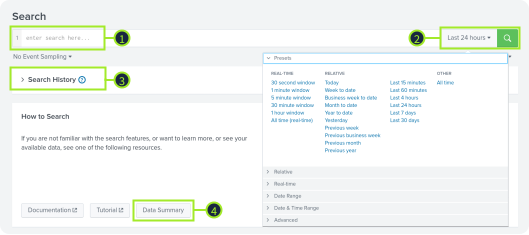

#### Your First Search

In this room, we will be working with the `windowslogs` index, where index is like a Splunk database or container for organizing the data. You can proceed by submitting your first query using the search function and setting the time range to `All time`.

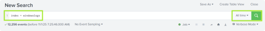

**Note**: Both `index=windowslogs` and `index = windowslogs` are valid syntax in Splunk.

#### Fields Sidebar

The Field Sidebar can be found on the left panel of Splunk search. This sidebar features two sections: one displays selected fields, and the other highlights interesting fields. It also provides quick results, including top values and raw values for each field.

1. **Selected Fields**: The default extracted fields. You can select other fields by clicking them and toggling `Selected`
2. **Interesting Fields**: Pulls all the interesting fields it finds and displays them in the left panel to further explore
3. **Numeric Fields `#`**: This symbol represents fields that contain numerical values
4. **Alpha-numeric Fields `α`**: The alpha symbol represents fields that contain strings (text values)
5. **Count**: The number of events containing the listed field
6. **More available fields**: If more fields are available, they can be accessed and selected here

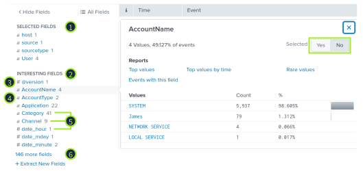

---------------------------------------------------------------------------------------

#### How many total events do you see?

Submit your first query for All Time: `index=windowslogs`.

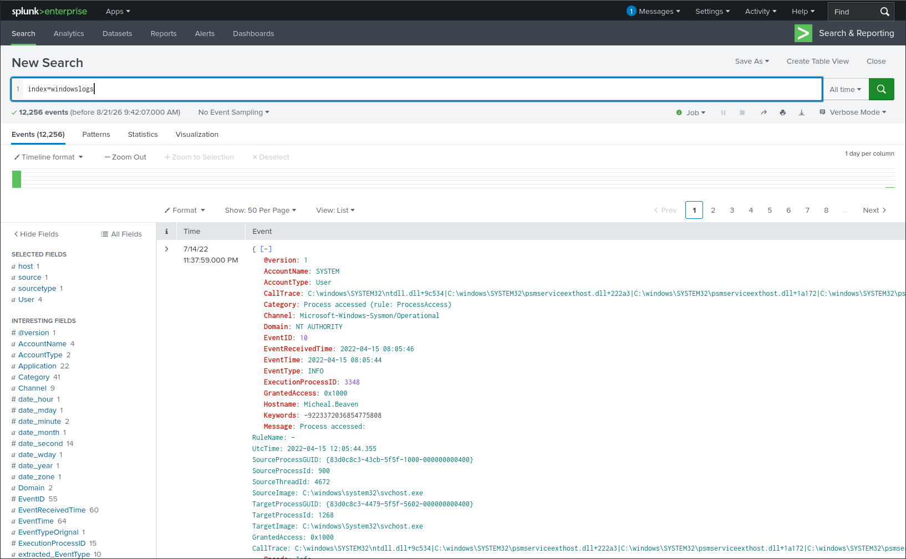

Answer: `12256`

After you submit your first query, look in the Fields sidebar.

#### Which SourceIP has recorded the most amount of events?

Hint: Look for the SourceIp field in the More Fields option.

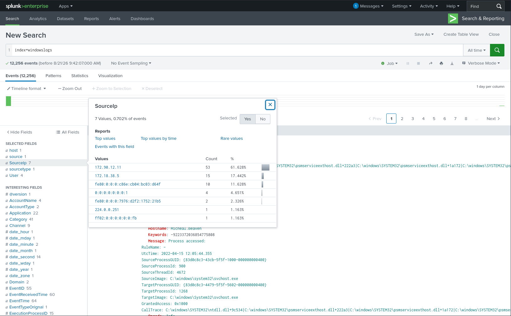

Answer: `172.90.12.11`

#### How many events appear on 04/15/2022 from 08:05 AM to 08:06 AM?

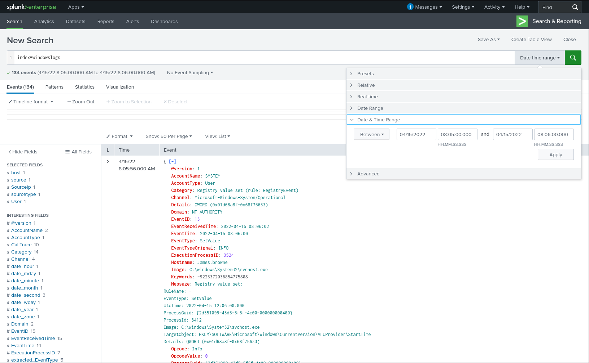

Answer: `134`

---------------------------------------------------------------------------------------

### Task 3 - Search Operators

Splunk's **Search Processing Language** (SPL) is behind every search in Splunk. It combines commands, functions, and operators that allow you to filter, transform, and analyze data from your ingested logs. In essence, SPL lets you search through massive amounts of data, apply filters to narrow down results, and format the output. Let's see how to use SPL.

#### Free Text Search

The simplest way to use SPL is to use free-text search, such as in the query below:

```text
index=windowslogs alice
```

The query will search for all events containing the **alice** keyword (case-insensitive). If you don't know the field names or just want to run a quick hunt for a unique keyword, free-text searches are your best choice. However, to run more complex searches, you'd need to use search operators and work with parsed **fields** and their **values**.

#### Search Operators

Splunk [operators](https://help.splunk.com/en/splunk-enterprise/search/search-manual/10.0/expressions-and-predicates/predicate-expressions) are the building blocks used to construct any search query. These operators are used to filter, remove, and refine your search results based on the specified criteria. Below, we will cover relational, logical, and wildcard operators. Note that for the filters to work, the events must be parsed into fields - the next rooms will explain the process in more detail.

**Relational Operators**:

These operators are used to compare two expressions. They determine the relationship between the expressions, such as whether one is equal to, not equal to, greater than, or less than the other. Let's check out some examples below.

|Operator|Example|Explanation|
|----|----|----|
|Equals `=`|`UserName=Mark`|Search for all events in which the field name `UserName` is equal to `Mark`|
|Not Equal To `!=`|`UserName!=Mark`|Search for all events in which the field name `UserName` is not equal to `Mark`|
|Less Than `<`|`Age<10`|The field `Age` has a value of less than `10`|
|Less Than or Equal To `<=`|`Age<=10`|The field `Age` has a value of less than or equal to `10`|
|Greater Than `>`|`Outbound_Traffic>50`|The `Outbound_Traffic` field value is greater than `50`|
|Greater Than or Equal To `>=`|`Outbound_Traffic>=50`|The `Outbound_Traffic` field value is greater than or equal to `50`|

Let's get hands-on and use the **!=** relational operator to locate all event logs in our index where the field **AccountName** is not equal to **System**. Start with the query below and don't forget to set your time range back to **All time**!

```text
index=windowslogs AccountName!=SYSTEM
```

In the screenshot below and in your Splunk instance, you can see that we have successfully filtered for all events that do not include the **AccountName** field value of **SYSTEM**.

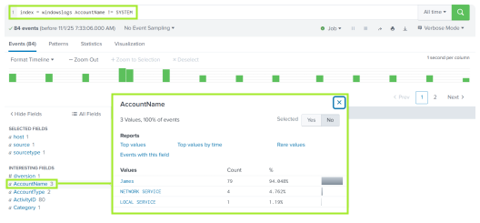

**Logical Operators**:

Splunk supports the following logical operators, which can be used to connect or modify conditions and operate on Boolean values (true/false).

|Operator|Example|Explanation|
|----|----|----|
|`NOT`|`NOT UserName=*`|Returns events where `UserName` field does not exist. Don't confuse it with `!=` operator|
|`AND`|`UserName=David AND IPAddress=10.10.10.10`|Returns all events in which the `UserName` field is equal to `David` and the `IPAddress` field is equal to `10.10.10.10`|
|`OR`|`UserName=David OR UserName=John`|Returns all events in which the `UserName` field is equal to `David` or `John`|
|`IN`|`UserName IN(David, John)`|A more convenient alternative to the `OR` keyword, especially for long lists.|

Let's get some more practice by appending the previous query to search for events that have the **AccountName** field **James**. With this query, you are telling Splunk to filter out the **SYSTEM** account name, and from the results, only see events from the account name **James**:

```text
// AND operator is implied, so both queries are valid
index=windowslogs AccountName!=SYSTEM AND AccountName=James
index=windowslogs AccountName!=SYSTEM AccountName=James
```

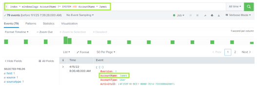

**Wildcards and CIDR Search**:

Splunk supports the use of wildcards and CIDR search for IP addresses to search for a partial or IP subnet match. For example:

|Symbol|Example|Explanation|
|----|----|----|
|`*`|`status=*fail*`|This will return all events that have `status` field set to `failed`, `failure`, `appfail`, etc.|
|`*`|`DestinationIp=172.*`|This will return all events that contain values like `DestinationIp=172.90.0.0.1` or `DestinationIp=172.18.5.22`|
|`N/A`|`DestinationIp=172.18.0.0/16`|This will return all events where `DestinationIp` field is within the `172.18.0.0/16` subnet|

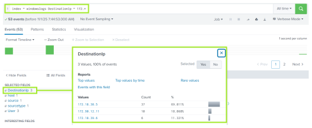

#### Order of Evaluation

**Quotes**:

In Splunk, quotation marks `""` are used to define exact phrases or strings. You can wrap text in quotes, and Splunk will treat it as a single value. Quotes can also be used to escape search operators. For example:

- `index=windowslogs failed login`: Search for events with **failed** and **login** keywords, in any order
- `index=windowslogs "failed login"`: Search for the exact phrase "**failed login**", word order matters
- `index=windowslogs "TO BE OR NOT TO BE"`: Search for the exact phrase containing **NOT** and **OR**

**Parentheses**:

You can utilize parentheses in Splunk to help group conditions together and control how the search is applied. Since **OR** operator takes precedence over **AND**, parentheses can help set the correct order of conditions. For example, imagine you want to search for events containing **alice** and **bob** together, or **charlie** alone:

|Your Search|How Splunk Evaluates It|
|----|----|
|`index=windowslogs alice AND bob OR charlie`<BR>(Implicit search, no parentheses)|`index=windowslogs alice AND (bob OR charlie)`<BR>(Mistake! Splunk evaluated OR before AND)|
|`index=windowslogs (alice AND bob) OR charlie`<BR>(Explicit search with parentheses)|`index=windowslogs (alice AND bob) OR charlie`<BR>(Correct! The results match your requirements)|

---------------------------------------------------------------------------------------

#### How many events in the windowslogs index have an EventID field value equal to 4624?

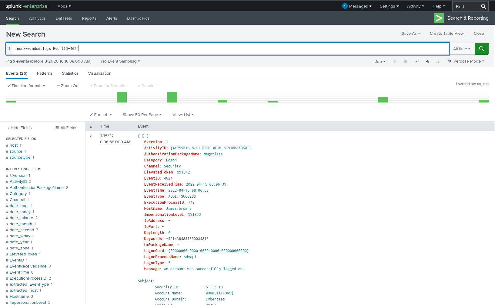

Answer: `26`

#### How many events are observed with the DestinationIp = 172.18.39.6 and DestinationPort = 135?

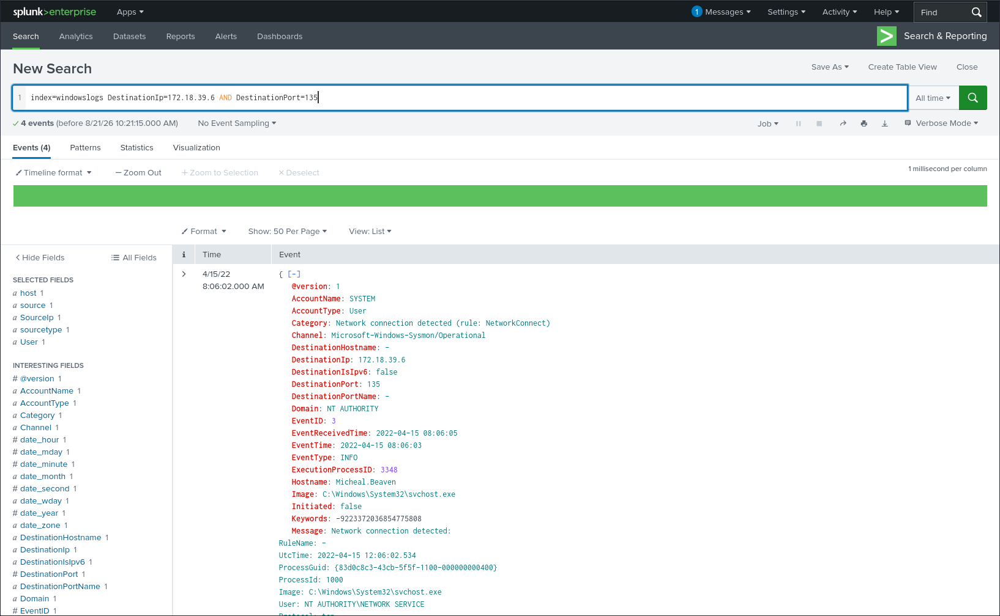

Answer: `4`

#### Use the query `index=windowslogs Hostname=Salena.Adam DestinationIp=172.18.38.5`. Which SourceIp returns the highest count?

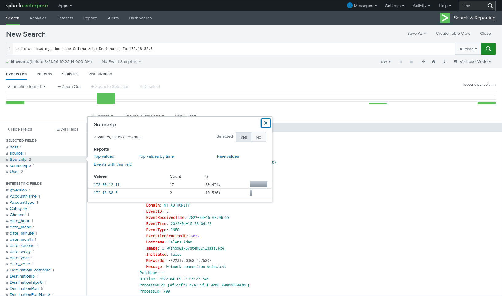

Answer: `172.90.12.11`

#### How many events are returned when you search the term `cyber*`?

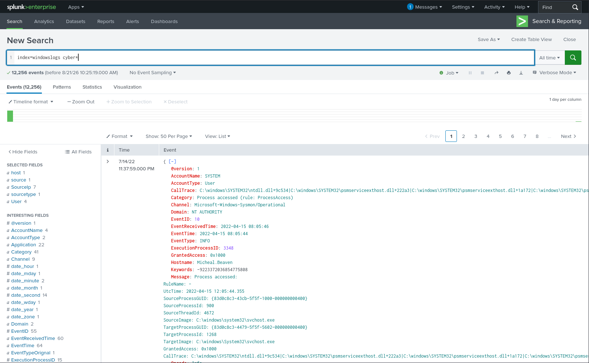

Answer: `12256`

#### Which operator is given the lowest priority in Splunk searches?

Answer: `AND`

---------------------------------------------------------------------------------------

### Task 4 - Filtering Results

Your network may generate thousands of logs every minute, all of which are ingested into your SIEM solution. Searching for anomalies without filters can quickly become overwhelming. Splunk’s Search Processing Language (SPL) enables analysts to apply filters using search commands to narrow down search results and focus only on the most relevant events.

In Splunk, commands are linked together using a pipe symbol `|`. Each pipe passes the output of one command into the next, allowing you to refine your results step by step. Let’s look at some useful commands that help filter and organize search results.

#### Useful Filtering Commands

**Fields**:

The [fields](https://help.splunk.com/en/splunk-enterprise/spl-search-reference/9.0/search-commands/fields) command is used to include or exclude specific fields from your search results. To exclude a field, use a minus sign `-` before the field name. The plus sign `+` can be used to include a field explicitly, but it isn’t required. By default, `fields` includes any fields listed after the command. Let’s try it out in our Splunk instance by highlighting the following fields. This makes it easy to see how useful the `fields` command can be when working with logs that contain hundreds of available fields.

```text
index=windowslogs | fields host User SourceIp
```

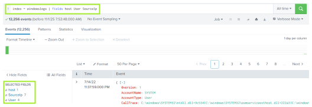

**Dedup**:

The [dedup](https://help.splunk.com/en/splunk-enterprise/spl-search-reference/9.0/search-commands/dedup) command removes duplicate values from your search results. For example, if our logs contain seven distinct IP addresses in the `SourceIp` field, the results will return seven events, one for each unique IP. The command is useful for subsearches and for cleaning identical events (e.g., Microsoft 365 often sends 50 events for a single activity).

```text
index=windowslogs
| fields EventID User Image Hostname SourceIp
| dedup SourceIp
```

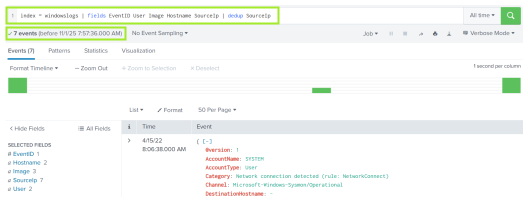

**Rename**:

The [rename](https://help.splunk.com/en/splunk-enterprise/spl-search-reference/9.0/search-commands/rename) command allows you to change the name of a field in your search results. This can help improve the readability of your search results, especially if the original fields are too long or not suitable for showing them in the screenshots in formal SOC reports.

```text
index = windowslogs
| fields EventID User Image Hostname SourceIp
| rename User as Employee
```

The command is also useful to flatten JSON or XML subfields. For example, for a JSON log entry like `{"request": {"path": "/admin", "ip": "10.0.0.2"}}`, Splunk will create two fields: `request.path` and `request.ip`. If you don't want to type the prefix every time, consider removing it like in the example below:

```text
index=jsondata
| rename request.* as * // request.path -> path; request.ip -> ip
```

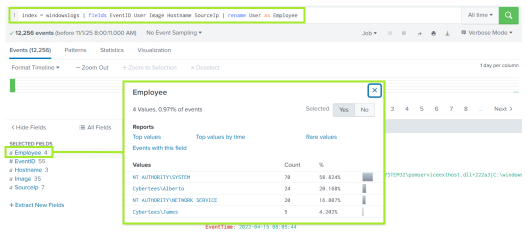

**Regex**:

The [regex](https://help.splunk.com/en/splunk-enterprise/spl-search-reference/9.0/search-commands/regex) command allows you to filter search results using regular expressions, which match specific text patterns in field values. This is useful when you need to find events that follow a specific format rather than an exact keyword. Splunk regular expressions are PCRE (Perl Compatible Regular Expressions) and use the PCRE C library.

```text
index = windowslogs | regex Image = "\.exe$"
```

The query above applies a regular expression to the `Image` field, returning only events where the field value ends with `.exe`. The `$` symbol specifies that the match must occur at the end of the string. That was the simplest example, but regex is irreplaceable for complex searches, especially on custom or poorly-parsed data sources.

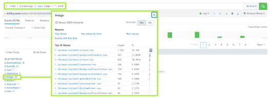

---------------------------------------------------------------------------------------

#### Use the `fields` command to highlight `Domain`, `SourceProcessId`, and `TargetProcessId`. Which `SourceProcessId` has the highest value?

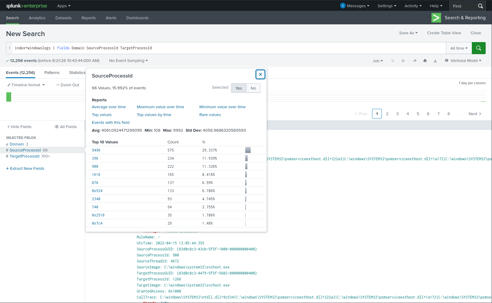

Answer: `9496`

#### Try out this query `index=windowslogs | regex TargetObject="Manager$"`. Which `TargetObject` field value contains the highest number of results?

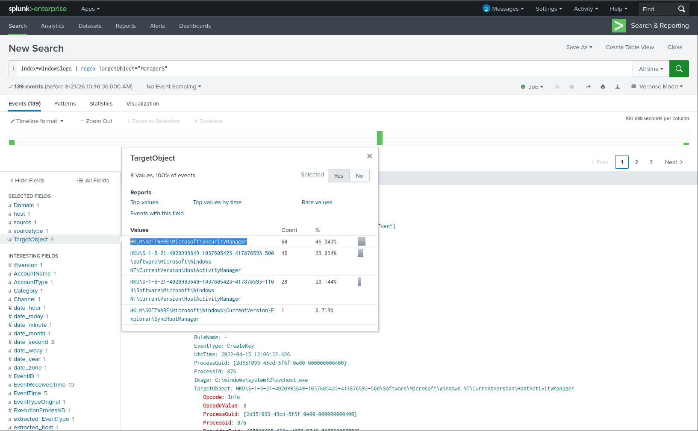

Answer: `HKLM\SOFTWARE\Microsoft\SecurityManager`

---------------------------------------------------------------------------------------

### Task 5 - Structuring Results

The Search Processing Language (SPL) provides further commands that help organize and structure your search results. When working with log data, raw search results can be overwhelming, and some events may contain fields that may not be relevant to your investigation. SPL commands enable you to filter, order, and format these results, allowing you to focus on the most important information.

#### Table Command

The [table](https://help.splunk.com/en/splunk-enterprise/spl-search-reference/9.0/search-commands/table) command allows you to select only the fields you are interested in viewing and displays them in a clean, readable format. This is especially useful when building timelines, investigating specific hosts or users, or comparing multiple fields. This query will create a table out of named fields and organize them by timestamp. Use the `table` command to answer the first question.

```text
index=windowslogs | table _time EventID Hostname SourceName
```

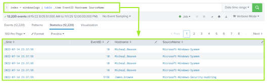

#### Useful Structuring Commands

Other commands can be used alone or combined with `table` to hone in on the data you're really interested in. Let's look at some examples in the table below.

|Command|Example|Explanation|
|----|----|----|
|`head`|`index=windowslogs \| head 20`|Returns the first (newest) 20 events. Useful to speed up the search if you don't need complete results|
|`tail`|`index=windowslogs \| tail 20`|Returns the last (oldest) 10 events. Useful to speed up the search if you don't need complete results|
|`sort`|`index=windowslogs \| sort User`|This will sort the logs in alphabetical order based on the field `User`|
|`reverse`|`index=windowslogs \| reverse`|This command reverses the order of events (descending order)|

#### Timelining With Table

The `table` command can be used to create timelines that help analysts visualize how events unfolded. By organizing key fields, we can reconstruct the sequence of actions that occurred on a system. For example, we can list all actions happening on the `Salena.Adam` host in a chronological order, and then exclude system noise or add additional columns, if required.

```text
index = windowslogs Hostname = Salena.Adam
| table _time Hostname EventID Category
| reverse
```

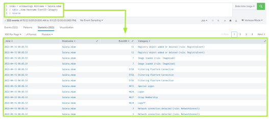

#### Subsearches

Imagine you are reviewing Sysmon process creation events and want to understand their logon context: did a process originate from a remote session (**LogonType 3/10**) or a service (**LogonType 5**)? Sysmon doesn't log the **LogonType** field, so you need to correlate across two data sources: Sysmon ID **1** for the process creation, and Security ID **4624** for the logon context. The **LogonId** field, present in both, is your link between them:

1. You get the **Image**, **User**, **LogonId** from the original Sysmon event (EventID=1)
2. Using **LogonId** field, you find the corresponding Logon event (EventID=4624)
3. You get the **LogonType** and **IpAddress** from the corresponding Logon event

With Splunk [subsearches](https://help.splunk.com/en/splunk-enterprise/get-started/search-tutorial/10.2/part-4-searching-the-tutorial-data/use-a-subsearch) and `join` keyword, you can correlate across multiple data sources within one search, and, for our example, build a unified tablecontaining both process and logon details:

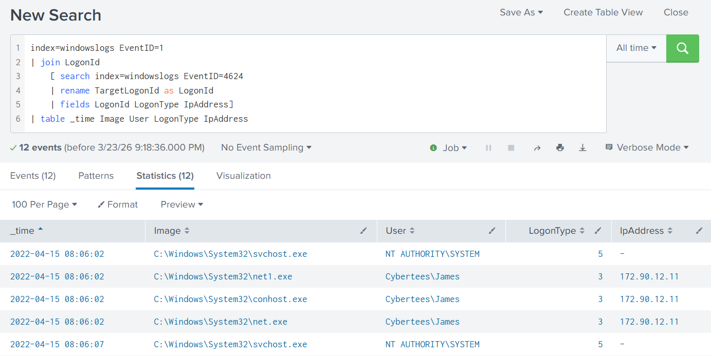

```text
index=windowslogs EventID=1
| join LogonId
    [ search index=windowslogs EventID=4624
    | rename TargetLogonId as LogonId
    | fields LogonId LogonType IpAddress]
| table _time Image User LogonType IpAddress
```

Let's unwrap the query above step by step:

1. The subsearch within `[ ... ]` is executed

- It starts from a simple search (note the **search** command at the beginning)
- It renames the field from **TargetLogonId** to **LogonId** to match Sysmon naming
- Splunk saves (**LogonId**, **LogonType**, **IpAddress**) tuples in a temporary lookup

2. The main search is executed

- It finds all Sysmon events matching the EventID=1 query
- Within each Sysmon event, it looks for the **LogonId** field
- If Sysmon **LogonId** matches some of the subsearch results, Splunk adds the **LogonType** and **IpAddress** to the main result

Overall, Splunk subsearches are extremely powerful, but also don't perform very well on large data sets. Most of subsearch queries can be replaced with a more-performant stats and eval command, that you will learn in the following task. Still, if you ever need need to enrich data source **A** with fields from data source **B**, try using **subsearch** + **join** combination!

---------------------------------------------------------------------------------------

#### Build a table that highlights the `EventID`, `AccountName`, and `AccountType` fields. Which `AccountName` appears first in your results?

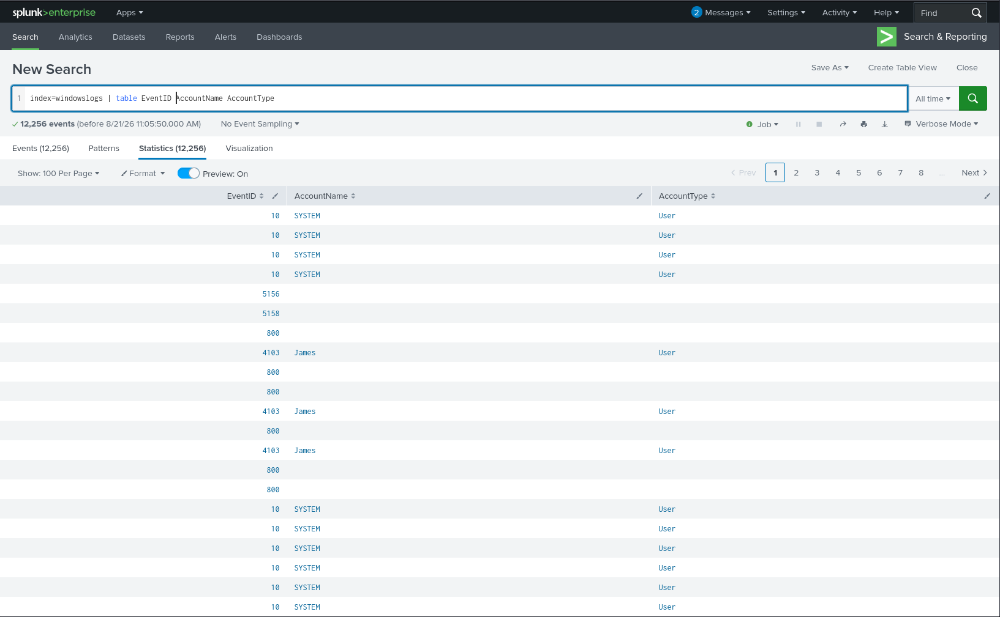

Answer: `SYSTEM`

#### Append the above query to include the `reverse` command. Which `EventID` appears first?

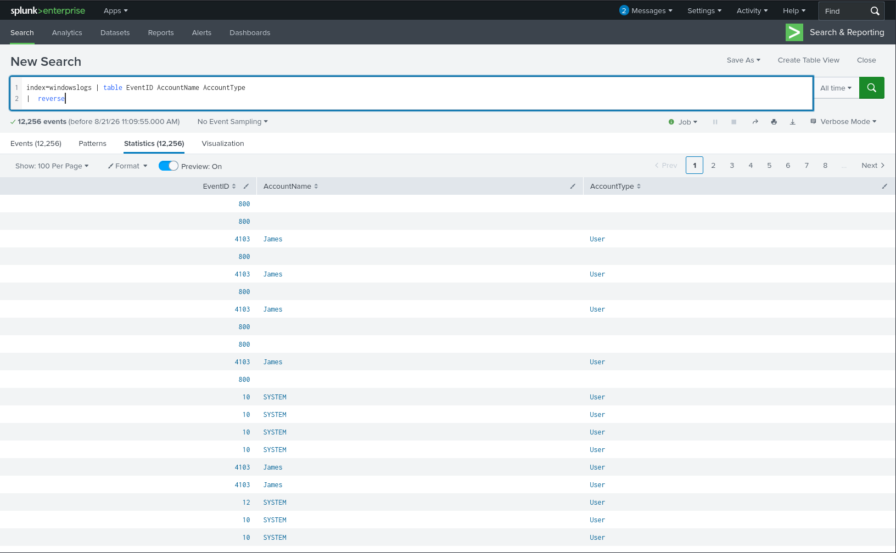

Answer: `800`

#### Use the query below to build a timeline of events. What password was given to the user `A1berto`?

```text
index=windowslogs EventID=1
| table _time ParentProcessId ProcessId ParentCommandLine CommandLine
| reverse
```

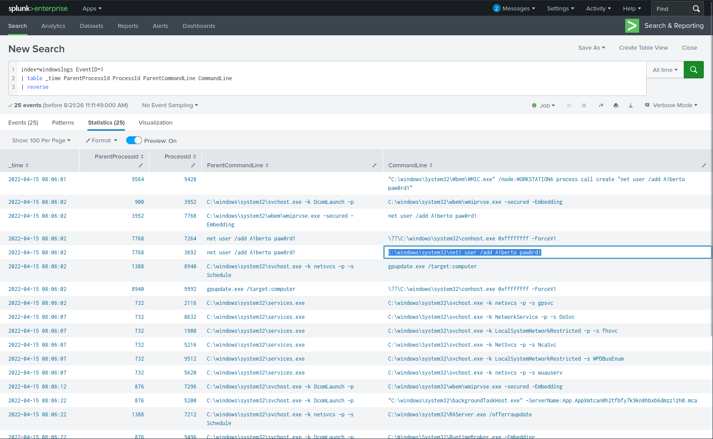

Answer: `paw0rd1`

---------------------------------------------------------------------------------------

### Task 6 - Transforming Commands

[Transforming commands](https://help.splunk.com/en/splunk-cloud-platform/search/search-manual/10.0.2503/create-statistical-tables-and-chart-visualizations/about-transforming-commands-and-searches) allow you to change raw event data into useful summaries, statistics, and visualizations. Instead of viewing every individual log, they help analysts aggregate, count, and analyze patterns across many events. Searches that utilize transforming commands are referred to as transforming searches in Splunk.

#### General Transformational Commands

|Command|Example|Explanation|
|----|----|----|
|`top`|`index=windowslogs \| top User limit=5`|Returns the ten most frequent values of the field specified. A numerical value can be included with `limit=` to reduce or expand the results|
|`rare`|`index=windowslogs \| rare User limit=5`|Returns the ten least frequent values of the field specified. A numerical value can be included with `limit=` to reduce or expand the results|

**Highlight**:

You can use the [highlight](https://help.splunk.com/en/splunk-enterprise/spl-search-reference/9.0/search-commands/highlight) command to visually mark the chosen field values when viewing raw log data. In the example below, we can use the following query to highlight the terms specified. Remember to change the view format from `List` to `Raw` to view the results.

```text
index=windowslogs | highlight User EventID Image "Process accessed"
```

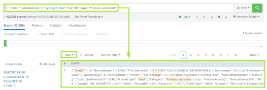

**Stats**:

The [stats](https://help.splunk.com/en/splunk-enterprise/spl-search-reference/9.0/search-commands/stats) command is a powerful tool in Splunk. It allows you to calculate statistics, such as counts, sums, and averages, of fields within your search results. This can be useful when summarizing large volumes of data to identify trends or anomalies. The table below covers some standard `stats` functions.

|Command Function|Example|Explanation|
|----|----|----|
|Average|`stats avg(ProcessCount)`|Calculates the average value of the chosen field|
|Max|`stats max(Price)`|Returns the maximum value of the chosen field|
|Min|`stats min(UserAge)`|Returns the minimum value of the chosen field|
|Sum|`stats sum(Cost)`|Returns the sum of the chosen field values|
|Count|`stats count by SourceIp`|Returns the number of occurrences of the chosen field|

You can try the `stats` command with the example below, which returns the total number of occurrences for each `EventID` and displays them in ascending order.

```test
index=windowslogs | stats count by EventID | sort EventID
```

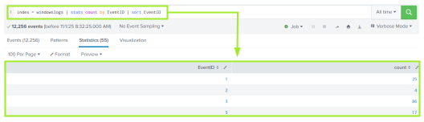

**Chart**:

The [chart](https://help.splunk.com/en/splunk-enterprise/spl-search-reference/9.0/search-commands/chart) command returns your search results in a table, which you can then use to create helpful visualizations. This command utilizes many of the same functions as `stats`. Let's give it a shot to visualize the `count` of events containing the `User` field with this query.

```text
index=windowslogs | chart count by User
```

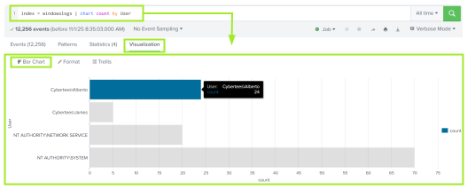

**Timechart**:

The [timechart](https://help.splunk.com/en/splunk-enterprise/spl-search-reference/9.0/search-commands/timechart) command is used to visualize how data changes over time. It is beneficial for spotting trends, peaks, and anomalies in your log data. In the example below, we use `timechart` to track process activity over time. The following query removes any NULL `Image` field values and creates a time-based area chart showing the top five most frequently occurring process images within 30-minute intervals.

```text
index=windowslogs Image!="" | timechart span=30m count by Image limit=5
```

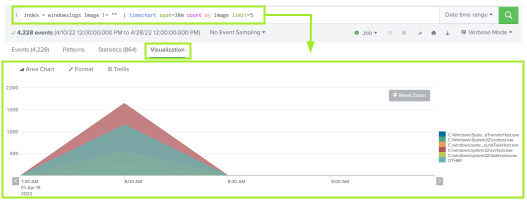

#### Data Enrichment and Field Manipulation

**IP Location**:

You can use the [iplocation](https://help.splunk.com/en/splunk-enterprise/spl-search-reference/9.0/search-commands/iplocation) command to enrich your search results with geographic information about IP addresses. It uses Splunk's built-in geolocation tables to add fields such as `City`, `Region`, and `Country`. Try it out with the query below.

```text
index=windowslogs | iplocation SourceIp | stats count by Country
```

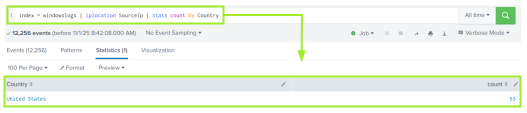

**Lookup**:

Similarly, [lookup](https://help.splunk.com/en/splunk-enterprise/spl-search-reference/9.0/search-commands/lookup) is used to enrich events using external data sources. It matches a field in your search to a corresponding field in a `CSV` file or lookup table. In this example, a `CSV` was created that associates the `Hostname` field with an employee role signified by `UserRole`.

```text
index=windowslogs
| lookup user_roles Hostname OUTPUT UserRole
| stats count by Hostname UserRole
```

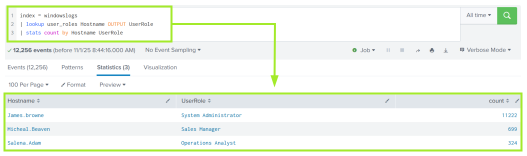

**Eval**:

The [eval](https://help.splunk.com/en/splunk-enterprise/spl-search-reference/9.0/search-commands/eval) command is one of the most versatile tools in Splunk. It allows you to create new fields, modify existing ones, and perform calculations directly within your searches. It can be used to make data more readable and prepare fields for use in visualizations. In the example below, we created a new field called `LogonTypeDesc` to give a more descriptive name to numeric `LogonType` values.

```text
index=windowslogs
| eval LogonTypeDesc = case(LogonType == 3, "Network Logon", LogonType == 5, "Service")
| stats count by LogonType LogonTypeDesc
```

The query assigns:

- Network Logon when `LogonType` is 3
- Service when `LogonType` is 5

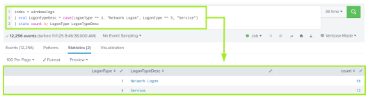

---------------------------------------------------------------------------------------

#### Use the `top` command to query the `Image` field. Which `Image` field value has the most occurrences?

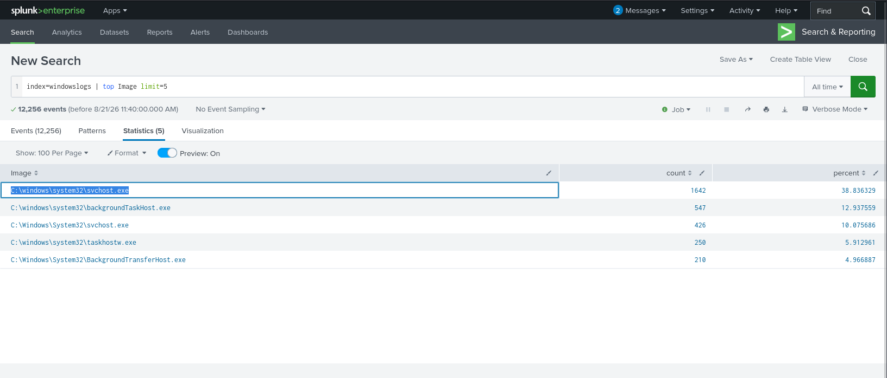

Answer: `SYSTEM`

#### Try out the `iplocation` command with the `SourceIp` field. Which `Region` do the IP addresses in your events originate from?

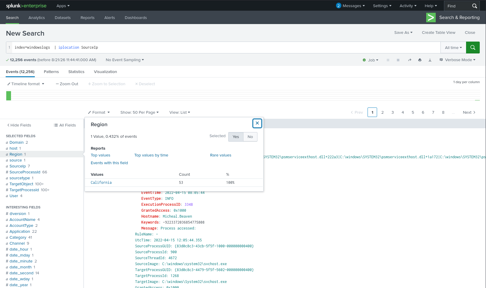

Answer: `California`

#### Try out this `lookup` query. Which `Image` field value has the highest `RiskScore`?

```text
index=windowslogs
| lookup image_riskscore Image OUTPUT RiskScore
| stats count by Image RiskScore
| sort - RiskScore
```

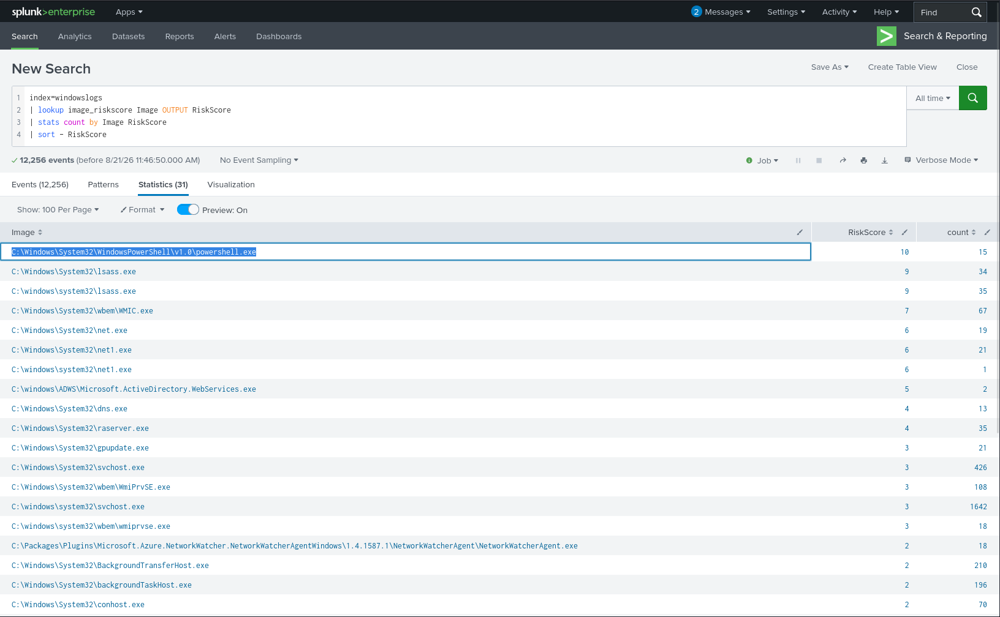

Answer: `C:\Windows\System32\WindowsPowerShell\v1.0\powershell.exe`

---------------------------------------------------------------------------------------

### Task 7 - Anomaly Detection

#### Anomaly Detection

Sometimes you might investigate a data set with lots of different events (e.g., VPN logins) and will need to quickly identify **outliers**, the events that look suspicious compared to the others. For example, imagine a data set of 2,000 VPN logins with just four fields: time of the login, username, source IP, and source country. How would you identify logins from unexpected countries, if field statistics don't show any anomalies?

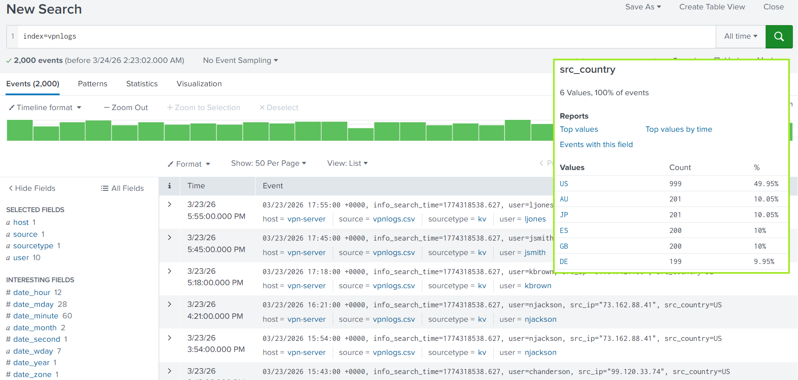

#### Detecting Outliers by Country

For a US-based user, logging in from the US is expected, but for an EU-based user, it might be a sign of intrusion. To create aggregated statistics per user, start with the search below. The `eventstats` command is very similar to `stats`, but preserves raw events for further processing; and `where` command is like `search`, but a more powerful. The query may look complex, so you are encouraged to read the descriptions below. After you run the query, you'll see two potentially compromised users:

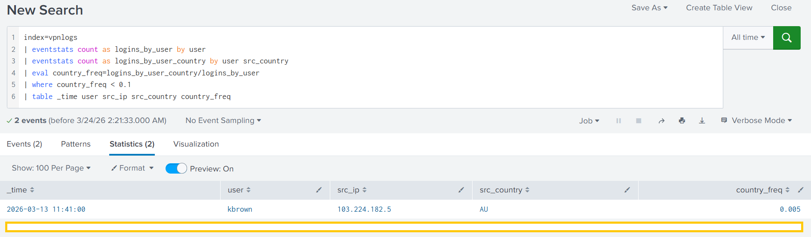

|Line / Command|Result|
|----|----|
|Line 2: Counts total logins by user|For kbrown user, **logins_by_user=200**|
|Line 3: Counts logins by user and source country|For kbrown and Austria, **logins_by_user_country=1**|
|Line 4: Evaluates frequency of logins per country|For kbrown and Austria, **country_freq=0.005**|
|Line 5: Includes only rare user-country pairs|Note: The sensitivity (0.1) is called the **threshold**|
|Line 6: Shows the outliers as a table|Only 2 outliers out of 2,000 login events!|

In summary, we have found two potentially compromised users: **kbrown**, and another one you'll need for the task. Both of them logged in from the anomalous countries only once, which is a strong signal of either VPN usage or a breach. Check out the query yourself and answer the first two questions from the task:

```text
index=vpnlogs
| eventstats count as logins_by_user by user 
| eventstats count as logins_by_user_country by user src_country 
| eval country_freq=logins_by_user_country/logins_by_user
| where country_freq < 0.1
| table _time user src_ip src_country country_freq
```

#### Detecting Outliers by Hour

Following a similar approach, you can hunt for logins during anomalous hours. However, this task is a bit harder, since you need to account for different time zones and different habits of your employees. Some will log in strictly during working hours, while others may log in even at night. To account for this, let's calculate a few variables:

1. `typical_hour`: An average hour when the employee logs in, such as 13:30 UTC
2. `stdev_hour`: How predictable the login hour is, where 0 means the most predictable

- `stdev_hour=2` means the employee is expected to log in at 13:30 UTC ± 2 hours

3. `zscore`: A number of standard deviations between the observed and typical login hour

- `zscore=3` means the login hour was x3 anomalous for that specific user

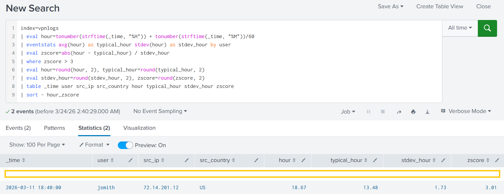

In summary, the query identifies anomalous login hours and detects two additional outliers, one of which is **jsmith**. You can see that the typical login hour for that user is around **13:30**, and the deviation for the user is low. However, the observed login was made at **18:30**, which is something worth investigating! Run the query below to find out the second outlier and answer the second question:

```text
index=vpnlogs
| eval hour=tonumber(strftime(_time, "%H")) + tonumber(strftime(_time, "%M"))/60
| eventstats avg(hour) as typical_hour stdev(hour) as stdev_hour by user
| eval zscore=abs(hour - typical_hour) / stdev_hour
| where zscore > 3
| eval hour=round(hour, 2), typical_hour=round(typical_hour, 2)
| eval stdev_hour=round(stdev_hour, 2), zscore=round(zscore, 2)
| table _time user src_ip src_country hour typical_hour stdev_hour zscore
| sort - hour_zscore
```

#### ML and Impossible Travel

More advanced detections, such as the [Impossible Travel](https://lantern.splunk.com/Security_Use_Cases/Compliance/Running_common_GDPR_compliance_searches/Geographically_improbable_access_detected), are built upon the same basic commands you learned in this room. All you need is SPL knowledge, some math, and threat context, such as IP geolocation from the **iplocation** command or threat intelligence from **lookup** tables. Then, you even play with **fit** and **apply** Splunk commands, which leverage machine learning algorithms to train on your data and improve the detection of future outliers.

---------------------------------------------------------------------------------------

#### Run the first anomaly detection query (index=vpnlogs). Which other user is marked as an outlier?

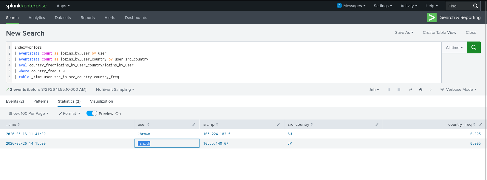

Answer: `jsmith`

#### Which country is anomalous for the user from Q1?

Answer Example: CN

See image above.

Answer: `JP`

#### Run the second anomaly detection query (index=vpnlogs). Which user suspiciously logged in at 3 AM?

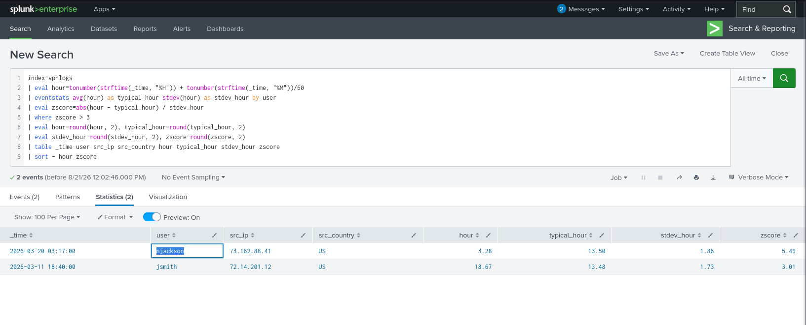

Answer: `njackson`

---------------------------------------------------------------------------------------

### Task 8 - Conclusion

In this room, you learned how to use Splunk’s **Search Processing Language** (SPL) to filter, structure, and transform raw log data into meaningful insights. You practiced using commands to build tables, charts, and visualizations to help uncover patterns and relationships between events.

To continue learning and try out your newly acquired Splunk skills, check out the SIEM-based challenge rooms below.

- [Benign](https://tryhackme.com/room/benign)
- [PS Eclipse](https://tryhackme.com/room/posheclipse)
- [Conti](https://tryhackme.com/room/contiransomwarehgh)
- [Volt Typhoon](https://tryhackme.com/room/volttyphoon)

---------------------------------------------------------------------------------------

For additional information, please see the references below.

## References

- [About transforming commands and searches - Splunk](https://help.splunk.com/en/splunk-cloud-platform/search/search-manual/10.0.2503/create-statistical-tables-and-chart-visualizations/about-transforming-commands-and-searches)
- [chart - SPL Search Commands - Splunk](https://help.splunk.com/en/splunk-enterprise/spl-search-reference/9.0/search-commands/chart)
- [Classless Inter-Domain Routing - Wikipedia](https://en.wikipedia.org/wiki/Classless_Inter-Domain_Routing)
- [Command quick reference - Splunk](https://help.splunk.com/en/splunk-enterprise/search/spl-search-reference/9.4/quick-reference/command-quick-reference#dea1673fb46084c8180b8cf3556870a68--en__Command_quick_reference)
- [dedup - SPL Search Commands - Splunk](https://help.splunk.com/en/splunk-enterprise/spl-search-reference/9.0/search-commands/dedup)
- [eval - SPL Search Commands - Splunk](https://help.splunk.com/en/splunk-enterprise/spl-search-reference/9.0/search-commands/eval)
- [fields - SPL Search Commands - Splunk](https://help.splunk.com/en/splunk-enterprise/spl-search-reference/9.0/search-commands/fields)
- [highlight - SPL Search Commands - Splunk](https://help.splunk.com/en/splunk-enterprise/spl-search-reference/9.0/search-commands/highlight)
- [iplocation - SPL Search Commands - Splunk](https://help.splunk.com/en/splunk-enterprise/spl-search-reference/9.0/search-commands/iplocation)
- [lookup - SPL Search Commands - Splunk](https://help.splunk.com/en/splunk-enterprise/spl-search-reference/9.0/search-commands/lookup)
- [Predicate expressions - Splunk](https://help.splunk.com/en/splunk-enterprise/search/search-manual/10.0/expressions-and-predicates/predicate-expressions)
- [regex - SPL Search Commands - Splunk](https://help.splunk.com/en/splunk-enterprise/spl-search-reference/9.0/search-commands/regex)
- [rename - SPL Search Commands - Splunk](https://help.splunk.com/en/splunk-enterprise/spl-search-reference/9.0/search-commands/rename)
- [Security information and event management - Wikipedia](https://en.wikipedia.org/wiki/Security_information_and_event_management)
- [SPL - Splexicon - Splunk](https://docs.splunk.com/Splexicon:SPL)
- [Splunk - Wikipedia](https://en.wikipedia.org/wiki/Splunk)
- [stats - SPL Search Commands - Splunk](https://help.splunk.com/en/splunk-enterprise/spl-search-reference/9.0/search-commands/stats)
- [table - SPL Search Commands - Splunk](https://help.splunk.com/en/splunk-enterprise/spl-search-reference/9.0/search-commands/table)
- [timechart - SPL Search Commands - Splunk](https://help.splunk.com/en/splunk-enterprise/spl-search-reference/9.0/search-commands/timechart)
- [Use a subsearch - Splunk](https://help.splunk.com/en/splunk-enterprise/get-started/search-tutorial/10.2/part-4-searching-the-tutorial-data/use-a-subsearch)
